# Apple GPU lowering: design and systemic review

Status snapshot: 24 August 2026, commit `48d88ec32638c3178531525085fd94a0b2d72f33`, Apple M4.

This is a review of the path from MAX/Mojo GPU operations to the AIR consumed
by Apple's Metal driver. It also covers the runtime boundary where it is part
of the compiled kernel ABI. It supersedes the bring-up status in
[`AIR_APPLE_SILICON.md`](AIR_APPLE_SILICON.md); that document remains useful as
the historical porting plan.

## Executive assessment

The vertical slice works. The source-built compiler emits a metallib, the
Apple runtime creates a validated Metal pipeline, binds arguments, dispatches
it, and produces numerically correct output for the Mandelbrot smoke test.
Mixed-signature Apple MMA tests also pass after moving declaration uniquing to
the module-scoped AIR lowering.

The stack is nevertheless still a bring-up architecture. Its most important
systemic weakness is that one logical AIR operation is represented as an
untyped string protocol and interpreted in several phases. This is why symbol
uniquing, operand unpacking, signedness, transpose flags, final AIR naming, and
runtime binding have each required local recovery logic. The current fixes are
sound enough to continue testing, but extending the same protocol operation by
operation will make correctness harder to establish.

The recommended direction is:

1. Keep MAX/Mojo call sites semantic and unsuffixed. Do not enumerate AIR ABI
   signatures in Mojo source.
2. Make the target-owned, module-scoped `AirLowering` the only owner of
   `pop.call_llvm_intrinsic` to AIR conversion.
3. Immediately harden the existing shim with an exact type key, explicit
   invariants, a target profile, and a pre-driver legality firewall.
4. Then replace the `llvm.air.*` string protocol with a typed internal AIR
   operation that preserves semantic attributes until final lowering.
5. Treat the compiler/runtime argument layout as a versioned contract and
   require complete reflection for compiler-generated metallibs.
6. Separate compiler acceptance, driver acceptance, runtime ABI coverage, and
   numerical kernel coverage in the test suite.

## Current evidence

| Check | Observed result | What it establishes |
| --- | --- | --- |
| `./spikes/run-cocoa-checks.sh` | 9 passed, 0 failed | The Cocoa compiler work remains intact. |
| Rebuilt `compute_smoke`, with `MTL_DEBUG_LAYER=1 MTL_SHADER_VALIDATION=1` | CPU 95.214 ms, GPU 0.849 ms, 112.15x, 100% exact, pass | End-to-end source compilation, metallib creation, reflected binding, dispatch, and a numerical result work under Metal validation. This is a smoke result, not a stable benchmark. |
| `test_apple_mma_8x8` and `test_tensor_core_apple`, forced uncached at the test-result layer and run under Metal validation | 2 of 2 pass | Mixed Apple MMA signatures no longer trigger the MLIR/LLVM bad-signature assertion. |
| New `test_air_overload_symbols`, current uncommitted worktree | 1 of 1 pass | A compile-only regression test now covers mixed MMA dtype signatures and declaration reuse in one compile, then repeats the stems in a second kernel compile. |
| Full `max/kernels/test/gpu` census recorded by `48d88ec` | 79 pass, 21 build failure, 17 runtime failure, 623 skip; 740 accounted targets | The reachable surface is substantially larger than the smoke test, but the result is a triage census rather than an acceptance score. Many skipped or failed targets are NVIDIA/AMD-only and are not constrained correctly for Apple. |

The broad census exposed several independent failure classes:

- Apple attention and KV-cache tests query device attribute 16,
  `MULTIPROCESSOR_COUNT`, which the Metal runtime does not implement.
- `test_mamba2_ssd_scan` and the CPU device-context test reach the unimplemented
  `AsyncRT_DeviceContext_enqueueHostFunctionRange` ABI entry point.
- `test_fused_qk_rms_norm_rope` reaches `metallib` with unresolved
  `llvm.vector.interleave2` declarations.
- One MHA test reaches pipeline creation and terminates the compiler service
  connection with `XPC_ERROR_CONNECTION_INTERRUPTED`.
- Grouped convolution, SRAM matmul, index tensor, layer norm, and RMS norm have
  numerical failures. `test_gather` instead fails runtime address resolution.
- Metal printing has an unresolved `__mojo_metal_os_log_64` dependency.
- Several failures are simply NVPTX or AMDGCN tests being offered to a compiler
  that intentionally does not contain those targets; other targets reference a
  missing `Kernels/lib/attn_res` package.
- M5-only paths skip on the M4, so the census does not validate those
  capabilities.

These classes must not be collapsed into a single "GPU tests pass" number.

## The flow and its ownership

```mermaid
flowchart LR
    A["MAX / Mojo GPU operation"] --> B["std.sys.llvm_intrinsic"]
    B --> C["pop.call_llvm_intrinsic with semantic llvm.air.* name"]
    C --> D["module-scoped AirLowering"]
    D --> E["typed LLVM external-call shims"]
    E --> F["LLVM IR optimization and inlining"]
    F --> G["AirBackend AIR ABI legalization"]
    G --> H["LLVM-17 AIR bitcode"]
    H --> I["xcrun metallib"]
    I --> J["embedded metallib"]
    J --> K["AppleGPURT reflection, binding, residency, dispatch"]
    K --> L["Metal driver / Apple GPU"]
```

### 1. MAX/Mojo expresses an operation

Apple MMA currently uses bare semantic shims such as
`llvm.air.simdgroup_matrix_16x16x16_multiply_accumulate` in
[`mma_apple.mojo`](max/mojo/max/gpu/compute/arch/mma_apple.mojo#L264). That is
the right level for MAX. The source knows the operation, Mojo types, transpose
intent, and feature requirement; it should not duplicate Apple's final symbol
mangling.

[`std.sys.llvm_intrinsic`](mojo/stdlib/std/sys/intrinsics.mojo#L37) packages
the variadic arguments and creates `pop.call_llvm_intrinsic`. Despite the name,
`llvm.air.*` is not an LLVM intrinsic namespace. It is an internal transport
protocol used by this fork.

### 2. Target-owned MLIR lowering creates module symbols

[`ConvertAirIntrinsicToCall`](KGEN/lib/KGENToLLVM/Target/Air/AirLowering.cpp#L128)
runs in `LowerGlobalPOPToLLVM`. It converts types, flattens packed operands,
chooses any immediately knowable AIR type suffix, makes a signature-specific
temporary symbol, and emits an `LLVM::CallOp` plus a module declaration.

This is correctly module-scoped. Declaration creation mutates the module
symbol table; doing it in the per-function pass previously allowed sibling
function conversions to race. The pipeline intentionally runs global POP
lowering before per-function POP lowering in
[`KGENToLLVMPipeline.cpp`](KGEN/lib/Compiler/ObjectCompiler/KGENToLLVMPipeline.cpp#L30),
and the generic pass leaves target-owned operations legal in
[`LowerPOPToLLVM.cpp`](KGEN/lib/KGENToLLVM/LowerPOPToLLVM.cpp#L2050).

Commit `48d88ec` fixed the bad-signature crash at the correct declaration site.
One bare MMA stem can have many function types; the temporary symbol now
includes the converted result and operand types. `AirBackend::airStem` removes
the temporary tag before final ABI naming.

### 3. LLVM-level AIR legalization produces the actual driver contract

After MLIR-to-LLVM translation and internal helper inlining,
[`mangleAirOps`](KGEN/lib/Compiler/ObjectCompiler/Target/Air/AirBackend.cpp#L1082)
derives Apple's actual AIR function names. MMA remains deferred to this point
because the transpose values are not recoverable as constants from the packed
wrapper earlier in the current pipeline.

[`legalizeModule`](KGEN/lib/Compiler/ObjectCompiler/Target/Air/AirBackend.cpp#L1420)
also performs address-space repair, builtin-to-kernel-argument conversion,
kernel ABI metadata, unsupported-type checks, and module version stamping. The
module is downgraded for the LLVM-17-era AIR reader and written with the
in-tree bitcode writer before `/usr/bin/xcrun metallib` packages it.

### 4. The runtime closes the ABI

[`AppleGPUMetal_loadFunction`](AsyncRT/lib/MojoBindings/AppleGPUMetal.cpp#L666)
creates the pipeline with reflection and records each buffer slot's type and
size. Launch uses that information to choose `setBuffer` or `setBytes`, checks
constant sizes, marks all live buffers resident for raw addresses inside
capture blobs, dispatches, and currently waits synchronously for completion.

The compiler and runtime therefore form one system. A kernel that serializes
successfully is not valid unless its metadata, reflected slot types, argument
order, resource residency, and launch semantics agree with the runtime.

## What should be preserved

- **Semantic call sites.** Reverting hand-written signature variants in
  `mma_apple.mojo` was correct. One declaration policy should cover the full
  operand cross-product.
- **Module-scoped declaration creation.** This eliminates symbol-table races
  rather than masking them.
- **Golden-sample development.** AIR names, attributes, metadata, and versions
  have been checked against `xcrun metal -S -emit-llvm`; that remains the best
  available oracle.
- **Failure gates before the driver.** Unsupported types and malformed IR are
  increasingly diagnosed before opaque Metal failures. This should become
  comprehensive.
- **Metal validation in acceptance tests.** The captured-pointer residency bug
  was invisible without shader validation.
- **Pipeline reflection.** Reading back the driver's argument contract is much
  safer than classifying an argument from its value.

## Systemic findings and specific adjustments

### P0: establish one lowering authority

At the reviewed commit, three places had knowledge of the shim conversion:

- `AirLowering` owns the live target path.
- Generic `ConvertPOPCallLLVMIntrinsic` contains an AIR-specific signature tag,
  but the Apple target makes those operations legal for the global pass, so
  this code is normally unreachable on AIR.
- `AirBackend::prepareModuleForLowering` scans for
  `LLVM::CallIntrinsicOp` before the lowering pipeline has created those ops.
  On the normal input it sees POP operations and does no work. If it ever did
  run, it would recreate the original bare-symbol type collision.

This duplication makes phase ordering part of correctness and leaves stale
fallbacks ready to become active after an unrelated pipeline change.

While this review was being written, concurrent uncommitted work in the shared
tree removed declaration creation from the generic and backend paths. The
generic path now emits a useful non-AIR target diagnostic, which is
directionally correct. The backend hook was changed into an attempted verifier,
but `prepareModuleForLowering` still runs *before* the lowering pipeline. A
verifier there cannot observe a shim that survives `LowerGlobalPOPToLLVM`, so
it must be moved to an actual post-lowering boundary rather than left as a
dead check.

Specific adjustment:

1. Keep `AirLowering` as the only path that creates AIR declarations.
2. Retain a source-located non-AIR target-mismatch diagnostic, but keep target
   conversion logic out of generic LLVM intrinsic lowering.
3. Delete `AirBackend::prepareModuleForLowering`; the object backend must not
   rewrite or attempt to verify a phase that has not run yet.
4. After `LowerGlobalPOPToLLVM`, verify that no `pop.call_llvm_intrinsic` whose
   name starts `llvm.air.` remains.
5. Immediately before MLIR-to-LLVM translation, verify that no
   `LLVM::CallIntrinsicOp` whose name starts `llvm.air.` exists.
6. For a non-AIR target, diagnose an `llvm.air.*` shim as a target mismatch at
   the operation location. Do not rely on generic LLVM intrinsic lookup to
   produce the error.

Exit criterion: one code path creates AIR declarations, and pass tests prove
both the successful AIR path and the clean non-AIR rejection.

### P0: make the temporary symbol key exact and checked — implemented, pending landing

At the reviewed commit, the new signature tag fixes the observed crash but is
formed by printing types and replacing disallowed punctuation with `_`. That
sanitization is not formally injective, and symbol lookup assumes that a
matching name has the matching `LLVMFunctionType`.

Concurrent uncommitted work now hashes the complete printed
`LLVMFunctionType` and checks the type of an existing declaration. That is the
right immediate shape: a hash collision becomes a located diagnostic rather
than an assertion or miscompile. A fresh rebuild of the two signature-sensitive
Apple MMA tests passes with that worktree change. The newly added compile-only
`test_air_overload_symbols` also passes and covers mixed dtype signatures,
reuse, and two separately invoked kernel compiles. Because the test calls
`_compile_code` once per kernel and the backend uses `SplitStrategy::PerExported`,
it does not by itself prove two exported kernels share declarations in one
MLIR module. It also does not deliberately force the rare hash-collision
diagnostic or cover scalar/vector shim families.

Specific adjustment:

1. Land the rebuilt in-progress change that builds an `LLVMFunctionType` first
   and keys declaration reuse by the pair
   `(semantic stem, exact LLVMFunctionType)`.
2. Give the temporary symbol a deterministic suffix from an unambiguous type
   encoding or a stable hash of that encoding. Human-readable type fragments
   may be retained only as diagnostics.
3. Whenever a symbol already exists, compare its function type. Preserve the
   in-progress normal compiler diagnostic containing both signatures on
   mismatch.
4. Retain `test_air_overload_symbols` and extend it with scalar/vector shim
   families. Unit-test the collision diagnostic by injecting a fixed hash into
   the symbol-key helper rather than trying to discover a real collision. Use
   a C++/MLIR pass test with two functions in one module for the module-scoped
   symbol-table invariant.

Exit criterion: no user input can turn a declaration collision into an MLIR or
LLVM assertion.

### P0: stop treating fake LLVM intrinsics as the long-term IR

The current protocol loses information before AIR needs it:

- LLVM integer types are signless, so AIR `.s.` versus `.u.` cannot be
  recovered for integer min/max.
- Transpose intent becomes values hidden inside a packed struct, so MMA naming
  is postponed until after inlining.
- Struct flattening drops every `[N x i8]` member on the assumption that it is
  padding. That works for Mojo `Bool`, but it would silently discard a genuine
  byte-array operand.
- AIR family and type-suffix tables exist in both `AirLowering` and
  `AirBackend`; the source already records drift around `simd_ballot`.

Specific adjustment, in two stages:

1. **Short term:** define one target-owned `AirIntrinsicDescriptor` table used
   by both MLIR lowering and LLVM legalization. Give every operation a stable
   enum, legal operand/result forms, signedness policy, final AIR stem,
   convergence attributes, and the phase at which its name can be finalized.
   Replace the byte-array heuristic with the same ABI/type-converter expansion
   used by generic POP lowering, based on the original operand type.
2. **Medium term:** introduce a small typed internal operation, for example
   `kgen.air.call`, with an operation kind and attributes for signedness,
   transpose flags, memory effects, and feature requirements. Create it while
   Mojo semantics are still available; lower it once to the final
   `LLVM::CallOp`. The object backend should legalize AIR representation and
   metadata, not reconstruct operation semantics from a function name.

The typed operation does not need to model all of Metal. It only needs to
replace the internal `llvm.air.*` string shims used by this tree.

Exit criterion: adding an AIR operation requires one descriptor/op definition,
not synchronized edits to Mojo strings, MLIR suffix tables, and LLVM parsers.

### P0: add a complete pre-driver legality firewall

`AirLegality` currently logs many unproven constructs, and the
`unmapped-llvm-intrinsic` rule is deliberately permissive. The fused RMS
norm/RoPE failure proves that an unresolved `llvm.vector.interleave2` can pass
through the compiler and fail only in `metallib`. The pipeline-creation XPC
failure is an even more opaque version of the same boundary problem.

Specific adjustment:

1. Before bitcode serialization, enumerate every external declaration and
   fail if an unresolved `llvm.*` symbol is not on a measured allowlist.
   Distinguish true LLVM intrinsics accepted by Apple's reader from external
   functions that merely use the prefix.
2. Lower or fold `llvm.vector.interleave2` and
   `llvm.vector.deinterleave2` before AIR emission.
3. Require every remaining `air.*` declaration to match a golden-sampled name,
   arity, function type, and required attributes.
4. Promote rules from log to fail per exact construct only after an isolated
   golden probe establishes the behavior. Avoid broad family guesses.
5. On a driver failure, retain uniquely named pre-legalization IR,
   post-legalization IR, AIR bitcode, metallib if produced, target profile, and
   command stderr in one manifest directory.

Exit criterion: unsupported IR fails in KGEN with the kernel and symbol named;
the Metal compiler service is not the first validator.

### P0: represent one coherent Apple target profile

The target identity currently mixes hardware generation, Metal language
version, AIR version, SDK, and minimum OS:

- The runtime reports `apple-m4`, which correctly describes hardware.
- The standard library maps that target to `+metal3_2,+air2_7_0`, while also
  defining separate Metal 4 variants.
- `AirTraits` advertises only `apple-m1` through `apple-m5`.
- `AirBackend` always stamps AIR 2.8, Metal 4.0, SDK 26.0, and an
  `air64_v28-apple-macosx26.0.0` triple.
- Test builds visibly warn that Metal/AIR feature strings are not recognized
  by the temporary arm64 `TargetMachine`.
- The spelling `metal:4` denotes M4 hardware in the current CLI path; it is
  easy to misread as Metal language version 4.

Specific adjustment:

1. Introduce an `AirTargetProfile` with separate fields for GPU family, Metal
   language version, AIR version, SDK version, and minimum deployment OS.
2. Derive the AIR triple and all module metadata from that profile. Remove
   literal version stamps from `legalizeModule`.
3. Normalize aliases such as `apple-m4-metal4` into the tuple, but keep runtime
   hardware discovery (`apple-m4`) separate from the selected language
   profile.
4. Either advertise the Metal 4 aliases in `AirTraits` or add an explicit
   compiler option for the language profile. Do not overload the hardware arch
   string further.
5. Keep Metal/AIR features out of the arm64 optimization `TargetMachine` and
   consume them only in AIR target code, eliminating the current warnings.
6. Reject an unavailable SDK/profile combination before compilation and print
   the complete selected tuple in verbose output and retained-artifact
   manifests.

Exit criterion: a compile test for each supported profile checks the triple
and metadata, and no target feature is silently ignored.

### P1: turn the AsyncRT surface into a capability contract

The full sweep is now finding runtime ABI stubs rather than compiler lowering
defects. Attribute 16 is `MULTIPROCESSOR_COUNT`; Metal exposes no direct CUDA
SM count, so returning an invented value would merely move the failure into
kernel scheduling. Host function range enqueueing is entirely unimplemented.

Specific adjustment:

1. Convert `AsyncRT/lib/MojoBindings/ABI-NOTES.md` into a checked capability
   table: implemented, synchronous fallback, unsupported with defined error,
   and untested.
2. Populate an `AppleGPUCapabilities` record once at context creation. For
   CUDA-shaped values that Metal does not expose, either derive a documented
   logical value from a reliable platform property or change Apple scheduling
   to consume an Apple-specific capability. Do not silently copy CUDA
   constants.
3. In particular, make attention dispatch tolerate an unknown physical core
   count or supply a tested logical parallelism value. Add an attribute test
   before re-enabling the affected attention/KV-cache group.
4. Implement `enqueueHostFunctionRange` with defined ordering relative to the
   context queue. A synchronous implementation is acceptable as an explicit
   bring-up fallback; it must still execute the requested range and propagate
   errors correctly.
5. Gate tests on named runtime capabilities so an ABI gap is reported as such,
   rather than as a kernel failure.

Exit criterion: no reachable AsyncRT symbol aborts as a generic phase-2 stub,
and the capability matrix is exercised directly.

### P1: make the generated-kernel argument contract strict

Reflection is currently best-effort. If it is unavailable, launch falls back
to caller flags and then tests whether an eight-byte scalar happens to resolve
inside the live allocation registry. Even when reflection exists, an explicit
"device" flag wins. A scalar can therefore be misclassified if its value
resembles an allocation address, and a stale or incorrectly flagged address
can become `unknown device address` at launch.

Specific adjustment:

1. Mark functions loaded from compiler-generated `MTLB` containers separately
   from raw MSL smoke kernels.
2. For generated metallibs, require a known reflected contract for every
   expected slot and fail function load if reflection is incomplete. Make
   reflection authoritative; caller flags may be checked against it but may
   not override it.
3. Keep value-based inference only for explicitly identified raw-MSL debug
   inputs.
4. Add a small compiler-generated argument manifest to the offload object when
   the container format permits it. At load time, compare compiler manifest,
   reflection, and host launch descriptors. Version the manifest.
5. Test a 64-bit scalar whose bits deliberately fall inside a live allocation
   range, captured pointers, buffer views with offsets, zero-byte buffers, and
   stale/freed addresses.

Exit criterion: generated kernels never classify an argument from its value.

### P1: make residency and allocation lifetime safe before adding asynchrony

`markAllResident` is a correct conservative workaround for raw device
addresses in capture blobs, but it is `O(all live allocations)` per dispatch.
The registry also returns an Objective-C object after dropping its lock without
retaining it, while residency holds the registry mutex while sending
Objective-C messages. These choices are manageable only while launches and
frees are effectively serialized.

Specific adjustment:

1. Under the registry lock, resolve and retain the buffer or copy a retained
   residency snapshot; release the lock before calling Metal; release objects
   after command encoding or completion as appropriate.
2. Define buffer ownership relative to context/queue completion before making
   launch asynchronous.
3. Implement the already golden-sampled `air.indirect_buffer` and
   `air.struct_type_info` metadata so residency can narrow from every live
   allocation to reachable captured resources.
4. Until precise residency lands, expose the live/resident buffer count in
   tracing and benchmark dispatch overhead against allocation count.

Exit criterion: a stress test can free and allocate on another host thread
while dispatching without use-after-free, and dispatch cost does not scale with
unrelated allocations after indirect metadata is enabled.

### P1: make backend stages explicit, single-run, and diagnostic

`legalizeModule` inlines internal helpers first. `emitObject` later constructs
another `AlwaysInlinerPass` and repeats device-pointer legalization. The
comments in that second block still describe AMD constraints. In addition,
`emitAssembly` and `emitObject` discard the detailed `llvm::Error` from
legalization and return only `AIR legalization failed`. The two
`APPLEGPU_KEEP_AIR` files named `pre` and `post` are currently written after
the same downgrade block, and the final retained metallib has a fixed name.

Specific adjustment:

1. Define one ordered pipeline: inline once, canonicalize, lower AIR semantics,
   legalize address spaces and kernel ABI, verify canonical IR, downgrade for
   LLVM 17, serialize, package.
2. If any transform must be repeated, give it an idempotence test and a comment
   stating the invariant that requires repetition.
3. Propagate `llvm::toString(std::move(err))` with stage, kernel, function, and
   instruction context.
4. Emit `<kernel>.<stage>.ll`, `<kernel>.air`, and
   `<kernel>.metallib` plus a manifest. Never let two kernels overwrite the
   same retained artifact.
5. Remove inherited AMD comments once the actual Apple invariant is recorded.

Exit criterion: each phase has one owner, one named artifact, and a diagnostic
that preserves the original cause.

### P2: replace synchronous bring-up semantics with AsyncRT semantics

Every kernel launch commits a command buffer and calls `waitUntilCompleted`.
This simplifies correctness work but removes overlap, makes the AsyncRT API
synchronous in practice, and can hide lifetime/order bugs that will appear as
soon as real queuing is enabled.

Specific adjustment:

1. Keep synchronous launch behind an explicit `APPLEGPU_SYNC_LAUNCH=1` debug
   option.
2. Implement context queue, completion, event, and error propagation semantics
   before making asynchronous execution the default.
3. Move waits to explicit context synchronization or dependency points.
4. Add ordering, callback, error, and buffer-lifetime tests before publishing
   performance numbers from multi-kernel workloads.

Exit criterion: two independent kernels can overlap or queue without an
implicit host wait, while the synchronous debug mode remains available.

### P1: restructure the Apple test suite around boundaries

The 740-target census is valuable for discovery but unsuitable as the primary
gate. Its 623 skips, foreign-target build failures, missing packages, cached
actions, and hardware-specific skips obscure regressions in the path under
review.

Create one explicit Apple acceptance suite with these layers:

| Layer | Runs without Apple GPU? | Required checks |
| --- | --- | --- |
| A. MLIR lowering | Yes | Same stem/multiple signatures, multiple functions, exact operand expansion, signedness diagnostics, canonical operation names, non-AIR target rejection. |
| B. AIR object emission | macOS/Xcode | No unresolved external `llvm.*`, exact AIR declarations/attributes, target profile metadata, verifier clean, `metallib` succeeds. |
| C. Pipeline creation | Apple GPU | Every emitted kernel creates a pipeline under Metal debug and shader validation; reflection is complete. |
| D. Runtime ABI | Apple GPU | Attributes, allocation/view lifetime, copies, events, host callbacks, argument binding, capture residency, synchronization, and error propagation. |
| E. Numerical kernels | Apple GPU | Elementwise, reductions, shuffles, 8x8 and 16x16 MMA dtype matrix, matmul, convolution, normalization, attention, and state-space kernels against CPU references. |

Specific adjustments:

- Add correct `target_compatible_with` constraints to AMD/NVIDIA-only tests so
  they skip as incompatible rather than fail the Apple build.
- Create a named Bazel `test_suite` for layers A-D and a separate numerical
  suite for E.
- Use `--nocache_test_results` for runtime acceptance after rebuilding the
  compiler. Record the KGEN commit/action hash, target profile, hardware, OS,
  and Xcode version with the result.
- Compile M5-only operations in a no-hardware layer and run them only on M5;
  report that hardware row separately instead of treating an M4 skip as
  coverage.
- Track status by failure class: compiler diagnostic, AIR packaging, pipeline
  creation, runtime ABI, runtime binding/lifetime, or numerical mismatch.

Exit criterion: a single command answers whether the Apple lowering contract
is healthy, without being dominated by unrelated CUDA/AMD targets.

## Recommended implementation order

### Milestone 1: harden the compiler boundary

1. Make `AirLowering` the sole shim-lowering owner and add phase verifiers.
2. Replace the printable signature tag with an exact type key and checked
   declaration reuse.
3. Add the unresolved-external firewall and lower vector interleave operations.
4. Introduce `AirTargetProfile` and derive every version stamp from it.
5. Add lowering and object-emission test layers A and B.

This milestone should precede adding more AIR intrinsic families. It turns
compiler crashes and driver disconnects into compiler diagnostics.

### Milestone 2: close the runtime contract

1. Publish and test the AsyncRT capability matrix.
2. Implement the device attributes and host callback range needed by current
   Apple tests.
3. Require complete reflection for generated metallibs and remove value
   inference from that path.
4. Make registry resolution/residency lifetime-safe.
5. Add runtime layer C and D acceptance tests.

### Milestone 3: resolve numerical failures before performance tuning

Reduce each numerical failure to the smallest kernel and classify it by first
failing boundary. Prioritize SRAM matmul, depthwise grouped convolution,
normalization, and index/gather paths because they exercise distinct lowering
and runtime behaviors. Keep Metal validation enabled throughout.

Do not interpret the smoke-test speedup as general performance until
synchronous waits and `markAllResident` are removed from the normal path.

### Milestone 4: replace the shim protocol

Introduce the typed internal AIR op and migrate one family at a time. Start
with MMA because it currently demonstrates every weakness of the string
protocol: overloaded signatures, semantic flags hidden as values, late
mangling, feature constraints, and driver-sensitive attributes. Remove the
corresponding backend string parser as each family migrates.

## Release gates for a defensible “working” claim

The port can accurately be described today as **an end-to-end Apple GPU path
with validated smoke and MMA coverage**. A broader “Apple GPU backend works”
claim should require all of the following:

- No compiler assertion for any malformed or overloaded AIR shim; all reject
  with source-located diagnostics.
- No unresolved external `llvm.*` symbol reaches `metallib`.
- One explicit and reported target profile controls triple and metadata.
- The generated-kernel argument contract is complete and authoritative.
- Every reachable AsyncRT entry point is implemented or capability-gated.
- The Apple acceptance suite passes without cached test results under Metal
  debug and shader validation.
- The supported numerical kernel matrix passes against CPU references.
- M4 and M5 coverage are reported separately.
- Asynchronous queue semantics and precise resource lifetime are tested before
  multi-kernel performance claims are made.

That framing recognizes the real progress without letting one successful
vertical slice stand in for the untested surface around it.
