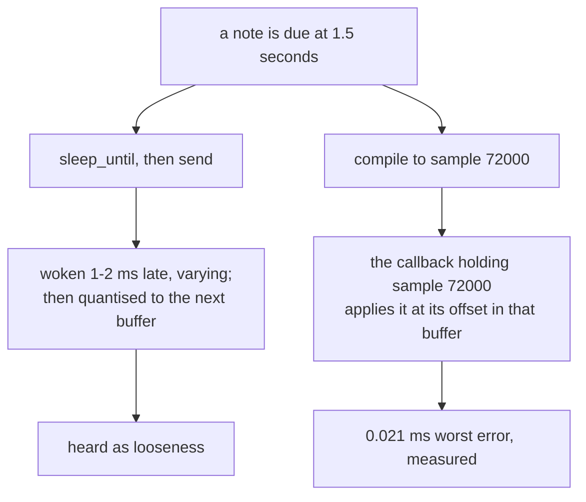

# 2. The timing argument

This is the chapter the player exists for, and it is the same shape of
argument the Othello example makes: a widely-used design is measured, found
wanting, and replaced by one that is measured too.

## The design almost everybody uses

An event scheduler usually looks like this, and this is what the C++ ancestor
does:

```cpp
std::this_thread::sleep_until(start + std::chrono::duration<double>(when));
sendMIDIEvent(event);
```

Compute when the note is due, sleep until then, send it. It is obvious, it is
correct in intent, and it is wrong in a way that is audible.

**It asks the operating system to wake a thread at a moment.** The kernel will
oblige when it next gets round to it — late by whatever the scheduler is busy
with. A millisecond or two on an idle machine; tens of milliseconds under
load, when another process is compiling or a browser is laying out a page.

The source does the arithmetic:

> *At 120bpm a semiquaver is 125 ms, so a 5 ms error is 4% of a note — audible
> as looseness, and worse, it varies.*

The variation is the part that matters. A **constant** 5 ms delay is
inaudible; it is a latency, and every note has it. An error that changes from
note to note is *jitter*, and jitter is exactly what the ear is built to
detect. It does not sound like a slow player. It sounds like a bad one.

There is a second problem stacked on the first. Sleeping schedules the *send*,
but the synthesiser only produces sound when the audio callback next runs. So
even a perfectly-woken thread has its event quantised to the next buffer
boundary — at 512 frames and 48 kHz, another 10.7 ms of slop.

## What replaces it

The tune is compiled ahead of time into a list of **"at sample N, do this"**,
and the audio callback applies each event at its exact offset *inside* the
buffer it is currently filling.

```mojo
@fieldwise_init
struct Step(ImplicitlyCopyable, Copyable, Movable):
    """One thing to do, at one sample."""

    var sample: Int
    var kind: Int
    var voice: Int
    var midi: Int
    var velocity: Int
```

No thread is woken. Nothing sleeps. The only clock is the one the audio
hardware is already running, and a sample index is an exact integer.

The header of `schedule.mojo` states the claim and where it can fail:

> *This is where the timing claim is either true or not. A tick is an exact
> integer; a sample is an exact integer; the conversion between them is one
> multiply and one divide in 64-bit, rounded once. Nothing accumulates.*

> *Scheduling by sample index instead means an event lands on the sample it was
> written for, and the only jitter left is the buffer boundary, which the
> callback already knows about and can subtract exactly.*

That last clause is the whole trick. The buffer boundary does not disappear —
it is just *known*, so it can be subtracted rather than suffered.

## How each backend honours it

The two backends solve the same problem differently, and neither has any
timing code of its own.

**The chip** renders the buffer in **spans between events**:

> *If a note begins 137 samples into a 512-sample buffer, the first 137 samples
> are rendered, the note is started, and the remaining 375 are rendered after —
> so the note begins on sample 137 and not at the buffer boundary. That is the
> whole difference between sample-accurate and buffer-accurate timing, and it
> costs one loop.*

**MIDI** does not need the loop, because the API already takes the offset:

> *`MusicDeviceMIDIEvent` takes an offset in samples from the start of the
> buffer being rendered, so an event 137 samples in is applied 137 samples in —
> the same accuracy the chip backend gets by rendering in spans, and the reason
> this player does not need a scheduling thread at all.*

That parameter has been in CoreAudio all along. Most software passes zero.

## The measurement

The claim is testable, and the test is designed to be hostile — a buffer size
chosen so that note onsets *cannot* land on buffer boundaries:

> *Measured, playing quarter notes at 120bpm through 512-frame buffers — a size
> that deliberately does not divide the note length, so every onset falls
> mid-buffer.*

```
scheduled   0    48000    96000   144000
measured    0    48001    96001   144000
worst error 1 sample = 0.021 ms
```

**0.021 ms**, against 5 ms or worse for the sleeping design — better by more
than two orders of magnitude. And the source declines to claim even that much:

> *The one-sample errors are the onset detector's threshold, not the
> scheduler.*

Two of the four onsets are off by one sample, and the honest reading is that
the *measuring apparatus* has a one-sample threshold. The scheduler may well be
exact. The report does not claim it, because the experiment cannot distinguish
the two.

## Why the design has a second payoff

The most useful consequence is not accuracy. It is that **there is no timing
code in either backend**:

> *Both backends share one render callback and one schedule. That is the point
> of the design: the tune is turned into a list of "at sample N, do this", and
> the only thing a backend decides is what "this" means. Nothing about timing is
> duplicated, so nothing about timing can differ between them.*

A sleeping scheduler needs a thread, a wake-up calculation, a way to stop it, and a way
to keep it in step with a second backend that has its own latency. All of that
is absent here. Adding a third backend would mean writing what "note on" means
and nothing else.

And it removes an entire class of concurrency bug. There is no scheduling
thread to race with the audio thread, no queue between them, and no lock. The
schedule is written once, before the audio unit starts, and is read-only
thereafter.

## The comparison

| | sleep-until | scheduled by sample |
|:---|:---|:---|
| clock | the OS scheduler | the audio hardware |
| error, idle | 1–2 ms, varying | 0.021 ms measured |
| error, under load | tens of ms | unchanged |
| quantisation | to the next buffer | none |
| threads | one extra, plus a queue | none |
| timing code per backend | one implementation each | none |

<!-- doccrate:keep-together:start -->



<!-- doccrate:keep-together:end -->
