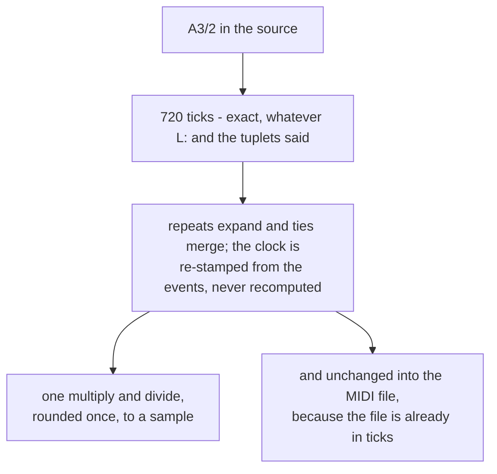

# 4. Time as an integer

Everything in [chapter 2](02-timing.md) rests on the sample number being
*exactly* right. This chapter is how it gets that way: one integer unit from
the parser to the last possible moment, and a single rounded conversion at the
end.

## 480 ticks to the quarter note

```mojo
comptime TICKS_PER_QUARTER = 480
comptime TICKS_PER_WHOLE = TICKS_PER_QUARTER * 4
```

> *Durations are counted in ticks at 480 per quarter note — 1920 per whole
> note — and never in seconds or doubles. That number is the standard MIDI
> resolution and it divides exactly by everything ABC can ask for: a 1/64 note
> is 30 ticks, a triplet eighth is 160, a dotted quarter is 720.*

Check the awkward cases:

| written | ticks | exact? |
|:---|---:|:---|
| whole note | 1920 | yes |
| 1/64 note | 30 | yes |
| triplet eighth (240 × 2/3) | 160 | yes |
| dotted quarter (480 × 3/2) | 720 | yes |
| quintuplet quarter (480 × 4/5) | 384 | yes |
| 1/128 note | 15 | yes |

480 = 2⁵ × 3 × 5, which is what makes it divisible by 3 (triplets), 5
(quintuplets), 2 repeatedly (dots and short notes), and 7 only approximately —
septuplets are the one case that does not land, and ABC tunes essentially never
use them.

The alternative is stated as a failure mode rather than a preference:

> *Floating-point timestamps drift by a fraction of a tick per note, which is
> inaudible until a few hundred notes have gone by and the voices are visibly
> apart.*

That is the characteristic shape of the bug: a tune sounds fine and its parts
drift apart over a minute. With integers there is no accumulation, because
there is no rounding to accumulate.

## The single conversion

```mojo
fn tick_to_sample(tick: Int, bpm: Int, per_beat: Int, sample_rate: Int) -> Int:
    """Exact, and rounded once at the end rather than accumulated.

    sample = tick * (60 / bpm) * sample_rate / ticks_per_beat, done as one
    integer expression. The numerator is at most a few times 10^12 for any
    real tune, which is comfortably inside 64 bits.
    """
    let denom = bpm * per_beat
    if denom <= 0:
        return 0
    return (tick * sample_rate * 60 + denom // 2) // denom
```

One expression. Three multiplies and one divide, on a value computed from the
event's **absolute** tick — not from the previous event's sample, which is what
would accumulate.

The `+ denom // 2` is round-to-nearest rather than truncation, so the error is
at most half a sample rather than up to a whole one — which is the difference
between the measured worst case being one sample and being two.

The range note is doing real work too: `tick * sample_rate * 60` for a
ten-minute tune at 48 kHz is around 10¹², against a signed 64-bit ceiling of
9.2 × 10¹⁸. Six orders of magnitude of headroom, checked rather than assumed.

## Repeats, expanded over events

```
# `|: A |1 B :|2 C |` plays A B A C. That is the whole point of the notation
# and it is the case naive expanders get wrong: duplicating the text between
# `|:` and `:|` gives A B A B, so the tune ends on the wrong phrase every
# time. Endings are not decoration; they are how a repeated strain gets out
# of itself.
```

The mechanism is one walk with one rule:

```mojo
elif ev.kind == EV_BAR and ev.aux == BAR_REPEAT_END:
    order.append(own[i])
    # The replay stops where the first ending begins, so the
    # second pass falls through into the second ending.
    let stop = ending1 if ending1 >= 0 else i
    for k in range(repeat_start, stop):
        order.append(own[k])
```

At `:|`, replay from the repeat start — but stop at the first ending if there
was one. The second pass therefore runs off the end of the replay and continues
into whatever follows, which is the second ending. No special case for `|2` at
all; it is simply the code that comes next.

And the reason this is done on events rather than text:

> *By this point every note already knows its voice and its length, so
> replaying a section is copying a range and re-stamping the clock — and a
> repeat that crosses a line break, or sits inside one voice of several, needs
> no special handling at all.*

A regex over text cannot see voices or line breaks. Working on events makes
those cases vanish rather than requiring code.

## Re-stamping the clock, and the chord trap

Copying events is only half the job — the copies need new tick numbers. The
rule is that **only things which occupy time advance the clock**:

```mojo
if (ev.flags & F_CHORD) != 0 or (ev.flags & F_GRACE) != 0:
    # A chord's later members sound with the note that opened the
    # group, which is the tick *before* it advanced the clock --
    # using the current tick instead spreads a chord out into an
    # arpeggio, one member per beat, which is audibly wrong and
    # looks like a parser bug rather than a re-timing one.
    ev.tick = group_tick
    expanded.append(ev)
    continue
group_tick = tick
ev.tick = tick
expanded.append(ev)
tick += ev.duration
```

Three kinds of event, three behaviours: a bar line is a marker and takes the
current tick; a chord member or grace note takes `group_tick`, the tick of the
note that opened its group; an ordinary note takes the current tick and then
advances it.

The comment records the symptom as well as the cause, and the symptom is the
useful part: get it wrong and `[CEG]` comes out as C, E, G one beat apart. That
looks exactly like a chord-parsing bug — and the parser is fine. The fault is
in re-timing, several stages downstream.

## Ties

```mojo
def resolve_ties(mut tune: Tune):
    """Join a tied note to the note it is tied to.

    A tie means one sound, not two: the second note is not struck. Extending
    the first and dropping the second is what makes `C-C` a half note and not
    two quarters with a seam.
    """
```

Two details in the implementation are worth extracting.

**The match has to be exact in three ways** — same voice, same pitch, and
starting *precisely* where the first ends:

```mojo
if tune.events[j].tick < end:
    continue
if tune.events[j].tick > end:
    break
```

Past the end, stop looking. A tie that does not find its partner leaves the
first note at its written length, which is the right failure.

**The second note is silenced, not deleted:**

```mojo
# Silenced rather than removed: removing it would move every
# index after it, and the outer loop is holding one.
tune.events[j].velocity = 0
```

A classic. Deleting from a list you are iterating invalidates the position you
are standing on. Setting velocity to zero is then honoured downstream by one
line in the schedule builder:

```mojo
if ev.velocity <= 0:
    continue                     # swallowed by a tie
```

## Sorting, and the tie-break that saves a note

```mojo
def sort_steps(mut steps: List[Step]):
    """Merge sort by sample, with note-off before note-on at the same instant.

    The tie-break matters: when one note ends exactly as another begins on the
    same voice, releasing first leaves the voice free for the new note. The
    other order steals a voice that is about to be freed and drops a note.
    """
```

```mojo
fn step_before(a: Step, b: Step) -> Bool:
    if a.sample != b.sample:
        return a.sample < b.sample
    return a.kind > b.kind          # NOTE_OFF (1) sorts before NOTE_ON (0)
```

With only three chip voices, voice allocation is tight. Two events at the same
sample — one note ending, another beginning — must be applied in the order that
frees a voice before asking for one. The other order takes a voice from a
sounding note while a voice was about to become free, and the tune loses a note
it did not have to.

Note also that the sort is a **bottom-up merge sort**, which is stable — so
events written in a particular order at the same sample stay in that order
beyond the explicit tie-break.

## The release gap

```mojo
# Lift the note a little early so repeated pitches are re-struck
# rather than running together. A twentieth of the note, capped, is
# about what a player does without thinking about it.
var gap = ev.duration // 20
let max_gap = per_beat // 16
if gap > max_gap:
    gap = max_gap
```

Two notes of the same pitch back to back, released exactly as the next begins,
sound like one long note — the ear needs a gap to hear a re-articulation. Five
percent of the note, capped at a sixteenth of a beat so long notes do not get a
long silence, is a musical judgement expressed in two lines.

## The MIDI file as proof

```
# This is the unglamorous half, and it is also the half that proves the model
# is right. A MIDI file is a public format with other readers: if the tune
# opens in a notation program with the right pitches, the right lengths and
# the bar lines in the right places, then the parser and the tick arithmetic
# are correct, and no amount of listening to a synthesiser could establish
# the same thing.
```

This is the strongest verification idea in the program. Listening tests your
ears. A MIDI file opened in notation software tests your model **against a
reader that was not written here** — and it displays the result as notation, so
a bar that does not add up is visible rather than audible.

And the tick resolution makes the export trivial:

> *The tick resolution is already MIDI's own — 480 per quarter note — so
> durations transfer with no conversion and no rounding. That is not a
> coincidence; it is why 480 was chosen in the model.*

The design decision at the top of this chapter pays off at the bottom of it: no
conversion means no rounding means the file says exactly what the model says.

<!-- doccrate:keep-together:start -->



<!-- doccrate:keep-together:end -->

