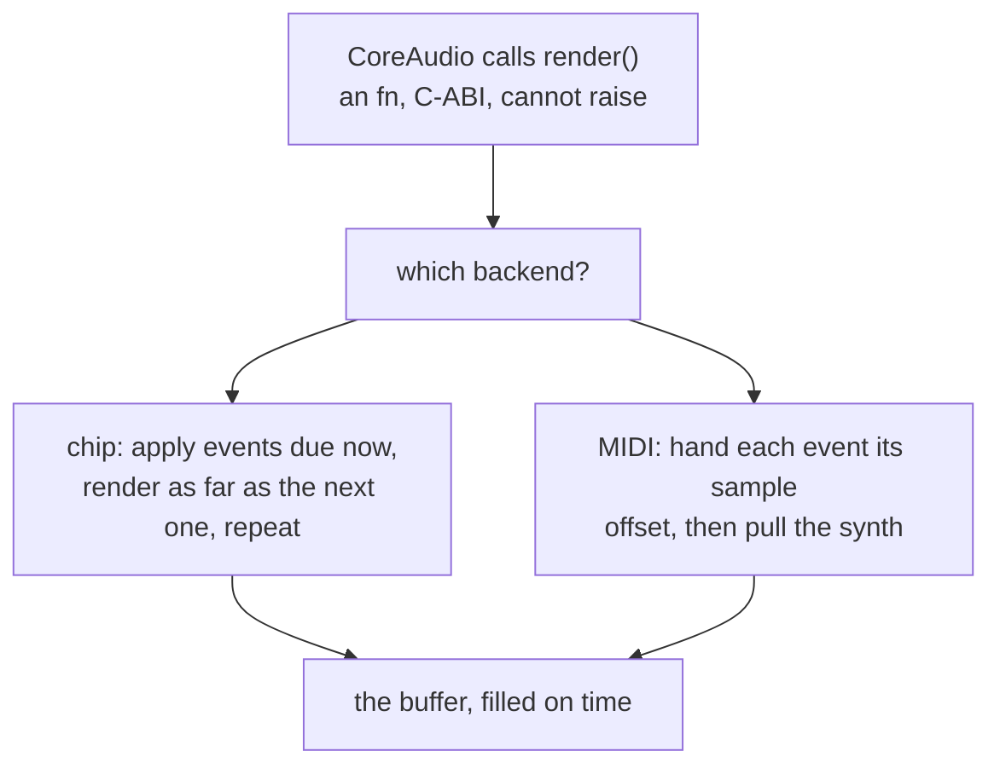

# 5. The audio thread

CoreAudio calls a render callback on a real-time thread it owns, every 10.7 ms
at 512 frames and 48 kHz. That callback must fill the buffer before the speaker
runs dry, and it **may not allocate, may not take a lock, and may not raise**.
Miss the deadline and you hear it.

This chapter is what the player does inside that constraint.

## The callback is an ordinary Mojo function

```mojo
comptime AURenderCallback = fn(P, P, P, UInt32, UInt32, P, /) -> Int32

fn render(ref_con: P, action_flags: P, timestamp: P,
          bus: UInt32, frames: UInt32, io_data: P) -> Int32:
    """Fill one buffer. Runs on CoreAudio's real-time thread."""
```

`fn` in this dialect is a **foreign-callable, non-raising, C-ABI function**. So
`render` *is* an `AURenderCallback` — its address goes straight into
`AudioUnitSetProperty` with no shim, no C file, and no Objective-C.

That the language's non-raising function kind is also its C-callable one is not
a coincidence here; it is exactly the contract CoreAudio requires, enforced by
the type rather than by discipline. A `def` may raise, and the compiler will
not let you install one.

The buffer list is unpacked by hand, because it is a C structure with a
variable-length tail:

```mojo
"""The buffer list is two non-interleaved float channels: an AudioBuffer is
{UInt32 channels; UInt32 bytes; void* data} and the list's array starts at
offset 8, so channel i's data pointer sits at 16 + i*16."""
```

## One callback, two backends

```mojo
if get(st, PLAYER_BASE + UI_BACKEND) == BACKEND_MIDI:
    render_midi(st, action_flags, timestamp, frames, io_data, n)
else:
    render_scheduled(st, left, n)
```

One branch, at the top, and after it the two backends share nothing except the
schedule they read. Neither contains a line of timing code.

## The chip backend: rendering in spans

This is the loop that makes the timing claim true.

```mojo
var filled = 0
while filled < frames:
    var cursor = get(st, PLAYER_BASE + SC_CURSOR)
    let now = get(st, PLAYER_BASE + SC_SAMPLE)

    # Everything due at this exact sample happens before another sample
    # is rendered.
    while cursor < count:
        let at = cursor * STEP_SLOTS
        if sched[unsafe_offset=at] > now:
            break
        ...apply the event...
        cursor += 1
    put(st, PLAYER_BASE + SC_CURSOR, cursor)

    # Render as far as the next event, or to the end of the buffer.
    var span = frames - filled
    if cursor < count:
        let next = sched[unsafe_offset=cursor * STEP_SLOTS] - now
        if next < span:
            span = next
    if span < 1:
        span = 1

    chip_render(st, dest + filled, span, silent_tick)
    filled += span
    put(st, PLAYER_BASE + SC_SAMPLE, now + span)
```

Read it as: *apply everything due now; render up to the next thing that is due;
repeat until the buffer is full.*

A buffer with no events is one `chip_render` call of 512 samples. A buffer with
a note at offset 137 is two calls, of 137 and 375. The cost is a loop
iteration per event, which is nothing, and the benefit is that a note begins on
its own sample.

The `if span < 1: span = 1` guard is a liveness fix rather than a correctness
one — two events at the same sample would otherwise give a zero-length render
and the loop would not advance.

## The MIDI backend: an offset the API already takes

```mojo
_ = external_call["MusicDeviceMIDIEvent", Int32](
    synth, UInt32(0x90 | channel), UInt32(note),
    UInt32(velocity), UInt32(offset),
)
```

That last argument is `inOffsetSampleFrame`. It has been in CoreAudio for
decades and most software passes zero. Passing the real offset is the entire
MIDI-side implementation of sample-accurate timing.

The channel mapping carries one piece of MIDI folklore:

```mojo
if channel >= 9:
    channel += 1
```

Channel 10 (index 9) is General MIDI's percussion channel — notes sent there
are drums, not pitches. Voices skip over it, or a third-voice harmony line
would come out as a cymbal.

## No allocation, and how that is guaranteed

The schedule is a `List[Step]` while it is being built, which allocates. It is
flattened into plain memory before the audio unit starts:

```mojo
def flatten_schedule(steps: List[Step], mut st: P) -> Int:
    """Copy the schedule into plain memory the audio thread can walk."""
    let addr = Int(external_call["calloc", P](Int(n * STEP_SLOTS + 8), Int(8)))
```

> *Everything here runs on the audio thread, so the schedule is a plain block
> of memory rather than a List: allocated once, before the unit starts, and
> never resized.*

Five `Int`s per step, at a fixed stride. The audio thread walks it with a
cursor and never writes to it.

The same rule shapes two other functions.

`midi_to_hz` **clamps its input**, and the reason is severity rather than
correctness:

```mojo
"""Clamped, because this runs on the audio thread and the octave loop below
is a loop: a nonsense note would be a hang, not a wrong pitch."""
```

A wrong pitch is a wrong note. A hang on the audio thread is silence for the
rest of the session, and it is the harder failure to diagnose because nothing
crashed.

And there is a do-nothing function whose docstring explains why it exists:

```mojo
fn silent_tick(st: P) -> None:
    """The chip's own player routine, doing nothing.

    The schedule drives the notes here, so the 50 Hz routine has no work --
    but the chip still calls it, and a null function pointer would not do.
    """
    pass
```

The chip expects a 50 Hz player routine — see the
[synth walkthrough](../ChipWalkthrough/06-player.md). This player drives notes
from the schedule instead, so the routine has nothing to do, and the honest
implementation is an empty function rather than a null pointer and a branch.

## Three voices, and what gives when a fourth note arrives

```mojo
"""Three voices and a tune that may want more, so something has to give when
they are all busy. A voice whose envelope has finished is free; failing
that the oldest sounding note is taken, because it is the one furthest
through its decay and the least missed."""
```

Three tiers, in order:

1. a voice holding no note at all
2. a voice whose envelope has reached `ENV_IDLE` — still assigned, but silent
3. otherwise, the **oldest** sounding note

Tier 2 is the one that matters musically. A released note holds its voice while
it decays, and once the envelope is finished that voice is audibly free even
though the bookkeeping still points at it. Checking the envelope recovers a
voice that would otherwise be wasted.

Tier 3's justification is the honest one: whichever note has been sounding
longest is furthest through its decay, so stealing it is the least audible
choice available.

## Register changes are events too

An `[I:chip …]` directive in the tune becomes a `Step` like any other:

```mojo
fn apply_chip(st: P, voice: Int, param: Int, value: Int):
    """One register change, on the audio thread.

    No allocation and nothing that can raise: this is the same contract the
    note events keep, because it runs from the same place they do.
    """
```

> *A directive is not special machinery. It becomes a `Step` at a sample
> position exactly like a note-on.*

So a filter sweep written into a tune lands mid-phrase, on the sample it was
written for, with the same accuracy a note gets — because it is travelling
through the same code.

One consequence needed extra state:

```mojo
fn record_adsr(st: P, voice: Int, a: Int, d: Int, sus: Int, r: Int):
    """Remember the four nibbles a set_adsr was given.

    set_adsr turns them into 16.16 increments through a period-stretching
    ladder, and that is not invertible -- so changing only the decay later
    means keeping the other three somewhere.
    """
```

`set_adsr` takes four nibbles and computes increments. The transform loses
information, so changing one parameter later requires the original four — kept
in the player region where the audio thread reads them without a lock.

## Why there is no lock anywhere

The window can move a slider while the tune plays. That is two threads touching
the same registers, and there is no mutex:

> *Nothing here touches the audio thread's schedule. Live notes are register
> writes — set a frequency, raise a gate — and the render callback reads those
> registers on its own clock. A torn read costs one frame of one oscillator,
> where a lock would cost a click in the speaker.*

The reasoning is specific rather than cavalier. The shared data is individual
integer registers; the worst outcome of a torn read is that one oscillator uses
a stale value for one 50 Hz frame, which is inaudible. A lock, meanwhile, can
make the audio thread wait on the UI thread — and a late buffer is a click,
which is very audible indeed.

**Blocking is the more dangerous failure on a real-time thread**, and that is
what makes the trade correct here rather than merely convenient.

<!-- doccrate:keep-together:start -->



<!-- doccrate:keep-together:end -->
