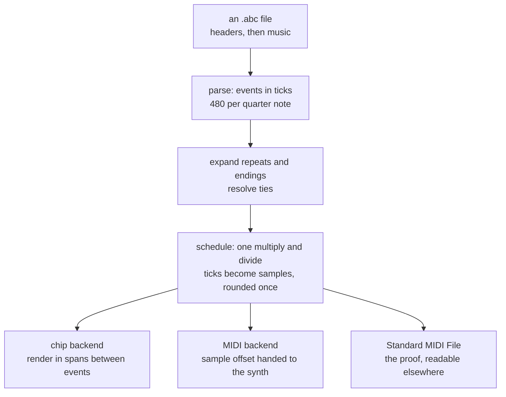

# ABC Player

**A folk-tune player with a real parser and a real deadline — where every note
begins on the sample it was written for, and the worst error measured is
0.021 milliseconds.**

It reads ABC notation, the ASCII format that hundreds of thousands of
traditional tunes are already written in, and plays it through either a
chip-tune synthesiser or Apple's General MIDI synth. It also writes Standard
MIDI Files, which is how the whole thing is proved correct by a program that
was not written here.

| | |
|:---|:---|
| **Source** | `examples/abcplayer/` — ten files, ~4,900 lines |
| **Reads** | ABC: headers, accidentals, tuplets, repeats and endings, chords, ties, grace notes, multiple voices |
| **Plays through** | three chip voices, or Apple's DLS synthesiser |
| **Writes** | Standard MIDI Files |
| **Time unit** | ticks — 480 per quarter note, integer throughout |
| **Timing error** | **1 sample, 0.021 ms**, measured |

## These documents

| Chapter | What it covers |
|:---|:---|
| [1. Where it came from](01-history.md) | ABC notation, the C++ player this ports, and the five things in it that had never worked |
| [2. The timing argument](02-timing.md) | Why sleeping until an event is due is the wrong design, and what replaces it |
| [3. Reading ABC](03-parser.md) | A notation that is ambiguous exactly where real tunes live |
| [4. Time as an integer](04-time.md) | Ticks, repeats, ties, and the single conversion to samples |
| [5. The audio thread](05-audio.md) | One schedule, two backends, and a callback that may not allocate |
| [6. The window](06-window.md) | A tune list, a voice editor, and Musical Typing |
| [7. What to understand](07-key-points.md) | The things that will surprise you, and the ones that will bite |

The synthesiser it plays through has [its own walkthrough](../ChipWalkthrough/index.md).

## The shortest possible summary

Most players schedule music by asking the operating system to wake a thread at
a moment:

```cpp
std::this_thread::sleep_until(start + std::chrono::duration<double>(when));
sendMIDIEvent(event);
```

That is late by whatever the scheduler is busy with — a millisecond or two
idle, tens under load. At 120 bpm a semiquaver is 125 ms, so a 5 ms error is
**4% of a note**, and because it varies from note to note you hear it as
looseness rather than as a tempo.

This player never sleeps. The tune is compiled to a list of *"at sample N, do
this"*, and the audio callback applies each event at its exact offset **inside**
the buffer. For the chip that means rendering in spans between events; for MIDI
it means handing `MusicDeviceMIDIEvent` the sample offset it already accepts.

Everything upstream of that exists to make the sample number exact. Durations
are integer ticks at 480 per quarter note — a resolution that divides evenly by
everything ABC can ask for — and nothing rounds until one multiply and one
divide at the very end.

<!-- doccrate:keep-together:start -->



<!-- doccrate:keep-together:end -->
