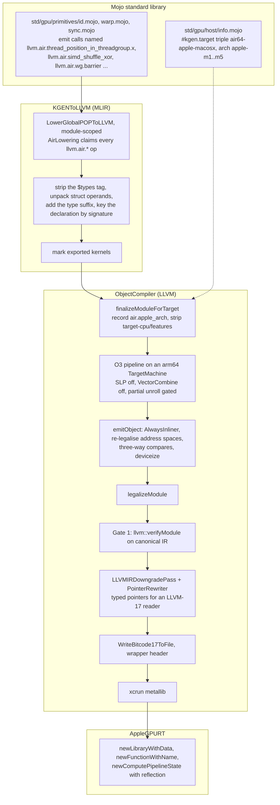

# 2. The pipeline

A kernel passes through four owners on the way to the GPU: the Mojo standard
library, which names the Apple builtins; the MLIR-to-LLVM lowering, which
turns those names into declarations; the object backend, which does
everything AIR-specific to the LLVM module and writes the artefact; and the
runtime, which loads it. The boundaries between them are deliberate, and two
of them were drawn after a defect showed where the old boundary was wrong.

<!-- doccrate:keep-together:start -->



<!-- doccrate:keep-together:end -->

## Stage 1: the standard library names the builtins

Mojo's GPU primitives are written per vendor. On the Apple path, `thread_idx`,
`block_idx`, `block_dim`, `grid_dim`, `lane_id`, the warp shuffles and
reductions, `barrier()`, and the simdgroup matrix operations each become a
call to a function that does not exist: a name of the form
`llvm.air.<builtin>` or `llvm.air.<builtin>.<dim>`. Twenty-five distinct
stems appear across the tree today, from `llvm.air.thread_position_in_threadgroup.`
and `llvm.air.threadgroup_position_in_grid.` (with a dimension appended) through
`llvm.air.simd_shuffle_xor`, `llvm.air.simd_sum`, `llvm.air.simd_ballot.i32`,
`llvm.air.wg.barrier`, `llvm.air.simdgroup.barrier`, a handful of transcendental
maths, and the three `simdgroup_matrix_*_multiply_accumulate` forms the M4 and
M5 MMA paths use.

These are *not* LLVM intrinsics. The AIR lowering header is explicit:

> *Owns the lowering of `llvm.air.*` builtin "intrinsics": those names are not
> real LLVM intrinsics, so they lower to calls of `air.*`-named external
> functions which the AIR backend later converts to kernel parameters /
> mangled AIR runtime calls.*

The distinction matters because LLVM will not mangle a name it does not own.
`llvm.fma` becomes `llvm.fma.v4f32` automatically; `llvm.air.simd_sum` does
not become anything, so every operand type would resolve to *one*
declaration, and the second signature would assert during MLIR-to-LLVM
translation — *"Calling a function with a bad signature!"*, a hard compiler
crash in a stack naming no user code. That was a real failure class, closed
at the declaration site rather than enumerated at each Mojo call site.

## Stage 2: the MLIR lowering owns declaration creation

`AirLowering.cpp` is short — 328 lines — and it has exactly one job: turn each
`llvm.air.*` call into a correctly typed declaration of a real `air.*`
symbol. Four things happen to every such call:

1. **The signature tag comes off.** The generic POP lowering makes each
   overload unique by appending `$<types>` to the name; the real AIR name is
   derived from the operand types here, so *the tag only ever had to be
   unique, never correct*.
2. **Struct operands are unpacked.** KGEN packs multi-operand intrinsic
   arguments into a struct; AIR runtime functions take flat scalars. A Mojo
   `Bool` arrives as `{i1, [15 x i8]}`, and the trailing byte-array padding
   has to be skipped rather than flattened into a spurious parameter.
3. **The type suffix is added**, from the builtin registry: `air.simd_shuffle_xor.u.i32`,
   `.f32`, `.f16`, each read off a golden MSL probe.
4. **The declaration is keyed by signature**, so two kernels using the same
   builtin at different payload types get two declarations and no collision.

One decision in that file deserves its own paragraph because it is a guess
made carefully. AIR carries *separate* signed and unsigned integer symbols —
`air.simd_sum.s.i32` and `air.simd_sum.u.i32` both exist — and by the time the
lowering runs, the LLVM dialect's integers are signless and the stdlib has
emitted a bare stem. The signedness is simply not in scope. The lowering
chooses `.u.` and then says exactly where that is sound:

> *sum, product, prefix sums — two's-complement add/multiply are bit-identical
> signed vs unsigned. SAFE. shuffles — a lane move does not interpret the
> payload. SAFE. min, max — genuinely different. min(-1, 5) is -1 signed and
> 5 unsigned. NOT SAFE, and rejected below rather than guessed at.*

Today the stdlib never emits `llvm.air.simd_min` or `simd_max`, so the
rejection is a tripwire: wiring them up will fail at compile time instead of
silently computing the wrong reduction. There is no 64-bit case at all, since
MSL rejects simdgroup operations on 64-bit types outright.

### Why this pass is module-scoped

The header records the triage finding that put it there:

> *The conversion creates module-level function declarations, so it MUST run
> in the module-scoped, single-threaded LowerGlobalPOPToLLVM pass — doing it
> from the per-function LowerPOPToLLVM pass raced sibling function conversions
> on the symbol table (triage finding: duplicate declarations / crashes when
> several kernels share a builtin).*

### Why the object backend refuses to do this job

`AirBackend.cpp` used to contain a fallback that rewrote any surviving
`llvm.air.*` shim itself. It now *verifies* that none survived, and fails
hard if one did. The comment on that decision is the clearest statement of
the ownership rule in the tree:

> *An object backend should not be reconstructing operation semantics from
> MLIR in the first place.*

The fallback had never fired on real input, because it ran before the
lowering pipeline had created anything for it to find; and had it ever
fired, it would have looked a declaration up by *name* and reintroduced
precisely the bare-symbol type collision the MLIR lowering exists to
prevent — *a dead fallback waiting to become live after an unrelated pipeline
change*. Reaching the object backend with a shim means the target hooks did
not run, and that deserves a located failure, not a silent recovery.

## Stage 3: the object backend

`AirBackend` is a `TargetBackend` with three properties that shape everything
else: it is an *offload* target, it is *not* a base target, and it splits the
module `PerExported` — one exported kernel per emitted module, which is why
every retained artefact is named per kernel.

### Before optimisation: record the arch, then strip the host attributes

`finalizeModuleForTarget` runs once the TargetMachine exists and before the
optimiser. KGEN's LLVM lowering stamps `target-cpu`, `target-features` and
`tune-cpu` on every lowered function from the `kgen.target` attribute. For an
AIR target the feature string is upstream's `+metal3_2,+air2_7_0`, and the
TargetMachine is arm64; the first optimiser pass that asks for a subtarget
builds an AArch64 subtarget *from that attribute*, and LLVM's feature parser
answered, on every GPU compile:

```text
'+air2_7_0' is not a recognized feature for this target (ignoring feature)
```

Harmless to the output — the scrub before emission strips the same
attributes — but noise on every build, and *a warning nobody reads is the
kind that hides the one that matters*. So the attributes come off here,
declarations included, because the subtarget query is made about callees as
well as bodies.

The order of the two lines in that function is the fix for defect D21:

> *legalizeModule needs the arch these attributes carry, and it runs AFTER
> this. Record it first (kAppleArchMD), then strip — the order whose absence
> was D21.*

The first version of the warning fix stripped the attribute and left
legalisation to read an empty arch. Every GPU program in the tree then failed
with `no Apple AIR target profile for arch ''`, and — chapter 4 tells the rest
— the change had been pushed as verified. The arch now travels as named module
metadata, `air.apple_arch`, which legalisation reads and then forgets before
the artefact is written.

### The shared O3 pipeline, with hooks

The optimisation pipeline is Modular's, shared with every target, and this
port threads the backend through it so a target can decline a pass. Five
virtuals on `TargetBackend` exist for that: `wantsVectorization`,
`wantsVectorCombine`, `wantsPartialUnrolling`, `unrollBodyLimit` and
`unrollSingleBlockOnly`. On AIR the first two answer no and the third yes,
for reasons that are the substance of chapter 6. Each is an environment knob
as well, and every knob prints an `[air-knobs]` line to stderr when it is
read, for a reason chapter 4 explains under the compile cache.

<!-- doccrate:keep-together:start -->

| Knob | Default | What it controls |
|:---|:---|:---|
| `APPLEGPU_AIR_VECTORIZE` | off | SLP vectorisation in the O3 pipeline |
| `APPLEGPU_AIR_VECTOR_COMBINE` | off | the VectorCombine pass |
| `APPLEGPU_AIR_UNROLL` | on | the gated partial unroller |
| `APPLEGPU_AIR_UNROLL_LIMIT` | 128 | loop body size the gate admits |
| `APPLEGPU_AIR_UNROLL_PARTIAL_THRESHOLD` | 1024 | LLVM's partial-unroll threshold |
| `APPLEGPU_AIR_UNROLL_GATE` | single-block | `wide` also admits threadgroup-only multi-block loops |
| `APPLEGPU_AIR_KEEP_LOOP_MD` | off | keep `!llvm.loop` metadata in the artefact |
| `APPLEGPU_AIR_OPT_LEVEL` | 3 | the device pipeline's optimisation level |
| `APPLEGPU_KEEP_AIR=<dir>` | unset | retain `.pre.ll`, `.post.ll`, `.air` and `.metallib` per kernel |
| `APPLEGPU_AIR_XFORMS` | all off | the table-driven legality transforms |

<!-- doccrate:keep-together:end -->

Knobs are read from the environment first, then from `/tmp/applegpu-xforms.conf`,
`~/.applegpu-xforms`, or a file named by `APPLEGPU_XFORMS_FILE`, so an
experiment can be pinned for a whole suite run without editing every command.

### After optimisation: the mini pipeline inside `emitObject`

`emitObject` runs a second, short pass sequence before legalisation, and the
order is the point:

1. **`AlwaysInlinerPass` first.** Force every internal helper into its caller
   before anything AIR-specific looks at the module. The next chapter quotes
   the three defects that put it here.
2. **Break wide vector arithmetic**, behind `APPLEGPU_AIR_SCALARIZE_WIDE_VECTORS`:
   a scalariser with `ScalarizeMinBits=128` fragments anything wider than
   `float4` while leaving loads and stores alone — *vector memory access is
   genuinely wide on this hardware, and splitting it would cost*.
3. **The partial unroller**, when the knob asks for it here rather than in the
   main pipeline.
4. **Re-legalise address spaces** now that inlining has run, because code the
   inliner pulled in from a callee has never been through the pass:

   > *On AIR that is not a missed optimisation, it is a wrong answer.*

5. **Lower three-way compares and deviceize captured pointers again**, for
   the same reason.

Then `legalizeModule` itself, which chapter 3 walks through; then Gate 1.

### Gate 1 sits on canonical IR

`llvm::verifyModule` runs immediately after legalisation and *before* the
downgrade. The first placement was after the downgrade and was wrong:

> *PointerRewriter deliberately rewrites pointers to TypedPointerType for the
> LLVM-17 writer and (per MojoMacX64's triage) drops the lifetime-on-alloca
> exemption on purpose, so a module that is correct for its purpose fails
> verification there: 23 spurious "llvm.lifetime.start/end can only be used
> on alloca or poison" against 4 real findings. A gate that cries wolf gets
> switched off.*

A rejected module is *kept*: the gate fires before any retained-artefact
hatch runs, and without that a rejection would leave nothing behind — *and
the module IS the diagnosis*.

### Downgrade, write, package

The emission machinery is Apple's published Metal skeleton, filled in:

> *LLVMIRDowngradePass is the published MetalAIRPass skeleton today; our
> legalizeModule above supplies the body that upstream leaves out.*

`LLVMIRDowngradePass` folds modern constructs into what an LLVM-17 reader
knows. `PointerRewriter` turns every opaque pointer into a `TypedPointerType`,
recording the retyped function signatures in its own side table — the source
of a subtle rule chapter 4 covers. `WriteBitcode17ToFile` is the cooperating
writer, described in its own header as *"for writing Metal bitcode"*; it emits
typed POINTER records and the bitcode wrapper header itself. Between the
downgrade and the write the backend takes a last look at the module and
prints its declared external symbols, because an unresolved external is *not*
rejected by `metallib` — it survives packaging and kills the compiler service
at pipeline creation with `XPC_ERROR_CONNECTION_INTERRUPTED`, naming nothing
at all.

The `.air` is copied to the retained-artefact directory *before* packaging.
The comment records why that ordering is not cosmetic:

> *When metallib rejects the bitcode ("Unexpected bitcode file!") the rejected
> file is exactly what you need, and copying it only on success meant it was
> deleted at the one moment it mattered.*

Packaging is `xcrun metallib`, found at `/usr/bin/xcrun` rather than on
`PATH` — under Bazel there *is* no `PATH`: `rules_mojo` pins the compile
action's environment to `PATH=/dev/null` for hermeticity, confirmed with
`bazel aquery`, and `--action_env=PATH` cannot override a rule's own
environment. The system stub resolves the active toolchain itself through
`DEVELOPER_DIR`, which the rule does pass through. The failure that produced
is worth keeping in mind whenever the build stops with what looks like a
compiler error: *the AIR bitcode is generated FIRST and only packaging fails,
so the whole codegen path can be working and the build still stops*.

### Which view is which

Three views of the module exist, and only one of them is the artefact:

- `--emit=bitcode` shows the module *as the pipeline produced it*, deliberately
  not legalised. Running `legalizeModule` there would also corrupt any module
  that later went through `emitObject`, because legalisation is not
  idempotent: each run appends another `!air.kernel` operand per kernel.
- `--emit=asm` is the legalised textual IR — the debugging view. It is a
  sidecar, not the module that went through `emitObject`'s post-O3 passes, so
  it is the wrong thing to read when the question is what a knob did.
- `APPLEGPU_KEEP_AIR=<dir>` retains the real thing, four files per kernel:
  `<kernel>.pre.ll` as legalised, `<kernel>.post.ll` after the downgrade,
  `<kernel>.air` as written, `<kernel>.metallib` as packaged. Every
  experiment in chapter 6 was read off those.

## Stage 4: the runtime

The metallib bytes reach `AppleGPURT` through Modular's device ABI, and from
there Metal's own API does the last step: `newLibraryWithData`,
`newFunctionWithName`, `newComputePipelineStateWithFunction:options:reflection:`.
The reflection result is the argument contract the launch path binds against.
Chapter 5 is that half of the story.
