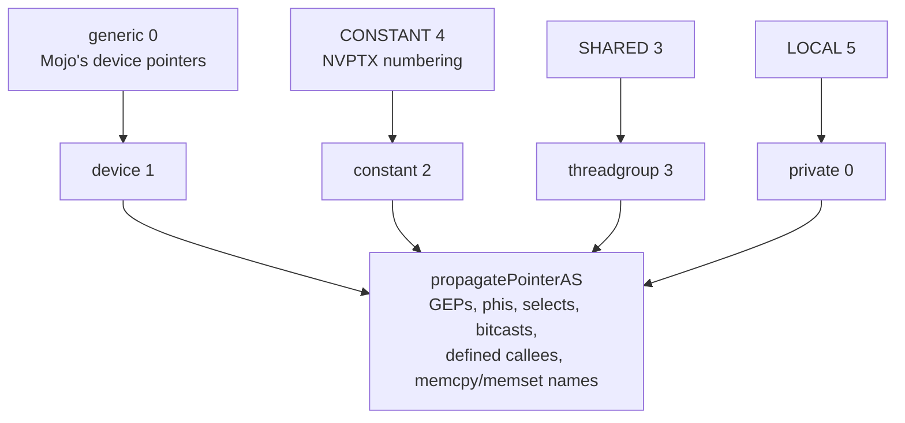

# 3. Legalisation

`legalizeModule` is the body Apple's published `MetalAIRPass` skeleton leaves
out. It is about two hundred and forty lines of calls in a fixed order, and
most of the order encodes a defect that happened when it was different. This
chapter walks it top to bottom.

## 0. One module, one target

The first thing the function does is resolve the target profile, from the
`air.apple_arch` metadata that `finalizeModuleForTarget` recorded. The comment
insists on doing it first because *the triple and every version stamp* derive
from it, and insists on doing it once:

> *One module, one target. Taking the first function's arch silently compiles
> ...*

— the rest of that sentence being what a module with two archs would do.
Every function in the module must agree, or legalisation refuses.

## 1. Inline every helper, before anything else

`inlineInternalHelpers` runs before a single AIR-specific rewrite. AIR has no
call stack and Metal kernels are fully inlined regardless, so it costs
nothing; the reason it runs *first* is a list:

> *— deviceizeCapturedPointers never saw code that inlining brought in later,
> leaving device pointers generic (reads returned zero, silently);*
> *— propagatePointerAS retyped a defined callee's parameter, which leaves the
> enclosing FunctionType behind and the module invalid;*
> *— a kernel using threadgroup memory THROUGH a helper could not have the
> global rewritten to a parameter, because the argument does not exist inside
> the callee.*
>
> *Every one of those is "the code moved after I legalised it". Inline first
> and the question does not arise.*

## 2. Three constructs the optimiser invents and AIR lacks

Three small lowerings run next, each for an instruction that never appears in
Mojo source and that LLVM's InstCombine synthesises from ordinary code:

- **`lowerVectorFMA`** — a vector `llvm.fma` must be `air.fma.<ty>`. Apple's
  compiler emits `air.fma.v4f32`; the scalar `llvm.fma.f32` is accepted as it
  is. The split is by width.
- **`lowerMaskBitcasts`** — InstCombine's idiom for "are any lanes set" is
  `bitcast <4 x i1> to i4` followed by `icmp eq i4 %b, 0`. An `i4` is not a
  register width any GPU implements. The pair is lowered to an OR reduction
  over the lanes so the odd-width integer is never materialised — and only
  when every user is a comparison against zero, since anything else risks
  silently wrong code.
- **`lowerThreeWayCompares`** — `llvm.scmp` and `llvm.ucmp`, which AIR has no
  instruction and no runtime function for. Othello's Monte-Carlo tree search
  kernel reached the reader as the undefined symbol `llvm.scmp.i32.i64`,
  *naming neither the kernel nor anything in the source*. Both expand into
  selects.

## 3. The transform table

`Air::applyTransforms` applies a table of optional rewrites, all off by
default and selectable with `APPLEGPU_AIR_XFORMS=name=on` or `all=on`:
`rename-llvm-intrinsics`, `split-i64-shuffle`, `guard-nan-minmax`,
`volatile-loop-loads`. They come from the out-of-tree LLVM AIR backend's
experience rather than from a defect measured here, so they are kept as
*evidence, not specification* — available for a comparison, never applied
unasked. Chapter 4 has the rule table that goes with them.

## 4. Builtins become AIR runtime calls

`mangleAirOps` finishes what the MLIR lowering began. The builtin registry —
`AirBuiltinRegistry.h`, *the shared source of truth for AIR builtin families,
signature classes, payload domains, convergence, and type suffixes* — lists
every family the backend will construct a declaration for. A family absent
from the table is not accepted merely because its name starts with `air.`.


| Signature class | Families |
|:---|:---|
| Barrier | `air.wg.barrier`, `air.simdgroup.barrier` |
| Unary | `air.sin`, `air.cos`, `air.tan`, `air.exp`, `air.exp2`, `air.exp10`, `air.log`, `air.log2`, `air.log10`, `air.sqrt`, `air.rsqrt`, `air.recip`, `air.fabs`, `air.floor`, `air.ceil`, `air.rint`, `air.round`, `air.trunc`, `air.frac`, the inverse trig and hyperbolic functions, and `air.simd_sum`, `air.simd_product`, `air.simd_min`, `air.simd_max`, the two `air.simd_prefix_*_sum` scans |
| Binary | `air.fmin`, `air.fmax`, `air.fmod`, `air.pow`, `air.powr`, `air.divide`, `air.copysign` |
| Ternary | `air.fma` |
| Shuffle | `air.simd_shuffle`, `air.simd_shuffle_up`, `air.simd_shuffle_down`, `air.simd_shuffle_xor` |
| Ballot | `air.simd_ballot.i32` |


Each family says whether it carries a type suffix, what payload domain it
accepts, and whether it is *convergent* — the barrier, shuffle, reduction
and ballot families are, and `applyAirCallAttributes` stamps the attribute
so no later pass duplicates or sinks a rendezvous. Two deliberate
irregularities are in the
experiment log: `air.simd_ballot.i32` is a *pre-mangled* ABI name, because its
operand is `i1` and its result `i32`, so deriving a suffix from operand zero
would be wrong; and SIMD payloads are limited to the scalar domains the
current Metal path supports, so the earlier backend's habit of manufacturing a
`.u.i64` spelling is gone.

Then `stripAirSignatureTags` removes any `$types` tag that survived, and
`eraseDeadIntrinsicDeclarations` sweeps out every `llvm.*` declaration nothing
calls — as a sweep, not per intrinsic, because *the next lowering will strand
another one. Ours did, immediately.*

## 5. Casts

`lowerIntFloatConverts` replaces every integer-to-float and float-to-integer
cast with a call, because Apple's compiler emits none of the native forms —
ever. Leaving them native does not fail cleanly:

> *metallib accepts the module and the Metal compiler SERVICE dies at pipeline
> creation with XPC_ERROR_CONNECTION_INTERRUPTED, naming nothing.*

The naming was golden-sampled from a kernel casting scalars and vectors both
ways:

```text
air.convert.f.f32.s.i32      air.convert.s.i32.f.f32
air.convert.f.f32.u.i32      air.convert.u.i32.f.f32
air.convert.f.v4f32.s.v4i32  air.convert.s.v4i32.f.v4f32
```

that is, `air.convert.<dstKind>.<dstTy>.<srcKind>.<srcTy>` with kind in
`{f, s, u}`. Float-to-float is split by width: a scalar `half` or `bfloat` to
`float` stays a native `fpext`/`fptrunc`, while the vector form becomes
`air.convert.f.v4f32.f.v4bf16` and its three siblings. The vector native form
is not rejected either — it is *computed wrongly by the driver with no error*.

## 6. Address spaces

This is the load-bearing step, and the oracle finding that opens this
document's index is about it. Mojo elaborates device pointers in the
*generic* address space, because NVPTX accepts that, and numbers the others
NVPTX's way. AIR has different numbers and no generic space at all.

<!-- doccrate:keep-together:start -->




<!-- doccrate:keep-together:end -->

`remapAddressSpaces` renumbers module globals and propagates. `propagatePointerAS`
follows a changed pointer through its use graph, mutating derived pointer
values in place. Every consumer that was ever missed became a separate bug,
and the finding tabulates them: a `select` or `phi` whose other arm was left
behind; an `icmp`, whose result is `i1` and so is never visited by a walk
keyed on pointer results; a constant operand, usually `ptr null`, which has to
be *rebuilt* in the new space rather than cast; the overloaded memory
intrinsics, which encode address spaces *in the name* and so have to be
re-resolved — `refreshOverloadedMemIntrinsics` — rather than retyped; a
defined callee whose body still saw the old space; a nested aggregate whose
inner device pointer stayed generic silently; and code arriving *after* the
pass, from inlining. *If you write one of these, write all five. They are the
same bug and they will surface weeks apart otherwise.*

`deviceizeCapturedPointers` handles the case the fork never had to: a pointer
loaded out of the constant argument buffer or pulled out of a capture struct
with `extractvalue` is itself a device pointer, and it is retyped to
`addrspace(1)` using Apple's own idiom, `inttoptr i64 %x to ptr addrspace(1)`.
Not `addrspacecast`: AMD's Metal backend needs the cast to keep pointer
provenance for its buffer-resource lookup, and Apple's has no generic space to
cast *from*. The port inherited the AMD choice and, in the finding's words,
*wrote a grid of zeroes with it. The reasoning behind the original was sound
for its target; that is exactly why it survived the port unexamined.*

After the kernels are legalised, `dropNoOpAddrSpaceCasts` removes casts that
retyping has made same-space — a same-space `addrspacecast` is invalid IR,
which Apple's reader reports only as `Invalid record`. It runs after and not
before because cleaning up first misses everything the legalisation is about
to create; and they also arrive from the frontend, whose
`unsafe_address_space_cast` has nothing requiring source and target to differ.

## 7. No doubles, and no 128-bit integers

Metal has no 64-bit floats anywhere — MSL has no `double` — and no 128-bit
integer type. Every instruction in every function is checked, result and
operands, and a kernel that uses either is *refused* with an error that names
it:

```text
float64/float128 not supported on Metal/AIR (in kernel 'k'): Metal has
neither a double nor a 128-bit integer type
```

— the integer case carries its own wording ("integers wider than 64 bits").
That is deliberately a located compile error rather than a silent demotion.
The firewall's `f64` rule, inherited from the proof-of-concept backend and
left at Log, records the alternative that backend chose.

## 8. Each kernel gets an AIR signature

`legalizeKernel` rewrites one exported kernel. Parameter lists are immutable
in LLVM, so it builds a fresh function, splices the body in, and returns the
new function together with the per-argument metadata list. Three things
change.

**Builtin shims become trailing parameters.** The remaining `air.*` calls that
are not runtime functions — thread and threadgroup positions, sizes, the
simdgroup indices — are collected per kind; the new signature is the original
parameters plus one parameter per builtin kind used. A dimension suffix in
the original name (`.x`, `.y`, `.z`) becomes an element extraction from the
three-wide parameter. Each such parameter carries its metadata tag:
`air.thread_position_in_grid`, `air.thread_position_in_threadgroup`,
`air.threadgroup_position_in_grid`, `air.threads_per_grid`,
`air.threads_per_threadgroup`, `air.threads_per_simdgroup`,
`air.thread_index_in_threadgroup`, `air.thread_index_in_simdgroup`,
`air.simdgroup_index_in_threadgroup`, `air.threadgroups_per_grid`.

**Pointer parameters move to the device address space**, because Mojo
elaborated them generic — *this rewrite is the address-space half of the
closed MetalAIRPass*. By-value aggregate parameters — the capture blob a
closure kernel carries — become a `constant T&` in `addrspace(2)`, used
where it stands; by-value scalars become an `addrspace(2)` parameter loaded
at entry. Both remember the original type, so the field layout stays
recoverable. Dynamically-sized threadgroup globals are rewritten into
`addrspace(3)` parameters the launch sizes through
`setThreadgroupMemoryLength`.

**Captured pointers are not hoisted.** The x86-64 fork this descends from
pulled every device pointer inside a capture struct out into its own kernel
buffer parameter, because AMD's Metal backend cannot resolve a raw address to
a buffer resource. On Apple silicon that is *actively harmful*: thirty-one
device buffers is the limit and hoisting spends one per captured pointer, so
a kernel Apple would bind as a single constant buffer can exhaust it. The
canonical Apple shape, verified with a golden sample of a kernel taking
`constant Caps& { device float* p; device float* q; uint n; }`, keeps the
pointer in the struct and describes it with nested metadata on *one* buffer:

```llvm
!12 = !{i32 0, !"air.indirect_buffer", !"air.buffer_size", i32 24,
        !"air.location_index", i32 0, i32 1, !"air.read",
        !"air.address_space", i32 2, !"air.struct_type_info", !13, ...}
!13 = !{i32 0,  i32 8, i32 0, !"float", !"p", !"air.indirect_argument", !14,
        i32 8,  i32 8, i32 0, !"float", !"q", !"air.indirect_argument", !15,
        i32 16, i32 4, i32 0, !"uint",  !"n", !"air.indirect_argument", !16}
!14 = !{i32 0, !"air.buffer", !"air.location_index", i32 0, i32 1, ...
        !"air.address_space", i32 1, ...}
!16 = !{i32 2, !"air.indirect_constant", !"air.location_index", i32 2, ...}
```

Two details are easy to miss and are written down beside the code: the
`struct_type_info` is a *flat* tuple per field — offset, size, zero, type
name, field name, `air.indirect_argument`, node — and the nested
`location_index` is its own namespace, not the top-level buffer numbering.
Emitting this is the open item tagged `TODO(air-indirect)`. It is not a
correctness blocker — `deviceizeCapturedPointers` retypes the loads and the
runtime keeps the pointees resident — but it is what would let residency be
narrowed from *every live allocation on the encoder* to the reachable ones.
Chapter 5 returns to that cost.

### The kernel entry in `!air.kernel`

Every legalised kernel is registered in the module's `!air.kernel` named
metadata: a node naming the function, an empty node where Apple's front end
puts kernel-level properties, and the list of per-argument nodes. The per-argument shape for an ordinary device buffer
and a thread position, in the form the golden samples show, is:

```llvm
!air.kernel = !{!0}
!0 = !{ptr @k, !1, !2}
!1 = !{}
!2 = !{!3, !4}
!3 = !{i32 0, !"air.buffer", !"air.location_index", i32 0, i32 1,
       !"air.read_write", !"air.address_space", i32 1,
       !"air.arg_type_size", i32 4, !"air.arg_type_align_size", i32 4,
       !"air.arg_type_name", !"float", !"air.arg_name", !"out"}
!4 = !{i32 1, !"air.thread_position_in_grid",
       !"air.arg_type_name", !"uint", !"air.arg_name", !"tid"}
```

The vocabulary the backend writes — `air.buffer`, `air.location_index`,
`air.address_space`, `air.read` and `air.read_write`, `air.arg_type_size`,
`air.arg_type_align_size`, `air.arg_type_name`, `air.arg_name`,
`air.indirect_buffer`, `air.indirect_argument`, `air.indirect_constant`,
`air.struct_type_info`, `air.buffer_size` — is exactly the set that appears in
Apple's output for the same kernel, and the reflection the runtime asks for in
chapter 5 is Metal reading this metadata back.

After the kernel loop, and not before it, `rebuildMismatchedSignatures`
reconciles any function whose parameters were retyped but whose
`FunctionType` was left behind — the ordering is stated in the source because
`legalizeKernel` is what creates the mismatch.

## 9. Module flags and versions

The six `air.max_*` limits from the profile go in as module flags — beside
two stock clang flags, `wchar_size` and `frame-pointer`, that the golden
samples also carry — then the identification metadata, *per the golden
sample* and, the comment notes, *NOT guessed from* the feature string:

```text
!air.version           = 2, 8, 0
!air.language_version  = "Metal", 4, 0, 0
!air.compile_options   = "air.compile.denorms_disable", ...
!air.source_file_name  = "mojo-kernel"
"SDK Version"          = 26, 0
```

## 10. Scrub

The last step removes what must not reach the reader: the host's
`target-cpu`, `target-features` and `tune-cpu` attributes from every function
(the module is handed to a clang-17-era `metal -x ir` as *text*, which is
stricter than the bitcode reader about attributes it does not know); the
argument attributes that era has no record for (`byval`, `captures`,
`range` and friends) and `dso_local` on non-local functions; the
exported-kernel passthrough attribute the MLIR lowering stamped; every
`!llvm.loop` metadata node, unless `APPLEGPU_AIR_KEEP_LOOP_MD=1` asks for a
comparison; and finally the `air.apple_arch` node, which was for
legalisation, not for the artefact.

The loop metadata line has a story. Before the unroller existed it was an
experiment knob; when the unroller's gate began marking loops it had declined
with `llvm.loop.unroll.disable`, those marks leaked through to Apple's
compiler, which honoured them, and the rolled matmul dropped to 116 GFLOP/s.
Chapter 6 has the table. Loop metadata does not go to the driver.
