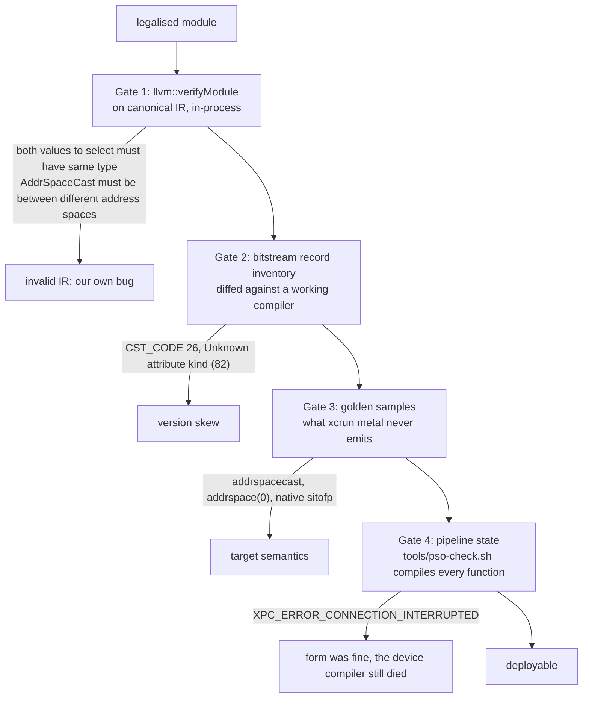

# 4. What went wrong

The defects in this chapter are arranged by the gate that would have caught
them, because that is the shape the work took. For the first weeks every
failure started from zero: three unrelated causes produced the same error
message, and until they were separated there was no way to know which kind
of wrong a module was. The diagnostics finding calls the gates *the single
highest-leverage thing in this repository — adding these turned defects that
cost hours each into defects that cost one cycle each*.

## Three causes, one message


| What the reader says | What it can mean |
|:---|:---|
| `Invalid record` | invalid IR that no reader accepts; **or** a modern construct the frozen reader predates; **or** a same-space `addrspacecast` |
| `Unexpected bitcode file!` | `metallib`'s answer to everything, including a `poison` constant and a call whose explicit type disagrees with its callee |
| `XPC_ERROR_CONNECTION_INTERRUPTED` | the compiler *service* died at pipeline creation: a misspelled symbol, a dead declaration, a native cast, an `i4`, a vector `llvm.fma` — none named |


> *No function. No instruction. No hint that a type might be involved. Three
> different defects produced this identical message, and nothing
> distinguished them until the module was compiled for the device in
> isolation.*

The three causes are: **invalid IR** — the backend's own bug, rejected by
modern LLVM too; **version skew** — valid modern IR the reader predates; and
**target semantics** — not skew, a different machine model. Each gate isolates
one.

<!-- doccrate:keep-together:start -->




<!-- doccrate:keep-together:end -->

## Gate 1: verify before serialising

`llvm::verifyModule`, immediately after legalisation and before the
downgrade. Chapter 2 quoted why the placement matters. What it caught was
humbling: a good share of what the reader had been rejecting was not
AIR-specific at all.

> *`select` with mismatched pointer types and a same-address-space
> `addrspacecast` both reached metallib and came back as "Invalid record";
> run through the verifier they are "both values to select must have same
> type", which says where to look.*

The finding adds a warning that proved true: *expect it to reject things that
currently "work"*. Two long-standing invalid-IR defects had been shipping
quietly because the reader tolerated them. *Fix the IR, not the gate.*

### The address-space defect class

The largest family Gate 1 exposed was the one chapter 3 described from the
mechanism side: a retyped pointer whose consumer was left behind.


| Consumer | Symptom | Fix |
|:---|:---|:---|
| `select` / `phi` | `both values to select must have same type` | reconcile the *other* arm |
| `icmp` | `Both operands to ICmp are not of the same type!` | result is `i1`, so a walk keyed on pointer results never visits it |
| constant operands | the same, usually `ptr null` | rebuild the constant in the new space |
| overloaded intrinsics | `Call parameter type does not match function signature!` | `llvm.memcpy` encodes the spaces in its *name* — re-resolve |
| defined callees | body still sees the old space | retype the parameter and recurse |
| nested aggregates | a device pointer stays generic, silently | extract the inner struct first |
| code arriving after the pass | the same, for one callee's pointers | re-run after inlining |


And the one the verifier cannot see, because the IR is well-formed: a device
pointer left generic. Its signature is an output buffer of zeroes with no
error anywhere. That has *two* causes on Apple, needing opposite fixes, and
one run separates them:

<!-- doccrate:keep-together:start -->

| `MTL_SHADER_VALIDATION=0` | `=1` | Cause |
|:---|:---|:---|
| passes | fails | non-residency: the buffer is not `useResource`d |
| fails | fails | a device pointer left in `addrspace(0)` |

<!-- doccrate:keep-together:end -->

The port guessed residency first, on the strength of the earlier finding, and
was wrong; the loads and stores of one kernel had disagreed, twelve generic
against forty-two device, and *only half the kernel was wrong*. The one-line
census that settles it — count the address space on every `load` — is in the
finding, and the rule it produced is absolute: *any `ptr` without an
`addrspace` in a finished AIR kernel is a defect unless it is alloca-derived,
and if the module has no `alloca` at all, there is no unless.*

## Gate 2: the bitstream, not the disassembly

The version-skew table, every row measured:


| Construct | Since | Symptom |
|:---|:---|:---|
| unary `fneg` | LLVM 8 | writer hard-crash |
| `freeze` | LLVM 10 | writer hard-crash |
| `poison` | LLVM 12 | `CST_CODE 26` → `Unexpected bitcode file!` |
| `llvm.stepvector` | LLVM 12 | XPC crash at pipeline creation |
| attribute codes ≳77 (`range`, `nofpclass`, `allockind`) | various | `Unknown attribute kind (82)` / `Invalid record` |
| GEP no-wrap flags (`nusw`, `nuw`) | LLVM 19 | text form rejected; encoded flags break the driver |
| fast-math flags on FP *casts* | modern | one flagged cast kills the module |
| `memory(none)` | LLVM 16 | **not** a rejection cause here — see below |


The last row is a correction, and the story behind it is the most expensive
tooling lesson in the port. Disassembling a rejected `.air` with `llvm-dis`
showed `memory(none)` on `llvm.umax.i64` — a known-bad LLVM 16 attribute, an
open-and-shut diagnosis. Several rounds of "strip it harder" changed nothing,
*because there was nothing to strip*:

> *`llvm-dis` re-populates intrinsic declarations with their default
> attributes on load. The attributes it prints are therefore not necessarily
> the attributes in the file.*

Two defences came out of it. Dump the module from *inside* the compiler,
immediately before encoding — that text is what was actually written, and
the `.pre.ll`/`.post.ll` artefacts exist for this. And trust the bitstream:
`llvm-bcanalyzer --dump` reports records as encoded, and attributes
re-derived on load do not appear.

### The typed-pointer rule

The real defect in that module was structural, and it is the one rule about
typed pointers worth memorising:

> *A call's explicit type must equal the pointee type of its callee operand.*

Under opaque pointers that is vacuous, so Gate 1 is silent. It becomes
load-bearing the moment `PointerRewriter` retypes pointers for the old
writer, because the rewriter records a retyped callee's new `FunctionType` in
its own side table while the call instruction keeps returning its
*pre-rewrite* copy. Emit that and the two disagree; Apple's reader says
`Explicit call type does not match pointee type of callee operand`, and
`metallib` says `Unexpected bitcode file!`.

The writer already had the fix — gated by name to the one intrinsic family it
was first hit on. *The rule is general: it holds for any callee the rewriter
retyped, which is any callee taking a pointer once a kernel's address spaces
are legalised.* Ungating it took the gather/scatter/index cluster from
sixteen kernels rejected to sixteen accepted. *Worth checking whether your
own port has the same shape — a correct fix wearing a name check that hides
how general it is.*

## Gate 3: what the vendor never emits

Chapter 1 gave the list. Each entry was a separate day: `addrspacecast` where
Apple's idiom is `ptrtoint`/`inttoptr`; `addrspace(0)` on anything but an
alloca; and the four native integer-float casts, which `metallib` accepts and
the device compiler dies on. The one tool that names a defect is worth
repeating, because it should be the *first* thing run against a rejected
module, not the last:

```bash
$(xcrun -f air-opt) kernel.air -o /dev/null
```

`air-opt` is stricter than `metallib` — it rejects bitcode that `metallib`
accepts and that runs correctly, including Modular's own — so it is a
diagnostic, never a verdict.

## Gate 4: compile it for the device

All three gates above check *form*. None compiles the module for the GPU, and
three defects passed all three and still killed the compiler service:

- **Dead intrinsic declarations.** The downgrade folded every
  `llvm.stepvector` call and left the `declare` behind. The reader resolves
  every declared symbol, so the module still died — and nothing in the IR
  referred to it. Hence the sweep in chapter 3.
- **Vector `fma` must be `air.fma.<ty>`.**
- **`bitcast <4 x i1> to i4`.** *Any integer type that is not 8/16/32/64 bits
  is a defect in a GPU module, and it will arrive from the optimiser rather
  than from your own lowering.* Although — the firewall's `odd-int-width`
  rule is *Log*, not *Fail*, because `test_grid_dim` emits a `trunc i64 to
  i2` and passes. Generalising from the `i4` case was wrong; the reader
  tolerates some odd widths, and the rule narrows only with evidence.

Only Gate 1 runs in-process. Gates 2 and 3 live in `spikes/air-gates.sh` in
this repository, and Gate 4 is `tools/pso-check.sh` in the oracles
repository: it loads a metallib, or packages a `.air` first, compiles
every function in it to a pipeline state, and exits non-zero if any fails.
About twenty lines of Objective-C. Verified in both directions on the
artefact that found it — exit 1 before the fixes, exit 0 after — and meant
for CI.

The other technique from that finding found two of the three before any
bisection: list the declared symbols and compare them with the vendor's for
equivalent source. *A symbol the vendor never emits is a defect; a symbol it
emits under a different name is a defect. Both are invisible in the
instruction stream and obvious in the symbol list.*

## The legality firewall

What the gates learned is written into `AirLegality.cpp` as a rule table.
Each rule has an action — `Fail`, `Log`, or `Permit` — and an *evidence*
field that says how the backend knows: `measured` means this backend shipped
the defect and the fix was verified on an M4; `air-poc` means it comes from
the out-of-tree LLVM AIR backend and stays at Log until confirmed here;
`semantic` means it is a property of the machine, not of a reader.


| Rule | Action | Evidence | What it catches |
|:---|:---|:---|:---|
| `mask-bitcast` | Fail | measured | `<N x i1>` ↔ `iN` — the form measured to pass verifyModule, metallib and air-opt, then kill the service |
| `three-way-compare` | Fail | measured | a surviving `llvm.scmp`/`ucmp`; the expected count is zero, so there is no false positive to find |
| `native-int-float-cast` | Fail | measured | `sitofp`/`uitofp`/`fptosi`/`fptoui` — must be `air.convert.*` |
| `vector-fp-cast` | Fail | measured | vector `fpext`/`fptrunc` — computed wrongly with no error |
| `vector-llvm-fma` | Fail | measured | vector `llvm.fma` — must be `air.fma.<ty>` |
| `unknown-air-symbol` | Fail | measured | an `air.*` declaration whose name or type is not in the contract |
| `divergent-barrier` | Fail | semantic | `air.wg.barrier` control-dependent on a thread, lane or simdgroup identity |
| `odd-int-width` | Log | unproven | integer widths outside 1/8/16/32/64, other than the mask case |
| `unresolved-external` | Log | measured | a declaration-only symbol the reader may not resolve |
| `generic-deref` | Log | measured | a load/store/atomic through a non-alloca `addrspace(0)` pointer |
| `addrspacecast` | Log | measured | Apple emits none; a same-space cast is invalid outright |
| `dead-intrinsic-decl` | Log | measured | an `llvm.*` declaration nothing calls |
| `unmapped-llvm-intrinsic` | Log | unproven | a vector `llvm.*` math intrinsic with an `air.*` equivalent — *probably still too broad* |
| `i64-simd-shuffle`, `f64`, `int-to-bf16`, `nonvolatile-loop-load`, `unguarded-scalar-store` | Log | air-poc | inherited from the proof-of-concept backend, unconfirmed here |
| `nan-minmax-unwrapped` | Permit | air-poc | kept only as documentation; it cannot work as a detection rule |


Two rules are worth reading for the reasoning alone. `unmapped-llvm-intrinsic`
says of itself that *the evidence is weaker than it looks*: `llvm.fma.v4f32`
was measured to kill pipeline creation, but `llvm.maxnum.v4f32` is emitted
661 times across ten tests and evidently tolerated — *treat a hit here as a
question, not an answer, until the specific intrinsic has been tested*. And
`nan-minmax-unwrapped` is switched off because it *cannot* work: AIR's
`fmin`/`fmax` drop NaN, which is correct for `llvm.minnum`/`maxnum` and wrong
only for `llvm.minimum`/`maximum`, and after renaming the two are
indistinguishable — Apple's own output trips it four times. The correctness
belongs in the `guard-nan-minmax` transform, which wraps only calls it
renamed.

Any rule can be downgraded for a comparison — `APPLEGPU_AIR_RULES=rule=log`
— but the table is the shipping posture, and a Fail that has to be turned
off is itself a finding waiting to be written.

The `divergent-barrier` rule is the one piece of real analysis in the file.
It treats the kernel arguments tagged by `!air.kernel` as the authoritative
thread-identity sources, follows their SSA dependencies into conditional
branches, and uses dominator and post-dominator analysis to tell a
lane-dependent branch that *reconverges* before one shared barrier (legal)
from a barrier selected, skipped or iterated by a thread-dependent condition
(fails). Threadgroup position and launch-size arguments are uniform at
workgroup scope and do not taint a branch. It found three latent divergent
barriers in the basics kernels (D8b) that had been passing on hardware by
luck.

<!-- doccrate:keep-together:start -->
## The defects that were not about IR at all


| Ledger | What happened | What it taught |
|:---|:---|:---|
| D21 | the feature-warning fix stripped `target-cpu` before legalisation read the arch from it; every GPU program failed with `no Apple AIR target profile for arch ''`, and the change was pushed as verified | the check had run a binary the *previous* build left behind; a counter that cannot tell "zero" from "never ran" is not a check |
| D22 | six knob experiments in a row measured the same number and emitted identical AIR — none had run; `~/.cache/modular/.mojo_cache` keys on source and compiler version string, not environment, not a local rebuild | a null experiment is a cache hit until proven otherwise; every knob prints `[air-knobs]`, and the suites run with a fresh `MODULAR_CACHE_DIR` |
| the Bazel `PATH` | `xcrun` was not found because the compile action has no `PATH` at all | the bitcode is generated first; a packaging failure reads like a codegen failure |

<!-- doccrate:keep-together:end -->

*The ledger, continued:*

<!-- doccrate:keep-together:start -->

| Ledger | What happened | What it taught |
|:---|:---|:---|
| the gate marks | `llvm.loop.unroll.disable` on loops the gate declined leaked to Apple's compiler, which honoured it; rolled matmul fell to 116 GFLOP/s | nothing the device pipeline says to itself may reach the artefact |
| D6 | one rowwise subkernel variant kills the compiler service; reduction from retained artefacts still open | keep `.air` before packaging, name artefacts per kernel, include the profile |
| D23 | `DeviceExternalFunction` launches segfaulted because the sizes never crossed the ABI; now a clean contract error | a null sizes pointer is the Apple argument-view discriminator, not "no sizes" — the runtime must be told which protocol the caller speaks |

<!-- doccrate:keep-together:end -->


D21 has a memory attached to it in this project's notes, and the rule it left
is short: a compiler change is verified by `check-examples.sh` and
`check-gamepane.sh`, never by the one program that motivated it, and never on
a bench number alone.
