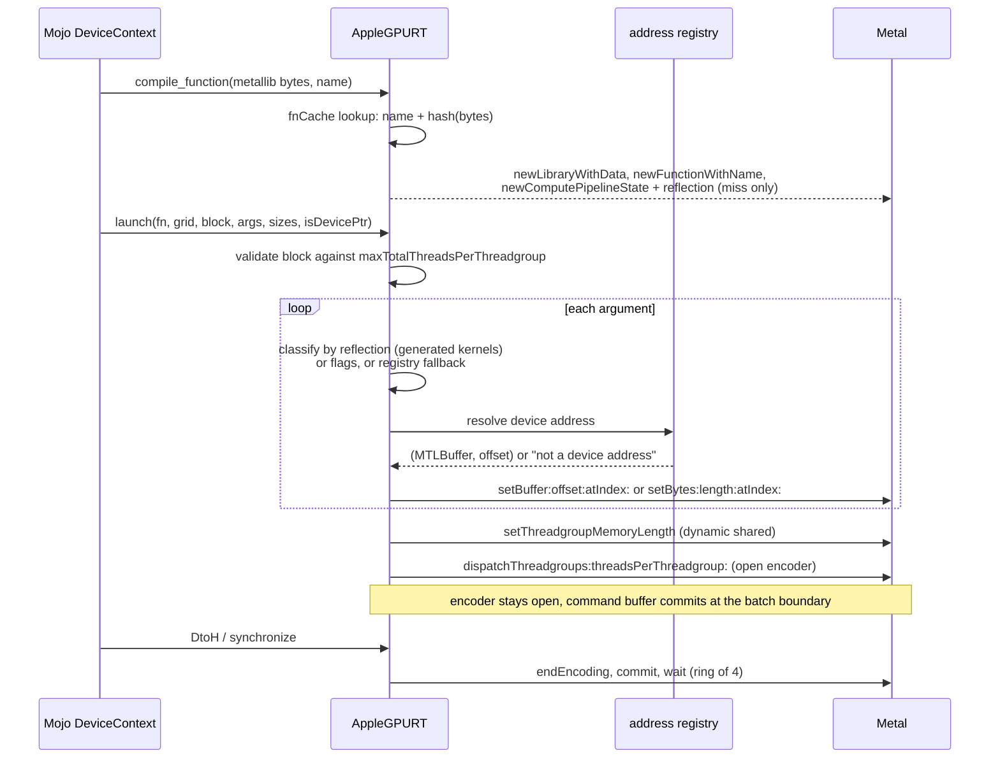
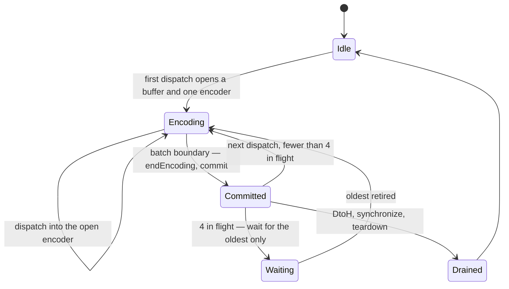

# 5. The runtime

Everything so far produces bytes. `AppleGPURT` is what turns them into a
dispatch, and it has its own failure surface — one the oracle findings call
*a second, unshared failure surface*, because everything else in the port is
about what the compiler emits and this is about the boundary underneath it.

## What Modular does not publish

Mojo's `DeviceContext` is a thin Mojo wrapper over a C ABI of `AsyncRT_*`
functions: `AsyncRT_DeviceContext_create`, `_createBuffer_async`,
`_HtoD_async`, `_DtoH_async`, `_compileFunction`, the launch entry points, the
`AsyncValue` retain and release family, streams, sub-buffers, and so on. The
bindings in `device_context.mojo` declare every symbol, so the *interface* is
fully specified. What is not published is an implementation for anything but
CUDA, HIP and Apple's own path, nor the semantics of several calls — and, as
the finding says, *that is where the cost is*. `AppleGPURT.cpp` and
`AppleGPUMetal.cpp` are that implementation for Metal on Apple silicon.

It is written in plain C++ over the Objective-C runtime — `objc_msgSend`
casts, the metal-cpp technique — so no Objective-C++ toolchain support is
needed anywhere in the build. One consequence had to be learned: Metal hands
back *autoreleased* objects from `commandBuffer`, `computeCommandEncoder` and
the blit encoder, and a plain C++ file gets no `@autoreleasepool`. On a thread
that has one — AppKit's main thread — they drain at the end of each event-loop
turn and nobody notices. On a worker thread that does not, *they are never
released at all*. The runtime now scopes its own pool around every hot-path
call that allocates one; a few cold paths, like context creation, still leak
their strings.

## Unified memory changes the shape of everything

The header comment sets the design in one paragraph:

> *On Apple Silicon the CPU and GPU share one pool, so every buffer is
> storageModeShared and both HtoD and DtoH are a plain memcpy — no staging
> buffer, no blit encoder, no command buffer. The x86-64 fork could not do
> this: a discrete Vega II has its own HBM2, so device buffers had to be
> storageModePrivate and every transfer went through a staging blit.*

So `isHost` no longer means "host-visible" — everything is. It means only
"the address handed to Mojo is a CPU pointer", which is still a real
distinction. The staging paths are kept behind a `hostVisible` flag so a
future `storageModePrivate` mode — worthwhile for GPU-only buffers, which
Apple can keep in a compressed layout — can switch it back per buffer.

## The address registry

Device pointers handed to Mojo are `MTLBuffer` `gpuAddress` values. A global
interval map resolves any device address back to its owning buffer and
offset. That is how a kernel launch binds a pointer argument — `setBuffer`
with a resolved offset — *without trusting struct layouts we don't own*, and
it is how a sub-buffer, a pointer into the middle of an allocation, or a
device address a kernel captured by value can all be bound the same way.

The registry has a mirror: an `MTLResidencySet` holding every root buffer.
The set is attached to the command queue once; membership is edited when an
allocation is created or destroyed and committed then, so the driver keeps
everything in it resident for every command buffer on that queue with no
per-dispatch work at all. It is per *device*, not per context, because a
capture blob may carry any live device address, so two contexts on one device
share a set attached to both queues. The section on residency below says what
this replaced.

## Reflection is the argument contract

Loading a kernel is Metal's own three steps — `newLibraryWithData`,
`newFunctionWithName`, `newComputePipelineStateWithFunction:options:reflection:`
— with the reflection option set deliberately:

> *Without the argument contract the launch path has to guess whether an
> 8-byte value is a device address to bind or scalar bytes to copy, and a
> guess is wrong in one direction or the other.*

What comes back is Metal's reading of the `!air.kernel` metadata chapter 3
emitted: for each buffer index, whether the slot is a buffer or a constant,
its address space, its size. The runtime keeps that as `argSlots`, indexed by
buffer index, and the launch path binds against it rather than against
anything the caller says. `STATUS.md` records the moment that became true:
*reflection is now authoritative for compiler-generated kernels*.

One ambiguity is documented beside the slot table and is worth knowing about.
The port's kernels declare device parameters with an opaque pointee, so Metal
reports the buffer's data type as *none*, and that cleanly identifies a device
buffer. An MSL kernel declares `device float*`, so Metal reports `Float`/4,
and the same test would call it a constant. *Same reflection API, opposite
meaning, and no way to tell which you are looking at without knowing where
the function came from.* So each loaded function carries a flag saying
whether the compiler generated it, and reflection is trusted as the contract
only when it did.

### The function cache

Compiling a function used to happen on every call: a fresh `MTLLibrary`,
`MTLFunction` and pipeline state, every time `compile_function` ran — and the
`enqueue_function[kernel]` template form every example uses runs it per
launch. The bytes arrive in a fresh `String` each time, so their address is no
identity. A per-context cache keyed by function name, the module length, a
64-bit hash of the bytes, and the kernel's maximum dynamic threadgroup bytes
brought that from 17.8 µs per call to 0.8–1.2 µs. It is the first
of the three dispatch fixes in chapter 6.

## A launch, step by step

<!-- doccrate:keep-together:start -->

<!-- doccrate:keep-together:end -->

The argument model is stated at the top of the launch function:

> *Per-arg value pointers + sizes + an is-device-pointer flag per argument.
> Pointer args hold a 64-bit device address; we resolve it to (MTLBuffer,
> offset) and bind with setBuffer — which also makes the resource resident.
> Scalar args are bound with setBytes. Argument index == buffer slot index.*

### The flags are wrong for captures, so the contract decides

The Mojo side marks every capture slot as "not a device pointer" — *captures
are raw values, never device buffers* — which holds on CUDA, where a captured
pointer is just an integer the kernel dereferences. It does not hold here. A
capture that the backend has typed as a device buffer parameter expects a
*binding*, not the address bytes. Binding one with `setBytes` put the address
value where the kernel expected the buffer base, and the kernel wrote 1.0
through it into nothing; the test that caught it,
`test_static_layout_capture_argcount`, failed with its output buffer still
holding the −1.0 fill.

The first fix resolved every pointer-sized argument against the registry
regardless of the caller's flag — *this runs even when the caller supplied
explicit flags, and must* — and that heuristic is what caught the bug. It is
also a guess that can in principle misfire on a scalar whose value happens
to land inside a live allocation, so it did not stay the answer. The
principled fix is the one the comment names: *ask the pipeline what each
argument is*. For a compiler-generated kernel, reflection **is** the
contract — every slot must be described, a caller flag that disagrees with
it prints a line and loses, and the registry heuristic survives only as the
fallback when there is no reflection at all. Resolving a device address to
`(MTLBuffer, offset)` through the registry is still how every such argument
is *bound*.

### Metal can silently no-op a dispatch

> *Metal can silently no-op a dispatch whose threadgroup is too large for the
> pipeline (SDL #15241); validate against the pipeline's own limit and fail
> loudly instead.*

`APPLEGPU_TRACE_LAUNCH=1` prints the pipeline's `maxTotalThreadsPerThreadgroup`
and `threadExecutionWidth` beside every launch for exactly this class of
question.

## Residency

`setBuffer` makes the bound resource resident. A pointer a kernel reaches
*through* a capture blob — a struct holding a device pointer, passed as one
constant buffer — is never bound, so Metal has no idea the pointee is in use.
The measured behaviour, on an M4 Max, is the trap chapter 4 tabulated: with
shader validation off, the read *passes silently* because a small,
recently-written buffer happens to be resident; with validation on, every
read returns zero. *So it is not fragile, it is already wrong, and it looks
fine.*

The first correct answer was `markAllResident()`: declare every live root
buffer to every compute encoder, one `useResource:` call per buffer per
dispatch, under the registry lock. Correct, and *O(live allocations) per
dispatch* — the cost of a dispatch grows with every unrelated allocation in
the process, which the experiment log named as the next runtime scaling
defect. The residency set inverts that cost:

> *The set is attached to the command queue once; membership is edited when
> an allocation is created or destroyed and committed then — O(changes), off
> the dispatch path entirely. Metal keeps everything in an attached, committed
> set resident for all command buffers on that queue, which is exactly the
> guarantee useResource was providing, minus the per-dispatch walk.*

`APPLEGPU_COARSE_RESIDENCY=1` restores the walk as a diagnostic escape hatch
(presence-parsed: any value at all, `=0` included, turns it on — the same is
true of the `APPLEGPU_TRACE_*` switches, unlike the value-parsed launch-mode
switches below). What the set still cannot do is shrink below *all of them*:
narrowing
residency to the pointees a kernel can actually reach is what the
`air.indirect_buffer` metadata in chapter 3 would buy, and that half is still
open.

## Batching, encoders, and the ring

Launches queue and batch by default and drain at synchronisation or
host-observation boundaries — any `DtoH`, any `synchronize`, teardown. Three
decisions set the cost of a dispatch, and all three were changed in one
session after measuring Metal's own floor (chapter 6):

1. **One compute encoder per batch**, not one per dispatch. An encoder
   boundary is a GPU-side pipeline drain, and Metal charges 3.5 µs for it
   against 1.0 µs for a dispatch inside an open encoder. The serial dispatch
   type orders dispatches within an encoder, so a dependent chain needs no
   boundary between links. The bench does not assume this: its ordering probe
   runs 1,000 and 5,000 dependent `+= 1` dispatches and asserts exactly 1,000
   and 5,000, batched and unbatched.
2. **A ring of command buffers** instead of commit-and-drain at every 64th
   dispatch. The drain blocked the host until the GPU was empty and then idled
   the GPU while the next batch was encoded; the ring waits for the *oldest*
   batch only, and only when four are outstanding.
3. **The function cache** above.

<!-- doccrate:keep-together:start -->

<!-- doccrate:keep-together:end -->

Every read path drains before it copies, state is locked, and three switches
exist for isolating a problem: `APPLEGPU_SYNC_LAUNCH=1` restores the
synchronous bring-up mode, a round trip per dispatch; `APPLEGPU_BATCH_DISPATCHES=0`
keeps the queue but gives each dispatch its own command buffer; and the older
`APPLEGPU_ASYNC_LAUNCH=0` disables asynchronous launch without claiming the
synchronous mode — `SYNC_LAUNCH` wins when both are set. Failures a read path
cannot report (a host pointer copy, a buffer destroy) are parked and surface
at the next `synchronize`.

## The ABI has its own defect class

Two of the findings under this heading are not about Metal at all. They are
about what an `Optional[Pointer]` is at a C boundary, and they bit from
opposite directions weeks apart.

`Optional[Pointer[T]]` is niche-optimised: `Pointer` is non-nullable, so the
optional is pointer-sized with null standing for `None`. Both bugs come from
believing that means it *is* a pointer. In one direction, `arg_sizes` —
declared `OptionalPointer` in `DeviceContext.enqueue` — arrived at the C side
as NULL, always, because the value is a nested memory-only aggregate the C
ABI lowering does not unwrap; the callee fell back to pointer-sized argument
sizes, right for buffers and wrong for scalars. In the other, a zero-byte
buffer reporting device address 0 reappeared in Mojo as an *empty* optional
and aborted. The rule the finding draws: *at an `external_call` boundary,
treat `Optional[T]` as an aggregate, not as a nullable scalar, in both
directions. If NULL is meaningful, spell the parameter as an integer address
and convert at the edge.*

That is also the shape of D23. `DeviceExternalFunction` — the path that
launches a kernel supplied as bytes rather than compiled from a Mojo `fn` —
never passed argument sizes, and a null sizes *pointer* on this runtime is
not "no sizes": it is the protocol discriminator meaning *the first entry is
the Apple argument view*, so the runtime reinterpreted the bare pointer
array as that struct and segfaulted. The enqueuer now always builds and
passes a real sizes array, and what remains is routing that
path through the same checked argument view the compiled-kernel path uses; a
size that disagrees with the kernel's declared constant bytes is now a clean
contract error rather than a crash.
