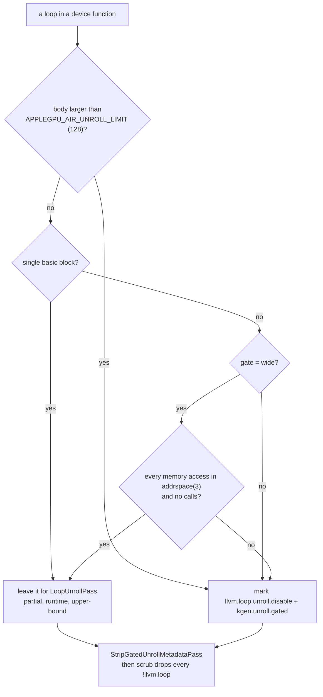

# 6. Making it fast

"Reasonably fast" has a definition in this port: within a few percent of what
Modular's released compiler and Apple's own compiler produce for the same
kernel on the same machine, with dispatch overhead at Metal's own floor. Both
halves were measured before they were true, and neither came from adding an
optimisation. This chapter is the four things that mattered, with the numbers
that decided each.

<!-- doccrate:keep-together:start -->

| Where the port stands | This port | Release 1.0.0 | Apple, from MSL | Bench |
|:---|---:|---:|---:|:---|
| register matmul, `comptime for` ×16, 1280³, M4 | **970** GFLOP/s | 956 | 951 | `matmul_reg_unrolled_bench` |
| register matmul, rolled K-step, M4 | 958 | — | — | `matmul_reg_bench` |
| FMA chains 1 / 4 / 16 / 64, M4 | 2,815 / 3,544 / **3,602** / 3,332 GFLOP/s | 363 / 1,587 / 2,876 / — | 677 / 2,157 / 2,957 / — | `fma_peak_bench` |
| STREAM triad, M4 | **96.9** GB/s of ~120 | — | — | `stream_bench` |
| dispatch, chain of 1,024, precompiled | **0.9–1.0** µs | — | Metal floor 1.0 | `launch_bench` |
| register-blocked matmul 2048³, M4 Max 32-core | **3,056** GFLOP/s (naive kernel: 1,187) | — | — | `bench/README` scoreboard |

<!-- doccrate:keep-together:end -->

## 1. Dispatch cost is an encoder boundary

The first question was not how fast a kernel runs but how much a dispatch
costs, because the examples issue dozens of *dependent* dispatches per frame —
Fluid needs about thirty-five — and the ledger had it open as D9. The
measurement was taken two ways on the same day: `metal-launch.m`, Metal with
no runtime in the way, and `launch_bench.mojo`, AppleGPURT through
`DeviceContext`. Both run an empty kernel in a dependent chain of *n*
dispatches into one buffer, then one commit-and-wait; per-dispatch cost is the
chain's wall time over *n*.

<!-- doccrate:keep-together:start -->

| Per dispatch, µs | chain 1 | chain 8 | chain 64 | chain 1024 |
|:---|---:|---:|---:|---:|
| Metal floor, one encoder per dispatch | 154 | 20.0 | 4.9 | 3.5 |
| Metal floor, one encoder for the chain | 145 | 21.7 | 3.9 | **1.0** |
| AppleGPURT before, kernel precompiled | 173 | 23.6 | 4.4 | 4.2 |
| AppleGPURT before, `enqueue_function[k]` per call | 184 | 29.1 | 8.8 | 8.6 |
| AppleGPURT before, batching off | 173 | 36.3 | 21.9 | 21.7 |
| AppleGPURT before, synchronous | 173 | 156 | 149 | 155 |
| **AppleGPURT after, precompiled** | 176 | 23.7 | 4.3 | **0.9–1.0** |
| **AppleGPURT after, `enqueue_function[k]` per call** | 177 | 25.2 | 5.1 | **1.6** |

<!-- doccrate:keep-together:end -->

Three things the columns say. **Chain 1 is the round trip**: about 150 µs for
a commit and a wait, whoever wrote the runtime, and a host-observed result
cannot cost less than that on this machine. **Chains 8 and 64 are round-trip
bound** and barely move. **Chain 1024 is the dispatch itself**: Metal charges
3.5 µs for a fresh compute encoder per dispatch and 1.0 µs inside one encoder,
because *an encoder boundary is a GPU-side pipeline drain*. The runtime was at
4.2 — one encoder per dispatch plus its own share — and is now at Metal's
one-encoder floor. The three changes were the previous chapter's function
cache, encoder reuse, and the ring; `compile_function` went from 17.8 µs to
0.8–1.2 µs per call.

The side effect was the more useful number. STREAM's copy/scale/add/triad
medians went from 77 / 84 / 86 / 81 GB/s to 97.6 / 96.8 / 97.8 / 96.9 GB/s,
still four of four exact — about 80% of the M4's ~120 GB/s. Its kernels are
launched back to back, and each launch had been paying an encoder boundary.

## 2. The optimisation that had to be turned off

D7 was "unrolled register matmul about 9% behind upstream", and it stayed
open for a while because the first six experiments against it were null (the
cache trap, below). When they were real, the pattern was immediate.

<!-- doccrate:keep-together:start -->

| K-step, 1280³ on the M4, GFLOP/s | This port | Release 1.0.0 | Apple, from MSL |
|:---|---:|---:|---:|
| rolled (a runtime loop) | **942** | 899 | — |
| unrolled ×4, loop of 4 | **980** | 985 | — |
| unrolled ×8, loop of 2 | 961 | 962 | — |
| unrolled ×16, straight-line | **870** | 956 | 951 |

<!-- doccrate:keep-together:end -->

Only the fully unrolled kernel was slow, and only here. What the port handed
Apple for it: 530 instructions where the release hands 2,607; 32 vector
`<16 x float>` operations where the release has 512 scalar FMAs; 16 `<4 x
float>` loads plus 64 scalar where the release has 128 scalar loads
interleaved per K-step. SLP vectorisation had found the straight-line FMAs and
packed them sixteen wide — and an Apple lane is scalar. The costume costs
insert and extract traffic the scalar form never had, and Apple's compiler
ran it at 871 GFLOP/s against 955 for the scalar form.

<!-- doccrate:keep-together:start -->

| Device pipeline | GFLOP/s | What the final AIR looks like |
|:---|---:|:---|
| shared O3 (the default before) | 871 | 32 `<16 x float>` ops, 16 `<4 x float>` + 64 scalar loads, 78 folded GEPs |
| shared O3 **minus SLP and VectorCombine** | **955** | 512 scalar FMAs, 128 scalar loads, 126 folded GEPs |
| device O0 | 952 | the pre-pipeline module: 512 scalar, 128 loads, unfolded |
| device O1 | 790 | — |
| device O2 | 763 | — |
| O3 + threadgroup arrays aligned 16 | 874 | unchanged loads |

<!-- doccrate:keep-together:end -->

Two rows in that table are the lesson. O0 — *no device-side optimisation at
all* — runs within 0.3% of the best. Apple's compiler is the optimiser; what
the device pipeline can contribute is small, and what it can subtract is
large. So `wantsVectorization()` and `wantsVectorCombine()` answer no on AIR,
`APPLEGPU_AIR_VECTORIZE=1` puts SLP back for a comparison, and the port now
sits at 970 against the release's 956 and Apple's 951.

The trap that ate the day before this is D22, and it belongs in any list of
what it takes to be fast, because a wrong measurement costs more than a slow
kernel. The Mojo compile cache at `~/.cache/modular/.mojo_cache` keys a
compiled kernel on its source and the compiler's version string. Not the
environment; not, evidently, a local rebuild of the compiler. Six experiments
— vectorisers off, threadgroup alignment, three optimisation levels, partial
unrolling — measured the same number and emitted byte-identical AIR because
none of them ran. Moving the cache aside made all of them real at once. Every
knob now prints an `[air-knobs]` line, the check scripts export a fresh
`MODULAR_CACHE_DIR`, and the rule is: *no line, no result*.

## 3. Unroll the loops the source left rolled, and nothing else

With SLP off, the FMA-chain bench told the next story. A chain is a
dependent sequence of FMAs; more independent chains in flight hide latency.
The port's curve from 1 to 32 chains ran 412 → 2,985 GFLOP/s against Apple's
677 → 3,203 from MSL — behind at every count, and the gap was largest where
the source had one loop and the release had unrolled it. There was no loop
unroller in the device pipeline at all (D24).

Adding LLVM's partial unroller unconditionally was a mixed result:

<!-- doccrate:keep-together:start -->

| GFLOP/s, 2048³; FMA chains 1/4/16/64 | Unroller off | Unroller on, no gate |
|:---|---:|---:|
| register matmul, rolled K-step | 958 | **997** |
| SRAM matmul | 341 | **397** |
| FMA chains | 411 / 1,311 / 2,629 / 3,210 | **1,922 / 3,375** / 2,621 / 3,333 |
| register matmul, `comptime for` ×16 | 973 | 803 |
| register matmul, ×4 in a loop of 4 | 1,005 | 851 |

<!-- doccrate:keep-together:end -->

The wins are where loops were rolled; the losses are where the source had
already unrolled. The kept AIR says what happened to the ×16 variant: the
unroller fully unrolled an inner loop that was already the tile load, and
Apple's compiler then did worse with the larger body. So the unroller ships
behind a gate, and the gate is the design:

<!-- doccrate:keep-together:start -->

<!-- doccrate:keep-together:end -->

Single-block loops are the FMA chain and the rolled K-step: a body of
arithmetic with no branches. Multi-block loops that touch only threadgroup
memory are the SRAM tile loops, admitted only under the `wide` gate, because
the first wide rule — "no loads or stores outside threadgroup space" — was
defeated by device pointers that are still `addrspace(0)` at the point the
unroller runs, before legalisation; the rule became *any access outside
addrspace(3)*. The thresholds are set through LLVM's option registry with
`addOccurrence`, because `cl::opt::setValue` is ignored by the unroll
preferences.

<!-- doccrate:keep-together:start -->

| GFLOP/s, 2048³; FMA chains 1/4/16/64 | Off | Gate: single-block, threshold 1024 | Gate: + threadgroup-only multi-block | The same, threshold 150 |
|:---|---:|---:|---:|---:|
| ×16 | 953 | **974** | 803 | 804 |
| ×4 | 1,004 | **1,004** | 851 | 851 |
| rolled | 957 | 954 | 794 | **993** |
| SRAM | 352 | **395** | 403 | 398 |
| FMA | 414 / 1,321 / 2,641 / 3,219 | 2,815 / 3,544 / **3,602** / 3,332 | 1,989 / 3,529 / 3,604 / 3,375 | 2,096 / 3,400 / 2,624 / 3,219 |

<!-- doccrate:keep-together:end -->

The single-block gate at threshold 1024 is what ships. No bench regresses,
SRAM gains 12%, and the FMA-chain curve reaches the machine's peak — about
3.6 TFLOP/s on the 10-core M4 — from four chains up, where it had needed
thirty-two. The rolled matmul's +4% in the last column is real and *open*: it
needs a per-loop unroll count rather than one threshold, and the wide gate
that reaches it costs the ×16 kernel 17%. The corpus sweep across the oracle's
probe kernels came back clean, which is the condition for a device-pipeline
change to land at all.

And the leak that made one of those columns read 116 for a day: the gate's
`llvm.loop.unroll.disable` marks, left in the module, reached Apple's
compiler, which honoured them on loops it would otherwise have unrolled
itself. Hence `StripGatedUnrollMetadataPass`, and the scrub's rule that no
loop metadata goes to the driver.

## 4. Threadgroup memory is accounted twice, sometimes

The examples status file records an anomaly that decides whether a tile fits:

> *The lowered BK=8 variants show an exact 2x ratio: `test_matmul_kernel_10`
> declares 8,320 bytes of shared arrays and its pipeline reports 16,640, while
> the tuned double-buffer kernel declares 12,544 and reports 25,088. Yet the
> original 128x128x16 double-buffer tile is rejected at pipeline creation with
> 33,280 bytes, equal to its declared arrays rather than twice them.*

Whether allocation liveness, unswitching, inlining, or AIR metadata explains
the discontinuity is unresolved; the recommendation is to retain pre- and
post-legalisation AIR for minimal one- and two-array kernels and find out,
because *correct accounting may recover deeper K tiles and performance*. The
companion recommendation is contractual: emit the expected static threadgroup
byte count in the kernel manifest, verify it after pipeline creation, and
reject an oversized specialisation at compile time rather than at launch.

## What it takes, in one list

- **Measure Metal's floor first**, with no runtime in the way, so the runtime
  has a number to be compared with rather than a feeling.
- **Never open an encoder a dispatch did not need.** One encoder per batch,
  a ring of four command buffers, a hash-keyed function cache.
- **Hand Apple scalar code.** Its compiler is the optimiser. SLP and
  VectorCombine off; O0 is within 0.3% of the best.
- **Unroll only what the source left rolled**, and strip every mark the gate
  made before the artefact is written.
- **Trust nothing that did not print a line.** Fresh compile cache per
  experiment, `[air-knobs]` on every knob, `APPLEGPU_KEEP_AIR` and a census of
  the `.post.ll` before believing a null result.
- **Verify with the suites**, never with the program that motivated the
  change, and never on a bench number alone.
- **Run under shader validation and the pipeline-state gate**, or the two
  silent classes — non-residency and generic pointers — stay silent.
- **Keep residency off the dispatch path.** A residency set edited when an
  allocation is created or destroyed is O(changes); a `useResource:` walk is
  O(live allocations) per dispatch.

What is still open is short: the per-loop unroll count for the rolled
matmul, precise residency through `air.indirect_buffer`, the threadgroup
accounting above, and the D23 remainder in the runtime.
