# Lowering to AIR

**How a Mojo GPU kernel becomes Apple Intermediate Representation, is packaged
into a metallib, and is dispatched on an M4 — with no Metal Shading Language
anywhere in the pipeline.**

Every GPU example in this collection — Fluid, Gray-Scott, Physarum, Boids, the
Fern, the Bifurcation diagram, the matmul and STREAM benches — compiles its
kernels through one backend: this fork's AIR target inside the Mojo compiler.
There is no shader source, no `xcrun metal` run over generated text, no
runtime JIT of MSL. The compiler writes the bitcode Apple's driver reads, and
the runtime hands it to Metal.

This is the walkthrough of that backend: what AIR is and why it is a harder
target than NVPTX or AMDGPU, how the lowering is designed, what it does step
by step, the defects met on the way and the gates that now catch each class of
them, and what it took to make the result run within a few percent of Apple's
own compiler.

> *AIR has no generic address space. A kernel whose stores are in
> `addrspace(1)` and whose loads are in `addrspace(0)` writes correctly and
> reads zero. No diagnostic, no rejected module, and nothing a verifier objects
> to — the IR is well-formed, it is simply addressing nothing.*

That sentence, from the findings this port keeps in its oracle repository, is
the whole character of the target in miniature. Almost nothing about AIR is
documented, most of what goes wrong is silent, and the only specification that
exists is what Apple's own compiler emits.

| | |
|:---|:---|
| **Object backend** | `KGEN/lib/Compiler/ObjectCompiler/Target/Air/AirBackend.cpp`, ~2,700 lines; `AirLegality.cpp`, ~1,400 lines |
| **MLIR lowering** | `KGEN/lib/KGENToLLVM/Target/Air/AirLowering.cpp`, 328 lines |
| **Target identity** | `KGEN/lib/Target/Air/AirTargetProfile.h`, `AirBuiltinRegistry.h`, `AirTraits.cpp` |
| **Runtime** | `AsyncRT/lib/MojoBindings/AppleGPURT.cpp`, `AppleGPUMetal.cpp` |
| **Target** | `air64_v28-apple-macosx26.0.0` — AIR 2.8, Metal 4.0, LLVM-17-era bitcode |
| **Hardware** | Apple M1–M5 profiles; measured on an M4 (10-core) and an M4 Max (32-core) |
| **Reader** | Apple's Metal compiler service, reached through `xcrun metallib` and `newComputePipelineState` |
| **Ground truth** | `xcrun metal -S -emit-llvm` golden samples, and the `oracles` corpus of released-Mojo output |

## Where the knowledge comes from

Worth stating plainly, because a backend for an undocumented target invites
the wrong assumption. Nothing here was reverse engineered.

There are exactly three sources, and all three are things you can simply run
or read:

- **The tree itself.** This is a fork of an Apache-2.0 codebase, so the
  frontend, the MLIR layer and the optimisation pipeline are ordinary source
  in this repository. The AIR backend and the Apple GPU runtime are this
  fork's own code, written into it.
- **A published interface.** `DeviceContext` is a Mojo wrapper over a C ABI
  whose every symbol is declared in `device_context.mojo`. The *interface* is
  fully specified in open source; what did not exist was an implementation for
  Metal, and `AppleGPURT.cpp` is that implementation written against those
  declarations.
- **Compilers, run on our own kernels.** `xcrun metal -S -emit-llvm` on our
  probe kernels shows what Apple's compiler emits; a released Mojo compiler on
  the same probes shows what its AIR looks like. Comparing our output with
  theirs on inputs we wrote is differential testing, and it is the only
  specification an undocumented reader has.

That last one is why "golden sample" and "oracle" appear throughout. They mean
a reference *output* for a kernel we wrote, not an artefact taken apart.

<!-- doccrate:keep-together:start -->

## One of four

This walkthrough covers the Apple Silicon AIR target. It is one of four
concurrent ports, each in its own fork, each aimed at a different reader:

| port | target |
|:---|:---|
| **this one** | **Apple Silicon — AIR, Metal 4, M1–M5** |
| NVIDIA | PTX |
| Qualcomm | Snapdragon |
| Mac Pro 2019 | AMD Vega II |

<!-- doccrate:keep-together:end -->

The NVIDIA, AMD and Snapdragon paths visible in *this* tree are reference
material only — each has a fork of its own where its work actually happens, so
what is described here is the Apple path and changes to shared lowering are
not made on their behalf. Where this document compares AIR with NVPTX or
AMDGPU it is describing what those backends do in the shared source, not the
state of the sibling ports.

## These documents

| Chapter | What it covers |
|:---|:---|
| [1. What AIR is](01-what-air-is.md) | A frozen reader reached by serialisation, the five-part target identity, and why golden samples are the only specification |
| [2. The pipeline](02-the-pipeline.md) | Every stage from a Mojo `fn` to a `.metallib`, who owns what, and why each pass is where it is |
| [3. Legalisation](03-legalisation.md) | `legalizeModule` step by step: inlining, builtins, converts, address spaces, kernel signatures, metadata, versions |
| [4. What went wrong](04-issues.md) | The defects met on the way, the four gates that separate three causes, and the legality firewall |
| [5. The runtime](05-the-runtime.md) | AppleGPURT: unified memory, the address registry, reflection as the argument contract, residency, batching |
| [6. Making it fast](06-making-it-fast.md) | Dispatch at Metal's floor, the optimisation that had to be turned off, the gated unroller, and honest measurement |
| [7. What to understand](07-key-points.md) | The ten things about this backend that are not obvious from watching it work |

## The shortest possible summary

Mojo elaborates a GPU kernel for NVIDIA: generic pointers, NVPTX address-space
numbers, LLVM intrinsics the NVPTX backend consumes in-process. AIR is none of
that. It is a *reader* — Apple's frozen LLVM fork inside the Metal compiler
service — and it accepts only what Apple's own compiler would have written:
every pointer in an explicit address space, every builtin as a type-suffixed
`air.*` call, thread identities as trailing kernel parameters carrying
metadata, typed pointers in LLVM-17 bitcode, one version stamp that agrees
with the triple.

So the backend rewrites the module until it looks Apple-shaped, verifies it
while it is still canonical IR, downgrades it, writes it with a bitcode writer
built for this reader, and packages it with `xcrun metallib`. The runtime
loads that library, asks Metal to reflect the argument contract back, binds
buffers by resolving raw device addresses against a registry it owns, and
dispatches inside one compute encoder per batch. Making it fast turned out to
mean doing *less*: switching a vectoriser off, unrolling only the loops the
source left rolled, and never opening an encoder that a dispatch did not need.

```mermaid
flowchart LR
%% @id air-overview
%% @name From a Mojo kernel to the GPU
%% @node src shape=stadium stroke=#14375A stroke_width=2
%% @node mlir shape=rounded stroke=#14375A stroke_width=2
%% @node opt shape=rounded stroke=#3F4650 stroke_width=2
%% @node leg shape=rounded stroke=#14375A stroke_width=2
%% @node bc shape=cylinder stroke=#403364 stroke_width=2
%% @node lib shape=subroutine stroke=#3F4650 stroke_width=2
%% @node rt shape=rounded stroke=#0A544E stroke_width=2
%% @node gpu shape=stadium stroke=#0A544E stroke_width=2
    src["Mojo kernel<br/>thread_idx, barrier(),<br/>simd ops, pointers"] --> mlir["KGEN / MLIR<br/>llvm.air.* shims become<br/>signature-keyed air.* calls"]
    mlir --> opt["LLVM O3<br/>arm64 TargetMachine borrowed,<br/>vectorisers off, unroller gated"]
    opt --> leg["AIR legalisation<br/>inline, address spaces,<br/>kernel signature + !air.kernel"]
    leg --> bc["LLVM-17 bitcode<br/>typed pointers,<br/>wrapper header"]
    bc --> lib["xcrun metallib"]
    lib --> rt["AppleGPURT<br/>pipeline state + reflection,<br/>one encoder per batch"]
    rt --> gpu["Apple GPU"]
```

<!-- doccrate:keep-together:start -->

<!-- doccrate:keep-together:end -->

## How to read this

Chapters 1 and 2 are the design. Chapter 3 is the mechanism and is the one
to keep open next to `AirBackend.cpp`. Chapter 4 is the history of what
broke, arranged by the gate that would have caught it, and is where the
lessons that generalise to any foreign-reader backend live. Chapters 5 and 6
are the runtime and the performance work; they can be read on their own.
Every number in this document was measured on the machines named above, and
the bench or finding it came from is named beside it.
