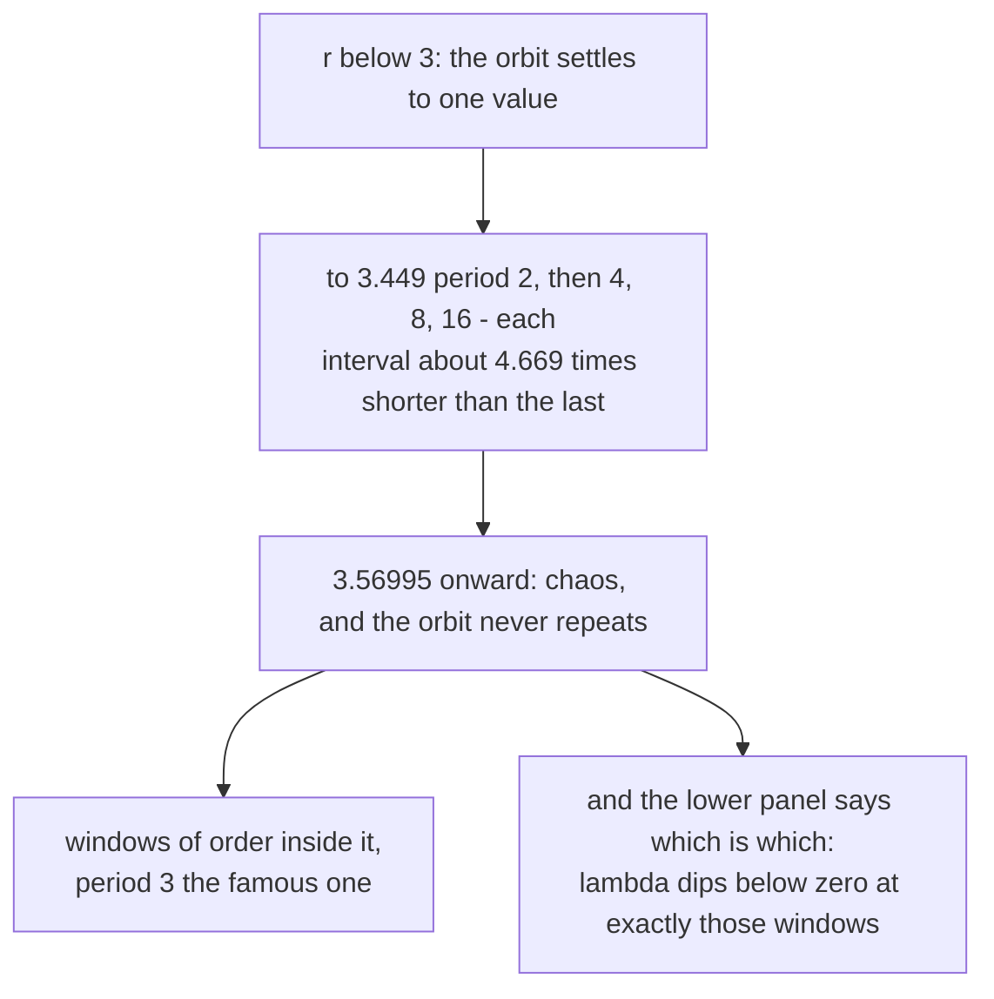

# 1. The map

## One line of arithmetic

```
x → r x (1 − x)
```

That is the whole model. Take a number between 0 and 1, multiply it by *r* and
by one minus itself, and repeat. It was introduced as a toy model of a
population: `x` is this year's population as a fraction of the maximum, `r` is
the growth rate, and the `(1 − x)` term is the crowding that stops growth when
the population gets large.

It is about as simple as a nonlinear recurrence can be, and it does not behave
simply.

## What the picture shows

Sweep *r* from 2.9 to 4.0, and for each value iterate until the orbit settles,
then record where it goes:

| *r* | what the orbit does |
|:---|:---|
| below 3 | settles to **one** value |
| 3 to ≈3.449 | oscillates between **two** |
| ≈3.449 to ≈3.545 | **four** |
| then 8, 16, 32… | each doubling in a shorter interval than the last |
| ≈3.56995 onward | **chaos** — the orbit never repeats |
| ≈3.8284 | a **window**: period 3, appearing out of chaos |

The doubling intervals shrink by a constant ratio — about 4.669 — and that
ratio turns out to be *universal*: the same number appears in wholly unrelated
systems that period-double. That discovery, by Mitchell Feigenbaum in the
1970s, is what made this equation famous well beyond population biology, and
Robert May's 1976 paper is what put it in front of everyone else.

The example's range starts at 2.9, so the first bifurcation at *r* = 3 sits
just inside the left edge and the whole cascade is visible.

## The windows

The chaotic region is not uniformly chaotic. Inside it are narrow bands where
order returns — the orbit collapses back to period 3, or 5, or 6 — and then
period-doubles its way back into chaos again, a whole miniature copy of the
cascade inside a sliver of *r*.

The period-3 window near 3.8284 is the famous one, because of a theorem: if a
continuous map has an orbit of period three, it has orbits of *every* period,
and its behaviour is chaotic. Period three implies chaos.

Those windows are the reason the lower panel exists.

## The Lyapunov exponent

Looking at the top panel, a window and a chaotic band both look like vertical
structure. You can *see* the difference at period 3, but for a period-6 window
in a busy region you cannot.

The lower panel measures it instead:

```mojo
# The Lyapunov exponent: the mean log of |dx'/dx|. Positive means
# nearby orbits separate, which is what chaos is.
var d = r * (1.0 - 2.0 * x)
if d < 0.0:
    d = -d
if d > 1e-12:
    lsum = lsum + log(d)
...
lyap[col] = lsum / Float64(RECORD)
```

The derivative of `r x (1 − x)` is `r (1 − 2x)`, which is the local stretching
factor: how much a tiny difference between two nearby starting points is
multiplied by, at this point on the orbit. Take the log, average it along the
orbit, and you have the **exponential rate** at which nearby orbits separate.

- **λ < 0** — differences shrink. Nearby orbits converge; the motion is
  periodic.
- **λ > 0** — differences grow exponentially. That *is* the definition of
  chaos: sensitive dependence on initial conditions.

So the bottom panel is not decoration. It is the top panel's claim, made
falsifiable:

```mojo
_ = bottom.set_title("λ > 0 is chaos; the dips are the windows of order",
                     fontsize=9, loc="left")
```

Every window of order in the top panel has a dip below zero underneath it, at
exactly the same *r*. Two independent computations agreeing is the check.

The `1e-12` guard is worth a glance: at a point where the derivative is
exactly zero — a *superstable* orbit, which happens at the centre of every
window — the log is negative infinity. Skipping those terms keeps the average
finite. It also very slightly biases the exponent upward at the window centres,
which is the honest trade for not having an infinity in the array.

## Letting the orbit settle

```mojo
comptime TRANSIENT = 2000  # iterations discarded so the orbit settles
comptime RECORD = 2000     # iterations plotted and measured
```

```mojo
# Let the orbit settle before recording anything, or the plot carries
# a smear of wherever x happened to start.
var x = 0.5
for _ in range(TRANSIENT):
    x = r * x * (1.0 - x)
```

The same idea as the fern's burn-in: the first iterations are on the way to the
attractor, not on it. Plot them and every column carries a vertical smear
leading down from 0.5, which reads as noise across the whole figure.

Two thousand each way, per column, over 1,600 columns — 6.4 million iterations,
half of them thrown away to make the other half honest.

## Why there is nothing to parallelise

```mojo
"""This is the part that has to be fast. Every iteration depends on the one
before it, so there is nothing to vectorise and nothing to hand a GPU --
it is simply a lot of arithmetic, done in order."""
```

Within a column, `x` at step *n* depends entirely on step *n−1*. No SIMD lane
can help; no thread can start early. It is the same structural obstacle the
[chaos game](../FernWalkthrough/01-chaos-game.md) has and the same one that
keeps alpha-beta off the GPU in [Othello](../OthelloWalkthrough/index.md).

The columns *are* independent of each other, so 1,600 threads would in
principle work. The program does not do it, and at 23.8 ms it does not need to:
a dispatch, a buffer and a read-back would cost more than the whole
computation. This is the case Othello's alpha-beta measurement makes —
**you cannot speed up something that has already finished.**

<!-- doccrate:keep-together:start -->



<!-- doccrate:keep-together:end -->

