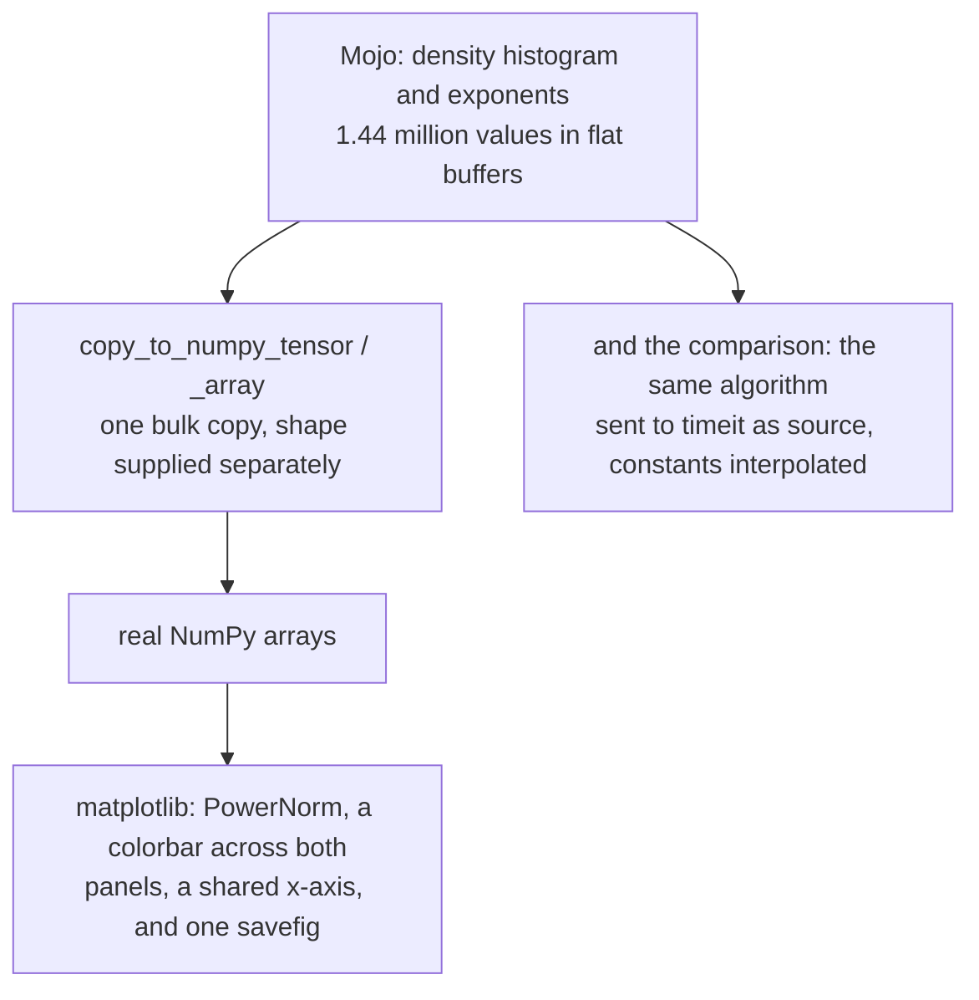

# 3. Crossing the bridge

Two arrays have to reach Python: a 1,600 × 900 histogram and 1,600 exponents.
That is 1.44 million values, and how they cross decides whether the bridge is
a detail or the bottleneck.

## One copy, not 1.4 million

```mojo
# std.python.numpy copies a flat Mojo Span into a real NumPy array. The
# alternative -- appending 1.4 million values across the bridge one at a
# time -- is the slow path, and this is the reason that module exists.
var dens = copy_to_numpy_tensor(density, Coord(H, W))
var lam = copy_to_numpy_array(lyap)
```

Two calls. Each takes a flat Mojo buffer and produces a real NumPy array — one
bulk copy, with the shape supplied separately as `Coord(H, W)` so the flat
buffer is reinterpreted as a 2-D array rather than reshaped element by element.

The alternative is the one everybody writes first: build a Python list, append
in a loop. Each append is a call across the language boundary, a reference count
touched, and possibly a list reallocation — and there are 1.4 million of them.
That would comfortably cost more than the 23.8 ms of actual computation, which
would make the whole argument of [chapter 2](02-the-division.md) collapse: the
compute would be fast and the *handover* would be slow.

The README notes that this is the module's reason for existing:

> *Its own docstring names matplotlib as the case it was written for.*

Worth generalising: when a program is fast in one language and presents in
another, **the boundary is where the performance goes**. A bulk transfer keeps
it a detail; a per-element one makes it the program.

## Sending CPython its own source

The comparison needs the same algorithm running in CPython. The example does
not ship a `.py` file:

```mojo
def python_seconds(cols: Int) raises -> Float64:
    """The same algorithm, in CPython, timed by `timeit`.

    Sent as source rather than kept in a file beside this one, so the example
    stays a folder with a main.mojo in it. `timeit` takes a statement and a
    setup as strings, which is exactly the shape this needs.
    """
```

Two reasons, and both are good.

**The example stays one folder with a `main.mojo` in it.** That is the shape
the IDE opens and the shape the build follows, and it is the property that lets
every example in the collection be opened and run without flags. A stray
`.py` beside it would work but would make the folder something else.

**`timeit` wants strings anyway.** Its API is `timeit(stmt, setup, number=...)`
where both are source. Handing it a string is not a workaround — it is the
interface.

```mojo
var setup = String("import math") + nl
setup += String("W = ") + String(W) + nl
setup += String("H = ") + String(H) + nl
...
```

The constants are interpolated from the Mojo `comptime` values, so the two
implementations cannot drift apart on grid size, transient length or record
length. Change `TRANSIENT` in one place and both sides change.

```mojo
return Float64(py=timeit.timeit(stmt, setup, number=1))
```

`number=1` — one run, not the default million. The statement takes 8.5 ms; a
million of them would take two and a half hours.

## Agg before pyplot

```mojo
# Agg before pyplot: this writes a file and must not need a window.
var mpl = Python.import_module("matplotlib")
_ = mpl.use("Agg")
var plt = Python.import_module("matplotlib.pyplot")
```

matplotlib chooses a rendering backend when `pyplot` is first imported, and the
default on a Mac is an interactive one that wants a window and a GUI event
loop. This program writes a file.

The ordering is the whole point: `mpl.use("Agg")` must happen **before**
`pyplot` is imported, because after that the choice is already made. Get it
backwards and the program either opens a window it does not want or fails on a
machine with no display — a headless run, a CI box, an SSH session.

## Two details worth stealing

The README picks these out, and they are both the kind of thing you learn once
by getting them wrong.

### The colorbar takes space from both panels

```mojo
# Against both axes, not just the top one. A colorbar takes its space
# from the axes it is given, so attaching it to `top` alone makes the top
# panel narrower than the bottom -- and two panels that share an x-axis
# but do not line up are worse than no colorbar at all.
var cb = fig.colorbar(im, ax=Python.list(top, bottom), pad=0.01)
```

A colorbar is drawn in space *taken from* the axes it is attached to. The
colour map belongs to the top panel, so attaching it there is the obvious move
— and it shrinks the top panel while leaving the bottom at full width.

The two panels share an x-axis. Misaligning them means an *r* value in the top
panel is at a different screen position from the same *r* in the bottom, which
breaks the one thing the figure is for: reading a window in the top panel and
checking that λ dips below zero at the same place.

`ax=[top, bottom]` takes the space from both, and they stay aligned.

### `PowerNorm`, not a log norm

```mojo
# PowerNorm rather than a log norm: most buckets are empty, and a log of
# zero is not a colour.
norm=mcolors.PowerNorm(0.35),
```

The histogram is enormously skewed — a column at a period-2 point puts all
2,000 visits into two buckets, while a chaotic column spreads them across
hundreds. Linear colour makes everything but the periodic bands black.

The reflex is a log norm. But most of the 1.44 million buckets are **exactly
zero**, and `log(0)` has no colour to map to. matplotlib will either mask those
cells or clip them, and either way the empty background stops being
background.

`PowerNorm(0.35)` raises the normalised value to the power 0.35 — compressing
the high end like a log does, while mapping zero to zero. Same benefit, defined
at the bottom of the range.

This is the same problem the [fern](../FernWalkthrough/02-one-fern.md) solves
with `log(h+1)` and `fernwind` solves with `n/(n+K)`. Three density plots,
three different compressions, each chosen for what its data actually contains.

## The rest of the figure

```mojo
var made = plt.subplots(
    2, 1,
    figsize=Python.tuple(12.0, 9.0),
    height_ratios=Python.list(3, 1),
    sharex=True,
    layout="constrained",
)
```

`height_ratios=[3, 1]` — the diagram gets three quarters, the exponent gets one.
`sharex=True` locks the axes together. `layout="constrained"` is matplotlib's
newer solver, which is what makes the colorbar-and-alignment fix behave.

```mojo
_ = bottom.fill_between(rs, 0.0, lam, where=lam.__gt__(0.0),
                        color="#C2410C", alpha=0.35, linewidth=0)
```

Fill the area under λ **only where it is positive** — so the chaotic regions are
shaded and the windows are visibly gaps. `lam.__gt__(0.0)` is the explicit
spelling of NumPy's `>` operator, producing a boolean mask array; written this
way because the comparison has to reach NumPy rather than be evaluated as a
Mojo expression.

Every one of these is a decision somebody already made well, which is the
argument the example was written to make.

<!-- doccrate:keep-together:start -->



<!-- doccrate:keep-together:end -->
