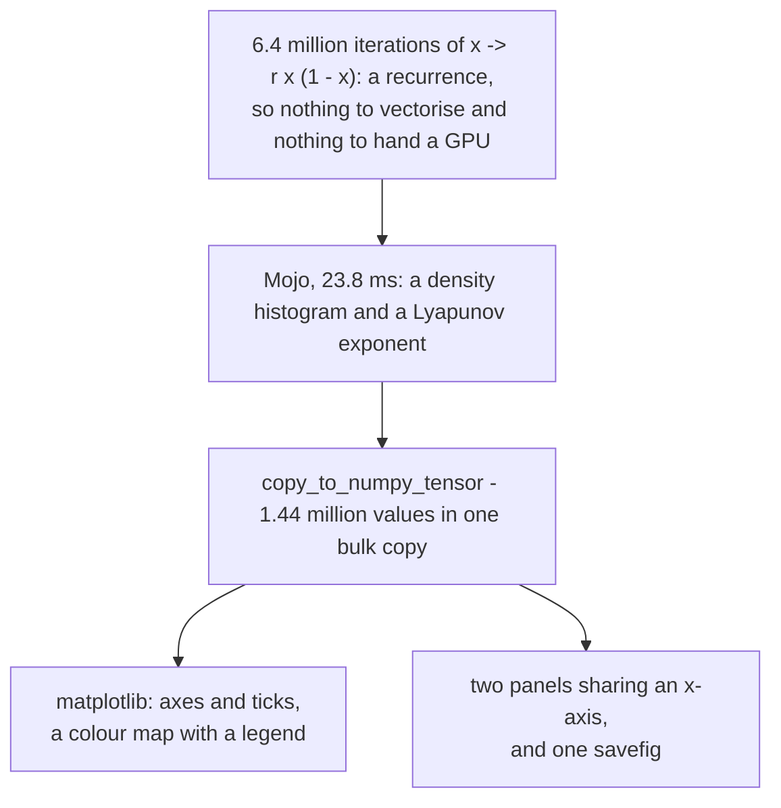

# Bifurcation

**Two hundred and fifty lines that make one argument: compute in Mojo, present
in Python, and measure the boundary rather than asserting it.**

It sweeps the logistic map `x → r x (1 − x)` across 1,600 values of *r*. The
attractor doubles, doubles again, and falls into chaos — with windows of order
inside it. The lower panel is the Lyapunov exponent, and it dips below zero
exactly where those windows are.

| | |
|:---|:---|
| **Source** | `examples/bifurcation/main.mojo`, 250 lines, one file |
| **Grid** | 1,600 columns of *r* × 900 buckets of *x* |
| **Work** | 6,400,000 iterations, each depending on the one before it |
| **Mojo** | 23.8 ms for all 1,600 columns |
| **CPython** | 8.5 ms for 24 columns → 0.6 s extrapolated |
| **Ratio** | **20.2×**, measured on the same algorithm both sides |

<!-- doccrate:keep-together:start -->

## These documents

| Chapter | What it covers |
|:---|:---|
| [1. The map](01-the-map.md) | Period doubling, chaos, the windows of order, and what the lower panel measures |
| [2. The division of labour](02-the-division.md) | Why the arithmetic stays in Mojo, why the figure goes to Python, and how the 20× was measured honestly |
| [3. Crossing the bridge](03-the-bridge.md) | Copying arrays wholesale, sending CPython its own source, and two plotting details worth stealing |
| [4. What to understand](04-key-points.md) | The things that will surprise you, and the ones that will bite |

<!-- doccrate:keep-together:end -->

## The shortest possible summary

**The thing Python is very good at is not arithmetic.** It is everything that
surrounds a result: axes with sensible ticks, a colour map with a legend, a
norm that makes a sparse histogram readable, two panels sharing an x-axis, and
a PNG at the end. Those are thousands of decisions somebody has already made
well.

The arithmetic, meanwhile, is a **recurrence** — every iterate depends on the
one before it — so there is nothing to vectorise and nothing to hand a GPU. It
is simply 6.4 million operations that have to happen in order, which is the
one thing CPython is worst at.

So the division is not a preference. Each side gets the half it is actually
good at, and the program measures the boundary every time it runs.

The measurement is deliberately unflattering to itself. The CPython side runs
the *same* algorithm — histogram write and logarithm included — under `timeit`,
which is CPython's best case. The README says what that costs:

> *On this machine the honest answer is about 20×, not the 100× a badly-set-up
> comparison would report.*
>
> *Twenty times is the whole argument. Half a second is tolerable once and
> intolerable in a loop, and the figure is not the part that costs anything.*

<!-- doccrate:keep-together:start -->

<!-- doccrate:keep-together:end -->
