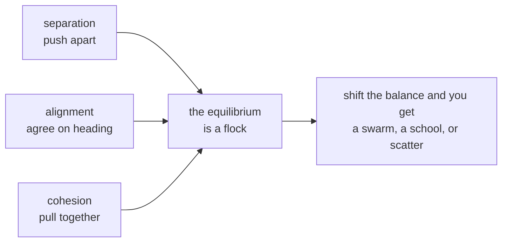

# 1. Reynolds' three rules

## 1987

Craig Reynolds presented **"Flocks, Herds, and Schools: A Distributed
Behavioral Model"** at SIGGRAPH in 1987. He called his simulated creatures
*boids* — bird-oid objects — and the paper is one of the most-cited in
computer graphics, for a reason that has little to do with birds.

Animating a flock had, until then, been understood as an animation problem:
somebody had to specify the path of the flock. Reynolds' claim was that this
is the wrong level to work at. Give each creature a small set of rules about
its immediate neighbours, run them all at once, and flocking is not something
you specify — it is something that **happens**.

Three rules, and he was explicit that they are ordered by priority:

1. **Separation** — steer to avoid crowding local flockmates.
2. **Alignment** — steer toward the average heading of local flockmates.
3. **Cohesion** — steer toward the average position of local flockmates.

*Local* is doing heavy lifting in all three. A boid perceives only what is
within a radius of it. Nothing has access to the flock as an object, because
there is no flock as an object — only birds with neighbours.

The example states the same thing in its header:

> *No bird knows it is in a flock, and no bird is told to stay near the others.*

## Why it mattered beyond graphics

Boids became the canonical demonstration of **emergence**: complex global
behaviour arising from simple local rules, with no central controller and no
representation of the global pattern anywhere in the system.

It is the same claim [Gray-Scott](../GrayScottWalkthrough/index.md) makes about
two chemicals and [Physarum](../PhysarumWalkthrough/index.md) makes about
stigmergy, and boids is the one that made the argument famous — partly because
it is so easy to verify by looking. You can watch a flock split around an
obstacle and rejoin, and know that nothing anywhere decided to do that.

The model reached film quickly. The bat swarms and penguin herds in *Batman
Returns* (1992) were animated with boids-derived software, and Reynolds
received a Scientific and Engineering Academy Award in 1998 for the work.

## The three rules are in tension, and that is the point

A model where the rules agreed would be uninteresting. These pull against each
other:

- **Cohesion** pulls boids together.
- **Separation** pushes them apart.
- **Alignment** does neither, and instead makes them *agree* — which turns a
  crowd into a flock rather than a cluster.

Flocking is what the equilibrium looks like. Change the balance and you get a
different creature, which is exactly what the four presets do:
<!-- doccrate:keep-together:start -->


| preset | align | cohesion | separation | radius |
|:---|---:|---:|---:|---:|
| flock | 0.06 | 0.0020 | 0.9 | 46 |
| swarm | 0.02 | 0.0060 | 0.5 | 70 |
| school | 0.10 | 0.0035 | 1.4 | 34 |
| scatter | 0.01 | 0.0006 | 2.2 | 46 |

<!-- doccrate:keep-together:end -->

Read them as characters:

- **swarm** — weak alignment, strong cohesion, weak separation, wide radius:
  everyone wants to be in the middle and nobody cares which way they face. A
  dense milling ball, like insects.
- **school** — strong alignment, strong separation, *narrow* radius: everyone
  matches heading with a few close neighbours while keeping distance. Tight
  ordered ranks, like fish.
- **scatter** — almost no alignment or cohesion, dominant separation: the rules
  that make a flock are switched off and only the one that breaks it remains.

And the file is upfront about where these numbers come from:

```mojo
# Like Physarum and unlike Gray-Scott, there is no narrow sweet spot here
# either -- these four are this file's own tuning, named for the character
# they give the flock rather than looked up from a source.
```

That is the third time this collection has stopped to say which kind of
numbers it is using. Gray-Scott's are cited because its parameter plane has
sharp boundaries and a published map; Physarum's and Boids' are described as
tuning. Getting that distinction into the source is a small discipline that
pays every time somebody wonders whether a constant is load-bearing.

## Speed limits, which Reynolds also needed

```mojo
comptime MAX_SPEED = Float32(3.4)
comptime MIN_SPEED = Float32(1.1)
```

Not decoration. The three rules are all *accelerations*, and accelerations
accumulate — without a cap, boids in a strong flock keep speeding each other
up. And without a floor, a boid whose forces happen to cancel stops dead and
becomes a permanent obstacle rather than a bird.

A real bird has a stall speed and a maximum. Two clamps, and the flock keeps
moving.

<!-- doccrate:keep-together:start -->



<!-- doccrate:keep-together:end -->
