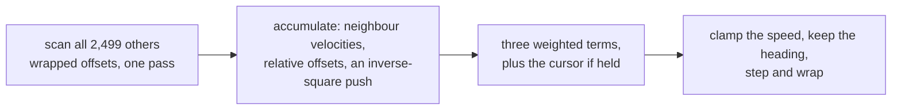

# 2. The rules, in code

A boid is four floats: `px`, `py`, `vx`, `vy`. Four separate arrays — structure
of arrays, for the coalescing reason [chapter 3](03-why-gpu.md) covers.

## The scan

```mojo
for j in range(BOIDS):
    if j == i:
        continue
    var dx = px_in[unsafe_offset=j] - x
    var dy = py_in[unsafe_offset=j] - y
```

Every boid, every other boid, every frame. What happens inside decides which
rule each neighbour contributes to.

## The wrapped distance, which is easy to get wrong

```mojo
# The shortest way around a WRAPPED field, or a neighbour just
# across the seam looks like it is on the far side of the
# screen, and the flock tears itself apart at the edges.
if dx > Float32(WIDTH) * Float32(0.5):
    dx -= Float32(WIDTH)
elif dx < -Float32(WIDTH) * Float32(0.5):
    dx += Float32(WIDTH)
```

The world is a torus — a boid leaving the right edge reappears on the left. So
two boids five pixels apart across the seam are at x = 766 and x = 3, and a
naive subtraction says they are **763 pixels apart**.

The fix is the *minimum-image convention*: if a difference exceeds half the
width, the short way round is the other way. Two comparisons per axis.

The comment names the symptom, which is the useful part: without it, boids
near an edge cannot see their neighbours across it, so flocks come apart
wherever they touch the seam — and only there, which looks like an edge-case
bug in the rendering rather than a distance calculation.

This is the same class of decision as
[Physarum's wrap-not-clamp](../PhysarumWalkthrough/02-the-rule.md): once the
world is a torus, **everything that measures distance in it has to know that.**

## Alignment and cohesion: two averages, one pass

```mojo
if d2 < neighbor_r * neighbor_r:
    avg_vx += vx_in[unsafe_offset=j]
    avg_vy += vy_in[unsafe_offset=j]
    avg_px += dx
    avg_py += dy
    count += Float32(1.0)
```

Within the neighbour radius, accumulate two things: neighbours' **velocities**
and their **relative offsets**. One pass, one counter, and note `d2` is
compared against `r²` — no square root in the inner loop, which runs 6.25
million times a frame.

The subtle part is `avg_px += dx` — the *offset*, not the position. So the
average that comes out is already relative to this boid:

```mojo
avg_px /= count
new_vx += avg_px * cohesion_w
```

Cohesion is then a single multiply. Accumulating absolute positions would have
meant averaging, subtracting this boid's own position, and — much worse —
getting the wrap wrong again, because an average of absolute positions across
a seam is meaningless. Accumulating already-wrapped offsets sidesteps that
entirely.

Alignment is the difference between the neighbours' average velocity and this
boid's own:

```mojo
new_vx += (avg_vx - vx) * align_w
```

A steering force *toward* the average heading, not an assignment of it. With
`align_w = 1.0` a boid would snap to the flock's heading instantly; at 0.06 it
eases in over about twenty frames, and that lag is what makes a turn propagate
through a flock as a wave rather than happening everywhere at once.

## Separation: an inverse-square push

```mojo
var sep_r = neighbor_r * Float32(0.35)
...
if d2 < sep_r * sep_r and d2 > Float32(0.01):
    var inv = Float32(1.0) / d2
    sep_x -= dx * inv
    sep_y -= dy * inv
```

Three things here.

**A smaller radius.** Separation acts within 35% of the neighbour radius, so
each boid has a large circle it flocks with and a small one it avoids. One
parameter, two ranges.

**Weighted by 1/d².** Not a constant push — the closer a neighbour, the more
sharply it is avoided. So distant flockmates barely register while an
imminent collision dominates, which is Reynolds' priority ordering falling out
of the arithmetic rather than being coded as a priority.

**Guarded at `d2 > 0.01`.** Two boids at the same point would divide by zero,
and the resulting infinity would propagate into the velocity, then the
position, then every neighbour's view of it. One comparison.

Note also that separation is applied **outside** the `if count > 0` block:

```mojo
if count > Float32(0.0):
    ... alignment and cohesion ...
new_vx += sep_x * separation_w
```

Alignment and cohesion need an average, so they need at least one neighbour.
Separation is a sum, so it is simply zero when nobody is close. Correct
either way, and it avoids a redundant guard.

## The mouse, as a fourth force

```mojo
if seek_w > Float32(0.0):
    new_vx += (target_x - x) * seek_w
    new_vy += (target_y - y) * seek_w
```

Held button, and `seek_w` becomes 0.0006. A pull toward the cursor,
proportional to distance, added to the same velocity the three rules just
modified.

Note what it is *not*: there is no override, no mode, no "seeking" state. The
flock still separates, aligns and coheres exactly as before — the seek is one
more term in the sum, so what you see is the flock negotiating between the
cursor and itself. Release, and it does not need to recover from anything.

## Then the clamps and the step

```mojo
var speed = sqrt(new_vx * new_vx + new_vy * new_vy) + Float32(1e-6)
if speed > MAX_SPEED:
    new_vx = new_vx / speed * MAX_SPEED
elif speed < MIN_SPEED:
    new_vx = new_vx / speed * MIN_SPEED
```

Normalise and rescale — so the clamp changes *speed* while preserving
*direction*, which is the whole point. Clamping the components separately
would turn a fast diagonal into a different heading.

The `+ 1e-6` guards a boid whose velocity is exactly zero, which would
otherwise divide by zero in the very next line.

Then the position update wraps, matching the distance calculation at the top.

<!-- doccrate:keep-together:start -->



<!-- doccrate:keep-together:end -->
