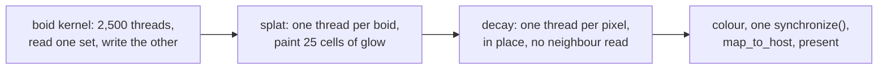

# 5. A frame, end to end

Four dispatches, and one branch that Gray-Scott went to some trouble to avoid.

## Before the loop

```mojo
ctx.enqueue_function(init_kern, px_a, py_a, vx_a, vy_a,
                     grid_dim=(BOID_GRID), block_dim=(BLOCK))
...
ctx.synchronize()
```

Eight boid buffers — two sets of four — plus three glow buffers and the frame.
Only the `a` set is initialised; the `b` set is written before it is ever read.

## The dispatch sequence

```mojo
if not paused:
    var seek_w = Float32(0.0006) if g_mouse_down()[] != 0 else Float32(0.0)
    if parity == 0:
        ctx.enqueue_function(
            boid_kern, px_b, py_b, vx_b, vy_b, px_a, py_a, vx_a, vy_a, ...)
        ctx.enqueue_function(
            splat_kern, gr, gg, gb, px_b, py_b, vx_b, vy_b, ...)
    else:
        ctx.enqueue_function(
            boid_kern, px_a, py_a, vx_a, vy_a, px_b, py_b, vx_b, vy_b, ...)
        ctx.enqueue_function(
            splat_kern, gr, gg, gb, px_a, py_a, vx_a, vy_a, ...)
    ctx.enqueue_function(decay_kern, gr, gg, gb, ...)
    parity = 1 - parity

ctx.enqueue_function(color_kern, dev, gr, gg, gb, ...)
ctx.synchronize()
```

Read the order:

1. **boids** — read one set, write the other
2. **splat** — paint from the set just written
3. **decay** — fade the glow
4. **colour** — tone-map into BGRA

Note **splat comes before decay**. So a boid's contribution this frame is
painted at full brightness and *then* faded along with everything else, which
means the newest position is exactly one decay step brighter than the previous
one — a smooth comet tail rather than a hard bright head.

Note also that `color_kern` sits outside the `if not paused` block, so a paused
frame is still drawn. Same as Physarum.

## The parity, spelled out

Physarum tracked parity with a variable and a conditional buffer pick:

```mojo
parity = 1 - parity
cur = trail_a if parity == 0 else trail_b
```

Boids cannot do that, because it has **four** buffers to flip, not one — and
they have to flip together. Selecting four pointers with four conditionals
would be worse to read than the explicit branch, so the file writes both arms
out:

```mojo
if parity == 0:
    ... boid_kern(b ← a); splat_kern(from b) ...
else:
    ... boid_kern(a ← b); splat_kern(from a) ...
```

Duplicated, and correct in a way that is checkable by eye: each arm names its
own source and destination, and the splat in each arm reads the set that arm
just wrote. A pointer-swapping version would put that correspondence one level
of indirection away.

Three ping-pong strategies in three sibling examples, each fitting its own
shape:
<!-- doccrate:keep-together:start -->


| | how | why |
|:---|:---|:---|
| Gray-Scott | even substep count, argument order | 20 steps per frame, so it can end where it started |
| Physarum | a parity variable, one buffer picked | one diffusion per frame, one buffer to track |
| **Boids** | **an explicit branch, both arms written** | **four buffers, and they must flip together** |

<!-- doccrate:keep-together:end -->

## The mouse as a weight, not a mode

```mojo
var seek_w = Float32(0.0006) if g_mouse_down()[] != 0 else Float32(0.0)
```

Held button, and the seek weight is non-zero; released, and it is zero. There
is no state, no transition, no easing — the term is simply present or absent
in a sum.

That is the same design as
[Physarum's attract kernel](../PhysarumWalkthrough/04-kernels.md), which forces
nothing and merely gives agents something bright to find. Both interactions
cost almost nothing because they reuse the mechanism that was already the whole
model.

## Preset switching

Four floats change and the next dispatch is a different creature — the boids
are **not** reset and their positions are kept. So an established flock
reorganises: switch from `flock` to `scatter` and you watch the groups
dissolve rather than seeing a fresh random field.

And the commit says that is exactly how it was verified:

> *the default preset shows distinct swirling flocks with individually legible
> trails: switching to "scatter" (weak alignment and cohesion, strong
> separation) produces visibly correct chaos instead — no large flocks at all,
> every bird darting on its own — proof the three rules are actually reaching
> the kernel differently, not a palette change wearing a different name.*

The specific failure being ruled out is worth naming, because it is the same
one Gray-Scott and Physarum tested for: a preset switch that updates the local
variables and the window title but fails to pass them into the dispatch looks
entirely correct from outside. Every automated check passes. Only two visibly
different behaviours rule it out.

## Then the usual tail

`ctx.synchronize()` — the one blocking point — then the copy to the host
buffer, the optional PNG from exactly the bytes about to be presented, and
`replaceRegion:` onto the drawable. Identical to Gray-Scott and Physarum,
including the comment about why the snapshot is taken there and not later.

<!-- doccrate:keep-together:start -->



<!-- doccrate:keep-together:end -->
