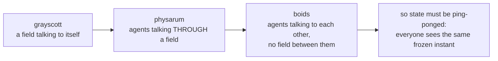

# Boids

**Three rules, two and a half thousand birds, and a murmuration that no line
of code describes.**

Steer away from whoever is too close. Steer toward the average heading of
whoever is near. Steer toward the average position of whoever is near. That is
the entire model.

> *No bird knows it is in a flock, and no bird is told to stay near the others
> — the murmuration is what those three local rules look like from far enough
> away.*

## The shortest possible summary

This is the third of three GPU demos, and the commit describes the arc across
them in one sentence:

> *`grayscott` is a field talking to itself, `physarum` is agents talking
> **through** a shared field, this is agents talking to each **other** directly,
> no field between them.*

That difference is not a detail of style. It forces a correctness discipline
the other two did not need. A boid's update reads **every other boid's**
position and velocity, so updating in place would let boid 400's new position
leak into boid 50's read of it, purely by scheduling luck — and the result
would still look like a flock, and would differ on every run.

So position and velocity are ping-ponged: Gray-Scott's `u`/`v` pair applied to
a flock, so that every boid this frame sees the **same frozen instant** of
everyone else, by construction rather than by hope.

The neighbour search is brute force, every boid against every other, and that
is a deliberate choice with numbers behind it — see
[chapter 3](03-why-gpu.md).

## These documents
<!-- doccrate:keep-together:start -->

| Chapter | What it covers |
|:---|:---|
| [1. Reynolds' three rules](01-history.md) | 1987, and why boids became the standard example of emergence |
| [2. The rules, in code](02-the-rules.md) | Separation, alignment, cohesion — and the wrapped distance |
| [3. Why this belongs on a GPU](03-why-gpu.md) | O(n²) on purpose, what it measured, and the ping-pong |
| [4. The five kernels](04-kernels.md) | Including the one that runs backwards, and a missing `atan2f` |
| [5. A frame, end to end](05-a-frame.md) | Four dispatches, an explicit parity, and decay in place |
| [6. What to understand](06-key-points.md) | What will surprise you, and what will bite |

<!-- doccrate:keep-together:end -->

## At a glance
<!-- doccrate:keep-together:start -->

| | |
|:---|:---|
| **Source** | `examples/boids/main.mojo`, 819 lines |
| **Boids** | 2,500 — a visual choice, not a ceiling |
| **Neighbour search** | brute force, every pair, every frame |
| **Per frame** | 4 dispatches: boids, splat, decay, colour |

<!-- doccrate:keep-together:end -->

<!-- doccrate:keep-together:start -->

<!-- doccrate:keep-together:end -->
