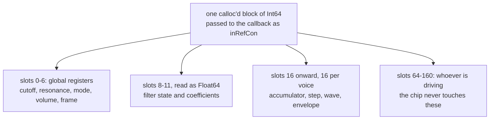

# 2. A chip is a bank of registers

There is no `Chip` struct. There is no `Voice` class. There is a `calloc`'d
block of `Int64` and a set of slot numbers:

```mojo
comptime S_TICK = 0        # samples left until the next 50 Hz frame
comptime S_CUTOFF = 1      # 11-bit filter cutoff register
comptime S_RES = 2         # 4-bit resonance
comptime S_FMODE = 3       # FILT_LP | FILT_BP | FILT_HP
comptime S_VOL = 4         # 4-bit master volume
comptime S_FRAME = 5       # frames elapsed since the chip was made
comptime S_DIRTY = 6       # filter coefficients need recomputing
```

The reason is stated as a design claim rather than a convenience:

> *All state lives in one flat block, because that is what a chip is: a bank of
> registers plus some internal counters. The block is passed to the render
> callback through CoreAudio's `inRefCon`, so nothing here needs a global and
> two chips could run at once.*

Three separate benefits, and the third is the one that would be hardest to
retrofit.

## It matches what is being modelled

A chip is addressed, not owned. Writing `set_pulse_width(st, 1, 1100)` is
poking a register, which is exactly what the machine did. There is no object
graph because the hardware has no object graph.

## `inRefCon` wants a pointer

CoreAudio's render callback receives one `void*` that the application chose.
A flat block *is* that pointer. Nothing is boxed, nothing is looked up, and the
audio thread reaches every register with one addition and one load:

```mojo
fn vget(st: P, voice: Int, field: Int) -> Int:
    return ints(st)[unsafe_offset=V_BASE + voice * V_STRIDE + field]
```

## No globals means no singleton

> *nothing here needs a global and two chips could run at once*

This is the constraint that other examples in the tree run into repeatedly.
Cocoa callbacks cannot reach locals, so state ends up in `named_global`s — and a
`named_global` is a *process* global, so there is exactly one of whatever it
holds.

`chip.mojo` avoids the whole problem by never having state of its own. Two
chips, two blocks, no interference. The ABC player exploits this without
thinking about it: it drives the same chip through a completely different
mechanism than `tune.mojo` does, and neither knows about the other.

## The float slots share the memory

```mojo
comptime S_LOW = 8         # float: filter lowpass state
comptime S_BAND = 9        # float: filter bandpass state
comptime S_F = 10          # float: filter frequency coefficient
comptime S_Q = 11          # float: filter damping
```

> *The float slots are the same memory read through a Float64 view; they are
> numbered apart so the two views never collide.*

One allocation, two typed views over it:

```mojo
fn ints(st: P) -> Pointer[Int, MutUntrackedOrigin]:
    return st.unsafe_bitcast[Int]()

fn floats(st: P) -> Pointer[Float64, MutUntrackedOrigin]:
    return st.unsafe_bitcast[Float64]()
```

Both are 8 bytes, so slot *n* is the same address in either view. The
discipline that keeps this safe is not a type system — it is that the slot
numbers are partitioned and the comment says so. Slots 0–6 are integers, 8–11
are floats, and nothing reads a slot through the wrong view.

## The voice block

```mojo
comptime V_BASE = 16
comptime V_STRIDE = 16
comptime V_ACC = 0         # phase accumulator, 24 bits with 8 fractional
comptime V_STEP = 1        # per-sample increment, same fixed point
comptime V_PW = 2          # 12-bit pulse width
comptime V_WAVE = 3        # waveform bits
comptime V_GATE = 4
...
comptime V_PREV = 15       # last accumulator, for edge detection
```

Sixteen slots per voice at a fixed stride, three voices, starting at 16. Each
comment says what the register *is* on the hardware — "12-bit pulse width",
"4-bit resonance" — so the model stays anchored to widths that actually
existed.

`V_PREV` is the one that is not a register: it is the previous accumulator
value, kept for edge detection. Hard sync and the noise shift both need to know
that something *wrapped* since the last sample, which is a comparison between
now and before. [Chapter 3](03-oscillators.md) uses it twice.

## Room reserved for whoever is driving

```mojo
comptime STATE_SLOTS = V_BASE + 3 * V_STRIDE

# The player routine keeps its own state after the chip's.
comptime PLAYER_BASE = STATE_SLOTS
comptime PLAYER_SLOTS = 96
comptime TOTAL_SLOTS = PLAYER_BASE + PLAYER_SLOTS
```

The block is deliberately over-allocated. The chip uses the first 64 slots; the
next 96 belong to whoever is driving it, and the chip never touches them.

That is what lets two entirely different drivers coexist. `tune.mojo` uses the
player region for a score, cursors and per-voice instrument settings. The ABC
player uses the *same* region for a schedule address, a sample cursor and voice
assignments — and says so:

```
# Slots in the chip's player region. The chip example's own player does not
# run here -- this is a different way to drive the same chip -- so the whole
# region is free.
```

A convention rather than a mechanism, and it works because only one driver runs
at a time.

## The player routine, as a type

```mojo
# The player routine, as a type: a C function pointer taking the chip. The
# alias is needed because `fn(...)` is only spelled this way in a type
# position the parser recognises as one.
comptime Tick = fn(P, /) -> None
```

The chip calls back into whatever is driving it through a plain C function
pointer. It does not know what a tune is, what a note is, or what a schedule
is — it knows that something wants to be called at 50 Hz and hands it the
register block.

That one type is the entire interface between the synthesiser and every player
built on it.

<!-- doccrate:keep-together:start -->



<!-- doccrate:keep-together:end -->
