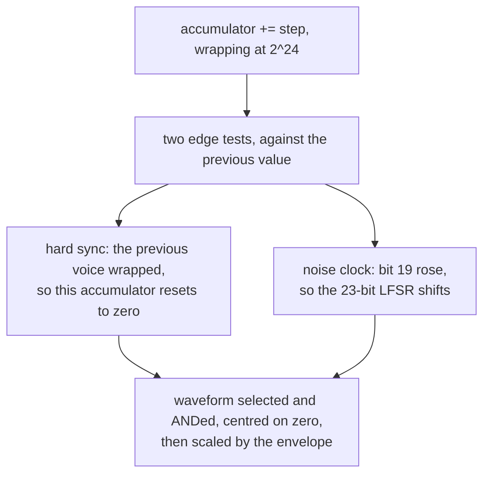

# 3. Oscillators

Three of them, running once per sample. Everything in this chapter happens
48,000 times a second, three times over.

## The phase accumulator

An oscillator is a counter that wraps:

```mojo
let step = vget(st, voice=v, field=V_STEP)
var prev = vget(st, voice=v, field=V_ACC)
var acc = (prev + step) & 0xFFFFFFFF
```

Add a step, mask. The wrap *is* the cycle: when the accumulator rolls over, the
waveform starts again. Frequency is entirely a function of the step size.

The accumulator is 24 bits with 8 fractional bits below it — 24.8 fixed point —
which is what the mask to 32 bits is doing. The extra eight bits are the
difference between a pitch that is right and one that is nearly right: without
them the step would be an integer number of accumulator units per sample, and
most notes would land audibly off.

The frequency register is the hardware's own:

```mojo
fn set_freq_reg(st: P, voice: Int, freq: Int):
    """The 16-bit frequency register, meaning freq * CLOCK / 2^24 Hz."""
```

> *The PAL machine's clock. Every frequency register in every chip tune ever
> written was chosen against this number.*

```mojo
comptime CLOCK_PAL = 985248
```

Keeping the register interface — rather than only accepting Hz — is what lets
values from real chip tunes mean what they meant. `set_freq_hz` exists
alongside it *"for tunes that were never chip data"*.

## The waveform selector, and the AND

```mojo
fn waveform(st: P, voice: Int, acc24: Int, ring_source_msb: Int) -> Int:
    """The 12-bit output of one voice's waveform selector.

    Selecting more than one waveform ANDs them together on the real chip --
    an accident of how the outputs are wired, not a design, and the source of
    most of the timbres people remember.
    """
    let wave = vget(st, voice, V_WAVE)
    var out = 0xFFF
```

`out` starts as all ones, and each selected waveform ANDs into it. Select none
and the function returns 0; select one and you get that waveform; select two
and you get their bitwise AND — which is not a mix, not an average, and not
anything a synthesiser designer would choose.

The three simple ones are a few bits each:

```mojo
if (wave & WAVE_SAW) != 0:
    out &= (acc24 >> 12) & 0xFFF

if (wave & WAVE_PULSE) != 0:
    out &= 0xFFF if ((acc24 >> 12) >= vget(st, voice, V_PW)) else 0
```

A **sawtooth** is the top 12 bits of the accumulator — the counter's own ramp,
read directly. A **pulse** is a comparison against the pulse-width register:
full scale above the threshold, zero below. That is the entire implementation,
and it is why the pulse width is a continuous control rather than a switch.

The **triangle** folds:

```mojo
# The triangle folds the top bit into the rest, and ring modulation
# replaces that bit with the previous voice's -- which is the whole
# of ring modulation on this chip. One XOR, and it is why bells
# and gongs sound the way they do.
var folded = acc24
if ((acc24 ^ ring_source_msb) & 0x800000) != 0:
    folded = (~acc24) & 0xFFFFFF
out &= (folded >> 11) & 0xFFF
```

A triangle is a sawtooth that reverses halfway: use the top bit to decide
whether to invert the rest. And **ring modulation is one XOR** in that
decision — instead of this voice's top bit deciding when to fold, the previous
voice's does.

That is worth pausing on. Ring modulation on a modular synthesiser is a
four-quadrant multiplier. Here it is a single XOR in the fold test, because the
triangle's shape is already determined by one bit. The metallic, inharmonic
result — bells, gongs — comes out of that.

## The noise LFSR

```mojo
if (wave & WAVE_NOISE) != 0:
    let lfsr = vget(st, voice, V_LFSR)
    # Eight taps, scattered: bits 22, 20, 16, 13, 11, 7, 4 and 2 become
    # the output's bits 11 down to 4. The low four bits are always zero,
    # which is part of why the noise sounds coarse.
    out &= (
        ((lfsr >> 11) & 0x800)
        | ((lfsr >> 10) & 0x400)
        ...
    )
```

The noise is a 23-bit linear-feedback shift register, and the output is **not**
the register — it is eight scattered bits of it, gathered into bits 11 down to
4 of a 12-bit value.

Two consequences, both audible:

- **The low four bits are always zero.** The noise is quantised to sixteen
  steps out of 4,096, which is part of why it is coarse.
- **The taps are not adjacent.** Consecutive samples are not smoothly related,
  which is what a hiss requires.

> *the noise is the actual 23-bit LFSR with the actual output taps, which is
> why it rasps instead of hissing*

And the shift is not once per sample:

```mojo
# The noise register shifts once per rising edge of accumulator
# bit 19 -- so noise pitch follows the frequency register, and a
# rising noise sweep is a rising frequency, not a filter.
if (was24 & 0x80000) == 0 and (acc24 & 0x80000) != 0:
    let lfsr = vget(st, voice=v, field=V_LFSR)
    let feedback = ((lfsr >> 22) ^ (lfsr >> 17)) & 1
    vput(st, voice=v, field=V_LFSR,
         value=((lfsr << 1) | feedback) & 0x7FFFFF)
```

**Noise has a pitch.** It is clocked from the oscillator, so the frequency
register controls how fast the register advances — low frequency gives a slow
rumble, high gives a bright hiss. This is why chip drums are written as *notes*:
a snare is a noise voice at a particular frequency, and a sweep is a frequency
sweep.

The feedback taps — bits 22 and 17 — are the hardware's.

## Hard sync

```mojo
# Hard sync: when the previous voice's accumulator wraps, this one
# is slammed back to zero. Two oscillators at unrelated pitches,
# one resetting the other, is the chip lead sound.
if vget(st, voice=v, field=V_SYNC) != 0:
    let src = (v + 2) % 3
    let s_now = (vget(st, voice=src, field=V_ACC) >> 8) & 0xFFFFFF
    let s_was = (vget(st, voice=src, field=V_PREV) >> 8) & 0xFFFFFF
    if s_now < s_was:
        acc = 0
```

The wrap is detected by comparing now against before: an accumulator that only
ever increases has wrapped exactly when it appears to have gone *backwards*.
That is what `V_PREV` is for.

Sync forces this oscillator to restart on the other's cycle, so it takes the
other's pitch while keeping its own harmonic content — a hard, tearing timbre
that sweeps as the synced voice's frequency moves.

Note `(v + 2) % 3` — the *previous* voice, wrapping. Voice 0's source is voice
2, which is the ring the hardware wires.

## Order matters twice

```mojo
# A copy: this is read before V_ACC is written below.
var prev = vget(st, voice=v, field=V_ACC)
```

`var`, not `let`. In this dialect `let` binds to a place, so `let prev` would
name the accumulator slot rather than copying it — and `prev` would read back
*changed* after `V_ACC` is written a few lines later. Both the sync detector
and the noise-clock edge test compare against `prev`, so both would silently
stop working.

This is the trap that runs through the whole tree, and here it would have
produced a synthesiser with no sync and no noise, and no error.

And the DC centring:

```mojo
# Centre the waveform before the envelope scales it, or every
# note-on would put a step of DC through the filter.
let sample = Float64((w - 2048) * env) / 255.0
```

The waveform is 0…4095, unsigned. Subtracting 2048 centres it on zero
*before* the envelope multiplies. The other order — envelope first, centre
after — makes every note-on a step change in DC offset, which the filter turns
into a thump on every note.

<!-- doccrate:keep-together:start -->



<!-- doccrate:keep-together:end -->

