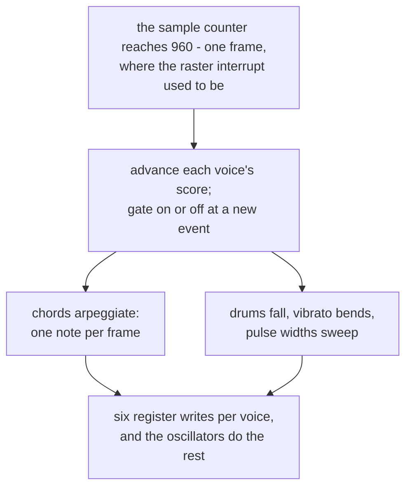

# 6. The player routine

> *This is the part people forget when they say "chip music". The chip has
> three voices and no memory of anything; everything that makes a C64 tune
> sound like a C64 tune happens up here, in a routine the raster interrupt
> called once per frame.*

## Fifty times a second

On the original machine, a routine ran off the raster interrupt at the vertical
blank — 50 Hz on PAL — and rewrote registers. Everything a chip tune does that
the chip cannot do itself happens in those fifty slots per second.

Here the same thing happens from inside the audio callback:

```mojo
var countdown = get(st, S_TICK) - 1
if countdown <= 0:
    countdown = FRAME_SAMPLES
    put(st, S_FRAME, get(st, S_FRAME) + 1)
    tick(st)
    if get(st, S_DIRTY) != 0:
        recompute_filter(st)
put(st, S_TICK, countdown)
```

> *A real machine got here by interrupt; the arithmetic is the same either
> way.*

`FRAME_SAMPLES` is 960 — 48,000 ÷ 50. A counter, and when it reaches zero the
player routine is called. There is no timer, no thread and no interrupt; the
sample counter *is* the clock, which is the same idea the
[ABC player's scheduler](../AbcPlayerWalkthrough/02-timing.md) is built on.

And the routine is called **from inside the audio callback**:

> *`tick` is a plain C function pointer, so the chip never has to know what a
> tune is — and the player routine gets called from inside the audio callback,
> on the beat, exactly as a raster interrupt would have.*

Which sets its contract:

> *The routine is an `fn` — a plain C function pointer — because it is called
> from inside the audio callback, on CoreAudio's real-time thread. It allocates
> nothing and cannot raise. Building a score does both, so that happens up
> front, in ordinary code.*

## The arpeggio

The most recognisable sound the machine made, and it is four lines:

```mojo
# The arpeggio. Three notes, one per frame, and the ear hears a chord.
var note = n0
let n1 = pvget(st, v, PV_N1)
if n1 >= 0:
    let n2 = pvget(st, v, PV_N2)
    let width = 3 if n2 >= 0 else 2
    let which = frame % width
    if which == 1:
        note = n1
    elif which == 2:
        note = n2
```

Three voices, and a tune wants chords *and* a bass line *and* a drum. There is
no fourth voice, so a chord is played by one voice switching between its three
notes on consecutive frames.

At 50 Hz each note lasts 20 ms and the pattern repeats every 60 ms — about
16 Hz. That is the sweet spot: fast enough that the ear fuses it into a chord,
slow enough that the fusion is imperfect and it *shimmers*.

> *fast enough that the ear hears a chord and slow enough that it shimmers —
> the arpeggio, and the single most recognisable sound of the machine.*

This is a limitation that became a style. Nobody chose that sound; three
oscillators and a 50 Hz interrupt chose it.

## The pulse sweep

```mojo
# Pulse-width modulation: a slow triangle, never reaching the ends,
# where the wave would go silent.
let pwm = piget(st, v, PI_PWM)
if pwm != 0:
    let cycle = (frame * pwm) % 4096
    let sweep = cycle if cycle < 2048 else (4096 - cycle)
    set_pulse_width(st, v, 512 + sweep)
```

> *a held note is kept alive by sweeping the pulse width every frame, because a
> static pulse wave goes lifeless in about half a second*

A pulse wave with a fixed duty cycle has a fixed harmonic spectrum, and the ear
stops attending to it very quickly. Moving the duty cycle moves the harmonics,
and the note stays alive.

The triangle is built by folding a modulo — up for the first half of the cycle,
down for the second — which is the same trick the oscillator's triangle uses,
one level up.

The `512 +` offset is the important part: **never reaching the ends**. Pulse
width 0 or 4095 means the comparison in the waveform generator is always true
or always false, and the voice goes silent. Sweeping into either end would
produce a note that drops out at the edge of every cycle.

## Drums

```mojo
# A drum is a note that falls. The chip has no percussion; every C64
# drum is noise plus a downward sweep, done from up here.
let drum = piget(st, v, PI_DRUM)
if drum != 0:
    let age = 0 if left < 0 else (24 - left)
    if age > 0:
        var fall = 1.0
        for _ in range(age):
            fall *= 0.82
        hz *= fall
```

Noise, plus frequency multiplied by 0.82 for each frame since the note began.
After ten frames — a fifth of a second — the pitch is down to 13% of where it
started.

This works because [noise has a pitch](03-oscillators.md): the LFSR is clocked
from the oscillator, so sweeping the frequency register sweeps the character of
the noise from a bright crack to a low thud. That is a snare.

Note `instrument_drum` sets `WAVE_NOISE` with `set_adsr(st, voice, 0, 5, 0, 4)`
— instant attack, sustain zero. The note is entirely attack and decay, which is
what a percussive envelope is.

## Vibrato, and a comment about `let`

```mojo
# `var`, not `let`: `let` names the storage rather than copying it, so
# a value read that way reads back changed once the slot is written --
# and the drum's pitch below is derived from this counter.
var left = pvget(st, v, PV_LEFT)
pvput(st, v, PV_LEFT, left - 1)
```

The same rule as everywhere else in the tree, and here the consequence is
specific: the drum's `age` is `24 - left`. With `let`, `left` would read back as
the decremented value, `age` would be off by one every frame, and the drum's
pitch sweep would be subtly wrong — audible only as "the drums sound a bit
off".

```mojo
# Vibrato, delayed slightly so short notes stay clean.
let vib = piget(st, v, PI_VIB)
if vib != 0:
    let cents = Float64(vib) * _sin(Float64(frame) * 0.55)
    hz *= 1.0 + cents / 1200.0
```

Depth in **cents** — hundredths of a semitone — which is the unit a musician
thinks in, converted by `/ 1200.0` because there are 1,200 cents to an octave.

`_sin(frame * 0.55)` is the call that made `_sin`'s range reduction matter:
`frame` counts up forever, so the argument grows without bound, and a
loop-based reduction would get slower for as long as the program runs. See
[chapter 5](05-filter.md).

## Instruments are just register settings with names

```mojo
fn instrument_lead(st: P, voice: Int):
    set_wave(st, voice, WAVE_PULSE)
    set_adsr(st, voice, 0, 7, 11, 6)
    piput(st, voice, PI_PWM, 7)
    piput(st, voice, PI_VIB, 14)
    route_filter(st, voice, False)


fn instrument_bass(st: P, voice: Int):
    set_wave(st, voice, WAVE_SAW)
    set_adsr(st, voice, 0, 6, 8, 5)
    piput(st, voice, PI_PWM, 0)
    piput(st, voice, PI_VIB, 0)
    route_filter(st, voice, True)
```

> *Three voices, three jobs. These are the register settings, given names.*

The lead is a pulse with a sweep and vibrato, unfiltered. The bass is a
sawtooth — harmonically rich, so there is something for the filter to work on —
routed *through* the filter. The drum is noise with a falling pitch.

No instrument abstraction, no patch format. An instrument is six register
writes, and that is all it ever was.

## The score

```mojo
# One flat block of Ints, four per event: three notes and a duration. Three
# notes because an event may be a chord, and a chord on this chip is an
# arpeggio. A note of -1 is a rest.
```

Four integers per event, in `calloc`'d memory — because the audio thread walks
it and may not allocate. Three note slots because the arpeggio needs three, and
`-1` for a rest.

Durations are in **frames**, not seconds:

```mojo
comptime EIGHTH = 10        # frames -- 50 Hz / 10 = 150 bpm in eighths
comptime QUARTER = 20
```

Which is how C64 tunes were always written. The 50 Hz interrupt is the clock, so
tempo is a count of frames, and a tempo that does not divide evenly into 50 Hz
simply does not exist.

## The same chip, driven two ways

The ABC player uses `chip.mojo` unchanged and does **not** use this routine:

```mojo
fn silent_tick(st: P) -> None:
    """The chip's own player routine, doing nothing."""
    pass
```

Its notes come from a sample-accurate schedule rather than a 50 Hz score, so
its player routine has nothing to do — but the chip still calls one, so an
empty `fn` is supplied.

Two completely different drivers, one synthesiser, and the only thing they
share is the `Tick` function pointer type and the register block.

<!-- doccrate:keep-together:start -->



<!-- doccrate:keep-together:end -->

