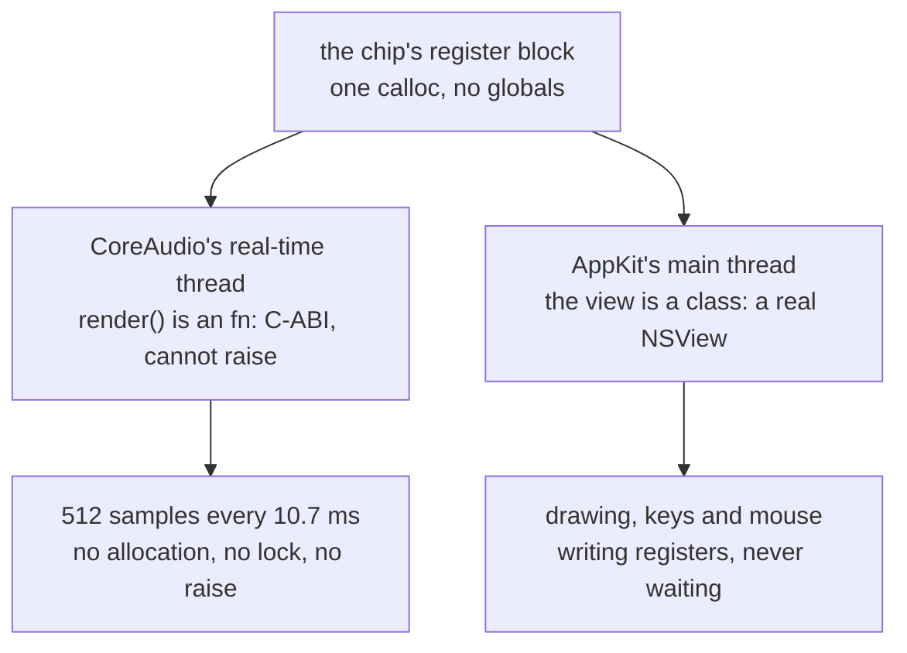

# 7. Two threads, no glue

> *Every other example here draws. This one has a deadline.*

That sentence is why this example exists in a Mojo repository rather than a
music one.

## The deadline

CoreAudio calls a render callback on a real-time thread it owns:

> *a C function pointer, invoked every 10.7 ms, that must fill 512 samples
> before the speaker runs dry. It may not allocate, may not take a lock, and
> may not raise. Miss the deadline and you hear it.*

All three prohibitions have the same cause. The thread runs at a priority above
almost everything else on the system, and anything that can make it *wait* —
an allocator lock, a mutex, an exception unwinder walking tables — can make it
late. Late means the buffer is unfilled, and an unfilled buffer is a click.

Not a warning. Not a log line. A click, and then the next one.

## Mojo is on both sides of the boundary

This is the claim the example is built to demonstrate:

> *Mojo turns out to be on both sides of that boundary without a shim:*
>
> - ***`fn` is a foreign-callable C-ABI function.*** *So `render` in main.mojo
>   is an `AURenderCallback` — installed straight into the audio unit with
>   `AudioUnitSetProperty`. There is no C file in this build and no
>   Objective-C.*
> - ***`class` declares a real Objective-C class.*** *So the same program's
>   window is an `NSView` subclass that AppKit dispatches to normally.*
>
> *One process, two threads, two languages' worth of ABI, and nothing
> hand-written to bridge them. That is the thing worth showing.*

Consider what this normally takes. A Swift audio application still writes its
render callback in C or in a carefully-annotated Swift function, because the
audio unit wants a plain function pointer and Swift closures are not one. A C++
one writes the callback in C++ and the UI in Objective-C++, in two files, with a
bridging header.

Here both are the same language in the same file, and the language's two
function kinds *happen to be exactly the two ABIs required*:

| the requirement | the language feature |
|:---|:---|
| a plain C function pointer that cannot raise | `fn` |
| an Objective-C class AppKit can dispatch to | `class` |

`fn` being non-raising is not a convenience — it is the property CoreAudio
requires, enforced by the type. You cannot accidentally install a callback that
might throw, because a `def` will not convert.

And the linker cooperates:

> *`cocoamojo` links AudioToolbox for every program, the way it already links
> AppKit and Metal, so this builds with no extra flags.*

## The API that had to be the old one

```
(`AVAudioSourceNode` would have been the modern API, and it takes an
Objective-C block. Mojo cannot construct a block, so this uses the older
AudioUnit path, where the callback is a plain function pointer. That is a real
limitation, and it is also why the older API is the right one here.)
```

An honest limitation, stated as one. An Objective-C **block** is not a function
pointer — it is a struct with an invoke pointer, a descriptor and captured
variables, laid out by a compiler ABI Mojo does not implement. So the modern
API is unreachable.

The older AudioUnit path takes a bare function pointer plus a `void*` context,
which is precisely what this language *can* produce. The limitation and the
solution are the same fact.

It is worth noting this is the same shape of constraint that shows up elsewhere
in the tree: a `DeviceContext` cannot live in a `named_global`, so GPU examples
drive their own event loop. Here a block cannot be constructed, so the audio
example uses the C-shaped API. In both cases the older, plainer interface is the
one that fits.

## The context pointer

```mojo
fn render(ref_con: P, action_flags: P, timestamp: P,
          bus: UInt32, frames: UInt32, io_data: P) -> Int32:
```

`ref_con` is the `void*` the application handed to `AudioUnitSetProperty`, and
it is the chip's register block. That is why [chapter 2](02-registers.md)'s flat
block matters: there is nothing to unbox, no global to look up, and no
synchronisation to reach the state — the argument *is* the state.

## Two bugs worth keeping

The README records both, and the sentence that matters is the last one:

> *Both were found by measuring rather than reading: a counter that stopped
> advancing, then the offending value printed from the thread that could safely
> print it.*

### A `let` that aliased a loop counter

> *`let drum_first = i` names `i`'s storage rather than copying it, so the
> recorded index followed the loop and voice 2 was pointed past the end of the
> score block. It read whatever the heap held; when that happened to be a note
> of several billion, `midi_hz`'s octave normalisation became a loop that never
> finished — on the audio thread, where a hang is silence rather than a crash.
> It froze about three runs in five, which is exactly the failure rate that
> makes you blame the audio system.*

Follow the chain, because every link is instructive:

1. `let` binds to a place, so `drum_first` tracked `i` instead of copying it.
2. The recorded index was therefore wrong, and voice 2 read past the score.
3. Past the score is *whatever the heap holds* — usually small, occasionally
   enormous.
4. `midi_hz` normalises octaves with a `while` loop, so an enormous note is an
   effectively infinite loop.
5. That loop runs on the audio thread, where a hang produces **silence**, not a
   crash and not a stack trace.
6. It happened about three runs in five.

That failure rate is the trap. A deterministic hang gets debugged. An
intermittent one that produces silence gets blamed on CoreAudio, on the audio
device, on the sample rate — on anything but the score index.

The fix was two things, and the second is the general lesson:

> *`midi_hz` now clamps its input as well. On a real-time thread a value that
> is merely wrong and a value that hangs are different severities.*

Fixing the aliasing fixes *this* bug. Clamping the input means the next bad
index produces a wrong note instead of silence — which is recoverable, and
diagnosable. The same clamp appears in the ABC player's `midi_to_hz`, with the
same reasoning.

### A font built inside `drawRect:`

> *Asking for a font on every string, thirty times a second, eventually
> returned nil, and a nil value in an attributes dictionary raises — surfacing
> as a trap deep inside AppKit with a stack that mentions nothing about fonts.*

A resource acquired in a draw loop and never released. It works, then works, and
eventually the request fails — and the consequence surfaces somewhere else
entirely, as a trap inside AppKit's attributed-string machinery with nothing in
the stack about fonts.

The fonts are now made once and retained. The ABC player does the same,
inheriting the fix.

## Why "found by measuring rather than by reading"

Both bugs are invisible to review. The `let` looks like an ordinary local
assignment — it *is* an ordinary local assignment, in every other language. The
font call looks like ordinary drawing code.

And both produce symptoms that point away from their cause: silence attributed
to the audio system, an AppKit trap attributed to string drawing. What found
them was a counter that stopped advancing, and then printing the offending value
**from the thread that could safely print it** — because printing from the audio
thread would have been its own deadline violation.

That last clause is a real technique. On a real-time thread you cannot log. You
can write a value to a slot and let another thread read it, which is what the
register block makes trivial.

<!-- doccrate:keep-together:start -->



<!-- doccrate:keep-together:end -->
