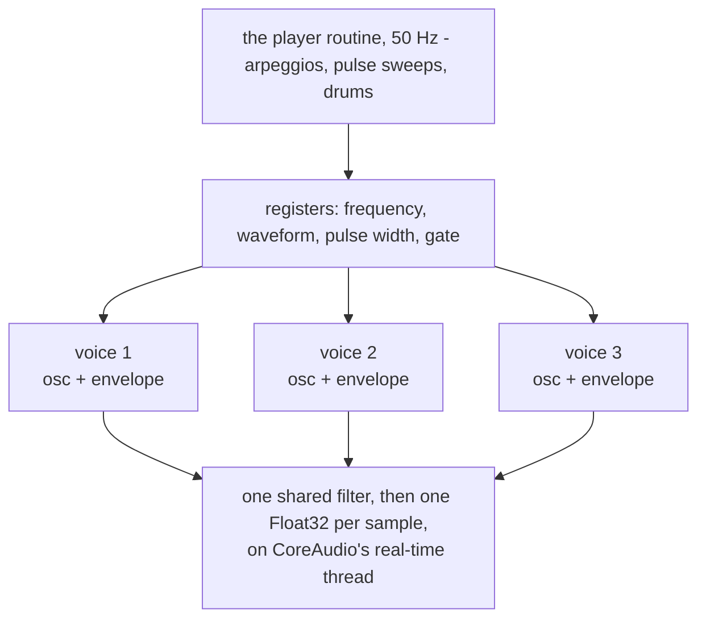

# CHIP

**Three voices, a resonant filter, and a player routine that rewrites the
registers fifty times a second. It sounds like a Commodore 64 because it does
what a Commodore 64 did, not because it plays samples of one.**

It is also the example with a *deadline*. Every other example in the tree
draws; this one has 10.7 milliseconds to fill a buffer before the speaker runs
dry, on a thread it does not own, in a function that may not allocate, may not
lock and may not raise.

| | |
|:---|:---|
| **Source** | `examples/chip/` — four files, ~2,200 lines |
| **The engine** | `chip.mojo`, 579 lines — three oscillators, three envelopes, one filter |
| **Arithmetic** | integer, except the filter and the final sample |
| **Register clock** | 50 Hz, the PAL vertical blank |
| **Audio deadline** | 512 frames at 48 kHz — 10.7 ms |
| **Also used by** | the [ABC player](../AbcPlayerWalkthrough/index.md), which vendors `chip.mojo` verbatim |

## These documents

| Chapter | What it covers |
|:---|:---|
| [1. What it is imitating](01-history.md) | The 6581, why this is not an emulator, and what actually makes the sound |
| [2. A chip is a bank of registers](02-registers.md) | One flat block of memory, no globals, and why that matters |
| [3. Oscillators](03-oscillators.md) | Phase accumulators, the waveform AND, the noise LFSR, ring mod and hard sync |
| [4. The envelope](04-envelope.md) | The period-stretching table — the single detail that matters most |
| [5. The filter](05-filter.md) | A state-variable filter, and the stability bug that took a tune to find |
| [6. The player routine](06-player.md) | Fifty edits a second, and why that is where the music lives |
| [7. Two threads, no glue](07-realtime.md) | `fn` as an `AURenderCallback`, `class` as an `NSView`, and two bugs worth keeping |
| [8. What to understand](08-key-points.md) | The things that will surprise you, and the ones that will bite |

## The shortest possible summary

A chip-tune synthesiser is two programs, and people usually only think about
the first.

**The oscillator** is arithmetic: a 24-bit counter that wraps, some bit
manipulation to turn its value into a waveform, an envelope that scales it, and
a filter. That part is a few hundred lines and it is the part everyone
describes.

**The player routine** is the part that makes it sound like a C64. The chip has
three voices and no memory. A chord is one voice switching between three notes
on consecutive frames — fast enough to hear as a chord, slow enough to shimmer.
A held note is kept alive by sweeping its pulse width, because a static pulse
wave goes lifeless in about half a second. A drum is noise plus a downward
pitch sweep, because the chip has no percussion.

> *So the interesting code is not the oscillator. It is this: fifty edits a
> second to a handful of registers, and out comes music.*

And the third thing, which is why this example lives in a Mojo repository at
all: the render callback CoreAudio calls is a plain Mojo `fn` installed
directly into an audio unit, while the same program's window is a Mojo `class`
that is a real `NSView`. One process, two threads, two ABIs, and no C or
Objective-C anywhere in the build.

<!-- doccrate:keep-together:start -->

<!-- doccrate:keep-together:end -->

