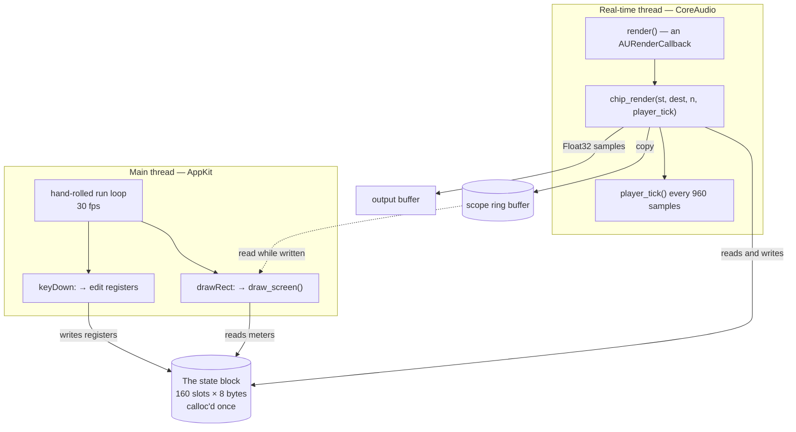
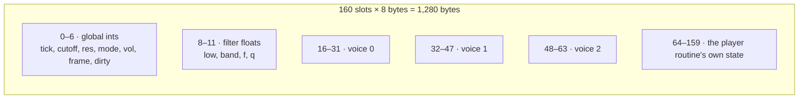
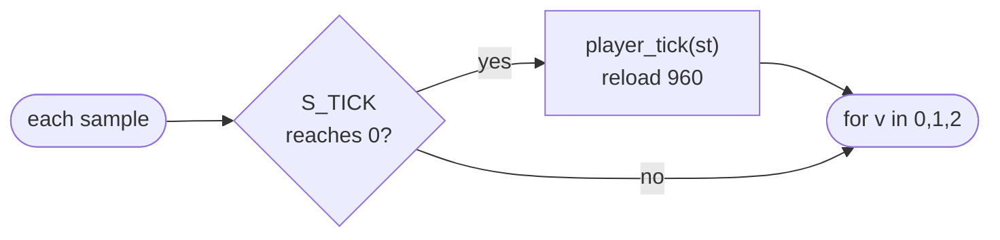
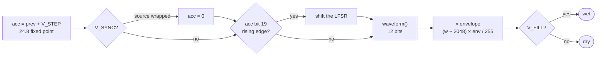
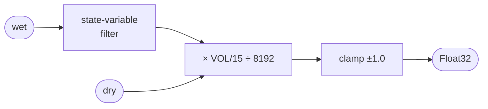
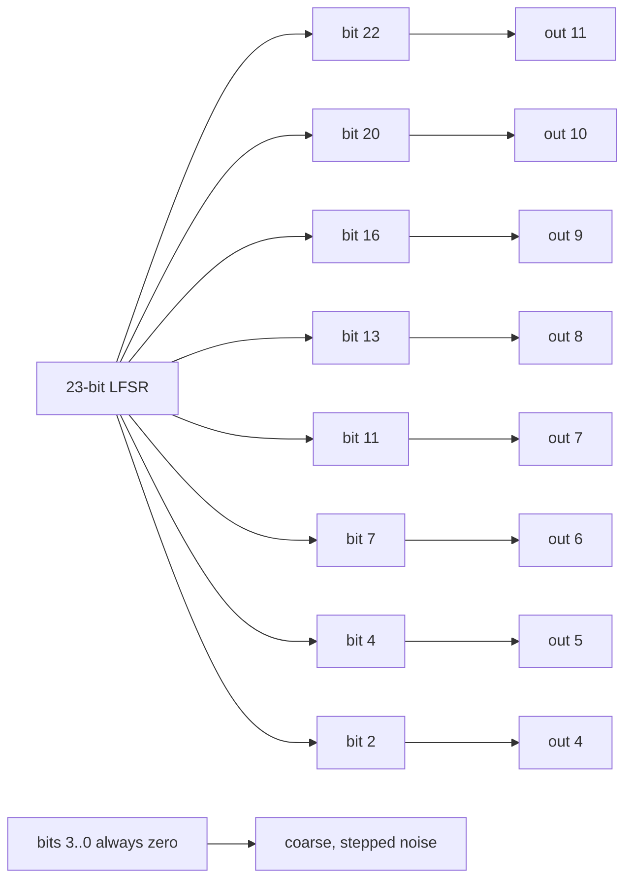
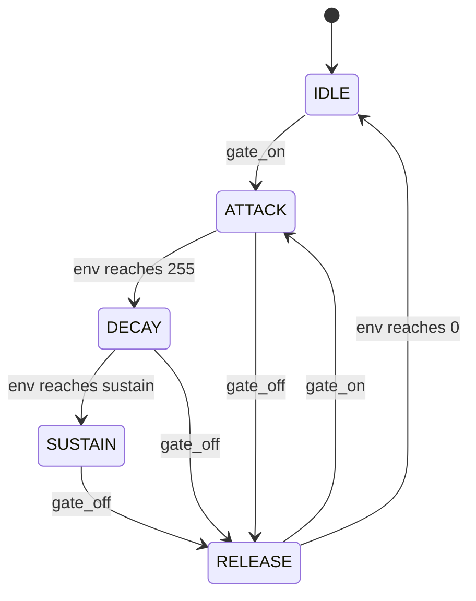
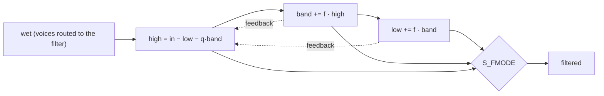

# 6. Inside `chip`

The `chip` example is 2,176 lines across four files, and it is the one to read
if you want to know what Mojo is like at a boundary where the machine is
unforgiving. It is a synthesiser in the manner of the MOS 6581 — three voices,
an envelope, a resonant filter — with a Cocoa window, driven by CoreAudio on a
real-time thread.

This chapter walks the whole program: the shape first, then the synthesis
arithmetic in detail, then what to do to it next.
<!-- doccrate:keep-together:start -->


| File | Lines | What it holds |
|:---|---:|:---|
| `chip.mojo` | 579 | The synthesiser: registers, oscillators, envelope, filter |
| `main.mojo` | 666 | CoreAudio, the window, the screen, the keys |
| `tune.mojo` | 395 | The player routine, instruments, the built-in demo |
| `abc.mojo` | 536 | An ABC-notation parser, so a text file can drive it |

<!-- doccrate:keep-together:end -->

## Why this example exists

Not to emulate a 6581. Cycle-exact emulators exist and are thousands of lines
of measured analogue behaviour. This is the other thing: the *arithmetic* that
gives that chip its voice, small enough to read in one sitting and fast enough
to hold a real-time deadline.

The point is the thread boundary, and the fact that one language sits on both
sides of it:

- **`fn` is a foreign-callable C-ABI function**, so `render` in `main.mojo`
  *is* an `AURenderCallback`. It is installed straight into the audio unit
  with no shim, no Objective-C, and no C file in the build.
- **`class` declares a real Objective-C class**, so the same program's view is
  an `NSView` subclass that AppKit dispatches to normally.
<!-- doccrate:keep-together:start -->


## The overall shape

Two threads that never wait for each other, and one block of memory they
share without a lock.

<!-- doccrate:keep-together:end -->



There is no mutex anywhere in the program, and that is deliberate. The
comment on `render` states the trade:

> There is no lock here and there must not be one: the main thread reads the
> same chip state to draw the meters, and a torn read costs a wrong pixel for
> one frame, where a held lock would cost a click in the speaker.

Everything the audio thread touches is allocated before the unit starts. The
scope buffer, the score, the chip itself — all of it exists before a single
sample is rendered.
<!-- doccrate:keep-together:start -->


### Startup order

```mermaid
sequenceDiagram
    participant M as main()
    participant C as chip_new()
    participant T as tune / abc
    participant AU as CoreAudio
    participant AK as AppKit

<!-- doccrate:keep-together:end -->

    M->>C: calloc 160 slots, sane silence
    M->>T: parse .abc, or build the demo
    Note over M,T: parsing allocates and can raise —<br/>so it happens before the unit exists
    M->>M: calloc the scope buffer
    M->>AU: AudioComponentFindNext (default output)
    M->>AU: set stream format — mono Float32, 48 kHz
    M->>AU: SetRenderCallback { render, chip }
    M->>AU: AudioUnitInitialize + Start
    Note over AU: the audio thread is now live
    M->>AK: window, SidView, makeKeyAndOrderFront
    loop 30 fps until quit
        AK->>AK: drain events, redraw
    end
    M->>AU: AudioOutputUnitStop
```

The run loop is hand-rolled rather than `[NSApp run]` for the reason the other
examples give: **the thing that owns the resource has to be the thing that
drives the app**. Here it owns the audio unit, and it has to stop it before
the process exits, or CoreAudio keeps pulling from a callback whose chip has
been freed.
<!-- doccrate:keep-together:start -->


## The state block

A chip is a bank of registers plus some counters, so that is what this is: one
`calloc`'d array of 160 eight-byte slots, addressed by index.

<!-- doccrate:keep-together:end -->



Two details make this work.

**The float slots are the same memory read through a `Float64` view.**
`ints(st)` and `floats(st)` are two bitcasts of one pointer. Slots 0–6 are only
ever read as `Int`, slots 8–11 only as `Float64`, and they are numbered apart
so the two views never collide.

**The whole block travels through CoreAudio's `inRefCon`.** That is why there
is no global holding the chip — and why two of these could run at once, which
is the cleanest route to a stereo or dual-chip version.

A voice occupies sixteen slots (`V_STRIDE`), addressed as
`V_BASE + voice * V_STRIDE + field`:
<!-- doccrate:keep-together:start -->


| Field | Meaning |
|:---|:---|
| `V_ACC`, `V_PREV` | Phase accumulator, and last sample's, for edge detection |
| `V_STEP` | Per-sample increment — the pitch |
| `V_PW` | 12-bit pulse width |
| `V_WAVE` | Waveform select bits |
| `V_GATE`, `V_PHASE`, `V_ENV` | Envelope gate, stage, and level |
| `V_AINC`, `V_DINC`, `V_SUS`, `V_RINC` | ADSR rates and sustain level |
| `V_LFSR` | The noise shift register |
| `V_RING`, `V_SYNC`, `V_FILT` | Ring modulation, hard sync, filter routing |

<!-- doccrate:keep-together:end -->

## The audio path, one sample at a time

`chip_render` fills a buffer. For every sample it runs the 50 Hz frame
countdown, then three voices, then the filter and the mix.
<!-- doccrate:keep-together:start -->




<!-- doccrate:keep-together:end -->

Each voice then walks this path, and the three results are summed:
<!-- doccrate:keep-together:start -->




<!-- doccrate:keep-together:end -->

The two sums meet at the end of the sample:
<!-- doccrate:keep-together:start -->




<!-- doccrate:keep-together:end -->

The frame countdown is the whole of the C64's timing model. A real machine got
there by a raster interrupt fifty times a second; here it is a counter, and
the arithmetic is identical.

---
<!-- doccrate:keep-together:start -->


# The synthesis, in detail


<!-- doccrate:keep-together:end -->
## 1. Pitch: a 24-bit phase accumulator

Every oscillator is a counter that wraps. Add `V_STEP` each sample, take the
top bits, and the shape you read out of them is the waveform.


The chip stepped its accumulator once per *chip cycle* — 985,248 times a
second on a PAL machine. This steps once per *output sample*, 48,000 times a
second, so the frequency register has to be converted:

<!-- doccrate:keep-together:start -->


```mojo
vput(st, voice, V_STEP, (freq * CLOCK_PAL * 256) // SAMPLE_RATE)
```

<!-- doccrate:keep-together:end -->


The `* 256` is eight fractional bits of headroom. Without them the division
rounds, and the error is a few cents flat in the high octaves — small, and
audible. So the accumulator is 24.8 fixed point internally, and `acc24` is
what the waveform generator sees:

<!-- doccrate:keep-together:start -->


```mojo
let acc24 = (acc >> 8) & 0xFFFFFF
```

<!-- doccrate:keep-together:end -->


`CLOCK_PAL = 985248` is not decoration. **Every frequency register in every
chip tune ever written was chosen against that number**, so a tune ported from
real chip data keeps its values and lands on the right pitches.

<!-- doccrate:keep-together:start -->


## 2. The four waveforms

`waveform()` returns twelve bits. It starts at `0xFFF` and **ANDs** each
selected shape into it — because that is what the real chip did:

<!-- doccrate:keep-together:end -->


> Selecting more than one waveform ANDs them together on the real chip — an
> accident of how the outputs are wired, not a design, and the source of most
> of the timbres people remember.

**Sawtooth** is the accumulator's top twelve bits, straight through:

<!-- doccrate:keep-together:start -->


```mojo
out &= (acc24 >> 12) & 0xFFF
```

<!-- doccrate:keep-together:end -->


**Triangle** folds the waveform in half when the top bit is set, which turns a
ramp into a peak:

<!-- doccrate:keep-together:start -->


```mojo
var folded = acc24
if ((acc24 ^ ring_source_msb) & 0x800000) != 0:
    folded = (~acc24) & 0xFFFFFF
out &= (folded >> 11) & 0xFFF
```

<!-- doccrate:keep-together:end -->


**Pulse** compares the accumulator against the 12-bit pulse-width register.
Full scale or nothing:

<!-- doccrate:keep-together:start -->


```mojo
out &= 0xFFF if ((acc24 >> 12) >= vget(st, voice, V_PW)) else 0
```

<!-- doccrate:keep-together:end -->


Pulse width is not a setting you dial in once — it is a register you are
*expected to modulate every frame*, and the player routine does exactly that.

**Noise** is the part that makes it sound like a games machine rather than a
white-noise generator.

<!-- doccrate:keep-together:start -->


## 3. The noise LFSR

A 23-bit linear-feedback shift register, clocked not by the sample rate but by
**bit 19 of the accumulator going high**:

<!-- doccrate:keep-together:end -->


<!-- doccrate:keep-together:start -->


```mojo
if (was24 & 0x80000) == 0 and (acc24 & 0x80000) != 0:
    let feedback = ((lfsr >> 22) ^ (lfsr >> 17)) & 1
    vput(st, voice=v, field=V_LFSR, value=((lfsr << 1) | feedback) & 0x7FFFFF)
```

<!-- doccrate:keep-together:end -->


Two consequences fall out of that, and both are audible.

**Noise pitch follows the frequency register.** A rising noise sweep is a
rising *frequency*, not a filter sweep. That is how every C64 cymbal and
explosion was made.

**The output is eight scattered taps, not the register.** Bits 22, 20, 16, 13,
11, 7, 4 and 2 become output bits 11 down to 4:

<!-- doccrate:keep-together:start -->




<!-- doccrate:keep-together:end -->


The low four bits are always zero. That quantisation is part of why the noise
*rasps* instead of hissing.

One detail in `chip_new` is load-bearing: the LFSR is seeded to `0x7FFFF8` and
must never be zero. All-zeroes is a fixed point of the shift — the noise would
be silence forever.

<!-- doccrate:keep-together:start -->


## 4. Ring modulation and hard sync

Both take their input from the *previous* voice, `(v + 2) % 3`.

<!-- doccrate:keep-together:end -->


**Ring modulation** is one XOR. The triangle's folding bit is replaced by the
source voice's top bit, and that is the entire mechanism — it is why bells and
gongs sound the way they do on this chip.

**Hard sync** slams the accumulator to zero when the source voice wraps:

<!-- doccrate:keep-together:start -->


```mojo
if s_now < s_was:
    acc = 0
```

<!-- doccrate:keep-together:end -->


Two oscillators at unrelated pitches, one resetting the other, is the chip
lead sound.

<!-- doccrate:keep-together:start -->


## 5. The envelope

This is the single algorithm that most decides whether the result sounds like
a games machine or a generic synthesiser.

<!-- doccrate:keep-together:end -->


<!-- doccrate:keep-together:start -->




<!-- doccrate:keep-together:end -->


The level is 16.16 fixed point, and **the attack is linear**. Only the falling
phases are shaped — and they are not exponential. The chip divided its
countdown further as the level fell, so the tail flattens in five visible
steps:

<!-- doccrate:keep-together:start -->


| Level | Divisor |
|---:|---:|
| 94–255 | 1 |
| 55–93 | 2 |
| 27–54 | 4 |
| 15–26 | 8 |
| 7–14 | 16 |
| 0–6 | 30 |

<!-- doccrate:keep-together:end -->


<!-- doccrate:keep-together:start -->


```mojo
env -= step // divisor
```

<!-- doccrate:keep-together:end -->


> Replacing that with a smooth exponential is the single change that makes
> this sound like a synthesiser instead of a games machine.

The rates come from the chip's own table — sixteen attack times from 2 ms to
8 s — with decay and release running **three times slower** for the same index.
That asymmetry is why a C64 bass can have a snap on the front and still ring
for half a second.

`rate_increment` converts milliseconds to a per-sample step and clamps it to
at least 1, because a zero step would hang the envelope in its attack phase
and the voice would never sound.

<!-- doccrate:keep-together:start -->


## 6. The filter

A two-pole Chamberlin state-variable filter — three outputs from one
structure, and the mode register selects which are summed:

<!-- doccrate:keep-together:end -->


<!-- doccrate:keep-together:start -->


```mojo
low += f * band
let high = wet - low - q * band
band += f * high
```

<!-- doccrate:keep-together:end -->


<!-- doccrate:keep-together:start -->




<!-- doccrate:keep-together:end -->


Two coefficients, from the cutoff and resonance registers:

<!-- doccrate:keep-together:start -->


```mojo
let hz = 200.0 + Float64(cutoff) * 5.8
var f = 2.0 * _sin(3.141592653589793 * hz / Float64(SAMPLE_RATE))
let q = 1.4 - Float64(get(st, S_RES)) * 0.086
```

<!-- doccrate:keep-together:end -->


The 6581's cutoff curve is famously non-linear and differs chip to chip, so
there is no correct mapping to reproduce; this is a plain linear sweep across
the range the chip covered.

<!-- doccrate:keep-together:start -->


### The stability bound, and why it matters

**`f` and `q` are not independent.** A Chamberlin filter is stable only while
`f + q < 2`, so the usable cutoff depends on the resonance chosen with it:

<!-- doccrate:keep-together:end -->


<!-- doccrate:keep-together:start -->


```mojo
var limit = 0.95 * (2.0 - q)
if limit > 1.4:
    limit = 1.4
if f > limit:
    f = limit
```

<!-- doccrate:keep-together:end -->


This is worth dwelling on, because the history is instructive. An earlier
version clamped `f` to a flat 1.4 — enough for the single cutoff and resonance
the demo tunes happened to use, and it left the filter sitting *just* inside
its own limit there, `f` 1.099 against a bound of 1.116. Much of the rest of
the range was unstable. At cutoff 1700 with resonance 5 the state diverges
within a second, and everything after that is a buzz.

Nothing found it until a tune began **sweeping the cutoff**, because nothing
had ever changed it while a note was sounding.

Two guards follow from that. The state saturates at ±65536, because a real
filter saturates. And NaN is caught and reset:

<!-- doccrate:keep-together:start -->


```mojo
if low != low or band != band:
    low = 0.0
    band = 0.0
```

<!-- doccrate:keep-together:end -->


NaN is *sticky* — one of them poisons every sample after it, so the synth goes
silent for good and only a restart brings it back. The output clamp cannot
help, because by then the damage is in the state rather than in the sample.

<!-- doccrate:keep-together:start -->


## 7. Mixing, and headroom

```mojo
let sample = Float64((w - 2048) * env) / 255.0
```

<!-- doccrate:keep-together:end -->


The waveform is centred *before* the envelope scales it. Skip that and every
note-on puts a step of DC through the filter.

<!-- doccrate:keep-together:start -->


```mojo
let mixed = (dry + filtered) * Float64(get(st, S_VOL)) / 15.0
var value = mixed / 8192.0
```

<!-- doccrate:keep-together:end -->


Three voices at full envelope reach 3 × 2048; the 8192 divisor leaves headroom
for the filter's resonant peak, which can exceed its own input. The final
clamp to ±1.0 is the last line of defence.

<!-- doccrate:keep-together:start -->


## 8. The player routine

`chip_render` takes a plain C function pointer:

<!-- doccrate:keep-together:end -->


<!-- doccrate:keep-together:start -->


```mojo
comptime Tick = fn(P, /) -> None
```

<!-- doccrate:keep-together:end -->


so the chip never has to know what a tune is. The player is called from
*inside* the audio callback, on the beat, exactly as a raster interrupt would
have been — and it keeps its own state in slots 64–159, after the chip's.

Every effect the example has is done up here, at 50 Hz, by writing registers:

<!-- doccrate:keep-together:start -->


| Effect | How |
|:---|:---|
| **Arpeggio** | Three notes, one per frame. The ear hears a chord. |
| **Drum** | Noise plus a downward sweep — `hz *= 0.82` per frame of age. The chip has no percussion. |
| **Vibrato** | `hz *= 1 + cents·sin(frame·0.55)/1200`, delayed slightly so short notes stay clean. |
| **PWM** | A slow triangle over the pulse-width register, never reaching the ends, where the wave would go silent. |

<!-- doccrate:keep-together:end -->


That table is the answer to "how did they get so much out of three voices".
None of it is in the chip. All of it is a player routine writing registers
fifty times a second.

<!-- doccrate:keep-together:start -->


### One trap, kept in the source

`_sin` is hand-written as a nine-term series, and the reason is a language
fact: `std.math.sin` is a `def`, a `def` may raise, and the render callback is
an `fn` — non-raising and C-callable — so it *cannot call one*.

<!-- doccrate:keep-together:end -->


Its range reduction is one multiply-and-truncate, not a loop, and the comment
explains why that matters:

> Subtracting 2π until the argument lands in range is harmless for a filter
> coefficient and quietly ruinous for vibrato: that argument grows with the
> frame counter, so the loop gets one iteration longer every fifty frames — on
> the audio thread, where the cost eventually shows up as a dropout and never
> as an error.

---

<!-- doccrate:keep-together:start -->


# Extending it

The design leaves several doors open on purpose.

<!-- doccrate:keep-together:end -->


**Run two chips.** All state is in one block reached through `inRefCon`, and
there are no globals — so a second `chip_new()` and a stereo stream format
gives you two independent chips panned left and right. This is the cheapest
big win in the file.

**Render offline.** `chip_render` takes a destination pointer and a frame
count; nothing in it knows about CoreAudio. Point it at a heap buffer, run it
faster than real time, and write a WAV — useful for tests, and for rendering a
tune to a file without playing it.

**Add a voice.** Voices are addressed as `V_BASE + voice * V_STRIDE`, so the
layout scales by changing `STATE_SLOTS` and the loop bounds. Watch for
`(v + 2) % 3` in the sync and ring paths — those hardcode three voices and
would need the modulus generalised.

**A better cutoff curve.** `recompute_filter` admits its mapping is a plain
linear sweep. Sampling a real 6581's curve, or fitting the published
measurements, changes the character more than any other single edit.

**Wavetables.** `waveform()` is a pure function of the accumulator and the
register bits. A fifth "wave" that indexes a table instead would slot in
beside the other four without touching anything else.

**Live input.** The `abcplayer` example already turns notation into a schedule
of *at sample N, do this*. A MIDI source could drive `gate_on`/`set_freq_hz`
the same way, making this a playable instrument.

**A spectrum display.** The scope ring buffer is already there and already
tolerates being read while it is written. A small DFT over it, drawn beside
the waveform, needs no new plumbing.

<!-- doccrate:keep-together:start -->


## Known rough edges

Honest notes from a review of this example, worth knowing before you build on
it:

<!-- doccrate:keep-together:end -->


- **The cutoff keys wrap rather than clamp.** `set_filter` masks with
  `& 0x7FF`, and the `<` / `>` handlers pass an unclamped value, so stepping
  below zero lands at 1984 and the filter snaps wide open. The resonance keys
  four lines away clamp properly.
- **The window is released when closed.** No `setReleasedWhenClosed(False)`,
  so the run loop's `isVisible` check touches a released object. It survives
  today only because the single outer autorelease pool never drains — which is
  itself the second defect. Fix them together.
- **`waveform()` returns full-scale DC for unrecognised wave bits**, because
  `out` starts at `0xFFF` and only ever ANDs. `set_wave` does not mask its
  argument, unlike every other register setter.
- **Voice 0's sync and ring read a one-sample-stale source**, because voices
  advance in index order within the same loop while `(v + 2) % 3` points voice
  0 at voice 2, which has not moved yet.

None of these stop the example working, and all of them are small. They are
listed because an example is read as a model, and a model should say where it
is thin.
