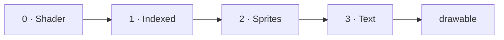
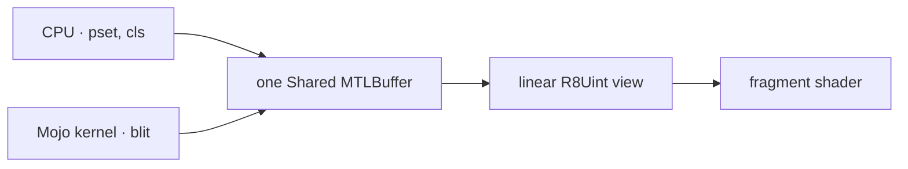
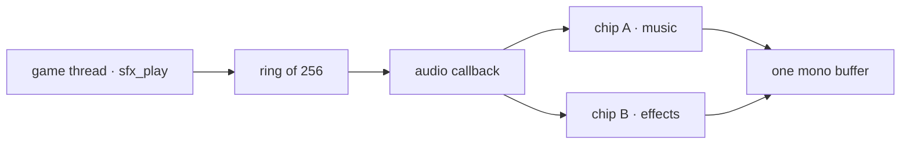

# 7. The game pane

`gamepane` is a package, not an example: 11,500 lines that a game imports
rather than copies. It is a port of [MacGamePane](https://github.com/albanread/MacGamePane),
a Rust engine for retro-styled games on Apple silicon, and the port kept every
capability while changing one thing about how they are built.

That one thing is the subject of most of this chapter. The Rust keeps a CPU
copy of every index buffer and uploads whatever is dirty each frame. This does
not. Every plane is one allocation that the CPU writes, a Mojo GPU kernel
reads and writes, and a fragment shader samples — and there is no second copy
anywhere in the package.

| Tier | Lines | What it holds |
|:---|---:|:---|
| `gamepane/api` | 2,151 | The platform-neutral surface. No `std.objc`, no `max.gpu`, no Metal |
| `gamepane/metal` | 3,344 | The one backend: windows, pipelines, kernels, the audio unit |
| `gamepane/abc` | 2,511 | ABC notation: parse, schedule, play, write an SMF |
| `gamepane/tests` | 3,535 | Every check, headless |

## The two tiers, and why the line is where it is

A game imports `gamepane.api`. That tier imports nothing that knows what a GPU
is — which means the compiler enforces the boundary rather than a convention
enforcing it. The neutral tier holds more than a set of type declarations: it
holds every piece of *arithmetic*.

Bresenham's line is arithmetic. A midpoint circle is arithmetic. Clipping a
blit rectangle against two planes is arithmetic, and so is a sprite's quad
transform, the palette's per-line/global index split, and rounding a WAV
sample half away from zero. None of it needs a device, so none of it is in the
backend, and all of it is testable without opening a window.

<!-- doccrate:keep-together:start -->

```mojo
@fieldwise_init
struct Plane(Copyable, Movable):
    var base: Pointer[UInt8, MutUntrackedOrigin]
    var stride: Int
    var width: Int
    var height: Int
```

<!-- doccrate:keep-together:end -->

That is the whole interface between the tiers for drawing. `Plane` cannot tell
a Metal buffer from a `List`, and every primitive is written against it. The
backend's job is to say where the bytes are.

## The layer stack

Four layers composite into one drawable, in order, each with its own render
pass and its own load action.

<!-- doccrate:keep-together:start -->



<!-- doccrate:keep-together:end -->

| Layer | What it is | Load action |
|:---|:---|:---|
| 0 · `ShaderPane` | A fragment function and ten floats | `Clear` |
| 1 · `IndexedPane` | Eight index planes, a per-line palette, a world larger than the screen | `Load`, index 0 discards |
| 2 · `Sprites` | Textured quads, per-instance scale · rotation · alpha | `Load`, alpha-blended |
| 3 · `TextOverlay` · `TextPlane` | A 5×7 font, rasterised or as cells | `Load`, alpha-blended |

Index 0 is transparent everywhere: the indexed pane discards on it, a sprite
discards on it, and an unused text cell emits alpha zero. That single
convention is what lets every layer be present always. A game that never
touches the text plane sees no difference from one that has no text plane at
all.

`DirectPane` is the alternative to layer 1 — a palette-indexed screen the host
writes a byte at a time, for a plasma or a raycaster where every pixel changes
every frame and there is nothing small to send.

## The frame contract

One command buffer per frame, and every layer encodes into it.

<!-- doccrate:keep-together:start -->

```mojo
let frame = pane.begin_frame()
sky.render(frame)                                  # layer 0: Clear
world.render(frame)                                # layer 1: Load
sprites.render(frame, sx, sy, vw, vh)              # layer 2: Load, blended
hud.render(frame)                                  # layer 3: Load, blended
pane.end_frame(frame)
```

<!-- doccrate:keep-together:end -->

`Frame` carries three Objective-C objects and one flag: the drawable, its
texture, the command buffer, and whether there was a drawable at all. An
invalid frame means the compositor had none ready, which is ordinary under
load — every layer's `render` returns immediately on it, and the frame is
skipped rather than reported as an error.

`begin_frame` also enforces the **ordering rule**. Blits are enqueued on the
GPU runtime's stream while frames are encoded on the layer's command queue:
two submission paths to one device, with nothing implicitly ordering them. So
`begin_frame` synchronises before it acquires the drawable, and a blit is
always complete before the frame that shows it. It is automatic because the
failure mode — a frame late by one — reads as a game bug rather than as a
missing call.

## One memory, three readers

Here is the port's central claim, and the thing that took a whole sprint to
establish before anything depended on it.

<!-- doccrate:keep-together:start -->



<!-- doccrate:keep-together:end -->

Apple silicon has unified memory, so a `Shared` buffer's contents is ordinary
CPU-writable memory. A *linear* texture view over that same buffer is what the
shader samples. The bytes the host writes are the bytes the GPU reads. Nothing
copies them, and no thread owns the write — Metal does not care which thread
stores into a shared buffer; what has thread affinity is command encoding and
presenting, neither of which happens when a game sets a pixel.

Deleting the mirror deletes more than a memcpy. It deletes the dirty flags, it
deletes the `upload()` call a caller has to remember, and it deletes the reason
the Rust's blitter applies every operation twice — once on the GPU and once on
the CPU copy, because otherwise the next upload would push stale bytes over the
blit's result.

It costs one thing, and the cost is the reason `DirectPane.stride()` is public:

> **The stride is not the width.** `bytesPerRow` for a buffer-backed texture
> must be a multiple of `minimumLinearTextureAlignmentForPixelFormat:`, which
> is 16 for `R8Uint` here. A row occupies `stride` bytes even when only
> `width` are visible, so a writer addresses `fb[y * stride + x]`. Code that
> assumes `y * width + x` draws a diagonal smear at any width the alignment
> does not divide — and 640 divides by 16, which is exactly why the tests use
> a 641-wide world as well.

### The accessor

`max.gpu` gives a `DeviceBuffer` that a kernel can take and the CPU can write,
but it does not expose the `id<MTLBuffer>` underneath — and without that there
is no texture view and no third reader. Three functions in this fork's own GPU
runtime close the gap:

<!-- doccrate:keep-together:start -->

```c
AppleGPUMetal_mtlBuffer            /* the id behind an AGMetalBuf   */
AsyncRT_DeviceBuffer_metal_buffer  /* the same, from a DeviceBuffer */
AsyncRT_DeviceBuffer_metal_offset  /* its view offset               */
```

<!-- doccrate:keep-together:end -->

That is 63 lines of C++, and it is the *only* C++ written for this package.
Everything else — the window, the view class, the event pump, four render
pipelines, four GPU kernels, the audio unit and its callback — is Mojo talking
to Objective-C through `std.objc`. The package contains zero `msg_send` calls;
protocol-typed Metal calls go through `send`, which is the sanctioned spelling.

**The id is a borrow.** It is not retained, and it lives exactly as long as the
`DeviceBuffer` that owns it — which matters more in Mojo than it looks,
because Mojo destroys a value at its *last use* rather than at the end of the
scope. A struct that keeps a texture view must keep the buffer as a field.
Getting that wrong sends a message to freed memory, and it does not crash
there; it crashes in the next allocation, a long way from the cause.

## A worked example: the indexed pane

`examples/galaxigans` is the game that ships with the toolchain -- a Galaga
ported from 1,447 lines of BASIC, in about the same again of Mojo. It uses
the sprite layer, the text overlay and the particle field, and the code
below is from the demos that exercise the indexed pane instead.

That demo draws a world twice the size of the screen, once, and never
redraws it.

<!-- doccrate:keep-together:start -->

```mojo
var world = IndexedPane(pane.ctx, pane.device, 960, 640, 480, 320)
var plane = world.active_plane()
plane.cls(0)                                    # 0 = transparent
for i in range(len(platforms)):
    let r = platforms[i]
    plane.fill_rect(r[0], r[1], r[2], r[3], UInt8(17 + i % 6))

for bx in range(0, 960, 240):
    plane.fill_rect(bx, 0, 24, 640, 1)          # stripes of index 1
for line in range(320):
    let t = Float32(line) / 320.0
    world.set_line_rgb(line, 1, Int(t * 40.0), Int(t * 10.0),
                       Int(60.0 + t * 80.0))
```

<!-- doccrate:keep-together:end -->

Three things are on display, and each is one line of game code.

**Index 0 is transparent**, so the starfield below shows through everywhere the
platforms are not — the fragment shader discards, and layer 0 survives.

**Indices 1–15 are per scanline.** Index 1 is a different colour on every line
of the viewport, so those stripes carry a vertical gradient that no pixel was
ever drawn to make. As the camera pans the stripes slide past while the
gradient stays put, because the colours belong to the screen line and not to
the world. That is 320 palette entries and a handful of rectangles doing what
would otherwise be a per-frame redraw.

**The world is bigger than the screen.** Panning is `set_scroll`, clamped to
the overscan margin. Nothing is redrawn to scroll, ever — the composite reads a
different window of the same bytes.

The palette's layout is worth stating exactly, because a writer has to address
it: `viewport_height` groups of sixteen per-line entries first, so line *y*'s
colour *i* is entry `y * 16 + i`; then the 240 global entries, so index *c*
(16–255) is entry `viewport_height * 16 + (c - 16)`. Four bytes each, RGBA.
There is no CPU mirror of the palette either, which is what stops an upload
ever copying a stale copy over a guest's direct writes.

## The blitter

Four Mojo `def`s, compiled to AIR and launched on the runtime's queue: `copy`,
`transparent` (source index 0 leaves the destination alone), `minterm`
(AND/OR/XOR with the destination), and `fill`. No hand-written Metal compute
shaders anywhere.

Two details are worth carrying away. Kernel arguments must be **fixed width** —
`Int` and `UInt` do not conform to `DevicePassable` — so every parameter is
`Int32`, `UInt8` or a pointer. And clipping happens **once**, before launch, in
the neutral tier: a thread never bounds-checks a plane, an off-edge blit is a
no-op rather than a trap, and both origins move together, because trimming two
pixels off the destination's left must trim two off the source or the copy
shears.

Compilation is cached. The first `compile_function` for a kernel costs about
140 ms and every later one about 28 µs, measured — so the operations call it
per blit without apology, and `warm_up_blitter` exists only so a game pays the
140 ms at startup rather than at its first sprite.

## Sprites are composited, not blitted

Nothing in the sprite layer writes into an index plane. Each visible instance
is a textured quad in its own render pass, blended source-alpha over whatever
the layers below left on the drawable. That is what makes scale, rotation and
alpha per-instance and free, and why a moving sprite never has to repair the
background it covered — there is no background underneath it, only an earlier
pass.

The quad transform is CPU-side, per instance: scale by half-extents, rotate,
subtract the scroll, map to NDC, triangle-strip order. One small draw call per
sprite rather than one instanced draw. That is the right trade at the sprite
counts a v1 needs and the wrong one at hundreds, and the code says so rather
than leaving it to be rediscovered.

A sprite is defined from text, which is why a whole sprite fits in a literal:

<!-- doccrate:keep-together:start -->

```mojo
comptime COIN = String(
    "..2222../.222222./22233222/22333222/22333222/22233222/.222222./..2222.."
)
let coin = sprites.define_sprite(pane.ctx, COIN)
sprites.sprite_rgb(coin, 2, 220, 170, 40)      # gold
sprites.sprite_rgb(coin, 3, 255, 245, 190)     # the glint
```

<!-- doccrate:keep-together:end -->

Hex digits are palette indices into the sprite's *own* sixteen colours and `.`
is transparent. Ragged rows are rejected rather than padded: a row one
character short shifts every pixel after it and produces a sprite that looks
*nearly* right, which is far harder to see than a refusal.

## Text, twice

The same 5×7 font, two renderers, and neither has its own copy of the table.

`TextOverlay` rasterises glyphs into an RGBA buffer when you call `draw_text`.
It is retained, which makes it right for a title or a label attached to an
object — and quietly expensive for a HUD, because a picture that has not
changed still costs one call per string per frame and the only defence is
remembering not to.

`TextPlane` removes the defence by removing the calls. It is a grid of cells in
a shared buffer — four bytes each, `[char, fg, bg, flags]` — and a shader that
samples a font atlas baked from the same `glyph_for`. Writing a character is a
byte store; a whole text screen is one copy.

The honest limit, because it decides what each is for: a grid snaps glyphs to
six-pixel boundaries, so it cannot centre a digit in a sixteen-pixel square or
put a card's rank at +3,+4 inside a thirty-four-pixel card. The plane is for
text *screens* — HUDs, menus, help pages, consoles. Object-attached glyphs stay
in the overlay.

The overlay is the one thing in the package that keeps an upload, and the
reason is narrow: everywhere else a plane is index bytes and a linear texture
view removes the copy, but the natural home for RGBA at one texel per screen
pixel is an ordinary sampled 2D texture. A dirty flag guards it.

## The audio arrangement

Two chips on one audio unit, summed by a plain Mojo `fn` handed straight to
CoreAudio. There is no shim: an `AURenderCallback` is a C function pointer, and
`fn` in a type position is exactly that.

<!-- doccrate:keep-together:start -->



<!-- doccrate:keep-together:end -->

**Nothing in the callback allocates, locks or raises.** Everything it touches
was allocated before the unit started — including the mix buffer, and including
the tune, whose schedule is flattened into an array of integers on the game's
thread. That is what lets a tune be sample-accurate with no lock: there is
nothing to lock, because nothing is built while it plays.

**The trigger path is single-producer, single-consumer.** The game only ever
writes the write counter; the callback only the read counter. Neither needs a
read-modify-write and there is nothing to contend. What it *does* need is
ordering, and that is what two fences are for — release after the payload and
before the counter that publishes it, acquire after the counter and before the
payload. Without them a weakly ordered machine may publish a slot before the
value in it, and the callback plays whatever was there last time round.

A full ring refuses and counts the refusals rather than overwriting. Losing the
oldest unplayed trigger silently is worse than saying no.

The twelve effects are **chip recipes, not samples**: a waveform, an ADSR, a
starting pitch, and a routine that writes the frequency register every 50 Hz
frame — so a sweep is a staircase at 50 Hz and audibly so. `saucer` and
`boss_hum` take two voices each, because the warble *is* the beat between them:
600 against 606 Hz, and 110 against 114.

Because the chip is integer arithmetic with a fixed LFSR seed, every effect
renders byte for byte the same on every run. The twelve hashes are committed,
so a change to the oscillator, the envelope, the filter or a recipe shows up as
a different number rather than as someone eventually noticing that the laser
sounds wrong.

## Running it

<!-- doccrate:keep-together:start -->

```bash
./tools/check-gamepane.sh
```

<!-- doccrate:keep-together:end -->

Every test and the demo, headless. `GAMEPANE_FRAMES=N` makes a pane an
unfocused Accessory that renders *N* frames and exits; `GAMEPANE_DUMP=path`
writes the last frame as raw BGRA. So the suite opens real windows on real
drawables and still runs to completion over ssh or in a build, stealing
nobody's focus — and the last check reads the demo's own dump back and fails if
nothing drew, which is the failure a suite of unit tests cannot see.

The tests are **built** rather than run under the JIT, for two reasons worth
knowing generally. The JIT cannot resolve AudioToolbox, so anything that opens
an audio unit fails there and passes as a binary. And a crash under `cocoamojo
run` loses buffered stdout — `flush=True` does not save it — so the last lines
before a fault vanish and the crash appears to be several statements earlier
than it is. Build a binary and run that; it prints every line first.

## What to do to it next

- **A game.** The package is an engine with no game in it. Galaxigans is the
  planned first one.
- **Instanced sprites.** One draw call per sprite is fine at a dozen and wrong
  at hundreds; the transform would move to the vertex shader.
- **A software backend.** The neutral tier imports no Metal, so a second
  backend is a real possibility rather than a claim — and `Plane` is the whole
  drawing interface it would have to satisfy.
- **More of the blitter.** A full 256-minterm three-input blitter is the Amiga
  original; four operations is the useful subset, and the fifth someone wants
  will tell you which.
