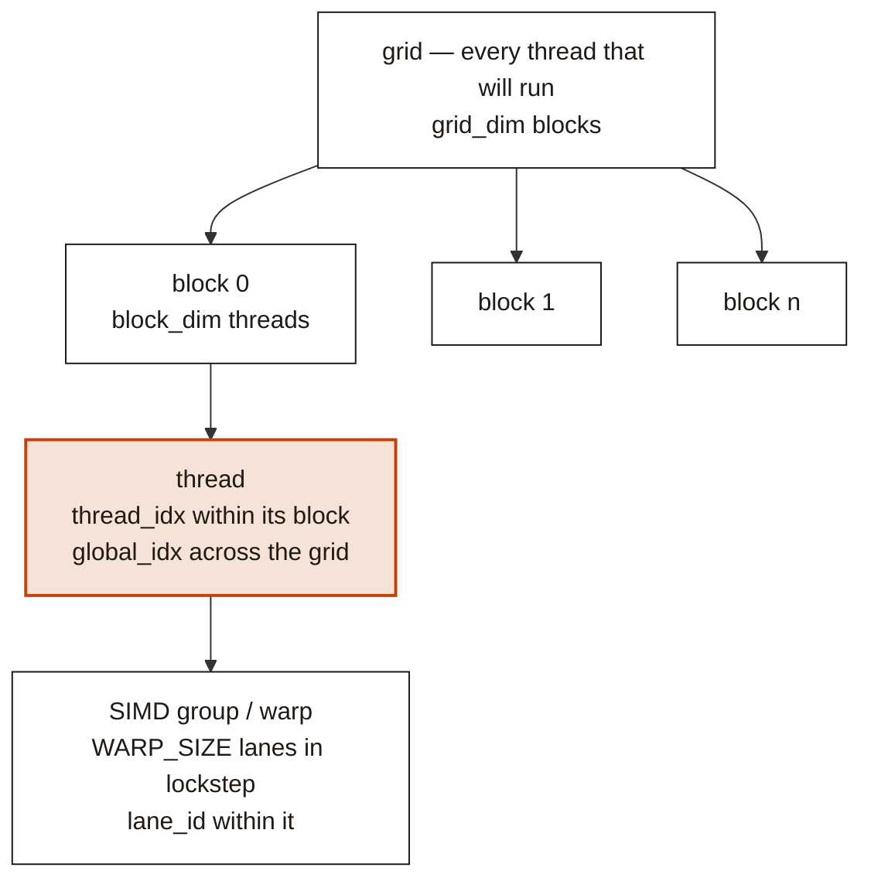

# GPU programming in Mojo

Mojo's premise is that one source file specialises to whatever silicon you
point it at, and the GPU is where that claim is cashed. A kernel is an ordinary
Mojo function. There is no separate shading language, no string of source
compiled at run time, and no second toolchain — you write Mojo, and the same
compiler that produced your CPU code produces the GPU code.

```mojo
from std.gpu import global_idx
from max.gpu.host import DeviceContext

def scale(data: Pointer[Float32, MutAnyOrigin], factor: Float32, n: Int):
    var i = Int(global_idx.x)
    if i < n:
        data[unsafe_offset=i] = data[unsafe_offset=i] * factor
```

That is a complete GPU kernel. The rest of this section is about how to launch
it, how to think about the threads that run it, and how to know the answer is
right.

| Document | What it covers |
|:---|:---|
| [1. Your first kernel](01-first-kernel.md) | The execution model, and a complete program from allocation to result |
| [2. Threads, blocks and memory](02-threads-and-memory.md) | Indexing, shared memory, barriers, and SIMD-group operations |
| [3. Running and checking](03-running-and-checking.md) | Building, timing, verifying results, and what this hardware supports |

## The execution model, briefly

The same function body runs on thousands of threads at once. Each thread
discovers *which* piece of work it owns by asking for its own index, does that
piece, and stops. Threads are grouped into **blocks**, blocks make up the
**grid**, and only threads within a block can cheaply cooperate.



If you have written CUDA or Metal compute, this is the model you already know,
with Mojo's names on it. If you have not, the next chapter builds it up from a
working program.

## Where this runs

This fork targets the **Apple Silicon GPU** through Metal. The reference
machine is an M4 Max. Kernels are ordinary Mojo, so the same source is what you
would run on another vendor's hardware through a different backend — but on
this machine, Metal is the backend and `DeviceContext(api="metal")` is how you
ask for it.
