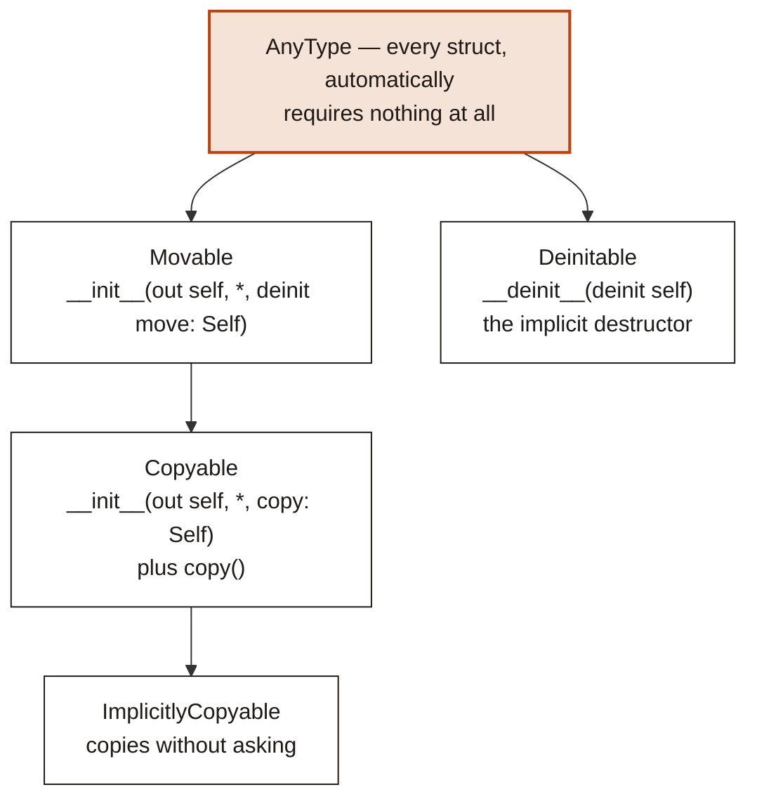

# 3. Mojo's own object model

Before any Cocoa appears, it is worth being clear about what Mojo gives you on
its own — because it is not what most object-oriented experience will lead you
to expect, and because the shape of the Cocoa layer is a direct response to the
gap.

Mojo has no classes of its own. It has structs with methods, traits, and
generics, and everything is resolved at compile time. There is no inheritance,
no vtable, no runtime object graph, and no dynamic dispatch anywhere in the
language.

That is not a deficiency to work around. Most of what you want from objects is
here; what is missing is precisely the part Objective-C is unusually good at,
which is why the two compose so well.

## `class` means something specific here

In this fork `class` is not a Mojo class. It declares an **Objective-C**
class — a real one, registered with the ObjC runtime, with dynamic dispatch and
inheritance and everything else Mojo does not have.

That is the division of labour in one keyword. `struct` is Mojo's value type,
resolved statically; `class` is Cocoa's reference type, resolved by the
runtime. They are different animals and the language now says so.

This chapter is about `struct`, because that is what Mojo gives you on its own
and what everything else is built from. [Chapter 6](06-callbacks.md) is about
`class`.

## Structs

A struct is a value type with a fixed layout known at compile time.

```mojo
struct Counter:
    var count: Int
    var label: String

    def __init__(out self, label: String):
        self.count = 0
        self.label = label

    def increment(mut self):
        self.count += 1

    def describe(self) -> String:
        return self.label + ": " + String(self.count)
```

Fields are declared with `var`. Methods are ordinary `def`s whose first
parameter is `self`, and the argument convention on `self` says what the method
does:

| First parameter | Meaning |
|:---|:---|
| `self` | Reads the value. The default. |
| `mut self` | Mutates it in place. |
| `var self` | Takes it by value; the method owns it. |
| `out self` | Initialises it. Used by `__init__`. |
| `deinit self` | Consumes it, ending its lifetime. |

`Self` names the enclosing type, which matters in generic code and in trait
requirements.

Static methods take no `self`:

```mojo
    @staticmethod
    def zero() -> Self:
        return Counter("")
```

### `@fieldwise_init`

When the initialiser would just assign each field in order, ask for it:

```mojo
@fieldwise_init
struct CGPoint(Copyable, Movable):
    var x: Float64
    var y: Float64

var p = CGPoint(3.0, 4.0)
```

This is the shape almost every Cocoa geometry struct takes.

## The lifecycle

Here Mojo diverges sharply from older writing about it, and from most other
languages. There are four operations, and **three of them are spelled as
`__init__` overloads**:

```mojo
struct Buffer(Copyable, Movable, Deinitable):
    var data: Pointer[UInt8, MutUntrackedOrigin]
    var size: Int

    def __init__(out self, size: Int):              # construct
        ...

    def __init__(out self, *, copy: Self):          # copy
        ...

    def __init__(out self, *, deinit move: Self):   # move
        ...

    def __deinit__(deinit self):                    # destroy
        ...
```

If you have seen `__copyinit__` and `__moveinit__`, those names are gone. The
keyword-only `copy:` and `deinit move:` arguments replace them, and there are
zero uses of the old spellings left in the standard library.

Copying is explicit at the call site too:

```mojo
var b = a.copy()
```

`copy()` is a convenience for `Self(copy=self)` provided by the `Copyable`
trait, and **overriding it is not allowed** — the trait says so directly. You
customise the constructor, not the convenience.

Moving uses the transfer sigil:

```mojo
var b = a^
```

## The four traits everything rests on



**`AnyType`** is the floor. Every struct conforms to it automatically, and it
requires nothing — *not even a destructor*. That is the unusual part, and the
next section is about why.

**`Movable`** requires the move constructor. It also carries a compile-time
flag, `__move_ctor_is_trivial`, that the compiler usually generates: true when
the value can be moved by copying its bits with no side effects.

**`Copyable(Movable)`** requires the copy constructor and inherits movability.
Copying is explicit by default.

**`ImplicitlyCopyable(Copyable)`** opts a type into being copied without an
explicit `.copy()`.

**`Deinitable`** is the implicit destructor. Every type gets it by default.

## Linear types, and why `AnyType` requires nothing

Most languages with strong lifetimes require every type to provide at least a
trivial destructor, so the compiler can destroy a value whenever it decides the
value is dead. Mojo's floor is lower than that on purpose.

A type may conform to `AnyType` but **not** to `Deinitable`. Such a type is
called *linear*, and it has no implicitly-callable destructor at all. The
compiler will not quietly clean it up; if you let one go out of scope without
consuming it, that is a **compile error**.

```mojo
struct MustBeCommitted(Deinitable where False):
    ...
    def commit(deinit self): ...
    def roll_back(deinit self): ...
```

The `Deinitable where False` conformance is how a type opts out. The effect is
that the user must *choose* — commit or roll back — and cannot drift into
neither by forgetting.

This is a real tool, not a curiosity. A linear type is a guard that some
explicit action must happen later, enforced by the compiler rather than by
review. You will not need it often; when you do, nothing else substitutes.

## Traits

A trait declares requirements. A body of `...` means "conforming types must
provide this".

```mojo
trait Equatable:
    def __eq__(self, rhs: Self) -> Bool: ...
```

Three things traits can do that make them carry most of the weight classes
would.

**They inherit.** `trait Comparable(Equatable)` requires everything `Equatable`
does, plus its own.

**They carry default implementations.** A trait method with a real body is a
default, and conforming types get it free:

```mojo
trait Comparable(Equatable):
    def __lt__(self, rhs: Self) -> Bool: ...

    @always_inline
    def __gt__(self, rhs: Self) -> Bool:
        return rhs < self
```

Implement `__lt__` and `__eq__`; get `__gt__`, `__le__` and `__ge__` for
nothing. This is where inherited behaviour lives in Mojo.

**They carry associated types.** A `comptime` member constrained by a trait:

```mojo
trait IterableOwned:
    comptime IteratorOwnedType: Iterator

    def __iter__(var self) -> Self.IteratorOwnedType: ...
```

The conforming type chooses what `IteratorOwnedType` is, and refers to it as
`Self.IteratorOwnedType`.

### Composition

Traits combine with `&`, anywhere a trait is expected:

```mojo
def once[T: Movable & Deinitable, //](...):
```

### Conditional conformance

A generic type can conform to a trait *only when its parameter does*. This is
the most expressive thing in the system, and `Optional` uses it heavily:

```mojo
struct Optional[T: AnyType](
    Boolable,
    Copyable where conforms_to(T, Copyable),
    Deinitable where conforms_to(T, Deinitable),
    Equatable where conforms_to(T, Equatable),
    Movable where conforms_to(T, Movable),
    ...
):
```

`Optional[Int]` is copyable because `Int` is. `Optional[SomeLinearType]` is
not, and the compiler knows without being told twice.

## Generics

Struct and function parameters go in square brackets and are compile-time
values:

```mojo
struct Optional[T: AnyType]:
    ...

def largest[T: Comparable](a: T, b: T) -> T:
    return a if b < a else b
```

### `Some[Trait]`

When a parameter exists only to name the argument's type, `Some` says so more
briefly:

```mojo
def foo[T: Intable, //](x: T) -> Int:   # the long way
def foo(x: Some[Intable]) -> Int:       # the same thing
```

The `//` marks parameters that are *inferred only* — never written at the call
site.

**`Some[Trait]` is not an existential.** It is an alias that expands to an
inferred generic parameter, so the call is still resolved and specialised at
compile time. There is no boxing, no vtable and no dynamic dispatch hiding in
it. `Some[Writer]` in a signature means "some specific type that writes,
chosen at compile time", not "any writer, decided at run time".

That distinction is the whole difference between Mojo's object model and
Objective-C's, and it is worth holding on to for the next chapter.

## Operators

The dunder protocol will be familiar from Python. This compiler's standard
library defines and dispatches:

| Group | Methods |
|:---|:---|
| Arithmetic | `__add__` `__sub__` `__mul__` `__truediv__` `__floordiv__` `__mod__` `__pow__` |
| Unary | `__neg__` `__pos__` `__abs__` `__invert__` |
| Bitwise | `__and__` `__or__` `__xor__` `__lshift__` `__rshift__` |
| Comparison | `__eq__` `__ne__` `__lt__` `__le__` `__gt__` `__ge__` |
| Container | `__getitem__` `__setitem__` `__len__` `__contains__` `__iter__` `__next__` |
| Conversion | `__int__` `__float__` `__bool__` `__str__` `__hash__` |
| Call and scope | `__call__` `__enter__` `__exit__` |

`__enter__` and `__exit__` are what make `with autoreleasepool():` work — a
context manager is just a struct with those two methods, which is exactly how
`autoreleasepool` is built.

Text formatting goes through the `Writable` trait and a `write_to` method
rather than only `__str__`.

## What this means for Cocoa

Lay the two models side by side and the division of labour is obvious.

| | Mojo | Objective-C |
|:---|:---|:---|
| Keyword here | `struct` | `class` |
| Unit | value semantics | reference semantics |
| Layout | fixed at compile time | object header plus ivars, discoverable at run time |
| Inheritance | none | single, deep, pervasive |
| Dispatch | static, always | dynamic, always — `objc_msgSend` |
| Polymorphism | traits and generics, resolved at compile time | messages, resolved at run time |
| Lifetime | scope-based, compiler-enforced | reference counting |
| Adding a method later | impossible | routine — categories, runtime class building |

Mojo has no runtime object system, and Cocoa is nothing *but* a runtime object
system. So CocoaMojo does not try to make Mojo object-oriented. It does two
narrower things:

**It wraps Objective-C references in Mojo structs.** `ObjCRef` is an ordinary
struct with a `__deinit__` that calls `objc_release`. Cocoa's reference
counting becomes Mojo's scope-based lifetime, with no new machinery on either
side — the next chapter but one is entirely about this.

**It builds real Objective-C classes.** When Cocoa needs to send your code a
message, a `class` declaration becomes a genuine registered ObjC class whose
method implementations are Mojo. The dynamic dispatch is real; it just lands on
static Mojo code.

Everything in the rest of this guide is one of those two moves. Knowing which
one you are looking at makes the rest considerably easier to read.
