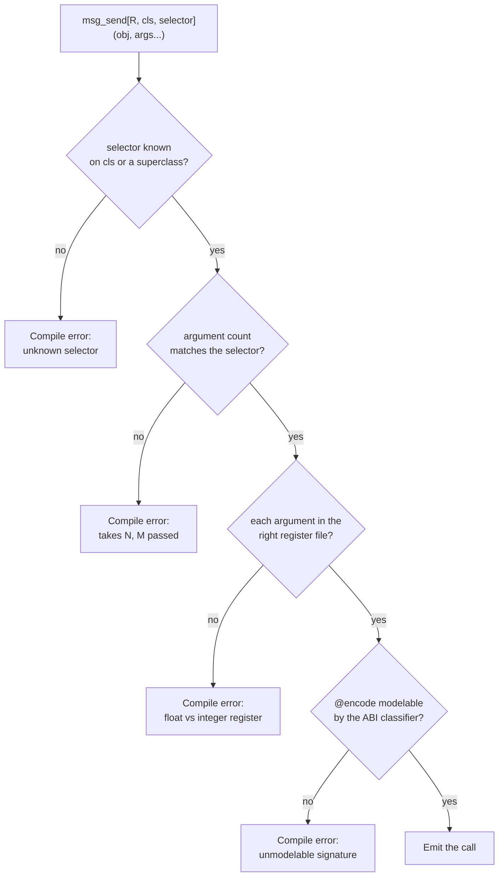

# 4. Calling Cocoa

Every Objective-C method call is one C function call:

```c
objc_msgSend(id self, SEL op, ...)
```

Binding that is not hard because of the call. It is hard because of everything
the call depends on — does this class have this selector, what does it return,
which register file does each argument travel in — and all of that lives in the
SDK, where it is traditionally transcribed by hand, once, wrongly.

`msg_send` gets those facts from the database while your program compiles.

## First: load the framework

Foundation arrives free — something in every process drags it in. **AppKit does
not**, unless the binary was linked against it. In a JIT-run program
(`mojo run`) nothing was, so `objc_getClass("NSApplication")` returns nil and
every message to it silently no-ops. The app "runs", exits without a window,
and produces no diagnostic anywhere.

That failure shape cost the fork real time. Call this first in anything
windowed:

```mojo
if not load_framework["AppKit"]():
    raise Error("could not load AppKit")
```

It is a `dlopen` with `RTLD_NOW`, idempotent and cheap after the first call.

## Looking up a class

```mojo
var cls = ObjCClass.lookup["NSString"]()
if cls.is_nil():
    print("NSString not registered — is Foundation linked?")
```

The name is a *parameter*, in square brackets, because it is resolved at
compile time. `is_nil()` is worth checking once at startup: a nil class means
the framework was never loaded, and every subsequent message will silently do
nothing.

`ObjCClass` and `ObjCObject` are distinct types even though both are pointers
at the C ABI, so you cannot pass one where the other is expected. Convert
deliberately:

```mojo
var as_obj = cls.as_object()
```

## Sending a message

```mojo
var n = msg_send[Int, "NSString", "length"](s)
```

Read the parameters left to right: the **return type**, the **class the
selector is looked up on**, and the **selector**. Then the receiver in
parentheses.

For a class method, add `is_class=True`:

```mojo
var s = msg_send[
    ObjCObject, "NSString", "stringWithUTF8String:", is_class=True
](cls.as_object(), text.as_c_string_slice())
```

Arguments follow the receiver. The colons in the selector tell you how many to
expect — `stringWithUTF8String:` takes one, `length` takes none — and the
compiler checks that you passed the right number.

## What gets checked, and when



Four checks, all before code generation. Taking them in turn:

**The selector must exist.** The lookup walks the superclass chain in the
metadata, so asking `NSMutableString` about `length` correctly finds
`NSString`'s definition. A misspelling has nowhere to hide.

**The argument count must match.** This is the check that saves you from the
worst class of bug. Call `characterAtIndex:` with no index and the callee reads
whatever happened to be in the argument register — a plausible-looking number,
a crash much later, or nothing at all. Here it is a compile error, and the fork
ships it as a must-fail test.

**Each argument must be in the right register file.** On AAPCS64 a scalar float
travels in `v0`–`v7` and everything else in the general-purpose registers.
Passing an `Int` where the ABI wants a `Float64` is not a conversion; it is
reading the wrong register. `msg_send` flags the cases it is certain about — a
scalar float against an integer class, and the reverse — and stays quiet about
structs and unknowns so there are no false positives.

**The signature must be modelable.** If the ABI classifier cannot make sense of
a method's `@encode` string it answers `"?"`, and that is a compile error rather
than a guess. This is the check that matters least often and matters most when
it fires.

## Return types

The return type parameter is what the C ABI sees, so pick the Mojo type that
matches the Objective-C one:

| Objective-C | Mojo return parameter |
|:---|:---|
| `id`, any object | `ObjCObject` |
| `NSUInteger`, `NSInteger` | `Int` |
| `BOOL` | `Bool` |
| `unichar` | `UInt16` |
| `double`, `CGFloat` | `Float64` |
| `const char *` | `OpaquePointer[MutUntrackedOrigin]` |
| `void` | assign to `_` and ignore |

A `void` method still returns something as far as Mojo is concerned, so the
idiom is:

```mojo
_ = msg_send[ObjCObject, "NSApplication", "setDelegate:"](app, delegate.ptr())
```

You will write `_ =` constantly. It is not a wart; it is the compiler refusing
to let you silently discard a value.

## Struct returns, and why arm64 makes them boring

On x86-64, a method returning a large struct must go through a completely
different entry point, `objc_msgSend_stret`, with a hidden buffer pointer in
`rdi` and the receiver shifted to `rsi`. Getting that wrong corrupts the stack.

On arm64 there is no `objc_msgSend_stret` and no `objc_msgSend_fpret`. They do
not exist in this machine's libobjc, because AAPCS64 does not need them: a small
aggregate comes back in `x0`–`x1`, a homogeneous float aggregate in `v0`–`v3`,
and anything larger through the `x8` indirect-result register. All of that
happens through the ordinary send.

So `cocoakb_msgsend_variant` always answers `"objc_msgSend"` here. The query is
kept anyway, because its *other* job survives: an unmodelable signature still
answers `"?"` and still fails the build.

A concrete case worth internalising: `-[NSValue rectValue]` returns a `CGRect`,
which is 32 bytes. On x86-64 that is a `_stret` call. Here it classifies as
`h4` — a homogeneous float aggregate of four doubles — and comes back in
`v0`–`v3` from a plain `objc_msgSend`.

## Protocol-typed receivers: `send`

`msg_send` needs a class name to look the selector up on. Sometimes you do not
have one. Every Metal object is declared as a protocol — `id<MTLDevice>`,
`id<MTLTexture>` — and so is every Cocoa delegate. The concrete class is a
private implementation detail you cannot name.

For those, use `send`, which is keyed by selector alone:

```mojo
var tex = send[ObjCObject, "newTextureWithDescriptor:"](device, desc.ptr())
```

The dispatch stub and the argument classes come from any class in the database
that implements the selector, which is consistent across implementors. You keep
the argument-count check and the register-file check. The only thing you give
up is verification that this particular receiver responds to it.

The trade is explicit, and the error when a selector is implemented by nothing
at all is clear:

```text
std.objc: no class in the metadata implements selector 'newTextureWithDesc:',
so its dispatch ABI is unknown. Check the selector spelling.
```

## Constructing

Keyword labels name a constructor, and the database decides which one — for
every class, with nothing written down per class anywhere:

```mojo
comptime NSWindow = Obj["NSWindow"]        # three lines, any class
let win = NSWindow(
    contentRect=CGRect(CGPoint(100.0, 100.0), CGSize(1080.0, 720.0)),
    styleMask=Int(15),
    backing=Int(2),
    defer=False,
)
```

Two spellings exist and the labels decide. When they name an initialiser —
first label `contentRect`, remaining labels the selector's remaining parts —
the compiler sends `alloc` then `initWithContentRect:styleMask:backing:defer:`.
When the labels are a class method's selector parts verbatim —
`NSButton(buttonWithTitle=title, target=self, action=sel["beep:"]().ptr())` —
it sends `+buttonWithTitle:target:action:` directly. Both are checked before
the program runs: labels no constructor answers are a compile error naming
the class and the labels, not a runtime `doesNotRecognizeSelector:`.

The alias line is yours to write, not the library's: every class the
database knows is the same one line away, which is the point — see
`cocoa_improvements_design.md` for the principle.

Strings cross automatically: a bare `String` argument is bridged to
`NSString` wherever the metadata says the argument is an object —
`NSButton(buttonWithTitle="Click")` needs no wrapping. Where the selector
takes a NON-object, a String is a compile error rather than corruption.
The positional spelling (`w.setTitle(...)` without labels) still crosses by
hand with `nsstring(...).ptr()`.

## Selectors

`sel[...]` registers a selector and caches it:

```mojo
var s = sel["applicationDidFinishLaunching:"]()
```

The resolved `SEL` is cached in a per-selector global slot, deduplicated by
name in the KGEN lowering, so every call site for a given selector shares one
slot. After the first send, resolving a selector is a load and a
branch-predicted-away null check — not a hash lookup and not a runtime registry
call.

You rarely call `sel` directly; `msg_send` does it for you. You need it when
talking to `class_addMethod` or `respondsToSelector:`.

## Strings

`NSString` is the type you will convert most, and there are three levels of
convenience.

The raw send, when you want to see the machinery:

```mojo
var s = msg_send[
    ObjCObject, "NSString", "stringWithUTF8String:", is_class=True
](cls.as_object(), text.as_c_string_slice())
```

`nsstring`, for handing an autoreleased string to an AppKit setter that will
retain it:

```mojo
_ = msg_send[ObjCObject, "NSWindow", "setTitle:"](win, nsstring("Life").ptr())
```

And `NSString`, a leak-safe owning wrapper, when the string outlives the
statement:

```mojo
var greeting = NSString("Hello")
print(greeting.length())
print(greeting.to_string())
```

Going the other way, `ns_to_string` is the direction that used to be missing:

```mojo
var text = ns_to_string(some_nsstring)
```

It copies out as UTF-8, so the result does not depend on the pool that owns the
`NSString`. Underneath it is still `-UTF8String`, which you can call yourself
when you want the raw pointer:

```mojo
var p = msg_send[
    OpaquePointer[MutUntrackedOrigin], "NSString", "UTF8String"
](s)
var text = String(unsafe_from_utf8_ptr=p.bitcast[c_char]())
```

## Errors: `NSError` becomes `raises`

Cocoa's error convention predates the exceptions it never adopted. A fallible
method takes a trailing `error:` out-parameter (`NSError **`) and signals
failure **through its return value** — nil for object returns, `NO` for `BOOL`
returns. The error object is only meaningful when the return value says
failure.

Checking the out-parameter instead of the return value is the classic Cocoa
bug. Ignoring it throws the diagnosis away — which is exactly what this
codebase used to do, with an `err_out()` sink that discarded every message.

Two wrappers convert the convention to Mojo's:

```mojo
# Object convention: nil means failure.
var contents = msg_send_raising[
    "NSString", "stringWithContentsOfFile:encoding:error:", is_class=True
](ns_string_cls, path.ptr(), Int(4))

# BOOL convention: NO means failure. Returns nothing.
msg_send_raising_check[
    "NSString", "writeToFile:atomically:encoding:error:"
](nsstring("round trip"), path.ptr(), Bool(True), Int(4))
```

**Do not pass the error argument.** The wrapper creates the stack slot and
appends it for you. Pass the message arguments without it.

On failure you get a Mojo `Error` whose message carries Cocoa's own diagnosis —
the `localizedDescription`, plus domain and code:

```text
stringWithContentsOfFile:encoding:error:: The file "really-not-here.txt"
couldn't be opened because there is no such file. (NSCocoaErrorDomain 260)
```

Everything `msg_send` checks is still checked. The selector must exist, the
register-file classes are verified, and the argument count includes the error
slot the wrapper supplies — all at compile time.

Two limits worth knowing. The wrappers are declared at explicit arities up to
five leading arguments, because Mojo permits nothing after an unpacked `*args`
so the slot cannot be appended to a forwarded pack. That covers the SDK's
convention comfortably, and a new arity is four lines. And if an API returns
failure without writing an error, you get a message saying so rather than a
crash.

## Enum constants

Cocoa's named constants come from BridgeSupport, resolved at compile time:

```mojo
comptime titled = cocoakb_enum_value["NSWindowStyleMaskTitled"]()
comptime utf8 = cocoakb_enum_value["NSUTF8StringEncoding"]()   # 4
```

Use these instead of typing the numbers. The one place you will be tempted to
cheat is style masks, where `15` is quicker to write than four lookups — the
example applications do exactly that, and it is the kind of shortcut that
survives right up until Apple renumbers something.

## Extern object constants

Constants like `NSForegroundColorAttributeName` are not values the metadata can
hand over at compile time. They are globals whose address the linker resolves.
`extern_object` takes a link-time reference to the data symbol and loads the
pointer out of it:

```mojo
var key = extern_object["NSForegroundColorAttributeName"]()
```

## Struct layouts

Declare the struct in Mojo, then assert that your declaration agrees with the
SDK:

```mojo
@fieldwise_init
struct CGPoint(Copyable, Movable):
    var x: Float64
    var y: Float64

@fieldwise_init
struct CGSize(Copyable, Movable):
    var width: Float64
    var height: Float64

@fieldwise_init
struct CGRect(Copyable, Movable):
    var origin: CGPoint
    var size: CGSize

comptime assert size_of[CGRect]() == cocoakb_struct_size["CGRect"]()
comptime assert align_of[CGRect]() == cocoakb_struct_align["CGRect"]()
comptime assert cocoakb_field_offset["CGRect", "size"]() == 16
```

This is the part people skip, and it is the part that pays. A wrong field
offset does not fail loudly — it reads a filename out of the middle of a
timestamp. Most sample code you will find online quotes 32-bit offsets;
`WIN32_FIND_DATAW`'s equivalent trap exists on every platform. Assert, and the
build tells you.

Once the assertions pass you can pass the struct by value straight through a
send, and the C ABI does the register allocation:

```mojo
win = msg_send[
    ObjCObject, "NSWindow", "initWithContentRect:styleMask:backing:defer:"
](
    win,
    CGRect(CGPoint(100.0, 100.0), CGSize(1080.0, 720.0)),
    Int(15),
    Int(2),
    Bool(False),
)
```
