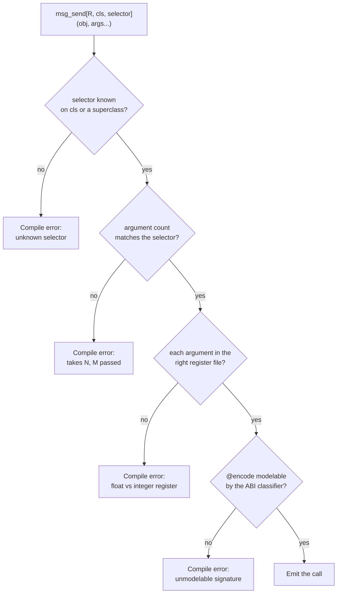

# 4. Calling Cocoa

Every Objective-C method call is one C function call:
<!-- doccrate:keep-together:start -->


```c
objc_msgSend(id self, SEL op, ...)
```

<!-- doccrate:keep-together:end -->

Binding that is not hard because of the call. It is hard because of everything
the call depends on — does this class have this selector, what does it return,
which register file does each argument travel in — and all of that lives in the
SDK, where it is traditionally transcribed by hand, once, wrongly.

`msg_send` gets those facts from the database while your program compiles.
<!-- doccrate:keep-together:start -->


## Built in layers, and every one of them still works

This is worth understanding before the syntax, because it explains why there
appear to be several ways to do the same thing. There are, and the choice
between them is not stylistic.

<!-- doccrate:keep-together:end -->

Cocoa support was added from the bottom up, and **nothing was replaced**. Each
layer is still there, still supported, and still the thing the layer above it
is made of.

| | Layer | Where it lives | What it added |
|---:|:---|:---|:---|
| 1 | `msg_send`, `send`, `ObjCClass`, `ObjCObject` | `std.objc.runtime` | One C call, bound by hand. No compiler involvement at all |
| 2 | `ObjCRef`, `autoreleasepool` | `std.objc.ownership` | Retain and release that cannot be forgotten |
| 3 | `NSString`, `CGRect`, `NSError` → `raises` | `std.objc.foundation`, `.geometry`, `.error` | The types that cross the boundary constantly |
| 4 | `ObjCClassBuilder` | `std.objc.classes` | Assembling a class at run time, method by method |
| 5 | **`cocoakb`** | the compiler | The compiler can ask the SDK questions *while compiling* |
| 6 | **`class`** | the compiler | Declaring an Objective-C class is a declaration |
| 7 | `Obj[...]`, `Cls[...]` | `std.objc.typed` | Calling one is a call, and the SDK types the result |
| 8 | keyword construction, `nsenum`, `String` bridging | the compiler | The labels name the initialiser; constants have names |

The first four are **ordinary library code**. They were written before the
compiler knew anything about Objective-C, and a program using only those still
compiles and runs today — that is what `spikes/` proves on every build.

Layer 5 is the hinge. Once the compiler can query the SDK during elaboration,
a selector can be *checked* rather than hoped for, and everything above it
follows: `class` (6) is that checking pointed at declarations, the typed call
surface (7) is it pointed at calls, and construction (8) is it pointed at
initialisers.

**Why the lower layers are not legacy.** Three reasons, all of which you will
meet:

- **The database does not know every class.** The concrete types behind
  `MTLDevice` are private, so `mandelbrot` and `life` reach them with `send` —
  layer 1 — and that is the correct answer, not a fallback.
- **Sometimes the mechanism is the point.** Chapter 5 shows `alloc` and `init`
  as two raw sends, because the +1 ownership chain is what is being taught and
  the constructor hides it.
- **A layer you cannot drop into is a wall.** Every generated-binding approach
  eventually meets a call it did not generate. Here the floor is always one
  `msg_send` away, and it is the same `msg_send` the layer above compiles to.

The design documents put the principle as *all Cocoa classes are equal, and the
surface is data*: macOS carries roughly 28,814 Objective-C classes, and a
surface that hand-covers forty of them is a privileged front tier over an
assembly back tier. There is no such tier here. `Obj["NSView"]` is a
*parameter*, so the surface is whatever the database knows — which is all of
it.

The rest of this chapter teaches layer 7 and 8, because that is what you should
write, and names the layer underneath whenever it is the better answer.
<!-- doccrate:keep-together:start -->


## First: load the framework

Foundation arrives free — something in every process drags it in. **AppKit does
not**, unless the binary was linked against it. In a JIT-run program
(`mojo run`) nothing was, so `objc_getClass("NSApplication")` returns nil and
every message to it silently no-ops. The app "runs", exits without a window,
and produces no diagnostic anywhere.

<!-- doccrate:keep-together:end -->

That failure shape cost the fork real time. Call this first in anything
windowed:
<!-- doccrate:keep-together:start -->


```mojo
if not load_framework["AppKit"]():
    raise Error("could not load AppKit")
```

<!-- doccrate:keep-together:end -->

It is a `dlopen` with `RTLD_NOW`, idempotent and cheap after the first call.
<!-- doccrate:keep-together:start -->


## Looking up a class

```mojo
var cls = ObjCClass.lookup["NSString"]()
if cls.is_nil():
    print("NSString not registered — is Foundation linked?")
```

<!-- doccrate:keep-together:end -->

The name is a *parameter*, in square brackets, because it is resolved at
compile time. `is_nil()` is worth checking once at startup: a nil class means
the framework was never loaded, and every subsequent message will silently do
nothing.

`ObjCClass` and `ObjCObject` are distinct types even though both are pointers
at the C ABI, so you cannot pass one where the other is expected. Convert
deliberately:
<!-- doccrate:keep-together:start -->


```mojo
var as_obj = cls.as_object()
```

<!-- doccrate:keep-together:end -->
<!-- doccrate:keep-together:start -->


## Sending a message

A message reads as a method call. `Obj[...]` binds an object to a class the
database knows, `Cls[...]` does the same for the class itself, and from there
the selector is just the method name:

<!-- doccrate:keep-together:end -->
<!-- doccrate:keep-together:start -->


```mojo
let app = Cls["NSApplication"]().sharedApplication()
_ = app.activateIgnoringOtherApps(True)

let content = win.contentView()
_ = content.addSubview(ObjCObject(label.id))
```

<!-- doccrate:keep-together:end -->

An underscore in a method name is a colon in the selector, the same rule
`class` uses in the other direction, so `setStringValue` answers
`setStringValue:`. The class in the brackets is what makes the check possible:
the compiler asks the database whether *that* class responds to *that*
selector, and a name neither knows is a compile error rather than a
`doesNotRecognizeSelector:` at run time.
<!-- doccrate:keep-together:start -->


### The primitive underneath

`msg_send` is layer 1: the call the typed surface compiles to, and the answer
whenever the surface cannot help — a private class the database has no name
for, or a signature you want to spell out exactly:

<!-- doccrate:keep-together:end -->
<!-- doccrate:keep-together:start -->


```mojo
var n = msg_send[Int, "NSString", "length"](s)
```

<!-- doccrate:keep-together:end -->

Read the parameters left to right: the **return type**, the **class the
selector is looked up on**, and the **selector**. Then the receiver in
parentheses. For a class method, add `is_class=True`. Arguments follow the
receiver, and the colons in the selector say how many to expect.

Prefer the method form. It is checked the same way, and it does not make you
write the selector twice — once as a string and once in your head.

It is also shorter, which is not the argument for it but is worth knowing.
Every Cocoa example in the distribution was migrated one file at a time, and
each commit is a straight before-and-after on the same program:
<!-- doccrate:keep-together:start -->


| file | added | removed | net |
|:---|---:|---:|---:|
| `window/main.mojo` | 52 | 89 | **−37** |
| `fluid/main.mojo` | 68 | 115 | **−47** |
| `chip/main.mojo` | 36 | 61 | **−25** |
| `othello/main.mojo` | 46 | 70 | **−24** |
| `mandelbrot/main.mojo` | 64 | 85 | **−21** |

<!-- doccrate:keep-together:end -->

`window` lost 28% of itself and gained the SDK's own names for four style
flags. Nothing was removed from any of these programs; what went was the
`alloc`, the selector strings, the receiver repeated in every call, and the
integers standing in for constants.
<!-- doccrate:keep-together:start -->


## What gets checked, and when



<!-- doccrate:keep-together:end -->

Four checks, all before code generation. Taking them in turn:

**The selector must exist.** The lookup walks the superclass chain in the
metadata, so asking `NSMutableString` about `length` correctly finds
`NSString`'s definition. A misspelling has nowhere to hide.

**The argument count must match.** This is the check that saves you from the
worst class of bug. Call `characterAtIndex:` with no index and the callee reads
whatever happened to be in the argument register — a plausible-looking number,
a crash much later, or nothing at all. Here it is a compile error, and the fork
ships it as a must-fail test.

**Each argument must be in the right register file.** On AAPCS64 a scalar float
travels in `v0`–`v7` and everything else in the general-purpose registers.
Passing an `Int` where the ABI wants a `Float64` is not a conversion; it is
reading the wrong register. `msg_send` flags the cases it is certain about — a
scalar float against an integer class, and the reverse — and stays quiet about
structs and unknowns so there are no false positives.

**The signature must be modelable.** If the ABI classifier cannot make sense of
a method's `@encode` string it answers `"?"`, and that is a compile error rather
than a guess. This is the check that matters least often and matters most when
it fires.
<!-- doccrate:keep-together:start -->


## Return types

The return type parameter is what the C ABI sees, so pick the Mojo type that
matches the Objective-C one:

<!-- doccrate:keep-together:end -->
<!-- doccrate:keep-together:start -->


| Objective-C | Mojo return parameter |
|:---|:---|
| `id`, any object | `ObjCObject` |
| `NSUInteger`, `NSInteger` | `Int` |
| `BOOL` | `Bool` |
| `unichar` | `UInt16` |
| `double`, `CGFloat` | `Float64` |
| `const char *` | `OpaquePointer[MutUntrackedOrigin]` |
| `void` | assign to `_` and ignore |

<!-- doccrate:keep-together:end -->

A `void` method still returns something as far as Mojo is concerned, so the
idiom is:
<!-- doccrate:keep-together:start -->


```mojo
_ = app.setDelegate(delegate.ptr())
```

<!-- doccrate:keep-together:end -->

You will write `_ =` constantly. It is not a wart; it is the compiler refusing
to let you silently discard a value.
<!-- doccrate:keep-together:start -->


## Struct returns, and why arm64 makes them boring

On x86-64, a method returning a large struct must go through a completely
different entry point, `objc_msgSend_stret`, with a hidden buffer pointer in
`rdi` and the receiver shifted to `rsi`. Getting that wrong corrupts the stack.

<!-- doccrate:keep-together:end -->

On arm64 there is no `objc_msgSend_stret` and no `objc_msgSend_fpret`. They do
not exist in this machine's libobjc, because AAPCS64 does not need them: a small
aggregate comes back in `x0`–`x1`, a homogeneous float aggregate in `v0`–`v3`,
and anything larger through the `x8` indirect-result register. All of that
happens through the ordinary send.

So `cocoakb_msgsend_variant` always answers `"objc_msgSend"` here. The query is
kept anyway, because its *other* job survives: an unmodelable signature still
answers `"?"` and still fails the build.

A concrete case worth internalising: `-[NSValue rectValue]` returns a `CGRect`,
which is 32 bytes. On x86-64 that is a `_stret` call. Here it classifies as
`h4` — a homogeneous float aggregate of four doubles — and comes back in
`v0`–`v3` from a plain `objc_msgSend`.
<!-- doccrate:keep-together:start -->


## Protocol-typed receivers: `send`

Layer 1 again, and the case that shows why it is not legacy.

<!-- doccrate:keep-together:end -->

`msg_send` needs a class name to look the selector up on. Sometimes you do not
have one. Every Metal object is declared as a protocol — `id<MTLDevice>`,
`id<MTLTexture>` — and so is every Cocoa delegate. The concrete class is a
private implementation detail you cannot name.

For those, use `send`, which is keyed by selector alone:
<!-- doccrate:keep-together:start -->


```mojo
var tex = send[ObjCObject, "newTextureWithDescriptor:"](device, desc.ptr())
```

<!-- doccrate:keep-together:end -->

The dispatch stub and the argument classes come from any class in the database
that implements the selector, which is consistent across implementors. You keep
the argument-count check and the register-file check. The only thing you give
up is verification that this particular receiver responds to it.

The trade is explicit, and the error when a selector is implemented by nothing
at all is clear:
<!-- doccrate:keep-together:start -->


```text
std.objc: no class in the metadata implements selector 'newTextureWithDesc:',
so its dispatch ABI is unknown. Check the selector spelling.
```

<!-- doccrate:keep-together:end -->
<!-- doccrate:keep-together:start -->


## Constructing

Keyword labels name a constructor, and the database decides which one — for
every class, with nothing written down per class anywhere:

<!-- doccrate:keep-together:end -->
<!-- doccrate:keep-together:start -->


```mojo
comptime NSWindow = Obj["NSWindow"]        # three lines, any class
let win = NSWindow(
    contentRect=CGRect(CGPoint(100.0, 100.0), CGSize(1080.0, 720.0)),
    styleMask=(
        nsenum["NSWindowStyleMaskTitled"]()
        | nsenum["NSWindowStyleMaskClosable"]()
        | nsenum["NSWindowStyleMaskMiniaturizable"]()
        | nsenum["NSWindowStyleMaskResizable"]()
    ),
    backing=nsenum["NSBackingStoreBuffered"](),
    defer=False,
)
```

<!-- doccrate:keep-together:end -->

Two spellings exist and the labels decide. When they name an initialiser —
first label `contentRect`, remaining labels the selector's remaining parts —
the compiler sends `alloc` then `initWithContentRect:styleMask:backing:defer:`.
When the labels are a class method's selector parts verbatim —
`NSButton(buttonWithTitle=title, target=self, action=sel["beep:"]().ptr())` —
it sends `+buttonWithTitle:target:action:` directly. Both are checked before
the program runs: labels no constructor answers are a compile error naming
the class and the labels, not a runtime `doesNotRecognizeSelector:`.

The alias line is yours to write, not the library's: every class the
database knows is the same one line away, which is the point — see
`cocoa_improvements_design.md` for the principle.

Strings cross automatically: a bare `String` argument is bridged to
`NSString` wherever the metadata says the argument is an object —
`NSButton(buttonWithTitle="Click")` needs no wrapping. Where the selector
takes a NON-object, a String is a compile error rather than corruption.
One-part selectors (`w.setTitle("Hello")`, with no label to keyword) bridge
the bare String the same way the keyword surface does, and property writes
(`w.title = "Hello"`) bridge the value they assign.
<!-- doccrate:keep-together:start -->


## Selectors

`sel[...]` registers a selector and caches it:

<!-- doccrate:keep-together:end -->
<!-- doccrate:keep-together:start -->


```mojo
var s = sel["applicationDidFinishLaunching:"]()
```

<!-- doccrate:keep-together:end -->

The resolved `SEL` is cached in a per-selector global slot, deduplicated by
name in the KGEN lowering, so every call site for a given selector shares one
slot. After the first send, resolving a selector is a load and a
branch-predicted-away null check — not a hash lookup and not a runtime registry
call.

You rarely call `sel` directly; `msg_send` does it for you. You need it when
talking to `class_addMethod` or `respondsToSelector:`.
<!-- doccrate:keep-together:start -->


## Strings

`NSString` is the type you will convert most, and there are three levels of
convenience.

<!-- doccrate:keep-together:end -->

The raw send, when you want to see the machinery:
<!-- doccrate:keep-together:start -->


```mojo
var s = msg_send[
    ObjCObject, "NSString", "stringWithUTF8String:", is_class=True
](cls.as_object(), text.as_c_string_slice())
```

<!-- doccrate:keep-together:end -->

`nsstring`, for handing an autoreleased string to an AppKit setter that will
retain it:
<!-- doccrate:keep-together:start -->


```mojo
_ = win.setTitle(nsstring("Life").ptr())
```

<!-- doccrate:keep-together:end -->

A bare `String` crosses on its own wherever the labels name a constructor and
the metadata says the argument is an object — `Obj["NSButton"](buttonWithTitle="Click")`
needs no wrapping. The positional spelling above does not bridge, so it still
takes `nsstring(...).ptr()`, and a `String` handed to a selector expecting a
non-object is a compile error rather than a corrupted call.

And `NSString`, a leak-safe owning wrapper, when the string outlives the
statement:
<!-- doccrate:keep-together:start -->


```mojo
var greeting = NSString("Hello")
print(greeting.length())
print(greeting.to_string())
```

<!-- doccrate:keep-together:end -->

Going the other way, `ns_to_string` is the direction that used to be missing:
<!-- doccrate:keep-together:start -->


```mojo
var text = ns_to_string(some_nsstring)
```

<!-- doccrate:keep-together:end -->

It copies out as UTF-8, so the result does not depend on the pool that owns the
`NSString`. Underneath it is still `-UTF8String`, which you can call yourself
when you want the raw pointer:
<!-- doccrate:keep-together:start -->


```mojo
var p = msg_send[
    OpaquePointer[MutUntrackedOrigin], "NSString", "UTF8String"
](s)
var text = String(unsafe_from_utf8_ptr=p.bitcast[c_char]())
```

<!-- doccrate:keep-together:end -->
<!-- doccrate:keep-together:start -->


## Errors: `NSError` becomes `raises`

Cocoa's error convention predates the exceptions it never adopted. A fallible
method takes a trailing `error:` out-parameter (`NSError **`) and signals
failure **through its return value** — nil for object returns, `NO` for `BOOL`
returns. The error object is only meaningful when the return value says
failure.

<!-- doccrate:keep-together:end -->

Checking the out-parameter instead of the return value is the classic Cocoa
bug. Ignoring it throws the diagnosis away — which is exactly what this
codebase used to do, with an `err_out()` sink that discarded every message.

Two wrappers convert the convention to Mojo's:
<!-- doccrate:keep-together:start -->


```mojo
# Object convention: nil means failure.
var contents = msg_send_raising[
    "NSString", "stringWithContentsOfFile:encoding:error:", is_class=True
](ns_string_cls, path.ptr(), Int(4))

# BOOL convention: NO means failure. Returns nothing.
msg_send_raising_check[
    "NSString", "writeToFile:atomically:encoding:error:"
](nsstring("round trip"), path.ptr(), Bool(True), Int(4))
```

<!-- doccrate:keep-together:end -->

**Do not pass the error argument.** The wrapper creates the stack slot and
appends it for you. Pass the message arguments without it.

On failure you get a Mojo `Error` whose message carries Cocoa's own diagnosis —
the `localizedDescription`, plus domain and code:
<!-- doccrate:keep-together:start -->


```text
stringWithContentsOfFile:encoding:error:: The file "really-not-here.txt"
couldn't be opened because there is no such file. (NSCocoaErrorDomain 260)
```

<!-- doccrate:keep-together:end -->

Everything `msg_send` checks is still checked. The selector must exist, the
register-file classes are verified, and the argument count includes the error
slot the wrapper supplies — all at compile time.

Two limits worth knowing. The wrappers are declared at explicit arities up to
five leading arguments, because Mojo permits nothing after an unpacked `*args`
so the slot cannot be appended to a forwarded pack. That covers the SDK's
convention comfortably, and a new arity is four lines. And if an API returns
failure without writing an error, you get a message saying so rather than a
crash.
<!-- doccrate:keep-together:start -->


## Enum constants

Cocoa's named constants come from BridgeSupport, resolved at compile time.
`nsenum` is the spelling to reach for, and it lives in `std.objc` beside
everything else you are already importing:

<!-- doccrate:keep-together:end -->
<!-- doccrate:keep-together:start -->


```mojo
_ = win.setBackgroundColor(...)
let mask = nsenum["NSWindowStyleMaskTitled"]() | nsenum["NSWindowStyleMaskClosable"]()
let utf8 = nsenum["NSUTF8StringEncoding"]()      # 4
```

<!-- doccrate:keep-together:end -->

A name the metadata does not know is a compile error naming it, rather than a
silently wrong mask — the same property every other call into the database
has. `nsenum` is a thin wrapper over the raw query, `cocoakb_enum_value`,
which is still there if you would rather import from `std.sys._cocoakb`
directly; the wrapper exists so that reaching for a constant does not mean
reaching into a private module.

The place this matters most is style masks, where `15` is quicker to type
than four lookups. That shortcut survives right up until Apple renumbers
something, and it makes the line unreadable in the meantime: `Int(15)` says
nothing, while four named flags say exactly which window you asked for.
<!-- doccrate:keep-together:start -->


## Extern object constants

Constants like `NSForegroundColorAttributeName` are not values the metadata can
hand over at compile time. They are globals whose address the linker resolves.
`extern_object` takes a link-time reference to the data symbol and loads the
pointer out of it:

<!-- doccrate:keep-together:end -->
<!-- doccrate:keep-together:start -->


```mojo
var key = extern_object["NSForegroundColorAttributeName"]()
```

<!-- doccrate:keep-together:end -->
<!-- doccrate:keep-together:start -->


## Struct layouts

Declare the struct in Mojo, then assert that your declaration agrees with the
SDK:

<!-- doccrate:keep-together:end -->
<!-- doccrate:keep-together:start -->


```mojo
@fieldwise_init
struct CGPoint(Copyable, Movable):
    var x: Float64
    var y: Float64

@fieldwise_init
struct CGSize(Copyable, Movable):
    var width: Float64
    var height: Float64

@fieldwise_init
struct CGRect(Copyable, Movable):
    var origin: CGPoint
    var size: CGSize

comptime assert size_of[CGRect]() == cocoakb_struct_size["CGRect"]()
comptime assert align_of[CGRect]() == cocoakb_struct_align["CGRect"]()
comptime assert cocoakb_field_offset["CGRect", "size"]() == 16
```

<!-- doccrate:keep-together:end -->

This is the part people skip, and it is the part that pays. A wrong field
offset does not fail loudly — it reads a filename out of the middle of a
timestamp. Most sample code you will find online quotes 32-bit offsets;
`WIN32_FIND_DATAW`'s equivalent trap exists on every platform. Assert, and the
build tells you.

Once the assertions pass you can pass the struct by value straight through a
call, and the C ABI does the register allocation:
<!-- doccrate:keep-together:start -->


```mojo
let win = Obj["NSWindow"](
    contentRect=CGRect(CGPoint(100.0, 100.0), CGSize(1080.0, 720.0)),
    styleMask=nsenum["NSWindowStyleMaskTitled"](),
    backing=nsenum["NSBackingStoreBuffered"](),
    defer=False,
)
```

<!-- doccrate:keep-together:end -->

A `CGRect` is four doubles, so it goes in registers; an `MTLRegion` is 48
bytes of `NSUInteger` and goes on the stack. Neither is your problem — the
size assertion above is what makes the difference safe to ignore.
