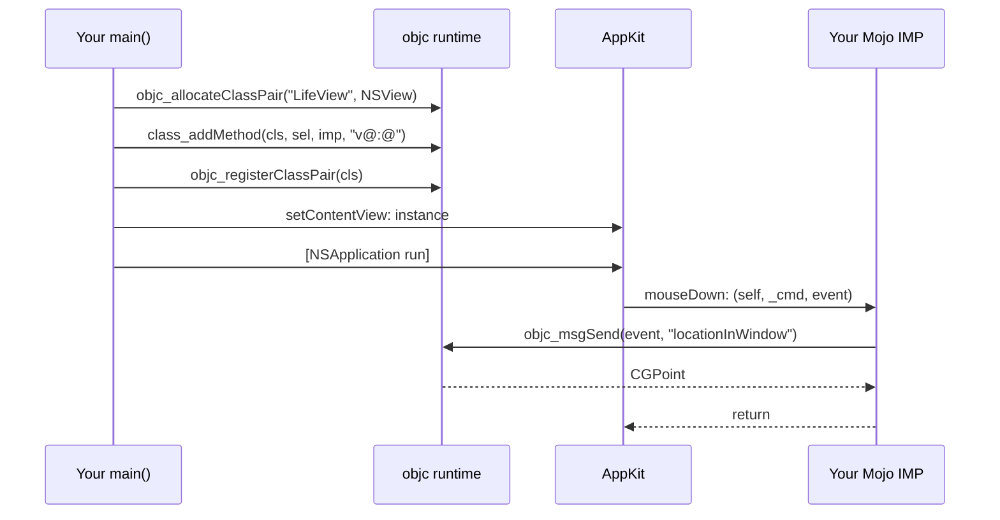

# 5. Letting Cocoa call you

Everything interactive in Cocoa works the same way: you supply an object, and
the framework sends it a selector. Target/action, delegates, notification
observers, timers — all of it.

To supply such an object from Mojo you define an Objective-C class at run time,
add methods whose implementations are Mojo `fn` functions, and register
it. `ObjCClassBuilder` wraps the three runtime calls that do this.

## The shape of a callback

An Objective-C method implementation, an `IMP`, is a C function whose first two
arguments are always the receiver and the selector:

```c
void method(id self, SEL _cmd, ...);
```

In cocoa-mojo you declare that with `fn`:

```mojo
fn button_clicked(self_: P, cmd: P, sender: P):
    clicks()[] += 1
    set_label(String("Clicked ") + String(clicks()[]) + " times")

fn should_terminate_after_last_window(self_: P, cmd: P, app: P) -> Bool:
    return True
```

`fn` *is* the contract `class_addMethod` requires — thin, non-raising, C ABI —
so the keyword now says what the function is instead of the old costume:

```mojo
def button_clicked(self_: P, cmd: P, sender: P) abi("C"):   # the old spelling
fn button_clicked(self_: P, cmd: P, sender: P):             # cocoa-mojo
```

`self_` has a trailing underscore because `self` is reserved. `cmd` you will
almost never use, but you must still declare it: the design proposes a
trampoline that injects the `_cmd` slot for you, and that is **not implemented
yet**. Write all three parameters.

Five IMP shapes are predeclared, and `add_method` overloads across them:

| Alias | Signature |
|:---|:---|
| `IMP0` | `fn(P, P, /) -> None` |
| `IMP1` | `fn(P, P, P, /) -> None` |
| `IMP0Bool` | `fn(P, P, /) -> Bool` |
| `IMP1Bool` | `fn(P, P, P, /) -> Bool` |
| `IMP2` | `fn(P, P, P, P, /) -> None` |

If your callback does not fit one of these you are past what
`ObjCClassBuilder` covers and into `class_addMethod` by hand — the pattern is
in the fork's `callback_probe.mojo` spike.

### What `fn` will not let you write

A callback that can raise is a compile error at the definition, not a crash
inside Cocoa's event loop later:

```text
'fn' declares a foreign-callable (C ABI, non-raising) function in cocoa-mojo
and may not be marked 'raises'; use 'def' for an ordinary Mojo function
```

That is the point of the keyword. The C boundary has no error channel, so a
raising callback was always a latent crash; now it does not compile.

## Building a class

```mojo
var b = ObjCClassBuilder("MyDelegate")             # subclass of NSObject
b.add_method["applicationDidFinishLaunching:"](did_launch)
var cls = b^.register()
var delegate = new_instance(cls)
```

To subclass something other than `NSObject`, name it as a parameter:

```mojo
var vb = ObjCClassBuilder["NSView"]("LifeView")
vb.add_method["mouseDown:"](on_mouse_down)
vb.add_method["keyDown:"](on_key_down)
vb.add_method["acceptsFirstResponder"](accepts_first_responder)
var LifeView = vb^.register()
```

`register()` takes `deinit self`, so it consumes the builder — hence `b^`. A
class can be registered exactly once, and the type system enforces it.

## Where the type encoding comes from

`class_addMethod` needs a *method type encoding*: a string like `"v@:@"`
telling the runtime the ABI of the implementation. Getting it wrong produces
argument corruption, not a diagnostic.

For any selector the SDK knows, you do not write it. The builder looks it up:

```mojo
b.add_method["applicationDidFinishLaunching:"](did_launch)
```

The database returns `"v24@0:8@16"` — the runtime's `@encode` carries frame
offsets — and the builder strips the digits to leave `"v@:@"`, which is what
`class_addMethod` wants.

For a selector the SDK has never heard of, because you invented it, pass the
encoding yourself:

```mojo
ab.add_method["tick:", encoding="v@:@"](on_tick)
```

Omitting `encoding=` on an unknown selector is a compile error telling you to
supply it. That is the correct behaviour: the alternative is a guess.

Reading `"v@:@"`: return `void`, then `self` (`@`), then `_cmd` (`:`), then one
object argument (`@`). The common encodings are in the
[reference](../reference/02-std-objc.md).

## A worked example: a timer target

```mojo
fn on_tick(self_: P, cmd: P, timer: P):
    step_simulation()
    redraw()

# ...

var ab = ObjCClassBuilder("LifeActions")
ab.add_method["tick:", encoding="v@:@"](on_tick)
var actions = new_instance(ab^.register())
_ = external_call["objc_retain", P](actions.ptr())
```

That last line matters. `new_instance` gives you a +1, but the value is about to
go out of scope while Cocoa still holds a bare pointer to it. Retaining it
deliberately, and never releasing, is correct for an object that must live as
long as the application. It is a leak in the strict sense and the right answer
in practice.

## The round trip



The encoding passed to `class_addMethod` in the second step is the one the SDK
database supplied; nothing in that sequence was typed by hand except the
selector names.

## Verifying it worked

`respondsToSelector:` is the cheap check, and worth doing once during bring-up:

```mojo
var responds = msg_send[Bool, "NSObject", "respondsToSelector:"](inst, s)
print("responds:", responds)
```

If that prints `False`, the usual causes are a selector spelled differently
from the one you added, or a `register()` that never ran.

## Delegates

A delegate is only an object implementing the right selectors. There is no
protocol conformance to declare at run time:

```mojo
var db = ObjCClassBuilder("LifeDelegate")
db.add_method["applicationShouldTerminateAfterLastWindowClosed:"](
    should_terminate
)
var delegate = new_instance(db^.register())
_ = msg_send[ObjCObject, "NSApplication", "setDelegate:"](app, delegate.ptr())
```

Because the selector is a real AppKit one, its encoding comes from the database
and you never type `"c@:@"` — which, incidentally, is the encoding people most
often get wrong, since `BOOL` is `c` and not `B`.

## Reading arguments out of an event

Callback arguments arrive as raw pointers. Wrap and send:

```mojo
def event_has_shift(event: P) -> Bool:
    var flags = msg_send[Int, "NSEvent", "modifierFlags"](
        ObjCObject(Int(event))
    )
    return (flags & 131072) != 0    # NSEventModifierFlagShift
```

That magic number should be `cocoakb_enum_value["NSEventModifierFlagShift"]()`.
The example applications hardcode several of these, and it is the one habit in
them worth not copying.

Reading a keystroke is the same pattern with a string on the end:

```mojo
fn on_key_down(self_: P, cmd: P, event: P):
    var chars = msg_send[
        ObjCObject, "NSEvent", "charactersIgnoringModifiers"
    ](ObjCObject(Int(event)))
    if chars.is_nil():
        return
    var p = msg_send[P, "NSString", "UTF8String"](chars)
    if Int(p) == 0:
        return
    var s = String(unsafe_from_utf8_ptr=p.unsafe_bitcast[c_char]())
    if len(s.as_bytes()) == 0:
        return
    var c = s.as_bytes()[0]
    if c == UInt8(ord(" ")):
        toggle_running()
```

Three nil checks before touching anything. AppKit will hand you a nil string
for a dead key, and a null `UTF8String` for an empty one.
