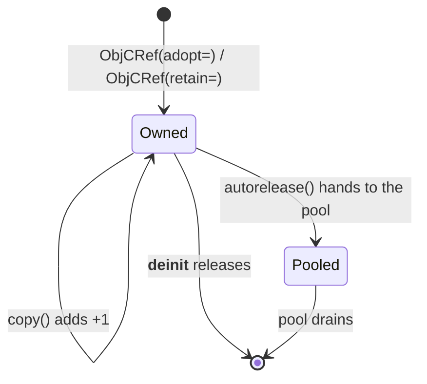

# 5. Ownership and memory

Cocoa manages memory by reference counting. An object is created at +1, every
`retain` adds one, every `release` takes one away, and at zero it is
deallocated. Autorelease pools defer a release to the end of a scope.

Mojo has value semantics and deterministic destruction. CocoaMojo binds the two
so that the Objective-C reference count follows the lifetime of the Mojo value
holding it — which means **you opt out of correct memory management, never
into it**.
<!-- doccrate:keep-together:start -->


## `ObjCRef` owns a +1

```mojo
struct ObjCRef(Movable):
    ...
```

<!-- doccrate:keep-together:end -->

An `ObjCRef` holds one owned reference. It releases when the Mojo value is
destroyed. There are two ways to make one, and picking the right one is the
whole skill.
<!-- doccrate:keep-together:start -->


```mojo
var owned = ObjCRef(adopt=obj)    # you already own a +1
var shared = ObjCRef(retain=obj)  # you only borrowed it; add a +1
```

<!-- doccrate:keep-together:end -->

The rule that decides which is the oldest rule in Cocoa, and it is mechanical:
<!-- doccrate:keep-together:start -->


| Selector you called | You own the result? | Use |
|:---|:---|:---|
| `alloc`, `new`, `copy`, `mutableCopy` | yes, +1 | `adopt=` |
| anything else | no, borrowed | `retain=` |

<!-- doccrate:keep-together:end -->

Get this backwards in the `adopt` direction and you over-release, which crashes
somewhere unrelated. Get it backwards in the `retain` direction and you leak.
<!-- doccrate:keep-together:start -->


## The classic +1 chain

```mojo
def make_array() -> ObjCRef:
    var cls = ObjCClass.lookup["NSMutableArray"]()
    var allocated = msg_send[
        ObjCObject, "NSMutableArray", "alloc", is_class=True
    ](cls.as_object())
    var inited = msg_send[ObjCObject, "NSObject", "init"](allocated)
    return ObjCRef(adopt=inited)
```

<!-- doccrate:keep-together:end -->

`alloc` returns +1, `init` consumes and returns it, and `adopt=` takes over. The
caller cannot forget to release, because there is nothing to forget: the
`ObjCRef` releases when it dies.

The raw sends are deliberate here. This is layer 1 and layer 2 of
[the stack](04-calling-cocoa.md#built-in-layers-and-every-one-of-them-still-works),
and the two halves of the chain are the lesson — the constructor at layer 8
does the `alloc` and the `init` for you and shows you neither. Ordinary code
writes `Obj["NSMutableArray"](...)`. It is worth knowing once what that line
stands for, because the ownership rule it obeys is the one every Cocoa API
answers to, including the ones the database has never heard of.

The fork's ownership test cycles a million of these and watches memory stay
flat.
<!-- doccrate:keep-together:start -->


## Copying is an explicit retain

`ObjCRef` is `Movable` but not implicitly `Copyable`. Sharing an Objective-C
object means retaining it, and the design makes that visible:

<!-- doccrate:keep-together:end -->
<!-- doccrate:keep-together:start -->


```mojo
var a = make_array()
var b = a.copy()     # a visible +1
```

<!-- doccrate:keep-together:end -->

If you want to move rather than share, use the transfer sigil:
<!-- doccrate:keep-together:start -->


```mojo
var b = a^
```

<!-- doccrate:keep-together:end -->
<!-- doccrate:keep-together:start -->


## Autorelease pools

```mojo
with autoreleasepool():
    var s = make_autoreleased()
    print("live inside the pool:", not s.is_nil())
# pool drained here
```

<!-- doccrate:keep-together:end -->

`autoreleasepool` pushes a pool on entry and pops it on exit. It guards against
a double pop internally, because popping a token twice corrupts the pool page
and produces a hard crash a long way from the cause.

Wrap `main` in one. Wrap any loop that creates many temporary Cocoa objects in
one. Do **not** wrap an AppKit callback in one — AppKit's own event dispatch
already has a pool active, and every object you read from an event is
autoreleased by the caller.
<!-- doccrate:keep-together:start -->


## Returning an object without leaking

Sometimes you want to hand an object back without making the caller own it —
exactly what an Objective-C method returning an autoreleased object does.
`autorelease()` consumes the `ObjCRef` and gives the object to the current pool:

<!-- doccrate:keep-together:end -->
<!-- doccrate:keep-together:start -->


```mojo
def make_autoreleased() -> ObjCObject:
    var owned = make_array()
    return owned^.autorelease()
```

<!-- doccrate:keep-together:end -->

Note the `^`. `autorelease` takes `deinit self`, so the reference is consumed;
without the sigil you get a compile error.

The returned `ObjCObject` is valid until the pool drains. Using it afterwards
is a use-after-free, and no amount of compile-time checking can save you from
that one — it is the one place in CocoaMojo where the discipline is yours.
<!-- doccrate:keep-together:start -->


## The lifetime, as a state machine



<!-- doccrate:keep-together:end -->
<!-- doccrate:keep-together:start -->


## `let` for the bindings you never rebind

Everything above works the same whether you bind with `var` or `let`. The ARC
behaviour lives in `ObjCRef`, not in the keyword.

<!-- doccrate:keep-together:end -->
<!-- doccrate:keep-together:start -->


```mojo
let obj = make_array()          # +1 at bind, released at scope exit
let s = nsstring("hello")
```

<!-- doccrate:keep-together:end -->

What `let` adds is that the *binding* cannot be reassigned, which is worth
having precisely because Cocoa code is full of handles you obtain once and then
only send messages to. If you never rebind it, say so; the compiler will hold
you to it.

The object stays mutable. `let win = ...` then `setTitle:` is fine — you are
mutating the object, not rebinding the name.
<!-- doccrate:keep-together:start -->


## Weak references

`ObjCRef` is the strong half of the story. `ObjCWeakRef` is the other half, and
you need it more often than you might expect, because **Cocoa's delegate
convention is weak**. A window does not own its delegate; an observer does not
own its target. Holding an `ObjCRef` where Cocoa expects weakness is a retain
cycle that leaks both sides.

<!-- doccrate:keep-together:end -->
<!-- doccrate:keep-together:start -->


```mojo
var strong = make_object()
var weak = ObjCWeakRef(strong.object())

var loaded = weak.load()        # an ObjCRef: the object at +1, or nil
if loaded.is_nil():
    print("gone")
```

<!-- doccrate:keep-together:end -->

It is a **zeroing** weak reference: while the object lives, `load()` returns
it; after the last strong reference goes, `load()` returns nil. A weak
reference to nil is legal and simply loads nil.

Three details that matter in use.

**`load()` returns an owned `ObjCRef`, not a bare handle.** It goes through
`objc_loadWeakRetained`, so the object cannot be deallocated between your
nil-check and your use. That is the entire reason to load a weak reference
rather than peek at it.

**Copying is explicit**, matching `ObjCRef`:
<!-- doccrate:keep-together:start -->


```mojo
var weak2 = weak.copy()         # an independent registration
```

<!-- doccrate:keep-together:end -->

**There is one small heap allocation per weak reference**, and the reason is
worth understanding. The Objective-C runtime tracks a weak reference *by the
address of the slot holding it*. Mojo values move. If the slot were a struct
field, any move would leave the runtime pointing into a dead stack frame — a
corruption with no diagnostic. So the slot lives on the heap, its address stays
stable for the life of the value, and moving the struct moves only a pointer.
Delegates are few; the allocation is not a problem.
<!-- doccrate:keep-together:start -->


### A rough edge

Assigning into an uninitialised `var` of a type with a `__deinit__` destroys
garbage first and crashes. This is pre-existing and not specific to weak
references, but it bites here because the natural shape —

<!-- doccrate:keep-together:end -->
<!-- doccrate:keep-together:start -->


```mojo
var weak: ObjCWeakRef          # then assign later
```

<!-- doccrate:keep-together:end -->

— is exactly that pattern. Bind it in a helper scope and return it instead.
<!-- doccrate:keep-together:start -->


## Buffers that Cocoa callbacks must reach

This one is not about Objective-C at all, and it will catch you.

<!-- doccrate:keep-together:end -->

Mojo destroys a value at its **last use**, not at the end of scope. So a `List`
whose `.unsafe_ptr()` you stash in a global is freed immediately after that
line, and every stored pointer dangles. The symptom arrives much later as a
corrupted allocator, nowhere near the cause.

When memory has to outlive Mojo's view of it, own it outside Mojo:
<!-- doccrate:keep-together:start -->


```mojo
def alloc_zeroed(count: Int, size: Int) -> Int:
    var sym = _sym["calloc"]()
    var call = Pointer(to=sym).unsafe_bitcast[
        def(Int, Int, /) thin abi("C") -> P
    ]()[]
    return Int(call(count, size))
```

<!-- doccrate:keep-together:end -->

Explicit, unowned, and correct. The alternative — hoping a `List` lives long
enough — is not a smaller amount of unsafety, only a less visible one.
<!-- doccrate:keep-together:start -->


## Where callback state lives

Cocoa callbacks are bare C function pointers. They get no closure and no
context argument you did not arrange yourself. State they need must therefore
live somewhere reachable by name.

<!-- doccrate:keep-together:end -->
<!-- doccrate:keep-together:start -->


```mojo
comptime g_running = named_global["life.running", Int]
comptime g_gen = named_global["life.gen", Int]

# read and write through the pointer
g_running()[] = 1
var generation = g_gen()[]
```

<!-- doccrate:keep-together:end -->

`named_global` gives you one zero-initialised process global per name, shared
across every call site, because KGEN deduplicates the global by name. It is the
plainest possible answer to a real constraint, and it is better than the
alternative of smuggling a pointer through `setRepresentedObject:` and casting
it back.
<!-- doccrate:keep-together:start -->


## A short checklist

Use `adopt=` after `alloc`, `new`, `copy`, `mutableCopy`; `retain=` otherwise.
Use `^` when consuming an `ObjCRef`. Wrap `main` and long loops in
`autoreleasepool`, but not AppKit callbacks. Allocate anything a callback must
reach outside Mojo's ownership, and reach it through `named_global`.

<!-- doccrate:keep-together:end -->
