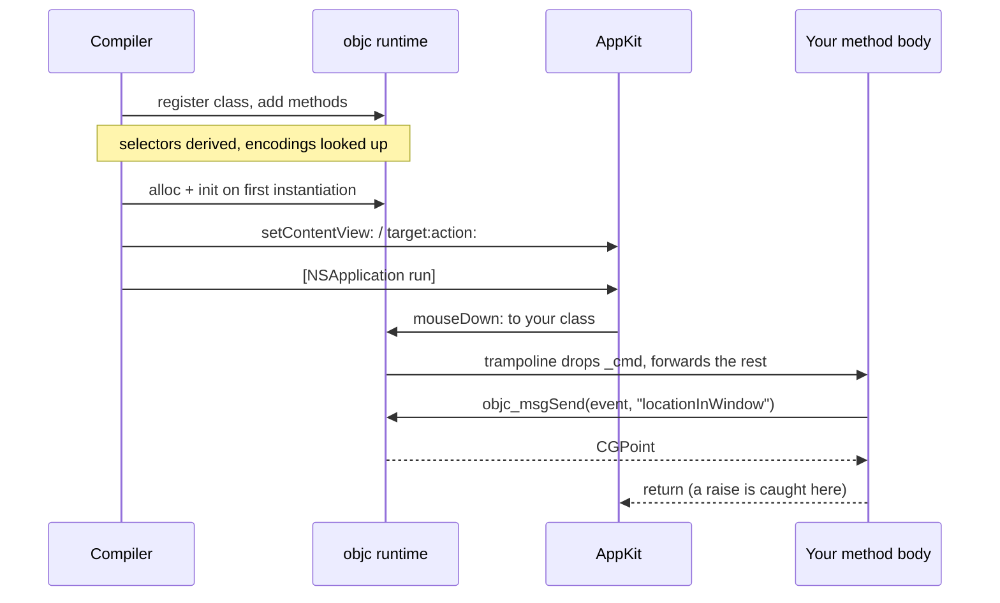

# 6. Letting Cocoa call you

Everything interactive in Cocoa works the same way: you supply an object, and
the framework sends it a selector. Target/action, delegates, notification
observers, timers — all of it.

To supply such an object you need an Objective-C class. In cocoa-mojo you
declare one with `class`, and the compiler does the rest.
<!-- doccrate:keep-together:start -->


## `class` declares an Objective-C class

The whole of it is a declaration:

<!-- doccrate:keep-together:end -->
<!-- doccrate:keep-together:start -->


```mojo
class ExampleActions:
    def buttonClicked_(self, sender: ObjCObject):
        clicks()[] += 1
```

<!-- doccrate:keep-together:end -->

That is a real Objective-C class. The compiler registers it with the runtime,
derives the selector, works out the type encoding, builds the trampoline, and
gives you an instance:
<!-- doccrate:keep-together:start -->


```mojo
let actions = ObjCObject(ExampleActions().__objc_id)
```

<!-- doccrate:keep-together:end -->

No `ObjCClassBuilder`, no encoding string, no `IMP`, and no `cmd: P` slot.
<!-- doccrate:keep-together:start -->


### Method names become selectors

**A trailing underscore is a colon.**

<!-- doccrate:keep-together:end -->
<!-- doccrate:keep-together:start -->


| Mojo method | Selector |
|:---|:---|
| `acceptsFirstResponder` | `acceptsFirstResponder` |
| `buttonClicked_` | `buttonClicked:` |
| `mouseDown_` | `mouseDown:` |
| `applicationShouldTerminateAfterLastWindowClosed_` | `applicationShouldTerminateAfterLastWindowClosed:` |

<!-- doccrate:keep-together:end -->

The number of underscores must equal the number of arguments after `self`, and
a mismatch is a compile error naming both counts.

That diagnostic earns its place in the *other* direction. Writing `drawRect`
where you meant `drawRect_` derives a nullary selector, registers perfectly,
and then never receives a single draw — the framework keeps sending
`drawRect:` to a class that answers `drawRect`. Nothing crashes, nothing
appears. It is now a compile error.

**A leading underscore means the method is Mojo's own** and never reaches the
runtime. Without that rule every snake_case helper in a class would derive a
nonsense selector like `my:helper` and then be rejected for a colon it never
wanted — which would make a Cocoa class a hostile place to put a private
method. `_tab_width` is simply private, exactly as Mojo and Python already read
a leading underscore, and the dunders come along for free.

To spell a selector that the underscore rule cannot produce, say so:
<!-- doccrate:keep-together:start -->


```mojo
    @objc("insertText:replacementRange:")
    def insert_text(self, text: ObjCObject, range: NSRange): ...
```

<!-- doccrate:keep-together:end -->
<!-- doccrate:keep-together:start -->


### Superclass and protocols

```mojo
class LifeView(NSView):          # subclass an SDK class
class LifeDelegate:              # no base means NSObject
class Editor(NSView, NSTextInputClient):   # first base is the superclass,
                                            # the rest are protocols
```

<!-- doccrate:keep-together:end -->

Protocols are adopted through `class_addProtocol` — real conformance, not
merely having the methods. AppKit does ask: `conformsToProtocol:` reportedly
cost a day on `NSTextInputClient` before that was understood.

An unknown superclass is caught at compile time, so a typo in a class name
fails the build rather than producing a class that inherits from nothing.
<!-- doccrate:keep-together:start -->


### Encodings are looked up, then derived

If the selector already exists on the superclass chain, the encoding comes
from the SDK database, and a signature that disagrees with it is a compile
error **quoting the database's encoding**. If the SDK has never heard of the
selector — which is the normal case for target/action and delegate methods you
invent — the encoding is derived from your Mojo signature.

<!-- doccrate:keep-together:end -->

Either way you do not write `"v@:@"` again.
<!-- doccrate:keep-together:start -->


## Methods may raise

This is the part that changes how the code reads:

<!-- doccrate:keep-together:end -->
<!-- doccrate:keep-together:start -->


```mojo
class ExampleActions:
    def buttonClicked_(self, sender: ObjCObject):
        with autoreleasepool():
            _ = Obj["NSTextField"](label_addr()[]).setStringValue(...)
```

<!-- doccrate:keep-together:end -->

No `try`, and no `fn`. A `class` method body is a `def` and **may raise**; the
synthesized trampoline catches at the Objective-C boundary, because unwinding
into `objc_msgSend` is undefined behaviour. On a raise the boundary reports —
`NSLog` and continue, by default — and returns a zero value.

You can still write `fn` methods where you want the strict contract and no
catch machinery. But the reason the examples read cleanly is that the common
case no longer needs one.
<!-- doccrate:keep-together:start -->


## Fields

A class holds per-instance state:

<!-- doccrate:keep-together:end -->
<!-- doccrate:keep-together:start -->


```mojo
class Tally(NSObject):
    var hits: Int
    var high_water: Int

    # Mutating methods declare `mut self`, exactly as on a struct.
    def isProxy(mut self) -> Bool:
        self.hits += 1
        if self.hits > self.high_water:
            self.high_water = self.hits
        return True

    def selectedRange(self) -> NSRange:
        return NSRange(self.hits, self.high_water)
```

<!-- doccrate:keep-together:end -->

Three instances of `Tally` count separately, and the counting happens when the
Objective-C runtime dispatches to the method — not when Mojo calls it. That
distinction matters more than it sounds, and the next section is about it.

Where the state lives: the object gets **one ivar of `sizeof(Self)`**, 8-aligned,
at an offset the runtime settles at registration. There is no allocation beyond
the object itself. Every trampoline moves the incoming `id` along by that
offset, so `self` inside a method *is* the box.

`mut self` is required to write a field, exactly as on a struct.
<!-- doccrate:keep-together:start -->


### The rules, v1

Fields have just landed, and the contract is narrower than it will be. Stated
so nobody finds out the hard way:

<!-- doccrate:keep-together:end -->

**Fields must be default-constructible, and zero must be a valid value.** The
runtime zero-fills the object; `__init__` default-constructs every field so
both views agree. This is the `named_global` rule you already know, now applied
per instance.

**Field initializers are not honoured.** `var x: Int = 3` does not parse, and
even where it did the box would hold the default rather than the 3.

**Destruction does not run.** `dealloc` is not hooked yet, so a field's
`deinit` never fires. A field owning heap memory lives as long as the object
and leaks when the object dies — the same lifetime story as the
`named_global`s fields replace. Fine for app-lifetime objects, wrong for
transient ones.
<!-- doccrate:keep-together:start -->


### The constructor-copy trap

This is the one to internalise. `Tally()` hands back a class *value*, which is
a copy of the box's ground state plus the `id`. Reading `__objc_id` from it is
correct. **Mutating a field through it writes the copy, not the object.**

<!-- doccrate:keep-together:end -->

Watch it happen:
<!-- doccrate:keep-together:start -->


```mojo
var p = Probe()
var o = ObjCObject(p.__objc_id)

p.isProxy()                 # mutate through the Mojo value
# the Mojo value says:   True
# the object says:       False

_ = msg_send[Bool, "NSObject", "isProxy"](o)    # mutate through the runtime
# the object says:       True
```

<!-- doccrate:keep-together:end -->

So the state a Cocoa callback sees is the state the *runtime* wrote. Since
callbacks are the whole point of a class, this is usually invisible: AppKit
sends messages, the trampoline resolves the box from the real `id`, and
everything agrees. It bites the moment you try to seed a field from Mojo after
construction and wonder why the view never sees it.

Until the handle type arrives, treat the value `Tally()` returns as a way to
get an `id` and nothing more.
<!-- doccrate:keep-together:start -->


### What fields replace

State that used to live in process globals:

<!-- doccrate:keep-together:end -->
<!-- doccrate:keep-together:start -->


```mojo
comptime clicks = named_global["example.clicks", Int]
```

<!-- doccrate:keep-together:end -->

`examples/life/main.mojo` still carries fourteen of these, and most are now
convertible. Weigh it against the two limits above: a counter or a flag is a
clean win, while anything owning memory keeps the leak it already had and
gains nothing until `dealloc` runs.
<!-- doccrate:keep-together:start -->


### Still not in this version

Nested classes, class-level `comptime` parameters, and Mojo-trait
conformances. A class is not a struct.

<!-- doccrate:keep-together:end -->
<!-- doccrate:keep-together:start -->


## Instances

`ClassName()` registers the class if it is not registered yet, then allocs and
inits. Registration is idempotent — a second instance costs one
`objc_getClass`.

<!-- doccrate:keep-together:end -->
<!-- doccrate:keep-together:start -->


```mojo
var probe = Probe()
var obj = ObjCObject(probe.__objc_id)
```

<!-- doccrate:keep-together:end -->

`__objc_id` is the raw `id`. A class reference is register-passable, retains on
copy and releases on destruction — which is what an Objective-C reference *is*,
and the same shape `ObjCRef` already had.
<!-- doccrate:keep-together:start -->


## Sending to your own selectors

One asymmetry to know. `msg_send` checks the selector against the SDK, so it
cannot send a selector you invented:

<!-- doccrate:keep-together:end -->
<!-- doccrate:keep-together:start -->


```mojo
# buttonClicked: is ours — msg_send will not have it
var responds = msg_send[Bool, "NSObject", "respondsToSelector:"](
    obj, sel_dynamic("buttonClicked:")
)
```

<!-- doccrate:keep-together:end -->

`sel_dynamic` registers a selector by name at run time, and
`respondsToSelector:` is what a button asks before it sends anything anyway.
<!-- doccrate:keep-together:start -->


## The older way: `ObjCClassBuilder`

Everything above replaces a mechanism that still exists and still works. You
will meet it in `spikes/`, which predate `class`:

<!-- doccrate:keep-together:end -->
<!-- doccrate:keep-together:start -->


```mojo
var vb = ObjCClassBuilder["NSView"]("LifeView")
vb.add_method["mouseDown:"](on_mouse_down)
vb.add_method["tick:", encoding="v@:@"](on_tick)
var LifeView = vb^.register()
```

<!-- doccrate:keep-together:end -->

with callbacks written as `fn`s carrying the `self_: P, cmd: P` prefix by hand.
It is the layer `class` is built on, and it remains the escape hatch for a
method shape the class syntax does not cover. For new code, declare a class.
<!-- doccrate:keep-together:start -->


## The round trip



<!-- doccrate:keep-together:end -->

The trampoline is the piece you never see. It carries the `(self, _cmd, args…)`
shape the runtime requires, drops the `_cmd` slot, forwards the rest to your
method, and catches anything the body raises so it cannot unwind into
`objc_msgSend`.
<!-- doccrate:keep-together:start -->


## Verifying it worked

`respondsToSelector:` is the cheap check, and worth doing once during bring-up:

<!-- doccrate:keep-together:end -->
<!-- doccrate:keep-together:start -->


```mojo
var responds = msg_send[Bool, "NSObject", "respondsToSelector:"](inst, s)
print("responds:", responds)
```

<!-- doccrate:keep-together:end -->

If that prints `False`, the usual causes are a selector spelled differently
from the one you added, or a `register()` that never ran.
<!-- doccrate:keep-together:start -->


## Delegates

A delegate is an object implementing the right selectors — so it is a class
with those methods on it:

<!-- doccrate:keep-together:end -->
<!-- doccrate:keep-together:start -->


```mojo
class LifeDelegate:
    def applicationShouldTerminateAfterLastWindowClosed_(
        self, app: ObjCObject
    ) -> Bool:
        return True

# ...
let delegate = ObjCObject(LifeDelegate().__objc_id)
_ = app.setDelegate(delegate)
```

<!-- doccrate:keep-together:end -->

Because the selector is a real AppKit one, its encoding comes from the database
and you never type `"c@:@"` — which, incidentally, is the encoding people most
often get wrong, since `BOOL` is `c` and not `B`. Get the signature wrong and
you get a compile error quoting what the SDK expects.

Where a delegate must *declare* conformance rather than merely have the
methods, name the protocol as a base:
<!-- doccrate:keep-together:start -->


```mojo
class Editor(NSView, NSTextInputClient):
    ...
```

<!-- doccrate:keep-together:end -->
<!-- doccrate:keep-together:start -->


## Reading arguments out of an event

Callback arguments arrive as raw pointers. Wrap and send:

<!-- doccrate:keep-together:end -->
<!-- doccrate:keep-together:start -->


```mojo
def event_has_shift(event: ObjCObject) -> Bool:
    let flags = Obj["NSEvent"](event.addr()).modifierFlags()
    return (flags & nsenum["NSEventModifierFlagShift"]()) != 0
```

<!-- doccrate:keep-together:end -->

Arguments arrive typed now — a `class` method declares `event: ObjCObject`
rather than a raw `P` — so most of the wrapping the old callbacks needed is
gone.

The flag is named rather than remembered. An earlier version of this chapter
wrote `131072` with the name in a comment beside it and told you the examples
did the same; they do not any more, and neither should you. A comment saying
which constant a number is cannot be checked, and `nsenum` can.

Reading a keystroke is the same pattern with a string on the end:
<!-- doccrate:keep-together:start -->


```mojo
class LifeView(NSView):
  def keyDown_(self, event: ObjCObject):
    let chars = Obj["NSEvent"](event.addr()).charactersIgnoringModifiers()
    if chars.is_nil():
        return
    let p = Obj["NSString"](chars.addr()).UTF8String()
    if Int(p) == 0:
        return
    var s = String(unsafe_from_utf8_ptr=p.unsafe_bitcast[c_char]())
    if len(s.as_bytes()) == 0:
        return
    var c = s.as_bytes()[0]
    if c == UInt8(ord(" ")):
        toggle_running()
```

<!-- doccrate:keep-together:end -->

Three nil checks before touching anything. AppKit will hand you a nil string
for a dead key, and a null `UTF8String` for an empty one.
<!-- doccrate:keep-together:start -->


## When the caller is not Objective-C

Everything above is Cocoa calling you through the Objective-C runtime: you
declare a `class`, the runtime finds your selector, and dispatch does the
work. Some of the most interesting parts of macOS do not work that way. They
take a **C function pointer** and call it directly — no object, no selector,
no runtime in between.

<!-- doccrate:keep-together:end -->

This is where the fork's `fn` earns its revived meaning. `fn` is thin,
non-raising, and C ABI: that is exactly an Objective-C `IMP`, and it is
exactly a C callback too. So a Mojo `fn` *is* a C function pointer, and can
be handed to a C API with nothing in between — no shim, no trampoline, no C
file in the build.

CoreAudio's render callback is the sharpest case, because it also has a
deadline. Declare the signature as a type, and the function is that type:
<!-- doccrate:keep-together:start -->


```mojo
comptime P = OpaquePointer[MutUntrackedOrigin]
comptime AURenderCallback = fn(P, P, P, UInt32, UInt32, P, /) -> Int32

fn render(
    ref_con: P, action_flags: P, timestamp: P,
    bus: UInt32, frames: UInt32, io_data: P,
) -> Int32:
    ...
    return 0
```

<!-- doccrate:keep-together:end -->

Installing it means writing the function's address into the struct CoreAudio
expects. Read it out of a slot holding the value rather than bitcasting the
function itself — the slot's eight bytes are the pointer:
<!-- doccrate:keep-together:start -->


```mojo
var cbfn: AURenderCallback = render
let fn_addr = Pointer(to=cbfn).unsafe_bitcast[Int]()[]
var cbs = external_call["calloc", P](Int(2), Int(8))
cbs.unsafe_bitcast[Int]()[unsafe_offset=0] = fn_addr
cbs.unsafe_bitcast[Int]()[unsafe_offset=1] = Int(state)   # the refCon
```

<!-- doccrate:keep-together:end -->
<!-- doccrate:keep-together:start -->


### What a real-time thread forbids

`render` runs on a thread CoreAudio owns, every few milliseconds, with a hard
deadline: 512 frames at 48 kHz is 10.7 ms, and a buffer not filled in time is
a gap you can hear. Three rules follow, and none of them is advice:

<!-- doccrate:keep-together:end -->

- **No allocation.** Everything the callback touches is allocated before the
  unit starts.
- **No locks.** The drawing thread reads the same state to paint meters; a
  torn read costs one wrong pixel for one frame, where a held lock costs a
  click in the speaker. Take the torn read.
- **No raising.** An `fn` cannot raise, which is the language enforcing the
  rule rather than the programmer remembering it.

The callback carries no captured state — a C function pointer has nowhere to
put any. That is what `refCon` is for: the last field of the struct above is
handed back as the first argument on every call, so the whole synthesiser
hangs off one pointer and nothing needs a global.
<!-- doccrate:keep-together:start -->


### An unbounded loop is a hang, not a slow path

Ordinary code survives a loop that runs too long; a real-time thread does
not. A range-reduction written as *subtract 2π until in range* is fine for a
filter coefficient and ruinous for a vibrato whose argument grows with a
frame counter: the loop gets one iteration longer every fifty frames, and one
day the audio simply stops. Reduce in one step instead, and clamp anything
derived from data:

<!-- doccrate:keep-together:end -->
<!-- doccrate:keep-together:start -->


```mojo
let turns = x * 0.15915494309189535     # 1 / 2*pi
var t = x - 6.283185307179586 * Float64(Int(turns))
```

<!-- doccrate:keep-together:end -->

The same reasoning applies to a note number arriving from a file. Clamping it
is not defensive decoration: unclamped, an octave normalisation is a loop
over the octave count, and a nonsense value is not a wrong pitch but a
stopped speaker.

`examples/chip/` is the whole of it — a three-voice synthesiser whose
oscillators are phase accumulators, with the render callback above — and
`examples/abcplayer/` reads ABC notation and schedules it to the sample
through the same path.
