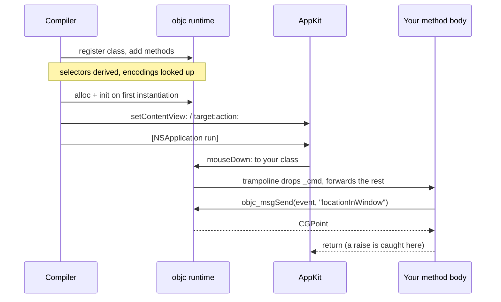

# 6. Letting Cocoa call you

Everything interactive in Cocoa works the same way: you supply an object, and
the framework sends it a selector. Target/action, delegates, notification
observers, timers — all of it.

To supply such an object you need an Objective-C class. In cocoa-mojo you
declare one with `class`, and the compiler does the rest.

## `class` declares an Objective-C class

The whole of it is a declaration:

```mojo
class ExampleActions:
    def buttonClicked_(self, sender: ObjCObject):
        clicks()[] += 1
```

That is a real Objective-C class. The compiler registers it with the runtime,
derives the selector, works out the type encoding, builds the trampoline, and
gives you an instance:

```mojo
let actions = ObjCObject(ExampleActions().__objc_id)
```

No `ObjCClassBuilder`, no encoding string, no `IMP`, and no `cmd: P` slot.

### Method names become selectors

**A trailing underscore is a colon.**

| Mojo method | Selector |
|:---|:---|
| `acceptsFirstResponder` | `acceptsFirstResponder` |
| `buttonClicked_` | `buttonClicked:` |
| `mouseDown_` | `mouseDown:` |
| `applicationShouldTerminateAfterLastWindowClosed_` | `applicationShouldTerminateAfterLastWindowClosed:` |

The number of underscores must equal the number of arguments after `self`, and
a mismatch is a compile error naming both counts.

That diagnostic earns its place in the *other* direction. Writing `drawRect`
where you meant `drawRect_` derives a nullary selector, registers perfectly,
and then never receives a single draw — the framework keeps sending
`drawRect:` to a class that answers `drawRect`. Nothing crashes, nothing
appears. It is now a compile error.

**A leading underscore means the method is Mojo's own** and never reaches the
runtime. Without that rule every snake_case helper in a class would derive a
nonsense selector like `my:helper` and then be rejected for a colon it never
wanted — which would make a Cocoa class a hostile place to put a private
method. `_tab_width` is simply private, exactly as Mojo and Python already read
a leading underscore, and the dunders come along for free.

To spell a selector that the underscore rule cannot produce, say so:

```mojo
    @objc("insertText:replacementRange:")
    def insert_text(self, text: ObjCObject, range: NSRange): ...
```

### Superclass and protocols

```mojo
class LifeView(NSView):          # subclass an SDK class
class LifeDelegate:              # no base means NSObject
class Editor(NSView, NSTextInputClient):   # first base is the superclass,
                                            # the rest are protocols
```

Protocols are adopted through `class_addProtocol` — real conformance, not
merely having the methods. AppKit does ask: `conformsToProtocol:` reportedly
cost a day on `NSTextInputClient` before that was understood.

An unknown superclass is caught at compile time, so a typo in a class name
fails the build rather than producing a class that inherits from nothing.

### Encodings are looked up, then derived

If the selector already exists on the superclass chain, the encoding comes
from the SDK database, and a signature that disagrees with it is a compile
error **quoting the database's encoding**. If the SDK has never heard of the
selector — which is the normal case for target/action and delegate methods you
invent — the encoding is derived from your Mojo signature.

Either way you do not write `"v@:@"` again.

## Methods may raise

This is the part that changes how the code reads:

```mojo
class ExampleActions:
    def buttonClicked_(self, sender: ObjCObject):
        with autoreleasepool():
            _ = msg_send[ObjCObject, "NSTextField", "setStringValue:"](...)
```

No `try`, and no `fn`. A `class` method body is a `def` and **may raise**; the
synthesized trampoline catches at the Objective-C boundary, because unwinding
into `objc_msgSend` is undefined behaviour. On a raise the boundary reports —
`NSLog` and continue, by default — and returns a zero value.

You can still write `fn` methods where you want the strict contract and no
catch machinery. But the reason the examples read cleanly is that the common
case no longer needs one.

## Fields

A class holds per-instance state:

```mojo
class Tally(NSObject):
    var hits: Int
    var high_water: Int

    # Mutating methods declare `mut self`, exactly as on a struct.
    def isProxy(mut self) -> Bool:
        self.hits += 1
        if self.hits > self.high_water:
            self.high_water = self.hits
        return True

    def selectedRange(self) -> NSRange:
        return NSRange(self.hits, self.high_water)
```

Three instances of `Tally` count separately, and the counting happens when the
Objective-C runtime dispatches to the method — not when Mojo calls it. That
distinction matters more than it sounds, and the next section is about it.

Where the state lives: the object gets **one ivar of `sizeof(Self)`**, 8-aligned,
at an offset the runtime settles at registration. There is no allocation beyond
the object itself. Every trampoline moves the incoming `id` along by that
offset, so `self` inside a method *is* the box.

`mut self` is required to write a field, exactly as on a struct.

### The rules, v1

Fields have just landed, and the contract is narrower than it will be. Stated
so nobody finds out the hard way:

**Fields must be default-constructible, and zero must be a valid value.** The
runtime zero-fills the object; `__init__` default-constructs every field so
both views agree. This is the `named_global` rule you already know, now applied
per instance.

**Field initializers are not honoured.** `var x: Int = 3` does not parse, and
even where it did the box would hold the default rather than the 3.

**Destruction does not run.** `dealloc` is not hooked yet, so a field's
`deinit` never fires. A field owning heap memory lives as long as the object
and leaks when the object dies — the same lifetime story as the
`named_global`s fields replace. Fine for app-lifetime objects, wrong for
transient ones.

### The constructor-copy trap

This is the one to internalise. `Tally()` hands back a class *value*, which is
a copy of the box's ground state plus the `id`. Reading `__objc_id` from it is
correct. **Mutating a field through it writes the copy, not the object.**

Watch it happen:

```mojo
var p = Probe()
var o = ObjCObject(p.__objc_id)

p.isProxy()                 # mutate through the Mojo value
# the Mojo value says:   True
# the object says:       False

_ = msg_send[Bool, "NSObject", "isProxy"](o)    # mutate through the runtime
# the object says:       True
```

So the state a Cocoa callback sees is the state the *runtime* wrote. Since
callbacks are the whole point of a class, this is usually invisible: AppKit
sends messages, the trampoline resolves the box from the real `id`, and
everything agrees. It bites the moment you try to seed a field from Mojo after
construction and wonder why the view never sees it.

Until the handle type arrives, treat the value `Tally()` returns as a way to
get an `id` and nothing more.

### What fields replace

State that used to live in process globals:

```mojo
comptime clicks = named_global["example.clicks", Int]
```

`examples/life/main.mojo` still carries fourteen of these, and most are now
convertible. Weigh it against the two limits above: a counter or a flag is a
clean win, while anything owning memory keeps the leak it already had and
gains nothing until `dealloc` runs.

### Still not in this version

Nested classes, class-level `comptime` parameters, and Mojo-trait
conformances. A class is not a struct.

## Instances

`ClassName()` registers the class if it is not registered yet, then allocs and
inits. Registration is idempotent — a second instance costs one
`objc_getClass`.

```mojo
var probe = Probe()
var obj = ObjCObject(probe.__objc_id)
```

`__objc_id` is the raw `id`. A class reference is register-passable, retains on
copy and releases on destruction — which is what an Objective-C reference *is*,
and the same shape `ObjCRef` already had.

## Sending to your own selectors

One asymmetry to know. `msg_send` checks the selector against the SDK, so it
cannot send a selector you invented:

```mojo
# buttonClicked: is ours — msg_send will not have it
var responds = msg_send[Bool, "NSObject", "respondsToSelector:"](
    obj, sel_dynamic("buttonClicked:")
)
```

`sel_dynamic` registers a selector by name at run time, and
`respondsToSelector:` is what a button asks before it sends anything anyway.

## The older way: `ObjCClassBuilder`

Everything above replaces a mechanism that still exists and still works. You
will meet it in `spikes/`, which predate `class`:

```mojo
var vb = ObjCClassBuilder["NSView"]("LifeView")
vb.add_method["mouseDown:"](on_mouse_down)
vb.add_method["tick:", encoding="v@:@"](on_tick)
var LifeView = vb^.register()
```

with callbacks written as `fn`s carrying the `self_: P, cmd: P` prefix by hand.
It is the layer `class` is built on, and it remains the escape hatch for a
method shape the class syntax does not cover. For new code, declare a class.

## The round trip



The trampoline is the piece you never see. It carries the `(self, _cmd, args…)`
shape the runtime requires, drops the `_cmd` slot, forwards the rest to your
method, and catches anything the body raises so it cannot unwind into
`objc_msgSend`.

## Verifying it worked

`respondsToSelector:` is the cheap check, and worth doing once during bring-up:

```mojo
var responds = msg_send[Bool, "NSObject", "respondsToSelector:"](inst, s)
print("responds:", responds)
```

If that prints `False`, the usual causes are a selector spelled differently
from the one you added, or a `register()` that never ran.

## Delegates

A delegate is an object implementing the right selectors — so it is a class
with those methods on it:

```mojo
class LifeDelegate:
    def applicationShouldTerminateAfterLastWindowClosed_(
        self, app: ObjCObject
    ) -> Bool:
        return True

# ...
let delegate = ObjCObject(LifeDelegate().__objc_id)
_ = msg_send[ObjCObject, "NSApplication", "setDelegate:"](app, delegate.ptr())
```

Because the selector is a real AppKit one, its encoding comes from the database
and you never type `"c@:@"` — which, incidentally, is the encoding people most
often get wrong, since `BOOL` is `c` and not `B`. Get the signature wrong and
you get a compile error quoting what the SDK expects.

Where a delegate must *declare* conformance rather than merely have the
methods, name the protocol as a base:

```mojo
class Editor(NSView, NSTextInputClient):
    ...
```

## Reading arguments out of an event

Callback arguments arrive as raw pointers. Wrap and send:

```mojo
def event_has_shift(event: ObjCObject) -> Bool:
    var flags = msg_send[Int, "NSEvent", "modifierFlags"](event)
    return (flags & 131072) != 0    # NSEventModifierFlagShift
```

Arguments arrive typed now — a `class` method declares `event: ObjCObject`
rather than a raw `P` — so most of the wrapping the old callbacks needed is
gone.

That magic number should be `cocoakb_enum_value["NSEventModifierFlagShift"]()`.
The example applications hardcode several of these, and it is the one habit in
them worth not copying.

Reading a keystroke is the same pattern with a string on the end:

```mojo
class LifeView(NSView):
  def keyDown_(self, event: ObjCObject):
    var chars = msg_send[
        ObjCObject, "NSEvent", "charactersIgnoringModifiers"
    ](ObjCObject(Int(event)))
    if chars.is_nil():
        return
    var p = msg_send[P, "NSString", "UTF8String"](chars)
    if Int(p) == 0:
        return
    var s = String(unsafe_from_utf8_ptr=p.unsafe_bitcast[c_char]())
    if len(s.as_bytes()) == 0:
        return
    var c = s.as_bytes()[0]
    if c == UInt8(ord(" ")):
        toggle_running()
```

Three nil checks before touching anything. AppKit will hand you a nil string
for a dead key, and a null `UTF8String` for an empty one.
