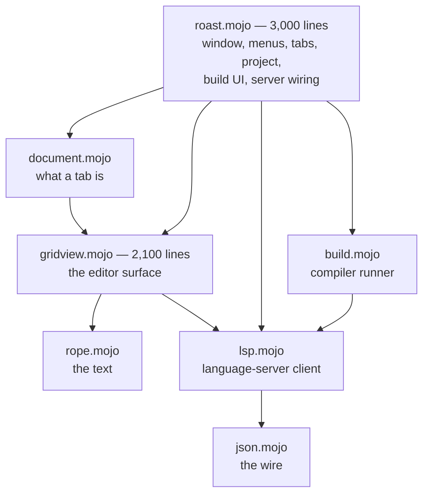

# 10. Roast: the IDE, read as a program

Chapter 9 read a demo. This chapter reads a tool: **Roast**, the fork's own
IDE, written in cocoa-mojo, and the largest program in the dialect — about
9,000 lines across seven modules and their test suites. It has tabs, a
project sidebar, a build-and-run console, completions and diagnostics from a
language server, find, undo, zoom, and an Examples menu. It regularly edits
its own source.

It earns a chapter for a different reason than Life did. Life shows how small
a Cocoa program can be. Roast shows the shapes that appear when a program
gets big *without* stopping being cocoa-mojo: where state lives when
callbacks have no closures, what the revived `let` does to code that mutates
containers, how a process is driven without blocking the main thread, and how
an application proves itself in CI with nobody at the keyboard.

Everything below is quoted from the source at commit `3275387`. The program
moves; the shapes are the point.



Each module below gets a section, and each section is really about one piece
of the language.

## The rope: structs, sharing, and `ArcPointer`

The text is a persistent rope — a B-tree over UTF-8 leaves in which **nodes
are immutable and shared**. An edit copies only the path from the touched
leaf to the root and returns a new root; every other node is shared with the
previous version.

```mojo
struct Node(Movable, Deinitable):
    """One rope node: either a run of text, or a list of children."""

    var is_leaf: Bool
    var text: String
    var kids: List[ArcPointer[Node]]
    var nbytes: Int
    var nlines: Int  # newline characters beneath this node, not line count
    var nutf16: Int  # UTF-16 units beneath this node -- what Cocoa counts in
```

This is chapter 3's material doing real work. `Node` is an ordinary Mojo
struct; `ArcPointer` makes children shareable between trees; and the three
cached counts are what make every question the editor asks — *which line is
this offset on, where does line 40,000 start, what is this range in UTF-16* —
an O(log n) walk instead of a scan.

One property pays three times over, and the editor is designed around it:

* **Undo is a stack of old roots.** Structural sharing makes a
  thousand-entry history cost kilobytes, so there are no command objects and
  no inverse operations to get wrong.
* **A snapshot is one pointer copy** — `rope.copy()` retains the root —
  so saving, searching, and sending text to the language server all read a
  consistent tree while the main thread keeps editing.
* **A save cannot tear**, because the tree it serialises cannot change.

Byte offsets throughout, and the dialect's slice spelling keeps everyone
honest: the rope indexes bytes (`s[byte=a:b]`), and only the view layer
thinks in characters (`s[codepoint=:keep]`). The third cached count exists
because Cocoa's text system counts UTF-16 units — `selectedRange` is asked on
essentially every keystroke, and answering it from cached per-node counts
rather than by walking a copy of the prefix is the difference between a
2.4 µs keystroke and a multi-megabyte one.

## The editor surface: a `class` that draws

The whole editor is one custom view. Its declaration is chapter 6 in a single
line:

```mojo
class RoastGridView(NSView, NSTextInputClient):
```

The base list names the superclass and the protocol, and the protocol matters:
implementing the selectors is not conforming, and AppKit asks
`conformsToProtocol:` before it will speak NSTextInputClient to a view. All
eleven protocol methods are implemented, because typing ASCII works with
almost any half of the protocol — dead keys, option-e composition and every
CJK input method go through marked text, and a client that answers
`hasMarkedText` without maintaining a marked range corrupts the buffer for
exactly the people using those input methods.

Drawing is arithmetic, on purpose. A fixed-pitch font means

```
x = column * advance          y = line * line_height
document height = line_count * line_height
```

so there is no layout pass, ever. `drawRect_` draws the lines the *damage*
covers — not the viewport:

```mojo
                # The dirty rect, not the viewport. For a keystroke they are
                # the same thing; for the caret blink the dirty rect is a
                # four-point sliver, and drawing the viewport instead meant
                # re-lexing every visible line twice a second to blink a
                # cursor.
```

Keyboard input never touches the buffer directly. Every key goes to the input
context, which turns it into either committed text or a *command selector* —
and commands are where an editor's real bugs live, so they are one function,
`apply_command`, driven directly by a windowless test suite:

```mojo
    def keyDown_(self, event: ObjCObject):
        """Every key goes to the input context, never straight to the buffer.

        Interpreting the event ourselves would work for ASCII and break every
        input method: it is `interpretKeyEvents:` that turns a keystroke into
        `insertText:`, a command selector, or marked text mid-composition.
        """
```

One detail worth stealing: the shifted movement keys arrive as the same
selectors with an `AndModifySelection:` suffix. Roast strips the suffix once,
and every motion — present and future — gains its selecting twin for free.

## State a callback can reach: `named_global`, then fields

A Cocoa callback is a C-ABI `fn` with no closure. Whatever it needs, it must
be able to *find*, and Roast shows the two answers the dialect has, in the
order it grew them.

The first is `named_global`: one zero-initialised process global per name.
The contract is strict — a zero-initialised global of any type is all zeros —
and the codebase treats that as a design constraint rather than a nuisance:

```mojo
# The buffer lives in a one-element global list rather than a raw heap slot.
# A zero-initialised global of any type is all zeros, and assigning a value
# with a destructor over zeros would run that destructor on garbage. A List is
# the exception worth using: zero-initialised it *is* a valid empty list, so
# the first buffer is appended and every later one replaces element zero --
# destroying a real Rope, which is correct.
comptime g_buffer = named_global["roast.buffer", List[Rope]]
```

That pattern — `Int` for object addresses, one-element `List` for anything
with a destructor — repeats across the program's 89 globals.

The second answer is newer: **fields on the class**. State that is *per view
by nature* now lives in the view's box:

```mojo
    var caret: Int
    """the insertion point, in bytes from the start of the rope"""
    var anchor: Int
    """the other end of the selection; equal to the caret when there is none"""
```

The migration is instructive because of what it did *not* do: none of the 149
call sites moved. Each global became a function of the same name returning a
pointer, choosing storage by whether a view exists yet:

```mojo
def g_caret() -> Pointer[Int, MutUntrackedOrigin]:
    """`caret`, on the view. Spelled as it always was, so no call site moved.
    ...
    """
    var id = g_grid()[]
    if id == 0:
        return _pre_caret()
    return Pointer(to=box_ref[RoastGridView](id)[].caret)
```

The fallback is not a transition artefact — the editing test suite drives the
whole editor without ever making a view, deliberately, because the risk there
is the arithmetic and not the Objective-C. And the test the migration was
*for* could not previously have been written at all: two views, two carets,
and editing one leaves the other alone.

## `let`, `var`, and a bug that shipped

The revived `let` is an immutable binding **to a place**, not a snapshot of a
value. The codebase documents the trap twice, and then a review caught it a
third time, live.

The documented version, from the highlighter:

```mojo
            # `var`, not `let`. In cocoa-mojo `let x = y` binds to y rather
            # than copying it, so `let start = i` followed i as the loop
            # advanced and the keyword span came out empty.
```

The live version was in `popup_accept`, the code that types a completion into
the buffer when you press Enter. It bound `let text` into the completion
list, then called `hide_popup()` — *which clears that list* — then inserted
`text`. That is a read of freed memory, and it inserted the right text
anyway, because freed heap memory usually still holds its bytes. The worst
kind of working.

The interesting part is why it compiled. Bind into a *tracked* list and the
compiler refuses:

```
error: use of invalidated interior reference 'l["element"]'
```

But every long-lived structure in a Cocoa program routes through
`named_global`, whose pointers carry `MutUntrackedOrigin` — and untracked
origins are precisely where invalidated-reference analysis goes blind. The
fix is one word, now wearing its reason:

```mojo
    # `var`, not `let`. The revived `let` binds to the list slot, and
    # hide_popup() clears that list ... `var` copies while the slot is
    # still alive.
    var text = g_comp_insert()[][sel]
```

The rule this teaches: **`let` into a container you are about to mutate is
wrong, and the compiler can only tell you so when the origin is tracked.**
Inside the `named_global` world, the discipline is yours.

## Two child processes, zero blocked threads

Roast runs a language server for its whole life and a compiler on demand.
Both are `NSTask`s with pipes, and both are drained *without blocking* from
the same timer, because a server thinking hard must not be an editor that has
stopped responding.

The non-blocking read is a lesson in ABI honesty, quoted at length because
the comment is the best in the codebase:

```mojo
@always_inline
def readable(fd: Int) -> Bool:
    """Is there anything to read right now?

    This exists instead of setting O_NONBLOCK, and the reason is an arm64 ABI
    trap worth writing down. `fcntl` is variadic -- int fcntl(int, int, ...) --
    and on arm64 a variadic argument is passed on the stack, not in a register.
    Calling it through a fixed three-argument signature puts O_NONBLOCK in x2,
    where fcntl never looks, so the flag is silently not set and the next read
    blocks the main thread until the server happens to say something. The
    editor stops responding and nothing in the code looks wrong.

    `poll` takes a pointer, a count and a timeout, all fixed, so it has no such
    hazard. POLLIN is 1; a zero timeout means ask and return.
    """
```

The server conversation is JSON-RPC with `Content-Length` framing — a header,
a blank line, and that many *bytes* — and the client is strict about protocol
order in a way worth copying. Nothing is sent before the server answers
`initialize`; the client counts completed handshakes, and the application
watches the count and announces every open document when it moves:

```mojo
def announce_open_documents():
    """Send didOpen for every open tab.

    load_file announces a file when the server is ready at the time -- which
    it is not at startup (the handshake takes a poll cycle), and not for any
    tab that was open when a project change swapped in a fresh server process.
    ...
    """
```

Replies are matched by request id, and a completion reply additionally
records *which document* it was asked about — a reply that is not superseded
can still be about a file the user has switched away from, and a late answer
pasted into the wrong buffer is worse than no answer.

## Documents: the working set

With one buffer, globals were the right answer. With tabs they are exactly
wrong — and rather than thread a document handle through forty call sites,
`document.mojo` keeps the globals as the **working set** and makes a
`Document` a *saved state*. Switching tabs stashes the working set into the
document being left and loads the one being entered. Two functions, one
place, and every draw loop and input handler keeps working unchanged.

The rope is what makes this honest: stashing a document's text is one pointer
copy, and so is its whole undo history, because the entries share structure.

Every tab change goes through one function, so a rule added later cannot be
forgotten at one of the nine places a tab can change:

```mojo
def switch_document(index: Int) -> Bool:
    """Change tabs, flushing the outgoing document first.

    Every tab change goes through here rather than calling
    `document.switch_to` directly, so the flush cannot be forgotten at one of
    the nine places a tab can change.
    """
```

The flush exists because edits are debounced — three idle ticks before a
`didChange` goes out — so a tab edited and left quickly would strand its text,
and the server would go on reporting diagnostics for a version of the file
that no longer exists anywhere. Exactly the case that looks like the tool
lying to you.

## The shell: five classes and a timer

All of Cocoa's callback surface lands on five classes: the delegate, one
target for every menu and toolbar action (which is also the sidebar's data
source), the editor view, the completion popup's view, and the tab strip.
The tab strip is the one to read — it draws itself, hit-tests its own close
boxes, scrolls, and keeps its label attributes as fields built lazily in its
own box.

The program's heartbeat is one timer tick that drains both children and
notices state changes by serial number rather than by flag:

```mojo
    def timerTick_(self, timer: ObjCObject):
```

Everything asynchronous in Roast — server messages, compiler output, build
completion, completion replies, handshake completion — is a counter someone
bumps and the tick compares. No locks, no queues of closures: the run loop is
the concurrency model, which is chapter 8's advice applied to a whole
application.

Behaviour rules live in one place each. Opening an example *is* a project
switch — save what is dirty, root the project, open its files, close what
belongs to the old project — and the close rule survived a data-loss review:

```mojo
    # Still dirty means the save above did not happen -- the panel was
    # cancelled, or the write failed. Closing it anyway would discard exactly
    # the text the person just declined to write down, so it stays open
    # alongside the new project instead.
```

## Proving it with nobody at the keyboard

Roast's test philosophy is the part most worth stealing, and it is two rules.

**Rule one: logic tests need no window.** The rope, the JSON, the editing
commands, the build driver and the LSP client all run headless —
`edit_test.mojo` alone makes 122 assertions about caret arithmetic, UTF-8
boundaries, selection rules, undo bounds and clipboard round trips by driving
`apply_command` directly. When a bug is found in the app, the fix lands with
a check here, which is why the file keeps growing.

**Rule two: the application reports its own state.** A screenshot needs an
unlocked screen and a human; instead the app prints what AppKit actually
thinks — window visible, tab gap, menu count, sidebar rows — and the harness
greps. Behaviour that needs a click gets a *door*: an environment variable
that does exactly what the click does, through the same code path. The
Examples menu is even driven as a real menu — the harness finds the item by
title and calls `performActionForItemAtIndex:` — because a door that merely
reproduces the action's logic goes on passing after the menu stops reaching
it. That exact gap is how "the example opens one file of three" once shipped.

Unattended runs are also *polite*. A harness launch is still a real GUI
process on a real desktop, and as a Regular app it took the screen from
whoever was working. With the autoclose door set, the app declares itself an
Accessory and never claims the front:

```mojo
        # Accessory (1) gives the same window and the same
        # AppKit behaviour with no Dock icon and no claim on the front.
        let headless = g_autoclose()[] != 0
```

## What to take from it

Reading Roast end to end, five shapes recur, and they are the chapter:

1. **Cache what you will be asked.** Three counts on every rope node turn
   every editor question into a descent.
2. **State has an owner.** Application-wide state in `named_global`s,
   per-view state in the view's box, per-document state in the document —
   and accessors that let call sites not care which.
3. **`let` binds places.** Reach for `var` the moment the source of a
   binding can change under it; inside untracked origins nobody else will
   catch it.
4. **Never block the run loop.** Children on pipes, `poll` before `read`,
   serials instead of callbacks.
5. **Every behaviour gets a door.** If CI cannot reach a code path without a
   human, that path will ship broken — and in this program's history, it did.
