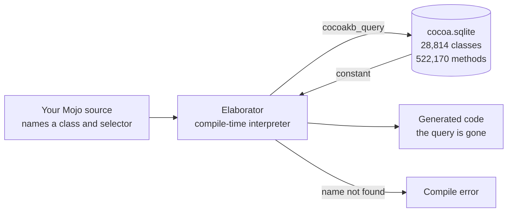

# CocoaMojo Programmer's Guide

This guide teaches CocoaMojo in the order you meet it: get a compiler running,
learn what the language actually is at this frozen version, send your first
message to Cocoa, get memory right, let Cocoa call back into your code, and
finally assemble a real windowed application.

Read it in order the first time. Each chapter assumes the one before it.

| Chapter | What you will be able to do |
|:---|:---|
| [1. Getting started](01-getting-started.md) | Build the compiler, build the SDK database, compile and run a program |
| [2. The language, as it is now](02-the-language.md) | Write code this compiler accepts, and recognise the constructs it rejects |
| [3. Calling Cocoa](03-calling-cocoa.md) | Look up classes, send messages, pass arguments, get results back |
| [4. Ownership and memory](04-ownership.md) | Hold Cocoa objects without leaking and without over-releasing |
| [5. Letting Cocoa call you](05-callbacks.md) | Define Objective-C classes at runtime whose methods are Mojo functions |
| [6. A complete application](06-an-application.md) | Put a window on screen, handle events, and drive a run loop |
| [7. Concurrency and blocks](07-concurrency.md) | Dispatch work across GCD queues, and call block-only Cocoa APIs |
| [8. A demo, walked through](08-walkthrough.md) | Read a complete 225-line windowed program line by line |

When you want to look something up rather than learn it, use the
[Reference Manual](../reference/).

## What makes this different from a binding layer

Most language bridges to Cocoa work by generating declarations: a tool reads
the SDK once, emits a large body of source, and from that moment the generated
code and the real SDK drift apart silently.

CocoaMojo does not generate anything. The compiler holds an open connection to
a database describing macOS, and resolves each fact at the point of use during
elaboration.

Two consequences follow, and they are the reason the whole design exists.

The first is that **a wrong name cannot survive to run time**. There is no
generated stub to be out of date, so a selector the SDK does not have has
nowhere to hide.

The second is that **the compiled program has no dependency on the database**.
By the time code is generated, every query has collapsed to a constant. The
database is a build input in exactly the way a header file is.
