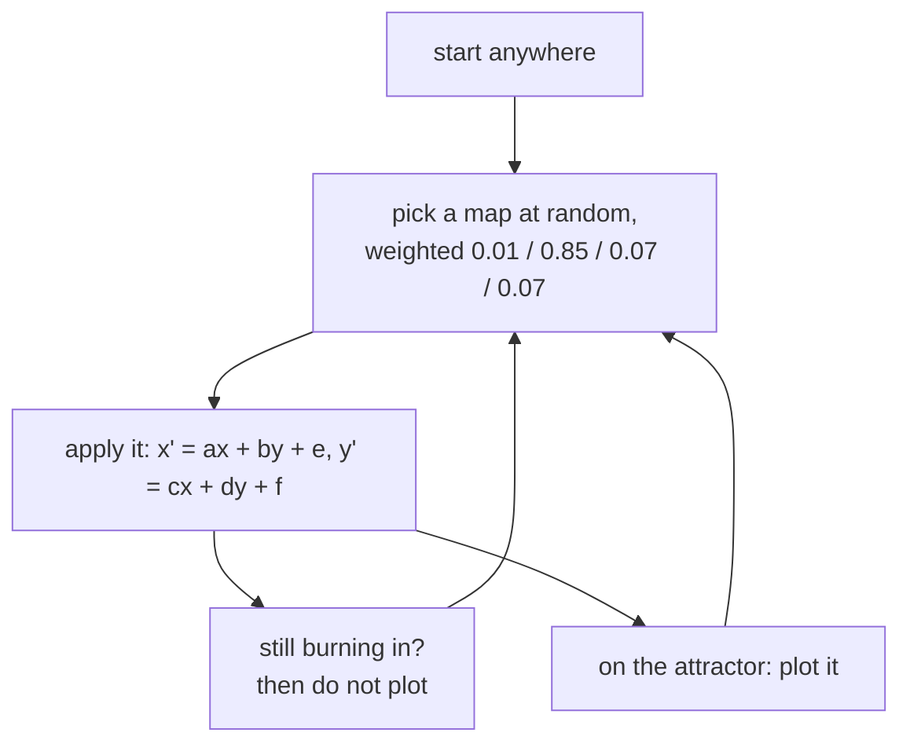

# 1. The chaos game

## Twenty-eight numbers

Here is the whole fern:

```mojo
def barnsley() -> List[Affine]:
    """Barnsley's fern: four maps, and the shape is in the numbers."""
    var maps = List[Affine]()
    maps.append(Affine(0.00,  0.00,  0.00, 0.16, 0.0, 0.00, 0.01))
    maps.append(Affine(0.85,  0.04, -0.04, 0.85, 0.0, 1.60, 0.85))
    maps.append(Affine(0.20, -0.26,  0.23, 0.22, 0.0, 1.60, 0.07))
    maps.append(Affine(-0.15, 0.28,  0.26, 0.24, 0.0, 0.44, 0.07))
    return maps^
```

Four rows of seven numbers. There is no code anywhere in these three examples
that knows what a frond is, or a stem, or a leaf. The docstring says it in
seven words — **the shape is in the numbers**.

Each row is an affine map plus the probability of choosing it:

```mojo
struct Affine(ImplicitlyCopyable, Movable):
    """x' = a x + b y + e,  y' = c x + d y + f, chosen with probability p."""
```

Read what the four are doing:

| map | p | what it is |
|:---|---:|:---|
| 0 | 0.01 | collapses everything onto a vertical line — **the stem** |
| 1 | 0.85 | shrinks by 0.85, rotates slightly, lifts by 1.6 — **the climb** |
| 2 | 0.07 | a squashed, rotated copy leaning right — **a frond** |
| 3 | 0.07 | the mirror of it — **a frond the other way** |

Map 1 takes 85% of the traffic and is the one that matters most. It is a
*slightly smaller, slightly rotated copy of the whole fern, moved up* — which
is exactly what the plant looks like: each section is the whole thing again,
smaller and turned a little. That single map builds the entire spine, and
[chapter 5](05-the-wind.md) is about what happens when you rotate it.

## The chaos game

The algorithm that turns those numbers into a picture is due to Barnsley and
is startlingly simple. Start at any point. Then repeatedly:

1. pick one of the four maps at random, weighted by `p`
2. apply it
3. plot where you are

That is it. The point converges onto the fern within a few dozen steps and
then wanders around it forever, visiting every part in proportion to how much
of the fern is there.

There is a theorem behind it. The four maps are all **contractions** — each
shrinks distances — so the system has a unique attracting set, and any starting
point is drawn onto it. Iterating at random samples that set. The
fern is not drawn; it is *revealed* by a point that cannot help but land on it.

```mojo
comptime SETTLE = 20  # iterations before the point is really on the attractor
```

The first few points are **not** on the fern — they are on the way to it. Plot
them and you get a short trail of stray dots leading in from wherever you
started. Twenty unplotted iterations gets rid of them, and the constant is
named for what it does.

`fernwind/` calls the same idea `BURN`:

```mojo
comptime BURN = 12
...
if step < BURN:
    continue
```

> *burns in unplotted so its point is ON the attractor before anyone sees it*

Twelve rather than twenty because that version has twenty-four thousand
streams, each doing its own burn-in, and the cost is paid per stream.

## Why this is hard to parallelise

Look at the loop:

```
x, y  =  map[k](x, y)
```

Step *n* depends on step *n−1*, and on nothing else. There is no array to
divide, no independent iterations, no reduction. It is a **recurrence** — the
same structural obstacle the [bifurcation example](../examples/bifurcation)
runs into with the logistic map, and the same one that makes alpha-beta a poor
fit for a GPU.

You cannot split one chaos game across threads.

What you *can* do — and this is the whole of
[chapter 4](04-the-flame.md) — is notice that the sequence's *starting point
does not matter*. Every stream converges to the same attractor from anywhere.
So instead of one point taking seven million steps, run twenty-four thousand
points taking three hundred steps each, and let them all land on the same fern.

That is not parallelising the algorithm. It is replacing it with a different
one that samples the same set.

## Where this comes from

Michael Barnsley set out the fern in *Fractals Everywhere* (1988), building on
John Hutchinson's work on iterated function systems. The fern became the
canonical demonstration for a reason that is really a compression argument:
twenty-eight numbers produce an image of unbounded detail, and zooming in
reveals more fern rather than more pixels.

The GPU version owes its structure to a later idea. Scott Draves's **fractal
flame** algorithm (1992) took the chaos game and changed how the result is
*recorded*: instead of setting pixels, accumulate a **density** — how many hits
each pixel received — plus colour, and tone-map the density at the end. That
turns a binary "was this pixel visited?" into a continuous measure, and it is
what makes flames look lit rather than stippled.

`fernwind/` is a flame renderer with Barnsley's maps in it:

| flame idea | where it is in `fernwind/` |
|:---|:---|
| accumulate density, not pixels | `nacc` — an atomic count per pixel |
| carry colour through the accumulation | `racc`, `gacc`, `bacc`, weighted by hits |
| tone-map at the end | the shade kernel's `n/(n+K)` coverage curve |
| many short streams rather than one long one | 24,576 threads × 280 plotted steps |

<!-- doccrate:keep-together:start -->



<!-- doccrate:keep-together:end -->
