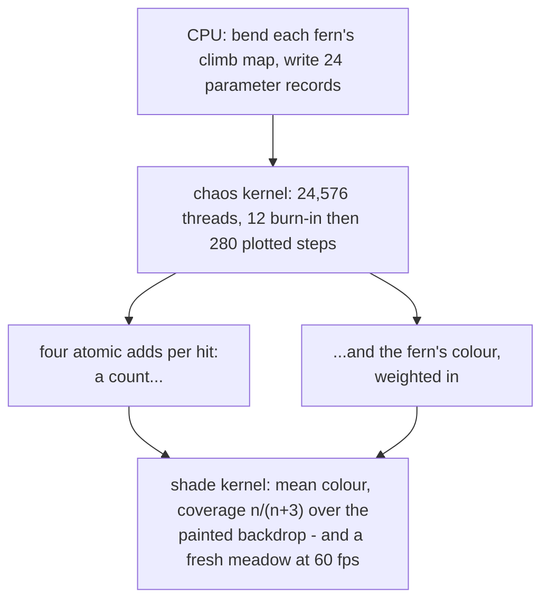

# 4. Twenty-four thousand chaos games

`ferns/` cannot animate because its picture *is* its state. The fix is to make
the picture disposable — to rebuild the entire meadow, from nothing, sixty
times a second.

That means seven million chaos-game steps per frame, which is not a thing one
CPU thread does. It is, however, exactly the kind of thing a GPU does, provided
you ask it the right question.

## The question you cannot ask

You cannot ask a GPU to run *one* chaos game faster. Step *n* needs step *n−1*;
there is nothing to divide.

## The question you can

The sequence's **starting point does not matter**. Every trajectory is drawn
onto the same attractor from wherever it begins, and after a short burn-in it
is sampling the same fern as any other trajectory.

So: instead of one point taking seven million steps, take **24,576 points
taking 292 steps each**.

```mojo
comptime STREAMS = 24576
comptime ITERS = 280
comptime BURN = 12
comptime BLOCK = 256
comptime GRID = (STREAMS + BLOCK - 1) // BLOCK
```

```mojo
def chaos_kernel(nacc, racc, gacc, bacc, params):
    """One thread, one short chaos game.

    The stream picks its fern by thread id, burns in unplotted so its point
    is ON the attractor before anyone sees it, then plots its stretch with
    four atomic adds per hit.
    """
```

24,576 × 280 = **6.9 million plotted points per frame**, at 60.0 fps measured.

This is not a parallelisation of the original algorithm. It is a different
algorithm that samples the same set — and it works only because of the
mathematical property from [chapter 1](01-chaos-game.md): contractions have a
unique attractor, and every starting point converges to it.

The burn-in is the price. Twelve steps per stream × 24,576 streams = 295,000
iterations per frame thrown away — about 4% overhead — to guarantee no stream
plots a point on its way in. Skip it and the meadow acquires a haze of stray
dots, one short trail per thread, 24,576 times over.

## Density through atomics

```mojo
let pat = py * W + px
_ = Atomic.fetch_add(nacc.unsafe_offset(pat), UInt32(1))
_ = Atomic.fetch_add(racc.unsafe_offset(pat), cr)
_ = Atomic.fetch_add(gacc.unsafe_offset(pat), cg)
_ = Atomic.fetch_add(bacc.unsafe_offset(pat), cb)
```

Four buffers, four atomic adds per plotted point. Twenty-four thousand threads
are writing to the same 1024×640 grid with no coordination, so every write must
be atomic or hits are lost.

Three of the four are colour, and the docstring says why:

> *a count, and the fern's colour weighted in, so overlapping ferns blend by
> evidence rather than by draw order.*

This is the fractal-flame idea. Where two ferns overlap, each contributes its
colour once per hit, and the shade kernel divides by the count to get the
**mean**. A pixel that got 30 hits from a blue-green distant fern and 10 from a
yellow-green near one comes out three-quarters distant-fern.

There is no draw order to get wrong, because there is no drawing — only
evidence accumulating, and an average taken at the end. With 24,576 threads
running concurrently there *is* no meaningful order to appeal to.

Note also that the accumulators are cleared each frame. That is the whole point:
the state is thrown away and rebuilt, which is what makes the maps free to
change.

## The probe that came first

The commit is explicit that two facts were established before anything was
built on them:

> *The design rests on two facts proved by a probe before anything was built on
> them, since nothing in this fork's AIR path had used either:*
>
> - ***`Atomic.fetch_add` lowers through the backend without losing
>   increments*** *(4096 threads, 4096 counted)*
> - ***host writes through `map_to_host` reach the next dispatch***

Both are load-bearing. If atomics dropped increments the meadow would be
subtly, unfalsifiably thin — no error, just fewer points than there should be,
which is indistinguishable from the tone curve being off. If host writes did
not land, the per-frame parameters would be stale and the wind would not move —
also with no error.

**Both failures would have looked like tuning problems.** A four-line probe
answered each in isolation, before there was a program to blame.

That is worth generalising. This is a young backend; when a design rests on a
runtime behaviour nothing in the tree has exercised, the cheapest thing you can
do is exercise it on its own first. Debugging it later means debugging it
through a fern.

## The tone curve

```mojo
"""Densities over the backdrop. The mean of the accumulated colour is the
fern's true shade wherever ferns overlap; coverage n/(n+K) is a curve
that density can push toward opaque but never past it, so the spine goes
solid and the wisps stay wisps and nothing blows out to white."""
```

```mojo
let dens = Float32(Int(n))
let a = dens / (dens + Float32(3.0))
```

`n/(n+K)` with K = 3. It maps [0, ∞) into [0, 1) — one hit gives 25% coverage,
three gives 50%, twenty-seven gives 90%, and no density however large reaches
1.0.

This is the same Reinhard-style curve Fluid uses on its dye, doing the same
job: the fern's spine gets thousands of hits and its outer fronds get one or
two, and the curve has to make both visible without the spine clipping to
white.

Note the difference from `fern/`, which uses `log(h+1)/log(peak+1)`. That needs
to know the peak — a second pass over the whole buffer. `n/(n+K)` needs nothing
but the pixel itself, which is what a kernel with no reduction can afford.
K = 3 is then tuned to the density this program actually produces:

```mojo
# The flame: streams x plotted iterations = points per frame. On the M4 this
# is far below the frame budget; the tone curve's K is tuned to this density.
```

Change `STREAMS` or `ITERS` and the picture gets denser or thinner overall, and
K has to move with it. The comment says so, which is the only thing that stops
the next person raising the point count and wondering why everything went
white.

## Randomness that must differ twice over

```mojo
# A stream's randomness must differ per thread AND per frame, or every
# frame replots the same points and the flame strobes.
var state = UInt32(idx) * 2654435761 ^ seed
```

Two independent requirements:

- **Per thread**, or 24,576 streams all trace the same trajectory and you get
  one fern's worth of points at 24,576× the density in the same places.
- **Per frame**, or every frame plots the *identical* seven million points.
  With enough points a fern looks complete either way — but the tiny
  frame-to-frame variation that makes it look alive disappears, and the result
  visibly strobes.

The frame seed rides in the parameter block:

```mojo
pw[1] = Float32(frames % 8388608)
```

2²³, which is the largest integer a `Float32` represents exactly. The parameter
block is floats, so the seed has to survive the round trip — a modulus chosen
for the storage format rather than for the randomness.

This is the exact opposite of `fern/`'s requirement, where a fixed seed makes
the output checkable. Same generator, opposite need, both commented.

## Choosing a map in three compares

```mojo
# Cumulative probabilities were prepared on the host, so choosing a
# map is three compares and no adds.
var m = at + 9
if roll > params[unsafe_offset = m + 6]:
    m += 7
    if roll > params[unsafe_offset = m + 6]:
        m += 7
        if roll > params[unsafe_offset = m + 6]:
            m += 7
```

`fern/` accumulates probabilities in the inner loop:

```mojo
var acc = 0.0
for i in range(len(maps)):
    acc += maps[i].p
    if r <= acc:
```

Two million times, that is fine. Seven million times a frame on a GPU, it is
four floating-point adds and a loop that could be three compares — so the
cumulative sums are computed once on the CPU while the parameters are being
prepared, and the kernel just walks them.

Small, and it is the kind of thing worth doing when the host is idle and the
device is the bottleneck.

<!-- doccrate:keep-together:start -->



<!-- doccrate:keep-together:end -->

