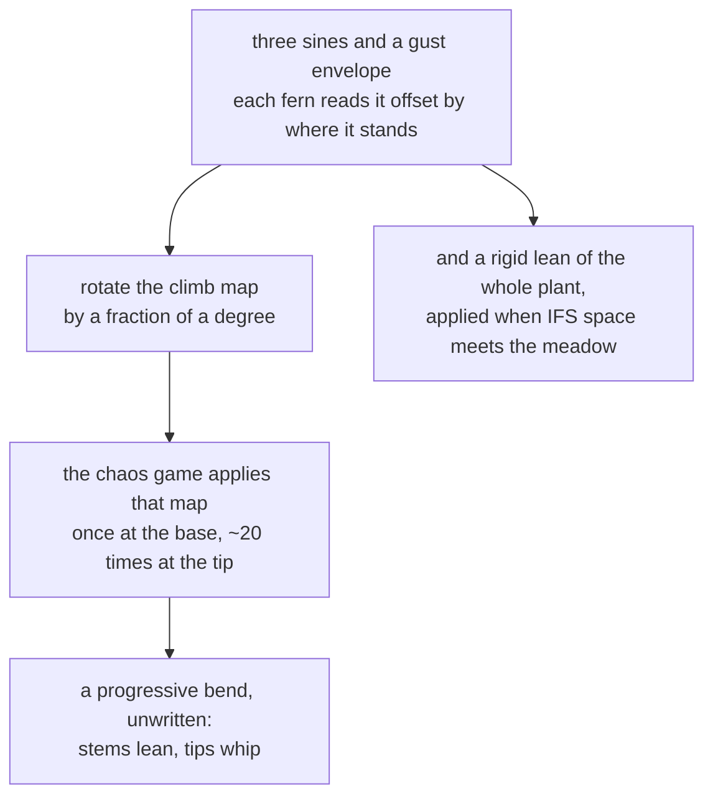

# 5. The wind is in the mathematics

This is the payoff, and it is the best idea in the three programs.

The obvious way to make a plant sway is to bend the picture of it — warp the
pixels, or transform a mesh. `fernwind/` does neither. It changes **one of the
four numbers-rows** before each frame, and lets the chaos game do the rest.

## Rotate the climb map

Recall from [chapter 1](01-chaos-game.md) that map 1 takes 85% of the traffic
and is *a slightly smaller, slightly rotated copy of the whole fern, lifted
up*. The source names it:

```mojo
# The fern, as in fern/ifs.mojo: four affine maps, and the shape is in the
# numbers. Map 1 is the climb -- the one the wind gets to bend.
```

Before every frame, that map is composed with a small rotation:

```mojo
if m == 1:
    # R(bend) after the climb map: linear part and
    # translation both rotate, the root stays put.
    a = bc * src.a - bs * src.c
    b = bc * src.b - bs * src.d
    c = bs * src.a + bc * src.c
    d = bs * src.b + bc * src.d
    e = bc * src.e - bs * src.f
    f = bs * src.e + bc * src.f
```

`bc` and `bs` are the cosine and sine of the bend angle. The whole map — its
2×2 linear part **and** its translation — is rotated. Rotating the translation
too is what keeps the root fixed: the rotation is applied about the origin of
the fern's own coordinate system, which is where the plant meets the ground.

The bend angle is a fraction of a degree.

## Why a fraction of a degree bends a whole plant

Because **map 1 applies to itself, recursively**.

A point on the fern's spine has had map 1 applied to it many times over —
that is what puts it up the stem. Once at the base, twice a little higher,
perhaps twenty times at the tip of the topmost frond.

So a rotation composed into map 1 is applied *once* to the lowest parts and
*twenty times* to the highest. The bend accumulates with height, all by itself:

> *because that map applies recursively up the plant, a uniform rotation
> compounds into a progressive bend: stems lean, tips whip.*

Nobody wrote "the tip should move more than the base". Nobody wrote a stiffness
gradient or a chain of bones. **One uniform rotation, applied recursively,
produces the correct progressive curve** — the same curve a real stem takes,
for the same reason: the deflection at each point is the sum of all the
deflections below it.

This only works because the fern is a *recursive* object and the animation acts
on the recursion rather than on the result. Bending the image could not produce
it without explicitly modelling the gradient.

## The gust field

The wind itself is four sines and a phase offset:

```mojo
let local = t - fern.phase
let gust = 0.6 + 0.4 * sin(local * 0.31 + 1.2)
let wind = gust * (
    0.5 * sin(local * 0.9)
    + 0.3 * sin(local * 2.3 + 0.8)
    + 0.2 * sin(local * 0.13)
)
```

Three sines at incommensurate frequencies — 0.9, 2.3 and 0.13 — so the sum
never repeats on any timescale a viewer would notice. The slow one (0.13)
provides a drift over tens of seconds; the fast one (2.3) provides the flutter.

Then `gust`, itself a slow sine between 0.6 and 1.0, multiplies the whole
thing: the wind gets stronger and weaker rather than blowing evenly.

And the detail that makes it a *field* rather than a signal:

```mojo
# Gusts travel across the meadow: each fern reads the field a
# little later the further right it stands.
let local = t - fern.phase
```

Each fern samples the same wind function at a **different time**, offset by
where it stands. A gust therefore crosses the meadow rather than hitting
everything at once, and the ferns are visibly at different phases — which is
what a breeze across a field looks like, and it costs one subtraction.

## Two effects, not one

```mojo
let lean = fern.lean0 + wind * 0.10 * fern.supple
let bend = (wind * 0.030 + 0.010 * sin(local * 3.1)) * fern.supple * fern.flip
```

**Lean** is a rigid rotation of the whole fern about its base, applied when the
IFS coordinates are mapped into the meadow:

```mojo
let px = Int(base_x + fx * lean_c + fy * lean_s)
let py = Int(base_y - fy * lean_c + fx * lean_s)
```

**Bend** is the recursive one described above, and it carries an extra fast
term — `0.010 * sin(local * 3.1)` — that the lean does not: a flutter in the
fronds that the trunk does not share.

Both scale with `supple`:

```mojo
var supple: Float64  # how much the wind moves it; taller bends more
```

A per-fern constant, so the meadow does not move as one object.

And `bend` is multiplied by `flip` as well — the mirror flag that makes half
the ferns face the other way. Without it, mirrored ferns would bend *into* the
wind while the others bend with it.

## What the still frame shows

> *The still in review shows ferns caught mid-gust at visibly different
> phases.*

Which is the check that the phase offset is doing its job. If every fern were
reading the same wind at the same instant, a single frame would show them all
leaning identically — and it would look like the camera was tilted rather than
like a breeze.

## Why only the GPU version can do this

Everything above requires the maps to change between frames. And a fern drawn
with different maps is *a different fern* — nothing about the previous frame's
points can be salvaged.

So the wind requires redrawing from scratch, redrawing from scratch requires
seven million points a frame, and seven million points a frame requires
[chapter 4](04-the-flame.md).

The chain runs the other way too, and it is the neatest thing about these three
programs: solving the throughput problem *for its own sake* would have produced
a faster meadow. Solving it made an animated one possible, and the animation
turned out to be free — one rotation, in one map, per fern, per frame.

<!-- doccrate:keep-together:start -->



<!-- doccrate:keep-together:end -->
