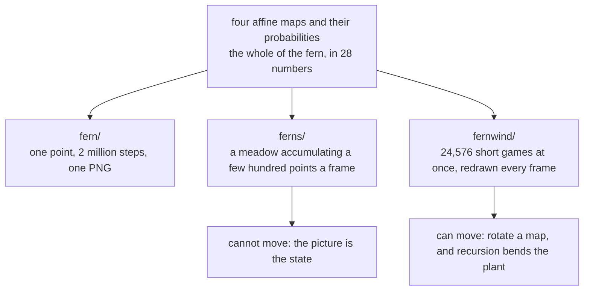

# Ferns

**Three programs, one fern, and an algorithm that is not supposed to
parallelise — until you stop trying to parallelise it and run twenty-four
thousand copies of it instead.**

The chaos game draws a fractal by chasing a single point through a handful of
affine maps and plotting where it lands. It is *inherently sequential*: each
position depends entirely on the one before it. There is no loop to split, no
grid to divide, and no obvious thread.

These three examples are what happens when you take that seriously.

| | | |
|:---|:---|:---|
| [`fern/`](../examples/fern) | 289 lines, 3 files | one fern, two million points, a PNG written by hand |
| [`ferns/`](../examples/ferns) | 641 lines | a meadow growing live in a window — and structurally unable to move |
| [`fernwind/`](../examples/fernwind) | 760 lines | the same meadow on the GPU, redrawn from scratch, swaying in the wind |

<!-- doccrate:keep-together:start -->

## These documents

| Chapter | What it covers |
|:---|:---|
| [1. The chaos game](01-chaos-game.md) | Barnsley's fern, why four affine maps *are* the plant, and the burn-in |
| [2. One fern, one PNG](02-one-fern.md) | `fern/`: the sequential original, a deterministic RNG, and a PNG written by hand |
| [3. A meadow that grows](03-the-meadow.md) | `ferns/`: a landscape assembling live — and why it cannot be animated |
| [4. Twenty-four thousand chaos games](04-the-flame.md) | `fernwind/`: the fractal-flame answer, atomics, and the probe that came first |
| [5. The wind is in the mathematics](05-the-wind.md) | Rotating one map, and letting recursion turn it into a bend |
| [6. What to understand](06-key-points.md) | The things that will surprise you, and the ones that will bite |

<!-- doccrate:keep-together:end -->

## The shortest possible summary

A Barnsley fern is four affine maps and their probabilities — twenty-eight
numbers. Start anywhere, repeatedly pick a map at random and apply it, and the
point converges onto the fern and then wanders around it forever. Plot where it
goes and the fern appears. **The shape is in the numbers**, not in any drawing
code.

The catch is that this is one point chasing itself. `ferns/` renders it the
honest way — a few hundred points per fern per frame, accumulating into the
picture — which is why that meadow **cannot move**: the picture *is* the
accumulated state, and animating would mean throwing away everything drawn so
far.

`fernwind/` does throw it away, every frame. Twenty-four thousand GPU threads
each run their *own* short chaos game — a burn-in to reach the attractor, then
a plotted stretch — and their hits meet in shared density buffers through
atomic adds. Seven million points a frame, a fresh meadow each time, at 60 fps.

And redrawing from scratch is what buys the animation, because **the maps can
change between frames**. Rotating each fern's climb map by a fraction of a
degree bends the whole plant — because that map applies recursively, so a
uniform rotation compounds into a progressive curve. Stems lean, tips whip.

The wind is not applied to the picture. It is applied to the mathematics.

<!-- doccrate:keep-together:start -->

<!-- doccrate:keep-together:end -->
