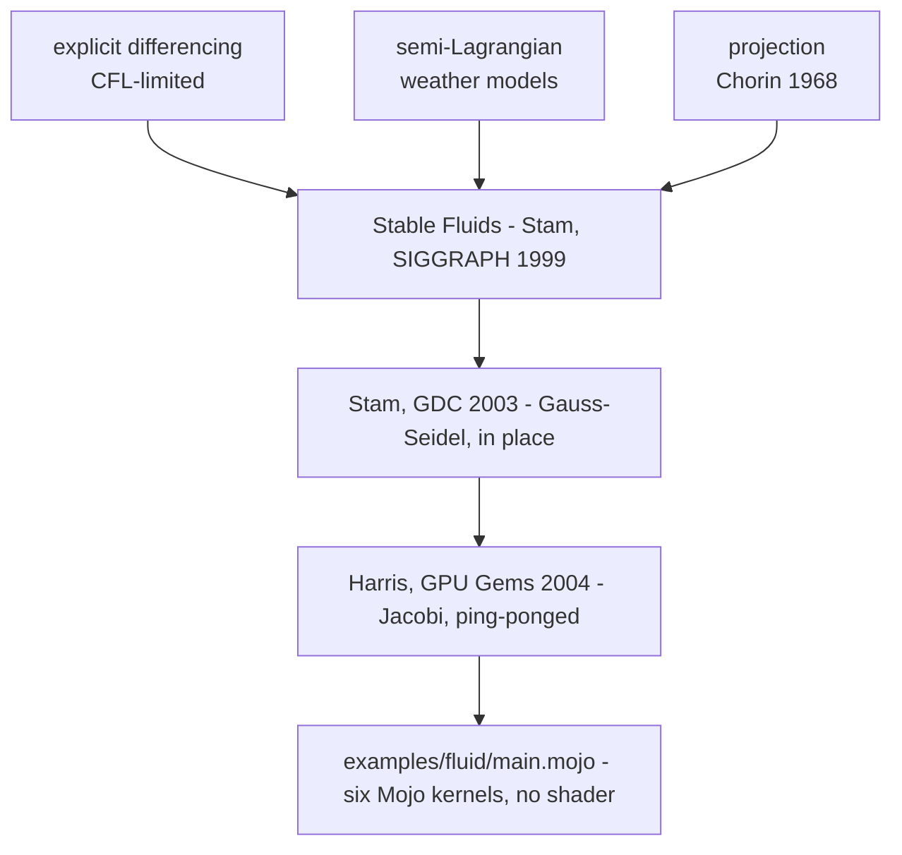

# 1. Where the algorithm comes from

Almost every design decision in `main.mojo` is inherited. The comments in the
source name the inheritance where it matters — *"Stam's method"*, *"one Jacobi
sweep of the pressure Poisson equation"*, *"turning this into Gauss-Seidel"* —
and each of those names is a piece of history that explains why the code looks
the way it does. This chapter unpacks them.

## Before 1999: fluids that could explode

Computational fluid dynamics is older than computer graphics, and the
techniques graphics inherited in the 1990s came with a condition attached.

The natural way to advance a fluid one step is **explicit finite differencing**:
compute the derivatives from the current state, step everything forward. It is
simple and it is fast, and it is stable only if the time step is small enough
that nothing travels more than about one grid cell per step. That is the
**CFL condition** (Courant–Friedrichs–Lewy, 1928). Violate it and the
simulation does not degrade — it detonates, usually within a handful of frames.

For engineering that is an inconvenience: take smaller steps. For graphics it
is fatal. An animator who speeds up a fluid wants it to look faster, not to
blow up, and a real-time demo cannot afford to subdivide its time step because
the user flicked the mouse.

## 1999: *Stable Fluids*

Jos Stam's **"Stable Fluids"** (SIGGRAPH 1999) removed the condition. The paper
assembled three ideas, two of them borrowed, into a solver that is
**unconditionally stable** — correct-looking at *any* time step.

The borrowed pieces are worth naming, because both are in this program:

### Semi-Lagrangian advection, from weather forecasting

Rather than pushing each cell's contents forward, trace **backwards** along the
velocity field: for each cell, ask where the fluid arriving here was one step
ago, go there, and interpolate what was there. This is the method of
characteristics, and it had been standard in **numerical weather prediction**
since the 1980s, where the alternative — an explicit scheme on a global
atmospheric grid — was ruinously expensive.

It is unconditionally stable for a reason that takes one sentence: every new
value is an *interpolation between existing values*, so no value can ever
exceed the range of what was already there. There is nothing for a growing
mode to grow into.

The source states exactly this, in the docstring of the kernel that does it:

> *Semi-Lagrangian advection: trace backwards, sample where it came from.*
>
> *Unconditionally stable whatever the time step, which is the whole reason
> Stam's method is used here rather than a forward difference.*

### Projection, from Chorin (1968)

A fluid that does not compress must have a divergence-free velocity field, and
advection does not preserve that property. The repair is **Chorin's projection
method**: advance the velocity ignoring incompressibility, then project the
result back onto the space of divergence-free fields.

That projection is legitimate because of a classical theorem — the
**Helmholtz–Hodge decomposition** — which says any vector field splits uniquely
into a divergence-free part plus the gradient of a scalar. Compute the scalar
(it is the pressure), subtract its gradient, and what is left is
divergence-free by construction.

Finding the pressure means solving a Poisson equation, and *that* is where
this program spends its frame.

### The price: numerical dissipation

Semi-Lagrangian advection averages four neighbours every step, and averaging
smears. Stable Fluids loses fine detail — vortices decay that should persist.
This was recognised immediately, and the follow-up work is well known:
Fedkiw, Stam and Jensen's **"Visual Simulation of Smoke"** (SIGGRAPH 2001)
added *vorticity confinement* to inject the lost swirl back, along with a
higher-order interpolant to smear less in the first place.

Fluid implements neither, and is right not to. What reads as a defect in a
smoke paper reads as viscosity in a dye demo — the billowing, softening plume
is the look people expect. It is worth knowing that the softness is the
method's error term and not a physical choice.

## 1845, and why the pressure solve looks like that

The Poisson solve is the expensive part, and the method used is the oldest
thing in the program.

**Jacobi iteration** (Carl Gustav Jacob Jacobi, 1845): to solve a system where
each unknown is defined in terms of its neighbours, guess, then repeatedly
replace every unknown with what its neighbours currently imply. Every update in
a sweep reads the *previous* sweep's values. It converges slowly and it
converges reliably.

**Gauss–Seidel** is the obvious improvement: use each new value as soon as you
compute it, rather than waiting for the next sweep. It converges roughly twice
as fast, and Stam's own code uses it — the famous ~100-line C listing from his
2003 GDC paper *"Real-Time Fluid Dynamics for Games"*, which is the ancestor of
most fluid demos ever written, runs Gauss–Seidel.

**And it is the wrong choice on a GPU**, because "as soon as you compute it"
presupposes an order, and thousands of threads running at once do not have one.

This is the single most important comment in the program, and it is a direct
consequence of that history:

> *Ping-ponged rather than updated in place: a Jacobi step reads the previous
> iterate's whole neighbourhood, and writing in place would feed half-new
> values back in, silently turning this into Gauss-Seidel with a
> thread-order-dependent answer.*

Write into the buffer you are reading and you do not get Jacobi and you do not
get Gauss–Seidel. You get Gauss–Seidel with a **nondeterministic** update
order — a solver whose answer depends on GPU scheduling. It still converges. It
still looks like a fluid. It differs run to run, machine to machine, and
nothing reports it.

The defence is two buffers and a swap. Structural, not careful.

## 2004: the GPU lineage

The step from Stam's CPU listing to *this* program is also a documented one.
Mark Harris's **"Fast Fluid Dynamics Simulation on the GPU"** (*GPU Gems*, 2004)
recast Stable Fluids for graphics hardware, and every characteristic shape of
this implementation is from that recasting:

| Stam, CPU (2003) | GPU (2004 onward), and this program |
|:---|:---|
| Gauss–Seidel, in place | **Jacobi, ping-ponged between two buffers** |
| a loop over cells | **one thread per cell**, `if idx < N` |
| `set_bnd` reflecting at walls | **a clamped read**, stated once in `_at` |
| a few sweeps, cheap | **thirty dispatches**, the bulk of the frame |

The boundary simplification is a real one and the source is upfront about it:

> *The boundary rule is stated once, here: clamp, which lets fluid slide along
> a wall rather than leak through it.*

Stam's `set_bnd` reflects velocity at walls to enforce no-flow-through. A clamp
approximates that — the fluid slides rather than bounces — in one line, applied
uniformly to every neighbour read in the program. For a demo in an open box it
is indistinguishable and it removes an entire category of edge-case bug.

## What is not inherited

Two things in the render path are the demo's own, and both are graphics rather
than physics:

- **Bilinear magnification** of 320×240 into 960×720, *"the field is smooth,
  and point-sampling would show the simulation's cells rather than the fluid."*
- **Reinhard tone mapping**, `x / (1 + x)`, *"so a heavy drag saturates
  gracefully instead of clipping to white."* Dye accumulates without bound;
  this maps it into [0, 1) smoothly so the image keeps brightening rather than
  flattening to white.

Neither appears in Stam. Both are doing more for how the demo *looks* than any
physics constant in the file.

## The lineage, in one picture

<!-- doccrate:keep-together:start -->

<!-- doccrate:keep-together:end -->

