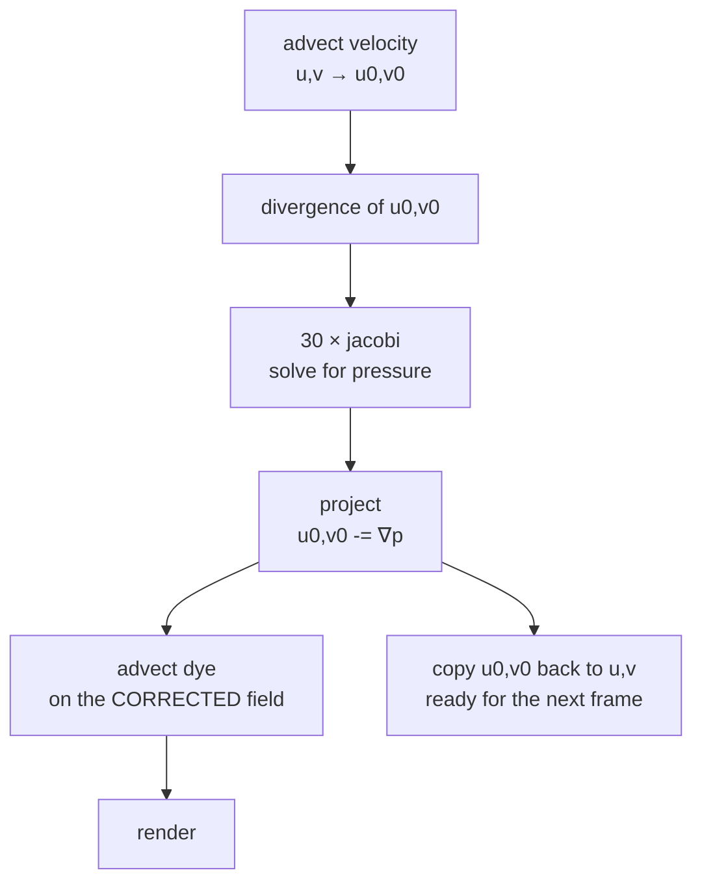

# 2. The physics, in the terms the code uses

You do not need fluid dynamics to read this program, but you do need four
ideas. Each maps onto exactly one kernel, which is why the code is short.

## What is being simulated

Two things live on a 320×240 grid:

- **A velocity field** — two scalar arrays, `u` and `v`, the horizontal and
  vertical speed of the fluid in each cell.
- **Dye** — three more scalar arrays, `dr`, `dg`, `db`. The dye does not
  affect the fluid at all. It is a *tracer*: it goes where the fluid goes, so
  you can see a field that would otherwise be invisible.

That separation is worth holding on to. The simulation is the velocity field.
The colour is passengers.

## Idea one: advection, and why it traces backwards

Everything in a fluid is carried along by the fluid, including the fluid
itself. That is advection.

The obvious way to compute it is forwards: take what is in this cell, work out
where it will be next tick, put it there. This is unstable. Push the time step
a little too far and values pile up, feed back, and the simulation explodes —
usually within a second, usually spectacularly.

Stam's insight is to run it **backwards**:

> For each cell, ask: where was this fluid one time step ago? Go there. Sample
> what was there. That is what is here now.

```mojo
var px = Float32(idx % W) - dt * u[unsafe_offset=idx]
var py = Float32(idx // W) - dt * v[unsafe_offset=idx]
dst[unsafe_offset=idx] = _bilinear(src, px, py) * fade
```

The departure point almost never lands on a grid cell, so it is **bilinearly
interpolated** from the four surrounding cells. And because every new value is
an interpolation *between existing values*, it can never exceed the range of
what was already there. The method cannot blow up. That is what "unconditionally
stable" means, and it is why the source says:

> *Unconditionally stable whatever the time step, which is the whole reason
> Stam's method is used here rather than a forward difference.*

The price is **numerical diffusion** — averaging four neighbours every step
smears the field slightly. In a physics paper that is a defect. In a demo that
wants smoke-like billows it looks like viscosity, so nobody minds.

## Idea two: incompressibility, and why it needs fixing

Real liquid does not compress. Whatever flows into a region must flow out of
it. Advection does not respect this: move a field along itself and you get
cells that are gaining more than they lose.

The measure of that failure is **divergence** — for each cell, the net outflow:

```mojo
div = 0.5 * ((u[x+1] - u[x-1]) + (v[y+1] - v[y-1]))
```

Positive means fluid is appearing; negative, disappearing. Both are wrong.

## Idea three: projection, and the thirty dispatches

The fix comes from a theorem: **any** velocity field can be split into a
divergence-free part plus the gradient of some scalar field. That scalar is
*pressure*. Find it, subtract its gradient, and what remains is divergence-free.

Finding it means solving a Poisson equation, ∇²p = ∇·u — and that is where the
dispatches go. The method here is **Jacobi iteration**: repeatedly replace each
cell with the average of its four neighbours, minus the divergence:

```mojo
p_next = (p[x-1] + p[x+1] + p[y-1] + p[y+1] - div) * 0.25
```

One sweep barely moves the answer. Thirty gets close enough to look right —
`JACOBI_ITERS = 30`, and since the sweeps ping-pong between two buffers, that
is **thirty dispatches per frame**, the bulk of the thirty-five.

This is the honest cost of incompressible fluid, and it is the reason Fluid
measures launch overhead so well: thirty small, strictly ordered kernels, each
of which must complete before the next reads its output.

Then the subtraction, which is the projection proper:

```mojo
u -= 0.5 * (p[x+1] - p[x-1])
v -= 0.5 * (p[y+1] - p[y-1])
```

## Idea four: dissipation

Two constants quietly keep the picture alive:

```mojo
comptime DYE_FADE = Float32(0.997)
comptime VEL_FADE = Float32(0.995)
```

Each is a multiplier applied during advection. Without them, dye accumulates
until the screen is uniformly bright and velocity accumulates until the field
is noise. With them, a drag makes a plume that spreads, thins and fades — and
the screen returns to black if you stop.

`VEL_FADE` is stronger than `DYE_FADE` on purpose: the motion should die away
faster than the colour, so a swirl leaves a visible trail behind it rather
than vanishing with its own momentum.

These constants are also what the headless smoke test checks against: dye mass
must track `DYE_FADE` to within 0.6%, because advection is supposed to *move*
mass, not create or destroy it beyond the fade.

## The order, and why it is that order

<!-- doccrate:keep-together:start -->



<!-- doccrate:keep-together:end -->

The one ordering that matters and is easy to get wrong: **dye advects on the
corrected field, not the raw one.** If the dye moved on `u`/`v` before
projection, it would be carried by a compressible field — and dye would visibly
bunch up and thin out in ways the velocity never does. The code advects dye
after `project`, using `u0`/`v0`, for exactly this reason.
