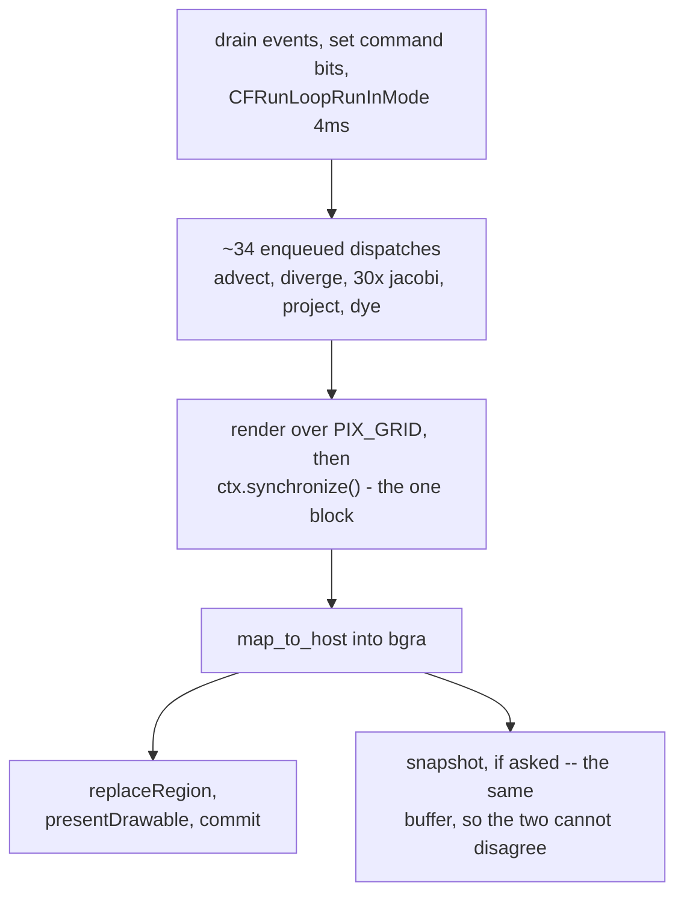

# 4. A frame, end to end

The program is one file and one loop. This chapter walks a single frame from
the mouse to the screen.

## Before the loop: twelve buffers and six kernels

```mojo
var u   = ctx.enqueue_create_buffer[DType.float32](N)   # velocity x
var v   = ctx.enqueue_create_buffer[DType.float32](N)   # velocity y
var u0  = ...                                           # velocity scratch
var v0  = ...
var dr, dg, db = ...                                    # dye, three channels
var s0  = ...                                           # shared dye scratch
var div = ...                                           # divergence
var pr, pr0 = ...                                       # pressure ping-pong
var frame = ctx.enqueue_create_buffer[DType.uint32](PIXELS)
```

Twelve device buffers, allocated once. Nothing is allocated per frame — a
simulation that allocated in its loop would spend more time in the allocator
than in the fluid.

Six kernels are compiled once, up front, and reused:

```mojo
var advect  = ctx.compile_function[advect_kernel]()
var diverge = ctx.compile_function[divergence_kernel]()
var jacobi  = ctx.compile_function[jacobi_kernel]()
var project = ctx.compile_function[project_kernel]()
var splat   = ctx.compile_function[splat_kernel]()
var shade   = ctx.compile_function[render_kernel]()
```

## Step 1: events

The loop drains the event queue with `nextEventMatchingMask:` and
`distantPast` — poll, do not block.

A **drag** does something worth noticing: it splats *five* fields at once.

```mojo
var vx = (mx - last_x) * Float32(6.0)
var vy = (my - last_y) * Float32(6.0)
ctx.enqueue_function(splat, u,  mx, my, 9, vx, ...)   # motion
ctx.enqueue_function(splat, v,  mx, my, 9, vy, ...)
ctx.enqueue_function(splat, dr, mx, my, 7, c[0]*0.6, ...)  # colour
ctx.enqueue_function(splat, dg, mx, my, 7, c[1]*0.6, ...)
ctx.enqueue_function(splat, db, mx, my, 7, c[2]*0.6, ...)
```

Three details:

- **The velocity comes from the mouse's own motion**, scaled ×6. You are not
  pushing a fixed force; you are handing the fluid your gesture. A slow drag
  makes a gentle plume, a flick makes a jet.
- **The velocity radius (9) is larger than the dye radius (7)**, so the push
  extends slightly beyond the colour you can see. Without it, dye near the
  edge of a splat would visibly lag the fluid it is supposed to be in.
- **The hue advances every splat** (`hue += 0.011`), so a session paints
  through the spectrum rather than one muddy colour.

And the coordinate flip, which is a classic and is commented as such:

```mojo
# Cocoa's origin is bottom-left; the grid's row 0 is the top.
var my = Float32(Float64(WIN_H) - pt.y) / Float32(SCALE)
```

## Step 2: the run-loop spin

```mojo
_ = external_call["CFRunLoopRunInMode", Int32](
    P(unsafe_from_address=mode_ref[]), Float64(0.004), Bool(False)
)
```

Four milliseconds. This is the fix described in [chapter 6](06-this-implementation.md) — without it, Apple
Events are delivered to the process and never dispatched, because a hand-rolled
`nextEventMatchingMask:` pump services the event queue but not the Mach port.

## Step 3: pending commands

Keys and Apple Events both set **bits in one flag**:

```mojo
# Keys set the same flags the Apple Events do, so there is
# one implementation of each verb rather than two.
if kc == 49: g_cmd()[] |= CMD_PAUSE
```

`CMD_SNAP | CMD_CLEAR | CMD_RAIN | CMD_PAUSE | CMD_QUIT`. Bits rather than
booleans, so two commands arriving in one frame cannot lose each other — and
one code path per verb regardless of where it came from. The Apple Event
handler does nothing but set a bit, because it runs on AppKit's delivery and
a GPU dispatch does not belong there.

## Step 4: the fluid step, in order

```mojo
ctx.enqueue_function(advect, u0, u, u, v, DT, VEL_FADE, ...)   # 1
ctx.enqueue_function(advect, v0, v, u, v, DT, VEL_FADE, ...)   # 2
ctx.enqueue_function(diverge, div, u0, v0, ...)                # 3
ctx.enqueue_memset(pr, Float32(0))
for _it in range(JACOBI_ITERS // 2):
    ctx.enqueue_function(jacobi, pr0, pr,  div, ...)           # 4..33
    ctx.enqueue_function(jacobi, pr,  pr0, div, ...)
ctx.enqueue_function(project, u0, v0, pr, ...)                 # 34
```

Note `advect` reads `u`,`v` and writes `u0`,`v0` — it cannot advect in place,
because a thread reading a neighbour that has already been overwritten would
read the future.

Then dye, on the **corrected** field:

```mojo
ctx.enqueue_function(advect, s0, dr, u0, v0, DT, DYE_FADE, ...)
ctx.enqueue_copy(dr, s0)
ctx.enqueue_function(advect, s0, dg, u0, v0, DT, DYE_FADE, ...)
ctx.enqueue_copy(dg, s0)
ctx.enqueue_function(advect, s0, db, u0, v0, DT, DYE_FADE, ...)
ctx.enqueue_copy(db, s0)
```

Three channels through **one shared scratch buffer**, copied back each time.
The source is explicit about the trade: *"`s0` is the shared scratch, copied
back each time, which keeps the buffer count down."* Three extra copies
against three extra buffers — a deliberate choice, not an oversight.

Finally the velocity is swapped back for the next frame:

```mojo
ctx.enqueue_copy(u, u0)
ctx.enqueue_copy(v, v0)
```

## Step 5: shade and present

```mojo
ctx.enqueue_function(shade, frame, dr, dg, db, grid_dim=(PIX_GRID), ...)
ctx.synchronize()
with frame.map_to_host() as pix:
    for k in range(PIXELS):
        bgra[unsafe_offset=k] = src[unsafe_offset=k]
```

`ctx.synchronize()` is the **one** blocking point in the frame. Everything
before it was enqueued; this is where the CPU waits for the GPU to finish the
whole batch. That single sync point is precisely why async launch and command-
buffer batching matter so much here — thirty-five dispatches queue up and are
paid for once.

Then the texture upload and present:

```mojo
_ = send[..., "replaceRegion:mipmapLevel:withBytes:bytesPerRow:"](
    tex, region, Int(0), bgra.unsafe_bitcast[NoneType](), Int(WIN_W * 4))
var cb = send[ObjCObject, "commandBuffer"](queue)
_ = send[ObjCObject, "presentDrawable:"](cb, drawable.ptr())
_ = send[ObjCObject, "commit"](cb)
```

`send` rather than `msg_send` for the Metal protocol objects: the concrete
classes behind `MTLTexture` and `MTLCommandQueue` are private, so there is no
public class name for the SDK database to check against.

## Step 6: the snapshot, if asked

```mojo
# Save here, not later: `bgra` is exactly what is about to be
# presented, so the file and the window cannot disagree.
```

`[s]` writes a real PNG — deflate through libz, real CRC — from the same host
buffer the layer is about to receive. `FLUID_AUTOSHOT=<frame>` does it
headlessly, which is how the demo's own picture was captured on a machine
without screen-recording permission.

## The whole frame

<!-- doccrate:keep-together:start -->



<!-- doccrate:keep-together:end -->


