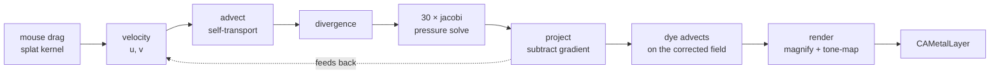

# Fluid

**A native macOS application, written entirely in Mojo, in which every kernel
runs on the Apple GPU and there is no shader anywhere in the pipeline.**

Drag the mouse and coloured dye swirls through a velocity field that is
advected along itself and then made divergence-free by a pressure solve. It
is Jos Stam's *Stable Fluids* (SIGGRAPH 1999), 320×240 of simulation
magnified into a 960×720 window, running at 60 fps on an M4.

It is also the reason this fork can say anything trustworthy about GPU launch
cost, which is the part of the story most people miss on first look.

| | |
|:---|:---|
| **Source** | `examples/fluid/main.mojo`, 871 lines, one file |
| **Simulation** | 320 × 240 cells, magnified ×3 |
| **Kernels** | six, all Mojo, compiled through this fork's AIR backend |
| **Per frame** | ~35 *dependent* GPU dispatches |
| **Buffers** | twelve device buffers, one host frame |
| **Presented via** | `CAMetalLayer`, BGRA8 |

## These documents

| Chapter | What it covers |
|:---|:---|
| [1. Where the algorithm comes from](01-history.md) | Stable Fluids and its ancestors, and why each inherited decision is in the code |
| [2. The physics](02-physics.md) | Stable Fluids in the terms the code uses, and why each step is there |
| [3. The six kernels](03-kernels.md) | Every kernel, read line by line, with the decisions inside them |
| [4. A frame, end to end](04-a-frame.md) | The dispatch sequence, the buffer choreography, and the run loop around it |
| [5. What to understand](05-key-points.md) | The eight things that will surprise you, and the ones that will bite |
| [6. How this demo came to be](06-this-implementation.md) | The spike, the launch-cost measurement it was built to take, and the two things it got wrong |

## The shortest possible summary

A fluid is a velocity field. Move the field along itself, and you have
advection. Do that naively and it explodes; do it Stam's way — trace
*backwards* from each cell and sample where the fluid came from — and it is
unconditionally stable at any time step. That stability is the whole reason
the method is famous, and it is four lines of Mojo.

Advection leaves the field compressible: fluid piles up in places. The fix is
a projection: compute how much each cell is gaining or losing (divergence),
solve for a pressure field that would cancel it, subtract that pressure's
gradient. The solve is thirty Jacobi sweeps, which is thirty dispatches, which
is why this program is a benchmark as well as a toy.

Then dye — three scalar fields, red, green, blue — rides the corrected
velocity, and a final kernel magnifies and tone-maps it into the window.

<!-- doccrate:keep-together:start -->

<!-- doccrate:keep-together:end -->
