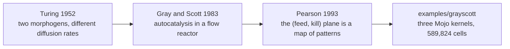

# 1. Where it comes from

Three ideas, forty years apart, and the code carries all three.

## 1952: Turing asks how a blob becomes an animal

Alan Turing's last published paper was not about computing. **"The Chemical
Basis of Morphogenesis"** (1952) asked a question that had no good answer: how
does a spherical, uniform embryo become a thing with a head, a tail and
stripes? Where does the asymmetry come from, if the starting state is
symmetric?

His answer was startling, and it is the reason this example exists.

Take two chemicals that react with each other and also diffuse. Diffusion is
the great smoother — left alone it removes every difference and produces a
uniform field. So the intuition is that diffusion plus reaction should smooth
even faster.

Turing showed the intuition is wrong. If the two chemicals **diffuse at
different rates**, a uniform state can become *unstable*: a tiny random
fluctuation grows instead of dying, and the system settles into a stationary
pattern with a characteristic wavelength. Spots. Stripes.

He called the chemicals **morphogens**, and the mechanism is now called a
**Turing instability** — diffusion, the thing that destroys structure, being
the thing that creates it.

The rate difference is not incidental, and it is in the code as two constants:

```mojo
comptime DU = Float32(1.0)
comptime DV = Float32(0.5)
```

`V` diffuses at half `U`'s rate. Set them equal and the patterns do not form.

## 1983: Gray and Scott build a reactor

Turing's paper was theory. Peter Gray and Stephen Scott, working on
combustion and chemical engineering in the early 1980s, studied a concrete
system: an **autocatalytic** reaction in a continuously stirred tank reactor —
fresh reagent flowing in, product flowing out.

Autocatalytic means the product catalyses its own production. Their scheme is
two steps:

```
U + 2V  →  3V        one U and two V make three V
V       →  P         V decays into an inert product
```

The first line is the whole personality of the model, and it is one term in
the kernel:

```mojo
var uvv = u * v * v
```

`u * v * v` — the rate depends on U being present *and* on V being present,
squared. So **V can only grow where V already is.** A speck of catalyst in a
sea of U does not consume the sea; it eats along its own boundary and spreads
outward as a ring.

The reactor gives the other two terms. Feedstock arrives:

```mojo
+ feed * (Float32(1.0) - u)
```

U is topped back up toward 1 everywhere, at rate `feed`. And everything drains
out:

```mojo
- (feed + kill) * v
```

V is removed at `feed + kill` — the `feed` part because the outflow carries it
away, the `kill` part as its own decay.

That is the whole of the source comment, in the language of a reactor:

> *U feeds itself back toward 1, V is a catalyst that eats U wherever both are
> present and is itself removed at a fixed rate.*

## 1993: Pearson maps the plane

The step that made this famous in graphics rather than chemistry was John
Pearson's **"Complex Patterns in a Simple System"** (*Science*, 1993).

Pearson took the Gray-Scott equations, fixed everything except `feed` and
`kill`, and swept those two across a plane — cataloguing what came out. The
answer was a zoo. Small regions of the plane produce spots that divide like
cells; adjacent regions produce stripes, or travelling waves, or spirals, or
patterns that never stop rearranging.

The finding was not that the model makes patterns. It is that **one equation
makes all of them**, and which one you get is a point on a two-dimensional map
with sharp boundaries.

The example is built on exactly that:

```mojo
# Six named regions of the Gray-Scott (feed, kill) plane -- the widely
# reproduced values this model is usually shown with, not a guess: get
# these even a few thousandths wrong and the field relaxes to a uniform
<!-- doccrate:keep-together:start -->

# grey instead of staying alive.
```

| preset | feed | kill |
|:---|---:|---:|
| gliders | 0.014 | 0.054 |
| bubbles | 0.098 | 0.057 |
| maze | 0.029 | 0.057 |
| worms | 0.058 | 0.065 |
| spirals | 0.018 | 0.051 |
| spots | 0.030 | 0.062 |

<!-- doccrate:keep-together:end -->

Look at **maze** and **bubbles**: identical `kill`, and `feed` differing by
0.069. Or **maze** and **spots**: `feed` a thousandth apart, `kill` five
thousandths apart, and one grows space-filling channels while the other makes
dividing dots.

That sensitivity is why the values are looked up rather than invented, and the
<!-- doccrate:keep-together:start -->

comment says what happens if you guess: *the field relaxes to a uniform grey
instead of staying alive*. There is no error and no crash. The simulation
simply stops being interesting, which is the most annoying kind of wrong.

## What the code inherits from each

| from | what is in the file |

<!-- doccrate:keep-together:end -->
|:---|:---|
| Turing, 1952 | two species diffusing at **different** rates — `DU = 1.0`, `DV = 0.5` |
| Gray & Scott, 1983 | the `u*v*v` autocatalysis, `feed·(1−u)` inflow, `(feed+kill)·v` outflow |
| Pearson, 1993 | six presets as six points on one map, and live switching between them |

And one thing that is this fork's own: every cell of it runs as a Mojo kernel
on the GPU, which is [chapter 3](03-why-gpu.md).

<!-- doccrate:keep-together:start -->



<!-- doccrate:keep-together:end -->
