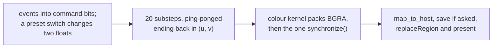

# 5. A frame, end to end

One file, one loop. This chapter walks a frame from the mouse to the drawable.

## Before the loop: five buffers, three kernels

```mojo
var u  = ctx.enqueue_create_buffer[DType.float32](CELLS)
var v  = ctx.enqueue_create_buffer[DType.float32](CELLS)
var u2 = ctx.enqueue_create_buffer[DType.float32](CELLS)
var v2 = ctx.enqueue_create_buffer[DType.float32](CELLS)
var dev = ctx.enqueue_create_buffer[DType.uint32](CELLS)

var gs_kern = ctx.compile_function[grayscott_kernel]()
var seed_kern = ctx.compile_function[seed_kernel]()
var color_kern = ctx.compile_function[color_kernel]()
```

Five device buffers — two pairs plus the frame — allocated once, and three
kernels compiled once. Nothing is allocated per frame.

Compare Fluid's twelve buffers and six kernels: the difference is entirely the
pressure solve that Gray-Scott does not need.

Then the initial state:

```mojo
ctx.enqueue_memset(u, Float32(1.0))
ctx.enqueue_memset(v, Float32(0.0))
for _i in range(SEED_BLOBS):
    ...
    ctx.enqueue_function(seed_kern, u, v, rx0, ry0, SEED_R2, ...)
```

A full tank of U, no V, then six random discs of catalyst.

There is a comment where a helper function would be:

```mojo
# Not a nested function: a DeviceContext and its buffers captured by a
# closure is untested ground, and this is called from exactly two
# places, so inlining both times is the safer six lines.
```

Six duplicated lines against an untested capture, in a dialect where the
compiler's closure handling has surprised people before. The comment records
that the choice was made rather than missed, which is what stops someone
"tidying" it.

## Step 1: events, into flags

```mojo
class GrayScottView(NSView):
```

Handlers set bits and nothing else:

```mojo
comptime CMD_CLICK = 1
comptime CMD_PAUSE = 2
comptime CMD_RESET = 4
comptime CMD_QUIT = 8
comptime CMD_PRESET = 16
comptime CMD_SAVE = 32
```

Bits rather than booleans, so two commands arriving in one frame cannot lose
each other. It is the house rule from Fluid and Othello, and the commit states
the reason:

> *input arrives through a `class` whose handlers only set flags, so every
> Metal and GPU call still happens on the thread that owns them.*

A `DeviceContext` lives in a local in `main`, and a Cocoa callback cannot
reach a local. So the pump owns the GPU and the handlers own nothing.

## Step 2: acting on them

```mojo
var pending = g_cmd()[]
if pending != 0:
    g_cmd()[] = 0
```

Note `var`, and note the order: read the flags **out** of the global, then
clear. `let` binds to a place in this dialect, so `let pending = g_cmd()[]`
would be a live view — clearing the global would empty it and every command
would evaporate. That exact bug cost Othello three debugging sessions and is
written up in `CLAUDE.md`.

The interesting branch is the preset switch:

```mojo
if (pending & CMD_PRESET) != 0:
    preset = g_want_preset()[]
    feed = preset_feed(preset)
    kill = preset_kill(preset)
    win.title = "Gray-Scott — " + preset_name(preset)
```

Two floats change, and the next dispatch is in a different regime. **The
kernel is not recompiled and the field is not reset** — the existing pattern
carries on under new rules, which is far more instructive than a fresh start:
you watch a maze reorganise itself into worms.

## Step 3: twenty substeps, ping-ponged

```mojo
if not paused:
    for _step in range(SUBSTEPS // 2):
        ctx.enqueue_function(gs_kern, u2, v2, u, v, feed, kill, ...)
        ctx.enqueue_function(gs_kern, u, v, u2, v2, feed, kill, ...)
```

Read the argument order. The first call has `u2, v2` as destination and `u, v`
as source; the second reverses them. Ten pairs, twenty steps, and the settled
state ends up back in `u, v`.

That last part is the point of the constant:

```mojo
comptime SUBSTEPS = 20
"""Simulation steps per drawn frame. Kept EVEN on purpose: the ping-pong
below always leaves the settled state back in (u, v), so the colour
kernel never has to ask which buffer is current."""
```

Make it odd and the answer finishes in `u2, v2`, the colour kernel reads `v`,
and you get the state from one step ago — every frame, consistently, which
looks like nothing at all is wrong.

The alternative designs are worth naming. You could track a `current` flag and
branch on it; you could copy back after each step. The even-pair loop costs
neither: no branch, no copy, and the invariant is maintained by the loop's
structure.

Twenty steps rather than one because a single step at this grid size is a
barely visible change. Twenty makes the pattern evolve at a watchable rate,
and the whole batch is enqueued without a single synchronise.

## Step 4: colour, and the one blocking point

```mojo
ctx.enqueue_function(color_kern, dev, v, phase, grid_dim=(GRID), block_dim=(BLOCK))
ctx.synchronize()
with dev.map_to_host() as pix:
    var src = pix.unsafe_ptr()
    for k in range(CELLS):
        bgra[unsafe_offset=k] = src[unsafe_offset=k]
```

`ctx.synchronize()` is the **only** blocking point in the frame. Twenty-one
dispatches were queued; this is where the CPU waits for all of them at once.

Note the colour kernel reads `v` — never `v2` — which is what the even substep
count guarantees.

## Step 5: the snapshot, if asked

```mojo
# Save here, not later: `bgra` is exactly what is about to be
# presented, so the file and the window cannot disagree.
```

Fluid's comment and Fluid's `save_png`, carried over — and the file says it is
a copy rather than an import:

> *example folders are self-contained by this tree's own convention, so this is
> a copy, not an import.*

The headless door does something better than exiting cleanly:

```mojo
# A headless run (GRAYSCOTT_FRAMES) leaves one PNG of its last
# frame behind -- a CI run produces something a person can
# actually look at, not just an exit code.
```

The commit is explicit that this is what verification meant here:

> *Verified by actually looking at the output, not just a clean exit: a saved
> PNG shows a textbook maze pattern after 12,000 steps, and switching to the
> worms preset produces visibly different physics (rings forming from each seed
> rather than maze's space-filling channels) — proof the parameter wiring
> changes what is actually computed, not just a label.*

That is the right test for this program. A clean exit proves the dispatches
ran. It does not prove `feed` and `kill` reached the kernel — a preset switch
that only changed the window title would pass every automated check.

## Step 6: present

```mojo
var drawable = Obj["CAMetalLayer"](layer.addr()).nextDrawable()
if drawable.id != 0:
    var tex = Obj["CAMetalDrawable"](drawable.addr()).texture()
    _ = send[ObjCObject, "replaceRegion:mipmapLevel:withBytes:bytesPerRow:"](
        tex, region, Int(0), bgra.unsafe_bitcast[NoneType](), Int(WIDTH * 4))
    var cb = send[ObjCObject, "commandBuffer"](queue)
    _ = send[ObjCObject, "presentDrawable:"](cb, drawable.ptr())
    _ = send[ObjCObject, "commit"](cb)
```

The colour kernel already produced BGRA8, so the bytes go straight onto the
drawable's texture. No shader, no sampler, no render pass — which is the first
of the three house rules the commit names.

`send` rather than `msg_send` because the concrete classes behind `MTLTexture`
and `MTLCommandQueue` are private, so there is no public class name to check
against.

Note the `if drawable.id != 0` — `nextDrawable` returns nil when the pool is
exhausted, and skipping the frame is correct.

<!-- doccrate:keep-together:start -->



<!-- doccrate:keep-together:end -->
