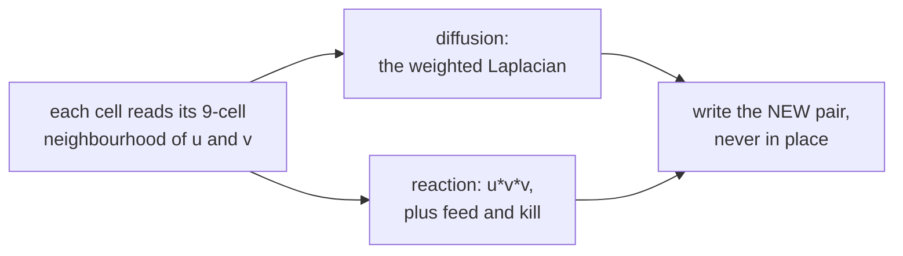

# Gray-Scott

**Two chemicals, four lines of arithmetic, and a 768 × 768 grid where every
single cell is computed by the same Mojo kernel on the Apple GPU.**

U feeds itself back toward 1. V is a catalyst that eats U wherever both are
present, and is itself removed at a fixed rate. That is the entire model — and
depending on where two numbers sit, that same four-line kernel produces spots
that divide like cells, worms that wriggle forever, spinning spirals, or a
coral maze that never stops growing.

<!-- doccrate:keep-together:start -->

## These documents

| Chapter | What it covers |
|:---|:---|
| [1. Where it comes from](01-history.md) | Turing, Gray and Scott, and Pearson's map of the plane |
| [2. The model](02-the-model.md) | Two chemicals and four lines, in the code's own terms |
| [3. Why this belongs on a GPU](03-why-gpu.md) | The textbook case, checked property by property |
| [4. The three kernels](04-kernels.md) | Every kernel, line by line |
| [5. A frame, end to end](05-a-frame.md) | The ping-pong, the substeps, and the loop |
| [6. What to understand](06-key-points.md) | What will surprise you, and what will bite |

<!-- doccrate:keep-together:end -->

<!-- doccrate:keep-together:start -->

## At a glance

| | |
|:---|:---|
| **Source** | `examples/grayscott/main.mojo`, 693 lines |
| **Grid** | 768 × 768 — 589,824 cells, one thread each |
| **Per frame** | 20 substeps + 1 colour pass = 21 dispatches |
| **What decides the pattern** | two floats: `feed` and `kill` |

<!-- doccrate:keep-together:end -->

## The shortest possible summary

Every cell holds two numbers, `u` and `v`. Each step, each cell looks at its
eight neighbours, and applies this:

```
du = Du·∇²u − u·v²  +  feed·(1 − u)
dv = Dv·∇²v + u·v²  −  (feed + kill)·v
```

The first term in each is **diffusion** — spreading out. The `u·v²` is
**reaction** — V consumes U and makes more of itself, which is why a single
speck of catalyst grows outward along its own edge rather than eating
everything at once. The last term is **replenishment** for U and **removal**
for V.

Diffusion alone smooths everything to a uniform grey. Reaction alone runs to
completion and stops. Together, at the right rates, they never settle — and
the shapes that come out are the ones biology makes.

Nothing in the kernel knows what a spot or a stripe is. The six presets in the
file are six *points* on one continuous map, and moving `feed` by three
thousandths puts the identical kernel in a different regime.

<!-- doccrate:keep-together:start -->



<!-- doccrate:keep-together:end -->
