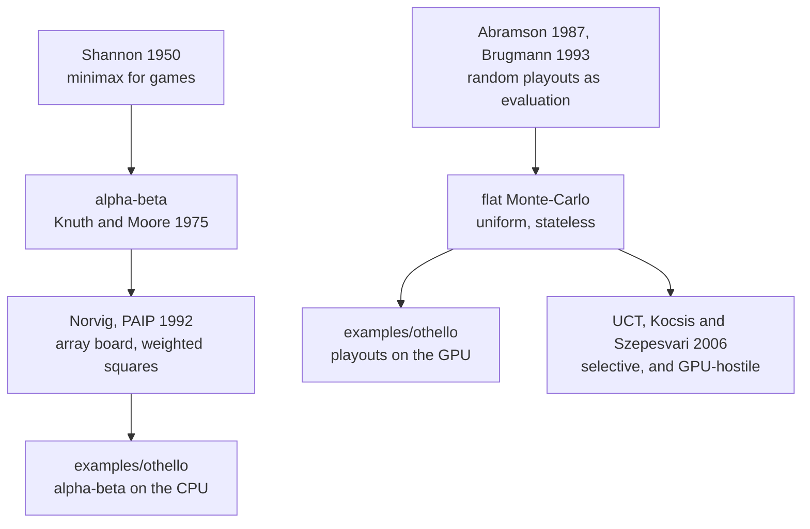

# 1. Where the ideas come from

Every technique in this example is older than the hardware it runs on, and two
of them are much older. The source comments name their ancestry directly —
*"Norvig's version in Paradigms of AI Programming"*, *"Norvig's weighted
squares"* — so the lineage is worth following, because it explains why the
code makes the choices it does.

## The game

Othello — Reversi, renamed and trademarked in 1971 — is played on 8×8 with
discs that are black on one side and white on the other. You place a disc so
that it brackets an unbroken line of your opponent's discs against another of
yours, and every disc in that line turns over. The player with more discs at
the end wins.

Three properties matter for what follows, and all three are unusual:

- **The board never empties.** Every move adds a disc; the game is over in at
  most 60 moves. There is a hard, short horizon.
- **Ownership is violently unstable.** A single move can flip a dozen discs.
  Counting material mid-game tells you almost nothing — a player ahead 40–4
  can lose.
- **Corners are permanent.** A disc in a corner can never be bracketed, so it
  can never be flipped. Everything else is negotiable.

That last point is the whole of classical Othello strategy, and it is why the
evaluation function in `ai.mojo` looks the way it does.

## Norvig, and the board this example does *not* use

Peter Norvig's *Paradigms of Artificial Intelligence Programming* (1992)
devotes a chapter to Othello, and it is the direct ancestor of this example —
the port started from a Common Lisp demo in that tradition.

Norvig represents the board as a **100-element array**: 64 playing squares
inside a border of sentinel values. The border exists so that a walk off the
edge hits a wall rather than wrapping onto the opposite rank. The source is
explicit that this is the right choice *for its language*:

> *That is the right shape for a language with arrays and no wide integers,
> and it costs a bounds check per step in eight directions.*

Two things carry over from Norvig unchanged. The first is the **weighted
squares table** — corners at 120, the squares diagonally beside them at −40,
edges modest, the middle nearly worthless. The second is the observation that
a table is not enough, which is why `smart_weighted` adds a bonus for corners
actually held.

What does *not* carry over is the array.

## Bitboards

A board is 64 squares. A machine word is 64 bits. Chess programmers noticed
this in the 1970s — 64 squares there too — and built a whole discipline around
representing positions as bit-parallel sets rather than arrays of pieces.

Othello is the game bitboards fit best, because Othello's rules are *already*
set operations. "Every square where a line of opponent discs is bracketed by
one of mine" is not a loop; it is a shifted, masked propagation:

```mojo
var run = shift(own, dir) & opp
for _ in range(5):
    run |= shift(run, dir) & opp
moves |= shift(run, dir) & empty
```

Norvig's sentinel border becomes a mask applied after the shift. Eight
directions, no bounds checks, no branches that depend on the position.

The source is clear that this is not a micro-optimisation:

> *That matters twice over here. It is faster on the CPU, and it is the reason
> a GPU player is possible at all: a thread that plays a whole game needs two
> registers for the board, and every thread executes the same instructions
> regardless of what its game looks like.*

Hold on to that sentence. It is the hinge the entire example turns on, and
[chapter 2](02-the-argument.md) is about nothing else.

## Minimax and alpha-beta

The classical answer to "what should I play?" is a tree search, and its
history is short and definitive.

**Minimax** applied to games is Claude Shannon's, from his 1950 paper on
programming a computer to play chess: assume your opponent plays the move
worst for you, recurse, back the value up.

**Alpha-beta** is the observation that most of that tree never needs to be
looked at. If one reply already refutes a move, the *other* replies to that
move cannot make it better — so stop. It was found independently by several
people in the late 1950s and 1960s, and given its definitive analysis by Knuth
and Moore in 1975. Done well, it examines roughly the square root of the nodes
minimax would.

`negamax` in `ai.mojo` is textbook alpha-beta, in the negamax formulation that
collapses the two cases into one by negating on the way up. It handles the two
Othello-specific wrinkles that a chess implementation would not have:

```mojo
if moves == 0:
    if legal_moves(opp, own) == 0:
        # the game is over -- count discs, do not consult the table
    # Pass: the turn goes over, the depth does not.
    return -negamax(opp, own, depth, -beta, -alpha, smart)
```

A player with no legal move **passes** rather than losing, and a pass must not
consume depth or a long forced sequence would be searched to nothing.

## And the machine that ended the argument

Othello is a solved argument in a way chess is not. Michael Buro's
**Logistello** beat the reigning world champion Takeshi Murakami **6–0** in
1997, and it did so with a hand-built, statistically fitted pattern evaluation
searching deeply — not with more randomness. Strong Othello has been a
solved-in-practice engineering problem for nearly thirty years.

In 2023 it was pushed further: 8×8 Othello was weakly solved, and perfect play
from the standard opening is a **draw**.

This matters to the example in a slightly deflating way. Nothing here is near
the state of the art, and nothing here is trying to be. The question the
example answers is not "how strong can Othello get?" but "which parts of a
board game are shaped like GPU work?" — and that question is worth asking
precisely because a game this well-understood makes the answer checkable.

## How Monte-Carlo got respectable

For most of that history, "play random games and count the wins" was not a
serious proposal. It became one in stages:

- **1987** — Bruce Abramson's thesis argues that the *expected outcome under
  random play* is a usable evaluation function, which was not obvious.
- **1993** — Bernd Brügmann's *Monte Carlo Go* plays it straight: no
  evaluation function at all, just random playouts. It plays badly, but it
  plays, in a game where handcrafted evaluation had stalled.
- **2006** — two papers land in the same year. Rémi Coulom names and formalises
  Monte-Carlo Tree Search; Kocsis and Szepesvári derive **UCT**, which applies
  a bandit algorithm (UCB1, Auer *et al.* 2002) to deciding which branch to
  sample next. Suddenly the samples go where they matter.
- **2016** — AlphaGo, which is MCTS with the random playout replaced by a
  neural network.

The example's Master player is deliberately from the **first** stage of that
story, not the last. It is *flat* Monte-Carlo: samples spread evenly over the
root moves, results discarded after each decision, no tree at all.

That is the crudest member of the family, and it is on the GPU **because** it
is crude — uniform sampling has no shared state, so ten thousand threads never
need to agree about anything. The spike in `spikes/othello-mcts/` is the
attempt to have UCT's selectivity *and* the GPU's throughput, and
[chapter 7](07-mcts.md) is the honest account of how that went.

## The lineage

<!-- doccrate:keep-together:start -->



<!-- doccrate:keep-together:end -->
