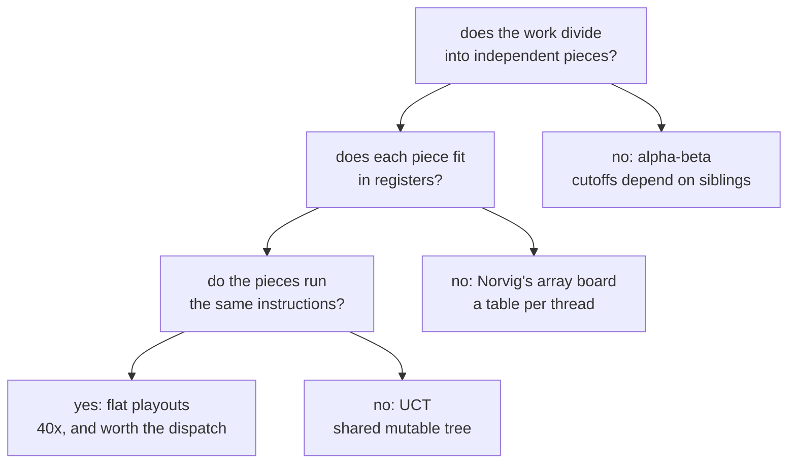

# 2. Does a board game want a GPU?

This is the chapter the example exists for. The source states the question in
its first paragraph and does not soften the answer:

> *A port of a Common Lisp demo, and an excuse to answer a question honestly:
> where does a GPU help a board game, and where does it not?*

The answer is **mostly no**. What follows is the case against, then the
narrow case for, then why the narrow case was worth building anyway.

## Five reasons this is a bad idea

### 1. There is nothing to accelerate

The strongest CPU player in the app searches four ply of alpha-beta. Measured
on the machine this was written on:

| depth | time |
|---:|---:|
| 3 | 22 µs |
| 4 | **81 µs** |
| 6 | 1,009 µs |

Eighty-one microseconds. A human cannot perceive it; a display cannot show it.
The source draws the obvious conclusion and refuses the obvious temptation:

> *Eighty-one microseconds. Moving that to a GPU would make it slower, and
> saying otherwise would be a demo rather than an argument.*

That is the first and most important objection, and it is not about
algorithms. **You cannot speed up something that has already finished.** A GPU
would add a kernel launch, a buffer, and a synchronise to a problem measured
in tens of microseconds — the overhead alone exceeds the work.

### 2. The best algorithm for the job is actively hostile to the hardware

Alpha-beta's entire advantage is *not looking*. When one reply already refutes
a move, the remaining replies to that move cannot change the answer, so they
are skipped. A well-ordered search examines about the square root of the nodes
that plain minimax would.

Now put that on a GPU. Threads in a warp execute together; when they take
different branches, the hardware runs both sides and masks off the threads that
should not be executing. A search where **every thread prunes somewhere
different** is the worst possible case for that: near-total divergence, all the
time.

You can avoid the divergence, and the way to avoid it is to stop pruning — to
have every thread search the same shape of tree. But the pruning *was the
algorithm*. You would be running exponentially more nodes in order to run them
in parallel. The source puts it in one line:

> *Threads would diverge on the first cutoff, and keeping them in step means
> giving up the pruning, which was the entire point.*

There is a deeper version of this objection. Alpha-beta is not just branchy —
it is **sequentially dependent**. The window that makes a cutoff possible comes
from results already computed. Search two siblings genuinely in parallel and
neither can narrow the other's window, so both do more work than either would
have done alone. Parallel alpha-beta is a real and difficult research area for
exactly this reason, and none of its answers look like a GPU.

### 3. The algorithm that *does* fit is the weak one

Flat Monte-Carlo — sample every root move uniformly, keep the winner — fits a
GPU beautifully. It is also, as the spike README says without flinching,
*"the crudest member of its family"*.

It spreads samples evenly over moves that are obviously bad and obviously
good alike, and it discards everything it learned the moment the move is
played. UCT — the version that made Monte-Carlo famous and eventually beat
professional Go players — is enormously stronger per sample, and it is
GPU-hostile for the *same reason alpha-beta is*:

> *the tree is shared mutable state, and what to sample next depends on what
> the last sample found. The same tension that rules out alpha-beta.*

So the GPU does not merely fail to help the good algorithm. **It selects for a
worse one.** Choosing an inferior method because it parallelises is one of the
oldest traps in the subject, and this example walks straight into it on
purpose, with a note explaining that it has.

### 4. A game wants latency; a GPU sells throughput

A board game needs **one** answer, **now**. That is a latency problem.

A GPU is a throughput machine: it is spectacular at doing forty thousand
independent things and mediocre at doing one thing quickly. Every move here
pays a fixed toll — compile lookup, buffer allocation, dispatch, `synchronize`,
map back to the host — regardless of how much thinking happened in between.
For alpha-beta at 81 µs that toll is the entire cost. It is only bearable
because a playout player *has* forty thousand independent things.

### 5. Strength does not come from randomness

Logistello beat the human world champion 6–0 in 1997 with a fitted pattern
evaluation and a deep search. The strongest Othello programs are still built
that way. None of them got there by playing more random games.

A GPU buys you *more samples*. Othello strength is bought with a *better
evaluation function*. Those are different currencies, and the exchange rate is
poor.

## The one place it genuinely fits

Set all of that aside and look at what a single playout actually does:

```mojo
fn playout(black_in: UInt64, white_in: UInt64, black_to_move: Bool,
           seed: UInt64) -> Int:
    """Play to the end at random. Returns +1 if black wins, -1 white, 0 drawn.

    The same function runs on the CPU and inside the GPU kernel. It touches
    no memory, which is why ten thousand copies of it can run at once.
    """
```

Check it against what the hardware wants, property by property:

| What a GPU wants | What a playout does |
|:---|:---|
| independence | every game is separate; no thread reads another's anything |
| no memory traffic | the whole state is two `UInt64`s and an RNG — **registers** |
| uniform control flow | every thread runs the same loop: legal moves, pick one, flip |
| arithmetic density | shifts, masks, popcounts, sixty times over |
| a large batch | 4,096 playouts × ~10 candidate moves = ~40,000 threads |
| a tiny result | one `Int32` per thread |

That is not a workload that has been *made* to fit a GPU. It is a workload
that already was one, and the only reason it fits is the board
representation. Norvig's 100-element array would put a per-thread array in
memory, and forty thousand threads each walking their own array is a different
and much worse program.

The measurement, 16,384 playouts from the opening position:

| | |
|:---|:---|
| CPU | 136.8 ms |
| GPU | **3.4 ms** |
| | **40×** |

> *Both pick the same move, which is the cheap correctness check worth doing
> whenever the same algorithm exists twice.*

## So why build it?

Six reasons, in rough order of how much they justify the effort.

**1. To be able to say "no" credibly.** A claim that alpha-beta does not want a
GPU is worth nothing from someone who never tried. The example ships both, on
the same board code, with numbers. The 81 µs is what makes the refusal an
argument rather than an opinion.

**2. Because speed here buys *strength*, not just speed.** This is the part
that is easy to miss. Forty times faster does not mean the same player answers
sooner — it means a *different player becomes affordable*. A level that would
stall for most of a second per move can now answer while your hand is still on
the mouse, so it can afford to be the strongest thing in the app:

```
Master (GPU playouts)  6 - 0  Advanced (alpha-beta, 4 ply)
```

with margins from 6 to 26 discs, and all six games played in half a second.
Crude-but-plentiful beat sophisticated-but-shallow. That is a genuine result
and not a foregone one.

**3. Because it forced the right representation.** The bitboard was adopted
*so that* a thread could hold a game. It then turned out to make the CPU
players faster and the ruleset shorter — 120 lines for the entire game,
verified against published perft counts. The constraint improved the code it
was imposed on.

**4. Because it is a completely different stress on the backend.** Fluid is
float-heavy, memory-bound, and 35 tiny dependent dispatches per frame. Othello
is **integer-only**, register-resident, and **one large dispatch per move**.
Same AIR backend, opposite corner of its behaviour — and it found a real
compiler bug there ([chapter 6](06-key-points.md), the `llvm.scmp` story).

**5. Because the fallback is honest.** With no Metal device, Master runs the
same playouts on the CPU with fewer of them, and the status bar says
`Master · CPU`. The GPU is an accelerator for a level, not a level of its own.

**6. Because trying to have both was worth the failure.** The hybrid in
`spikes/othello-mcts/` puts the tree on the CPU and the evaluations on the GPU.
It loses to the flat player 0–6, and it is committed anyway, in `spikes/` and
not `examples/`, because four of its bugs are worth keeping.
[Chapter 7](07-mcts.md) is that story.

## The summary the example would give

> *The short answer is that half of it does, and the useful part of this
> example is which half — and why.*

<!-- doccrate:keep-together:start -->



<!-- doccrate:keep-together:end -->
