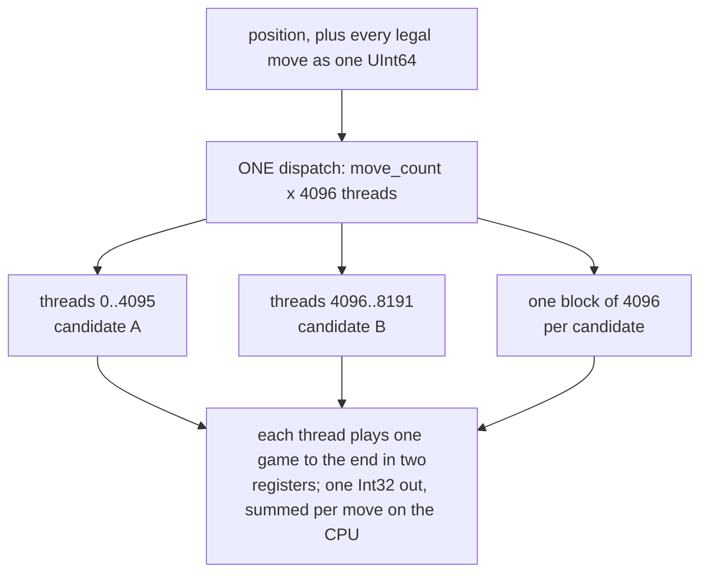

# 4. Four players and one kernel

`ai.mojo` is 380 lines and holds four ways to choose a move. Its header
comment is the thesis of the whole example, stated before any code:

> *Three ways to choose a move, and an honest account of which one wants a
> GPU.*

| Level | Method | Where |
|:---|:---|:---|
| Beginner | a uniformly random legal move | CPU |
| Intermediate | alpha-beta, 3 ply, plain weighted evaluation | CPU |
| Advanced | alpha-beta, 4 ply, weighted plus corner bonus | CPU |
| **Master** | **4,096 random playouts per candidate move** | **GPU** |

## The evaluation function

`weight_at` is Norvig's table, and it is stored as **a quarter of itself**:

```mojo
var r = index // 8
var c = index % 8
if r > 3:
    r = 7 - r
if c > 3:
    c = 7 - c
```

> *The table is symmetric in both axes, so only a quarter of it is written
> down: fold the square into the top-left 4x4 and look it up there.*

Sixteen values instead of sixty-four, and the symmetry is enforced by
construction rather than by carefully typing the same numbers four times.

The values encode the one thing everybody knows about Othello:

| square | value | why |
|:---|---:|:---|
| corner | **120** | can never be flipped |
| diagonally beside a corner | **−40** | taking one usually hands the corner over |
| beside a corner, on an edge | −20 | same problem, less acute |
| centre | 3–15 | almost worthless |

Negative values for squares you *hold* is the counter-intuitive part, and it
is correct: in Othello, owning a disc can be a liability.

`smart_weighted` adds one refinement, and explains its own limits:

```mojo
score += 30 * popcount(own & CORNERS)
score -= 30 * popcount(opp & CORNERS)
```

> *A corner is already worth 120, but holding one changes the value of the
> squares beside it — they stop being liabilities once the corner behind them
> is settled. This is a cheap stand-in for real stability analysis.*

The last sentence is the useful one. Real Othello engines compute *stability*:
which discs can provably never be flipped for the rest of the game. That is a
substantial piece of work. This is a constant times a popcount, and the comment
says so rather than pretending otherwise.

## `negamax` — alpha-beta, with Othello's two wrinkles

```mojo
fn negamax(own, opp, depth, alpha_in, beta, smart) -> Int:
    var alpha = alpha_in
    let moves = legal_moves(own, opp)
    if moves == 0:
        if legal_moves(opp, own) == 0:
            # game over: count discs
            ...
        # Pass: the turn goes over, the depth does not.
        return -negamax(opp, own, depth, -beta, -alpha, smart)
    if depth == 0:
        return smart_weighted(own, opp) if smart else weighted(own, opp)
```

Three things a chess implementation would not have:

**A pass does not consume depth.** If it did, a forced sequence of passes
would burn the search horizon and the engine would evaluate a position it
never actually reached. One comment, one line, easy to get wrong.

**The terminal score is not the table.** When neither player can move, the
game is decided by counting discs — and the docstring puts it memorably:

> *at the end a disc is worth exactly one disc.*

A positional table is a *proxy* for winning. At the end of the game the proxy
is not needed and would actively lie, because a position with terrible shape
and 33 discs is a win.

**The margin is carried in the score.** `WIN + mine - theirs` rather than a
flat `WIN`, so among won lines the engine prefers winning by more, and among
lost ones it prefers losing by less. That is what makes the losing games in
the 6–0 result close rather than collapses.

The loop itself is ordinary alpha-beta, and its cutoff is exactly the property
that makes it wrong for a GPU:

```mojo
if alpha >= beta:
    break
```

**That one line is the whole of [chapter 2](02-the-argument.md)'s objection.**
Whether it fires depends on what the previous sibling returned. Forty thousand
threads each hitting a `break` at a different moment is the definition of
divergence.

## `playout` — the function that runs on both machines

```mojo
fn playout(black_in: UInt64, white_in: UInt64, black_to_move: Bool,
           seed: UInt64) -> Int:
    """Play to the end at random. Returns +1 if black wins, -1 white, 0 drawn.

    The same function runs on the CPU and inside the GPU kernel. It touches
    no memory, which is why ten thousand copies of it can run at once.
    """
```

Its entire state is four values: two boards, a turn flag, an RNG word. No
allocation, no array, no lookup table.

The RNG is **xorshift64\***, chosen for the same reason:

> *because a playout needs a stream of numbers and nothing else: no state
> beyond one register, no tables, and the same three lines on both sides of
> the machine.*

```mojo
fn next_random(state: UInt64) -> UInt64:
    var x = state
    x ^= x >> 12
    x ^= x << 25
    x ^= x >> 27
    return x
```

Three instructions. A Mersenne Twister would need 2.5 KB of state per thread,
which for forty thousand threads is 100 MB of memory traffic on a workload
whose entire selling point is that it touches no memory.

The move choice is likewise register-only: `popcount` the legal moves, take
`rng % count`, and pick that bit with `nth_bit`, which clears low bits one at
a time.

And the passing rule, which is where a subtle bug would live:

```mojo
var passes = 0
while passes < 2:
    ...
    if moves == 0:
        passes += 1
        turn_black = not turn_black
        continue
    passes = 0
```

`passes` resets on any real move. Two passes in a row means neither player can
move — game over. One pass does not.

## The three-way compare, and the compiler bug it found

The last line of `playout` is the strangest code in the example, and it has a
seven-line comment because it needs one:

```mojo
# Written as arithmetic rather than a three-way branch on purpose. The
# obvious `if b > w: 1 elif w > b: -1 else: 0` is folded into LLVM's
# three-way compare intrinsic, and the Metal backend has no such
# instruction -- the kernel then fails to link with "Undefined symbols:
# llvm.scmp.i32.i64", which says nothing about what wrote it.
# `Int(b > w) - Int(w > b)` is ALSO folded: zext(a>b) - zext(b>a) is the
# canonical shape LLVM turns into scmp. This one is not that shape.
return Int(b > w) * 2 - Int(b != w)
```

Follow what happened:

1. The obvious three-way `if` is recognised by LLVM and folded into
   `llvm.scmp`, a single intrinsic for "compare and return −1, 0 or 1".
2. The Metal backend has no such instruction, so the kernel **fails to link**
   with a message naming an LLVM intrinsic and nothing about Othello.
3. The obvious workaround — `Int(b > w) - Int(w > b)` — does not help. That is
   `zext(a>b) - zext(b>a)`, the *canonical pattern* the fold matches. Writing
   the trick out by hand hands the optimiser exactly what it was looking for.
4. `Int(b > w) * 2 - Int(b != w)` computes the same function through a
   different shape, which the fold does not recognise.

Verify it: if `b > w` then `2 − 1 = 1`; if `w > b` then `0 − 1 = −1`; if equal
then `0 − 0 = 0`.

This is the kind of thing you can only find by writing a kernel that is not
floating-point graphics, and it is one of the reasons [chapter
2](02-the-argument.md) counts "a different stress on the backend" as a real
justification.

## The kernel

```mojo
comptime PLAYOUTS_PER_MOVE = 4096
comptime GPU_BLOCK = 256

def playout_kernel(wins, black, white, moves_lo, move_count,
                   black_to_move, seed):
    """One thread, one playout.

    Threads are laid out as (move, playout): thread i studies move
    i // PLAYOUTS_PER_MOVE, so a whole warp works on the same candidate and
    walks the same code with different dice.
    """
```

The thread layout is the design decision. Thread *i* studies move
`i // 4096` — so consecutive threads, which is to say the threads that
execute together, are all playing out **the same candidate move**. They start
from an identical position and diverge only through their dice.

Laid out the other way — thread *i* studies move `i % move_count` — adjacent
threads would start from different positions, and the warp would be
simultaneously exploring several different games from move one. Same total
work, worse behaviour.

Each thread applies its move, then seeds itself distinctly:

```mojo
let r = playout(nb, nw, not mover_black,
                seed ^ (UInt64(idx) * 0x9E3779B97F4A7C15))
```

> *A distinct stream per thread. Mixing the index in avoids every thread
> replaying the same game, which is the only way this can be wrong and still
> look plausible.*

That last clause is worth reading twice. If every thread shared a seed, all
4,096 playouts of a move would be the *same game*, the counts would still come
back, the player would still pick a move, and it would be a statistically
meaningless one. The bug has no symptom.

The constant is the golden-ratio odd multiplier used throughout hashing —
multiplying the index by it, then XOR into the seed, decorrelates neighbouring
thread indices into distant states.

## The reduction is on the CPU, on purpose

```mojo
wins[unsafe_offset=idx] = Int32(r) if mover_black else Int32(-r)
```

Each thread writes one integer. Nobody sums anything on the device:

> *an atomic per playout would serialise exactly the thing that is supposed to
> be parallel, and the reduction is 4096 additions per move on a CPU that is
> idle anyway.*

Forty thousand atomic increments to the same handful of addresses would
serialise the workload whose entire justification is that it does not
serialise. The alternative — a proper tree reduction in the kernel — would
work, and would add shared memory, barriers and a second dispatch to save a
few thousand additions on a CPU that is blocked on `synchronize` regardless.

The sign flip is also here: `Int32(r) if mover_black else Int32(-r)`, so the
score is always from the mover's point of view and higher is always better.
One flip, in one place — the same discipline the MCTS spike states explicitly
about `uct_child`.

## The dispatch

```mojo
var kern = ctx.compile_function[playout_kernel]()
var results = ctx.enqueue_create_buffer[DType.int32](total)
let blocks = (total + GPU_BLOCK - 1) // GPU_BLOCK
ctx.enqueue_function(kern, results, black, white, moves, Int32(count), ..., seed,
                     grid_dim=(blocks), block_dim=(GPU_BLOCK))
ctx.synchronize()
```

**One dispatch per move.** Compare with Fluid's thirty-five per frame — the
same backend, the opposite shape of workload. Here the launch overhead is
paid once against milliseconds of work, which is why Othello never needed the
async-launch investigation that Fluid motivated.

Note that the kernel is compiled and the buffer allocated **inside** the
per-move function. In Fluid that would be indefensible; here a move takes
3.4 ms and happens when a human clicks, so a compile lookup per move is not
worth the global to avoid it.

The whole legal-move set is passed as a single `UInt64` (`moves_lo`) and each
thread walks to its own move with `m &= m - 1`. No move list, no index array —
the argument *is* the data structure.

<!-- doccrate:keep-together:start -->



<!-- doccrate:keep-together:end -->

