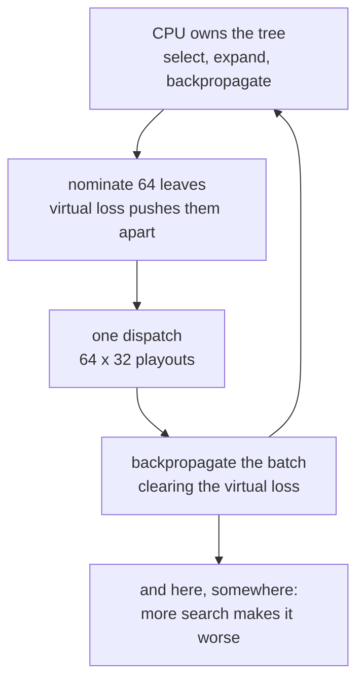

# 7. The sequel that does not work

`spikes/othello-mcts/` is the obvious next move, and its README opens by
admitting the obvious next move failed:

> **Hybrid UCT + GPU playouts — unfinished**
>
> *It does not work yet: it loses to the flat Monte-Carlo player in
> `examples/othello/` 0–6, and more search makes it worse.*

It is in `spikes/` rather than `examples/` deliberately — *"the shipped
example should be a thing that works"* — and it is committed anyway, because
four of its bugs are worth keeping. This chapter is the account.

## The idea, and why it should have worked

[Chapter 2](02-the-argument.md) leaves an unsatisfying result: the GPU only
accepts the *weakest* member of the Monte-Carlo family. UCT is far stronger
per sample, and it is GPU-hostile for exactly alpha-beta's reason — the tree
is shared mutable state and each sample depends on the last.

So split the work along the line where it actually divides:

| | |
|:---|:---|
| **CPU** | owns the tree — selection, expansion, backpropagation. Sequential, branchy, tiny. |
| **GPU** | answers one question — "how good is this position?" — for 64 positions at once. |

The economics are compelling:

> *A kernel launch costs the same whether it evaluates one leaf or sixty-four,
> so the tree nominates a batch before each dispatch.*

That is **leaf parallelisation**, a known and respectable technique, and
**virtual loss** is what stops all 64 nominations picking the same node — each
outstanding nomination counts as a temporary loss, pushing the next one
elsewhere.

The kernel is the flat one, generalised from one position to an array:

```mojo
def batch_playout_kernel(results, blacks, whites, turns,
                         position_count, per_position, seed):
    let which = idx // Int(per_position)
    let r = playout(blacks[unsafe_offset=which], whites[unsafe_offset=which],
                    turns[unsafe_offset=which] != 0,
                    seed ^ (UInt64(idx) * 0x9E3779B97F4A7C15))
    # Always from black's point of view. The tree flips the sign where it
    # needs to, once, rather than every thread guessing whose turn it is.
    results[unsafe_offset=idx] = Int32(r)
```

64 leaves × 32 playouts = 2,048 threads per dispatch.

## Four bugs, each invisible in a different way

This is the part worth keeping, and the README is unusually precise about
each. All four are **scale and ordering errors**, not logic errors — the code
did what it said, in the wrong units or at the wrong moment.

### 1. The descent never stopped

```mojo
t_pending()[][node] += 1
# The test has to come AFTER the increment above -- testing before it
# never fires, and the descent then runs all the way to a finished game
if node != 0 and t_visits()[][node] == 0 and t_pending()[][node] == 1:
    return node
```

The "is this node newly nominated?" test ran *before* the counter it reads was
incremented, so it never fired. Every selection descended to a finished game,
expanding the whole line on the way.

> *60 selections built 7,256 nodes instead of 129, and every evaluation was of
> a position whose result was already decided.*

Fifty-six times too many nodes, and every measurement taken of a position with
nothing left to measure.

### 2. Virtual loss in the wrong units

`pending` counted **nominations** (1 each) and was compared against `visits`,
which counts **playouts** (192 each in the original configuration). The loss
was numerically invisible, so all 64 leaves in a batch followed one path — the
precise failure virtual loss exists to prevent.

### 3. Exploration scaled to samples, not decisions

UCT's exploration term `sqrt(log N / n)` is written for a count of
**decisions**. A nomination here brings back `PER_LEAF` playouts at once, so
counting `visits` directly makes the term about `sqrt(PER_LEAF)` too small.

> *exploration vanished and the search went greedy, putting 89% of its samples
> on one move in a balanced opening.*

The fix is in the comment, and it is a nice distinction:

> *The mean is over playouts, which is the honest estimate; the exploration
> term is over nominations, which is the right scale.*

### 4. The root move chosen by visit count

Most-visited is the standard MCTS criterion, and it is right *when the search
is long enough for the best move to pull clearly ahead*. At a few thousand
nominations the root children's visit counts are within noise of one another,
so "most visited" picks whichever happened to be nominated marginally more
often. Changed to choose by mean, which is computed over tens of thousands of
playouts.

## After all four, it looks correct — and still loses

> *visits spread 66k–78k over four near-equal opening moves, and the means
> agree with direct sampling to within 0.01.*

Every diagnostic says the search is healthy. And:

```
 16 rounds   → loses by  8, 24, 14, 34, 38, 48
128 rounds   → loses by 48, 44, 40, 30, 32, 54
```

**More search makes it worse.** That is the diagnostic that matters, and the
README draws the right conclusion from it:

> *A correct search that is merely under-resourced improves with more
> simulations. One that degrades is converging confidently on the wrong
> quantity, so the remaining defect is in what gets backed up, not in tuning.*

This is a genuinely useful piece of reasoning. Monotonicity in resources is a
*property* you can test, and its violation cleanly separates "needs tuning"
from "is measuring the wrong thing" — without knowing where the bug is.

The two remaining suspects are named:

- the mean at a node mixes playouts taken at different depths and under
  different amounts of tree guidance — normal for MCTS, and it makes a sign or
  perspective error very hard to see from the root
- `t_score` is black-positive everywhere and the flip happens once, in
  `uct_child` — the right design, and *"exactly where a single misplaced
  negation would produce this symptom"*

And the experiment that would settle it: instrument one move end to end, dump
the principal variation, and check by hand whether the backed-up value at
depth 2–3 matches a direct playout estimate of that same position. That
isolates backup from selection, which is the split the evidence has not yet
cut.

## Two incidental things worth knowing

**A struct of ten `List`s crashes the compiler.** The tree is parallel arrays
in module globals rather than a struct, and not by preference:

> *A `struct` with ten `List` fields crashes this compiler outright —
> `incorrect # of replacement values` out of `DialectConversion` — before any
> of this code runs.*

**`_log` and `_sqrt` are written out by hand.** Newton's method for the root,
and an atanh series for the log after halving into [1, 2) — *"the stdlib has
one; this file avoids the import so the same arithmetic runs everywhere."*
The same instinct as Fluid's hand-written `_expf`: a function that must be
identical on host and device is written once, in a form that compiles for
both.

## What the failure is worth

The flat player on the GPU wins because it is crude enough to parallelise
perfectly. The tree player should beat it on samples and does not, because the
plumbing between a sequential tree and a batched evaluator has four places to
get the *units* wrong and one more, still unfound, to get the *sign* wrong.

That is a real result about the hybrid pattern, and it is why the spike is
committed rather than deleted. It also sharpens
[chapter 2](02-the-argument.md)'s conclusion: the GPU did not merely select a
weaker algorithm — it made the stronger one *harder to get right*, and that
cost is not visible until you try.

<!-- doccrate:keep-together:start -->



<!-- doccrate:keep-together:end -->
